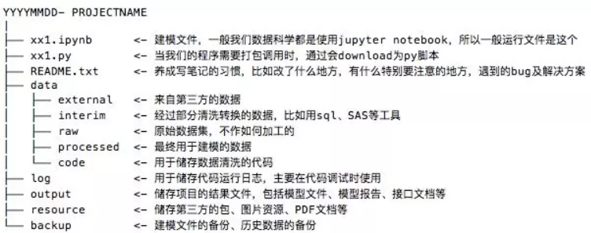
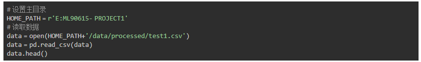

# 1. 项目文件事先做好归档


# 2. 永远不要手动修改源数据并且做好备份

# 3.做好路径的正确配置，
* 使用相对路径，
* 全局路径配置变量


# 4. 代码部分做好备注和说明

# 5. 加速你的python循环代码

# 6. 可视化你的循环代码进度
```python

```

# 7. 使用高效的异常捕获工具
```python
import pysnooper

@pysnooper.snoop('./8点超级有用的python编程建议/file.log')
def number_to_bits(number):
    if number:
        bits = []
        while number:
            number,remainder = divmod(number,2)
            bits.insert(0,remainder)
        return bits
    else:
        return[0]
number_to_bits(6)
```

# 8. 多考虑代码的健壮性
何为代码的健壮性,顾名思义，就是可以抵挡得住各种异常场景的测试，异常处理工作由“捕获”和“抛出”两部分组成。“捕获”指的是使用 try ... except 包裹特定语句，妥当的完成错误流程处理。而恰当的使用 raise 主动“抛出”异常，更是优雅代码里必不可少的组成部分，下面总结几点供大家参考：
1. 要知道传入的蚕食是什么，类型，个数
```python
def add(a, b):
    if isinstance(a,int) and isinstance(b,int):
        return a+b
    else:
        return '参数类型错误'
print(add(1,2))
print(add(1,'a'))
```

2. 只做最精准的异常捕获

我们有的时候想着让脚本work才是王道，所以不管三七二十一就搞一个大大的try...except把整块代码包裹起来，但这样很容易把原本该被抛出的 AttibuteError 吞噬了。从而给我们的 debug 过程增加了不必要的麻烦。

所以，我们永远只捕获那些可能会抛出异常的语句块，而且尽量只捕获精确的异常类型，而不是模糊的 Exception。

3. 异常处理不应该喧宾夺主

像上一条说到的异常捕获要精准，但如果每一个都很精准的话，其实我们的代码里就会有很多try...except语句块，以至于扰乱核心代码，代码整体阅读性。

这里，我们可以利用上下文管理器来改善我们的异常处理流程，简化重复的异常处理逻辑。

