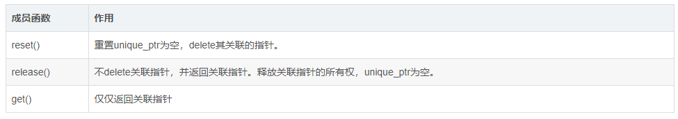

# 1. unique_ptr
## 1.1 unique_ptr 用法

unique_ptr 是 C++ 11 提供的用于防止内存泄漏的智能指针中的一种实现，**独享被管理对象指针所有权的智能指针**。unique_ptr对象包装一个原始指针，并负责其生命周期。当该对象被销毁时，会在其析构函数中删除关联的原始指针。
unique_ptr具有 - > 和 \* 运算符重载符，因此它可以像普通指针一样使用。
```c++
#include <iostream>
#include <memory>

struct Task{
    int mId;
    Task(int id): mId(id){
        std::cout << "Task::Constructor" << std::endl;
    }
    ~Task(){
        std::cout << "Task::Destructor" << std::endl;
    }
};

int main() {
    //通过原始指针创建 unique_ptr 实例
    std::unique_ptr<Task> taskPtr(new Task(23));

    //通过 unique_ptr 访问其成员
    int id = taskPtr->mId;
    std::cout << id << std::endl;
    return 0;

}
```
输出：
```
Task::Constructor
23
Task::Destructor
```
unique_ptr <Task> 对象 **taskPtr** 接受原始指针作为参数。现在当main函数退出时，该对象超出作用范围就会调用其析构函数，在unique_ptr对象taskPtr 的析构函数中，**会删除关联的原始指针，这样就不用专门delete Task对象了。**
这样不管函数正常退出还是异常退出（由于某些异常），也会始终调用taskPtr的析构函数。因此，原始指针将始终被删除并防止内存泄漏。

## 1.2 Unique_ptr 属性
- **unique_ptr 独享所有权**
unique_ptr对象始终是关联的原始指针的唯一所有者。我们无法复制unique_ptr对象，它只能移动。
由于每个unique_ptr对象都是原始指针的唯一所有者，因此在其析构函数中它直接删除关联的指针，不需要任何参考计数。

- **检查 unique_ptr 对象是否为空**
有两种方法可以检查 unique_ptr 对象是否为空或者是否有与之关联的原始指针。
```c++
// 方法1
if(!ptr1)
	std::cout<<"ptr1 is empty"<<std::endl;
// 方法2
if(ptr1 == nullptr)
	std::cout<<"ptr1 is empty"<<std::endl;
```

- **使用原始指针创建 unique_ptr 对象**
要创建非空的 unique_ptr 对象，需要在创建对象时在其**构造函数中传递原始指针**，即：
```C++
std::unique_ptr<Task> taskPtr(new Task(22));
```
不能通过赋值的方法创建对象，下面的这句是错误的
```c++
//std::unique_ptr<Task> taskPtr2 = new Task(); // 编译错误
```

- **使用 std::make_unique 创建 unique_ptr 对象 / C++14**
std::make_unique<>() 是C++ 14 引入的新函数
```c++
std::unique_ptr<Task> taskPtr = std::make_unique<Task>(34);
```

- **获取被管理对象的指针**
使用 **get()·** 函数获取管理对象的指针。
```c++
Task *p1 = taskPtr.get();
```

- **重置 unique_ptr 对象**
在 unique_ptr 对象上调用reset()函数将重置它，即它将释放delete关联的原始指针并使unique_ptr 对象为空。
```c++
taskPtr.reset();
```

- **unique_ptr 对象不可复制**
由于 unique_ptr 不可复制，只能移动。因此，我们无法通过复制构造函数或赋值运算符创建unique_ptr对象的副本。

```c++
// 编译错误 : unique_ptr 不能复制
std::unique_ptr<Task> taskPtr3 = taskPtr2; // Compile error

// 编译错误 : unique_ptr 不能复制
taskPtr = taskPtr2; //compile error
```

- **转移 unique_ptr 对象的所有权**
我们无法复制 unique_ptr 对象，但我们可以转移它们。这意味着 unique_ptr 对象可以将关联的原始指针的所有权转移到另一个 unique_ptr 对象。让我们通过一个例子来理解：

```c++
// 通过原始指针创建 taskPtr2
std::unique_ptr<Task> taskPtr2(new Task(55));
// 把taskPtr2中关联指针的所有权转移给taskPtr4
std::unique_ptr<Task> taskPtr4 = std::move(taskPtr2);
// 现在taskPtr2关联的指针为空
if(taskPtr2 == nullptr)
	std::cout<<"taskPtr2 is  empty"<<std::endl;

// taskPtr2关联指针的所有权现在转移到了taskPtr4中
if(taskPtr4 != nullptr)
	std::cout<<"taskPtr4 is not empty"<<std::endl;

// 会输出55
std::cout<< taskPtr4->mId << std::endl;
```

**std::move()** 将把 taskPtr2 转换为一个右值引用。因此，调用 unique_ptr 的移动构造函数，并将关联的原始指针传输到 taskPtr4。在转移完原始指针的所有权后， taskPtr2将变为空。

- **释放关联的原始指针**
在 unique_ptr 对象上调用 release()将释放其关联的原始指针的所有权，并返回原始指针。这里是释放所有权，并没有delete原始指针，reset()会delete原始指针。
```c++
std::unique_ptr<Task> taskPtr5(new Task(55));
// 不为空
if(taskPtr5 != nullptr)
	std::cout<<"taskPtr5 is not empty"<<std::endl;
// 释放关联指针的所有权
Task * ptr = taskPtr5.release();
// 现在为空
if(taskPtr5 == nullptr)
	std::cout<<"taskPtr5 is empty"<<std::endl;
```

- **总结**
new出来的对象是位于**堆内存**上的，**必须调用delete**才能释放其内存。
unique_ptr 是一个装指针的容器，且拥有关联指针的唯一所有权，作为普通变量使用时系统分配对象到**栈内存**上，超出作用域时会**自动析构**，unique_ptr对象的析构函数中会**delete其关联指针**，这样就相当于替我们执行了**delete堆内存上的对象**。


unique_ptr不能直接复制，必须使用std::move()转移其管理的指针，转移后原 unique_ptr 为空。std::unique_ptr<Task> taskPtr4 = std::move(taskPtr2);

创建unique_ptr对象有两种方法：
```c++
//C++11: 
std::unique_ptr<Task> taskPtr(new Task(23));
//C++14: 
std::unique_ptr<Task> taskPtr = std::make_unique<Task>(34);
```


