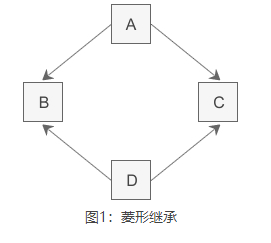
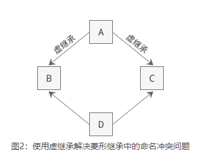
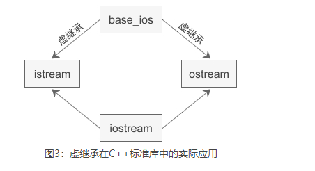

# 1. 虚基类
## 1.1 访问权限
**private：**
私有控制符。这类成员只能被本类中的成员函数和类的友元函数访问。

**protected：** 
受保护控制符。这类成员可以被本类中的成员函数和类的友元函数访问，也可以被派生类的成员函数和派生类的友元函数访问。 

**public：** 
共有控制符。这类成员可以被本类中的成员函数和类的友元函数访问，也可以被类作用域内的其他函数引用。 

**virtual: **
C++通过虚函数实现**多态**."无论发送消息的对象属于什么类，它们均发送具有同一形式的消息，对消息的处理方式可能随接手消息的对象而变"的处理方式被称为多态性。而虚函数是通过Virtual关键字来限定的。

只要是学过C++的人都知道在类Base中加了Virtual关键字的函数就是虚拟函数（例如函数print），于是在Base的派生类Derived中就可以通过**重写虚拟函数来实现对基类虚拟函数的覆盖**。当**基类Base的指针point指向派生类Derived**的对象时，对point的print函数的调用实际上是**调用了Derived的print函数**而不是Base的print函数。这是面向对象中的多态性的体现。
 
虚函数是在类中被声明为virtual的成员函数，当编译器看到通过指针或引用调用此类函数时，对其执行动态绑定。

## 1.2 类继承
**使用private继承**
父类的所有成员在子类中变为private;

**使用protected继承**
父类的protected和public成员在子类中变为protected，private成员不变;

**使用public继承**
父类中的方法属性不发生改变。

经过类的继承以后，基类的成员可以理解为：成为了继承类的成员，只是要做相应的访问属性改变，虽然基类成员好像是成为了继承类成员，但是还是和本身继承类数据成员有区别的，例如：继承类成员函数是不能访问继承过来的基类的私有成员，但可以访问继承过来的公有和保护成员。

## 1.3  virtual保留字
这里我们要讲的多态是指生效于运行时的**动态多态**，C++的动态多态技术是基于继承机制和虚函数的。多态可以理解成：不同的动作行为可以与同一个记号相关联。通俗的讲：基类类型的指针或引用可以调用基类的函数，也可以执行继承类的函数。这里的函数调用必须有个动态绑定，要实现这种动态绑定必须满足两个条件：
条件1
**只有指定为虚函数的成员函数才能进行动态绑定；**

条件2
**必须通过基类类型的指针或者引用进行函数调用。**

引用和指针的静态类型和动态类型可以不同，这是C++用以支持多态性的基石。因为每个派生类对象都包含基类部分，所以可以用基类类型的引用绑定到派生类对象的基类部分，也可以用基类类型的指针指向派生类对象（但是不能用继承类类型引用或指针绑定基类对象，除非强制类型转换）**。基类类型的引用或者指针在编译就是可知的，这是静态类型**，但是的它们所绑定的对象类型在运行时才可知，而且可能与的它们的静态类型不同，所以它们最终绑定的类型就是动态类型。

要理解多态中的动态绑定，首先要理解C++如何在继承层次中确定函数调用:

首先确定进行函数调用的对象、引用或指针的静态类型；
在该类中查找和调用的函数名字相同（不管参数）的函数，如果找不到，就在该类的直接基类中查找，如此循着它继承链往上找，直到找到名字相同的函数或者找完最后一个类，如果不能在类或者其他基类中找到该名字，则调用是错误的；

 一旦在某个类中找到一个和待调用的函数名字相同的函数，则在这个类中查找所有这个名字的函数重载版本，看能否找到一个能与待调用函数实参类型相同的函数，不能找到则调用不合法；（前三个步骤是在编译的时候确定）

如果函数调用合法，如果函数是虚函数，且通用引用或者指针调用，则编译器生成代码以确定根据对象的动态类型运行哪个函数版本，否则编译器生成代码直接调用函数。

单纯从virtual关键字出发，考虑两层关系：一个基类一个继承类，使用基类类型引用或者指针进行函数调用，首先在基类中查找一个能与待调用函数实参类型相同的函数，如果找不到，则调用出错；如果找到，看该函数是否是虚函数，如果基类中该函数是虚函数，而且继承类中有相同原型的函数，即使没有用virtual保留字，继承类中的函数自动变成虚函数，然后再运行过程中根据基类指针或引用绑定的对象来调用相应的函数，如果继承类中没有相同原型的函数，即使运行时绑定的是继承类对象，那么还是调用基类中的函数。

# 2 多继承

多继承（Multiple Inheritance）是指从多个直接基类中产生派生类的能力，多继承的派生类继承了所有父类的成员。尽管概念上非常简单，但是多个基类的相互交织可能会带来错综复杂的设计问题，命名冲突就是不可回避的一个。

多继承时很容易产生命名冲突，即使我们很小心地将所有类中的成员变量和成员函数都命名为不同的名字，命名冲突依然有可能发生，比如典型的是菱形继承，如下图所示：



类 A 派生出类 B 和类 C，类 D 继承自类 B 和类 C，这个时候类 A 中的成员变量和成员函数继承到类 D 中变成了两份，一份来自 A-->B-->D 这条路径，另一份来自 A-->C-->D 这条路径。

在一个派生类中保留间接基类的多份同名成员，虽然可以在不同的成员变量中分别存放不同的数据，但大多数情况下这是多余的：因为保留多份成员变量不仅占用较多的存储空间，还容易产生命名冲突。假如类 A 有一个成员变量 a，那么在类 D 中直接访问 a 就会产生歧义，编译器不知道它究竟来自 A -->B-->D 这条路径，还是来自 A-->C-->D 这条路径。下面是菱形继承的具体实现：
```c++
//间接基类A
class A{
protected:
    int m_a;
};

//直接基类B
class B: public A{
protected:
    int m_b;
};

//直接基类C
class C: public A{
protected:
    int m_c;
};

//派生类D
class D: public B, public C{
public:
    void seta(int a){ m_a = a; }  //命名冲突 
    // 这段代码实现了上图所示的菱形继承，第 25 行代码试图直接访问成员变量 m_a，结果发生了错误，
    // 因为类 B 和类 C 中都有成员变量 m_a（从 A 类继承而来），编译器不知道选用哪一个，所以产生了歧义。
    void setb(int b){ m_b = b; }  //正确
    void setc(int c){ m_c = c; }  //正确
    void setd(int d){ m_d = d; }  //正确
private:
    int m_d;
};

int main(){
    D d;
    return 0;
}
```
为了消除歧义，我们可以在 m_a 的前面指明它具体来自哪个类：
> void seta(int a){ B::m_a = a; }


# 3 虚继承（Virtual Inheritance）
为了解决多继承时的命名冲突和冗余数据问题，C++ 提出了虚继承，使得在派生类中只保留一份间接基类的成员。
在继承方式前面加上 virtual 关键字就是虚继承，请看下面的例子：
```c++
//间接基类A
class A{
protected:
    int m_a;
};
//直接基类B
class B: virtual public A{  //虚继承
protected:
    int m_b;
};
//直接基类C
class C: virtual public A{  //虚继承
protected:
    int m_c;
};
//派生类D
class D: public B, public C{
public:
    void seta(int a){ m_a = a; }  //正确
    void setb(int b){ m_b = b; }  //正确
    void setc(int c){ m_c = c; }  //正确
    void setd(int d){ m_d = d; }  //正确
private:
    int m_d;
};
int main(){
    D d;
    return 0;
}
```

这段代码使用虚继承重新实现了上图所示的菱形继承，这样在派生类 D 中就只保留了一份成员变量 m_a，直接访问就不会再有歧义了。

虚继承的目的是让某个类做出声明，承诺愿意共享它的基类。其中，这个被共享的基类就称为**虚基类（Virtual Base Class）**，本例中的 A 就是一个虚基类。在这种机制下，不论虚基类在继承体系中出现了多少次，在派生类中都只包含一份虚基类的成员。

现在让我们重新梳理一下本例的继承关系，如下图所示：



观察这个新的继承体系，我们会发现虚继承的一个不太直观的特征：必**须在虚派生的真实需求出现前就已经完成虚派生的操作**。在上图中，当定义 D 类时才出现了对虚派生的需求，但是如果 B 类和 C 类不是从 A 类虚派生得到的，那么 D 类还是会保留 A 类的两份成员。

换个角度讲，虚派生只影响从指定了虚基类的派生类中进一步派生出来的类，它不会影响派生类本身。

在实际开发中，位于中间层次的基类将其继承声明为虚继承一般不会带来什么问题。通常情况下，使用虚继承的类层次是由一个人或者一个项目组一次性设计完成的。对于一个独立开发的类来说，很少需要基类中的某一个类是虚基类，况且新类的开发者也无法改变已经存在的类体系。

C++标准库中的 iostream 类就是一个虚继承的实际应用案例。iostream 从 istream 和 ostream 直接继承而来，而 istream 和 ostream 又都继承自一个共同的名为 base_ios 的类，是典型的菱形继承。此时 istream 和 ostream 必须采用虚继承，否则将导致 iostream 类中保留两份 base_ios 类的成员。



# 4 虚基类成员的可见性、
因为在虚继承的最终派生类中只保留了一份虚基类的成员，所以该成员可以被直接访问，不会产生二义性。此外，如果虚基类的成员只被一条派生路径覆盖，那么仍然可以直接访问这个被覆盖的成员。但是如果该成员被两条或多条路径覆盖了，那就不能直接访问了，此时必须指明该成员属于哪个类。

以图2中的菱形继承为例，假设 B 定义了一个名为 x 的成员变量，当我们在 D 中直接访问 x 时，会有三种可能性：
如果 B 和 C 中都没有 x 的定义，那么 x 将被解析为 B 的成员，此时不存在二义性。
如果 B 或 C 其中的一个类定义了 x，也不会有二义性，派生类的 x 比虚基类的 x 优先级更高。
如果 B 和 C 中都定义了 x，那么直接访问 x 将产生二义性问题。

可以看到，使用多继承经常会出现二义性问题，必须十分小心。上面的例子是简单的，如果继承的层次再多一些，关系更复杂一些，程序员就很容易陷人迷魂阵，程序的编写、调试和维护工作都会变得更加困难，因此我不提倡在程序中使用多继承，只有在比较简单和不易出现二义性的情况或实在必要时才使用多继承，能用单一继承解决的问题就不要使用多继承。也正是由于这个原因，C++ 之后的很多面向对象的编程语言，例如 Java、C#、PHP 等，都不支持多继承。


