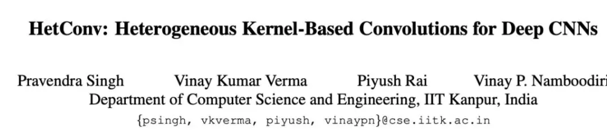
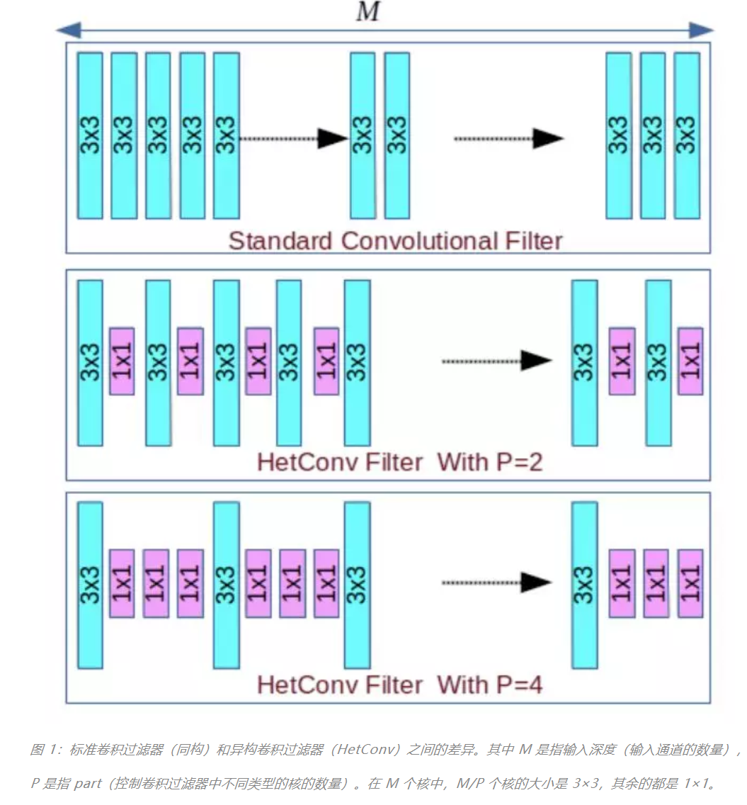
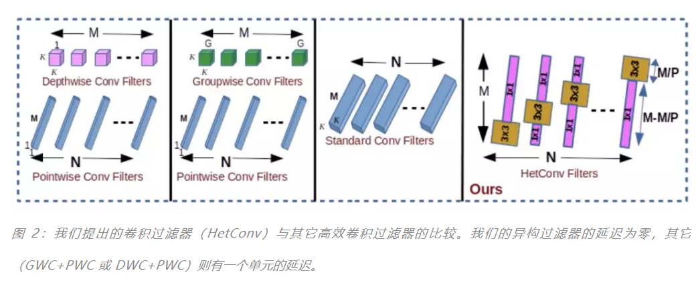
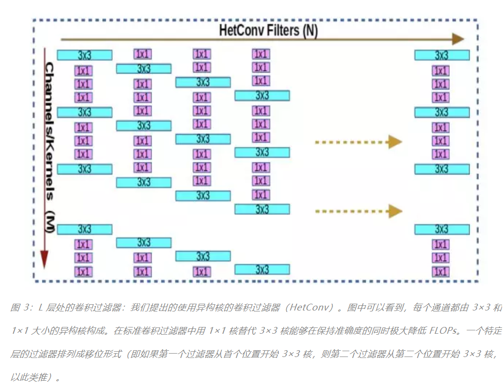
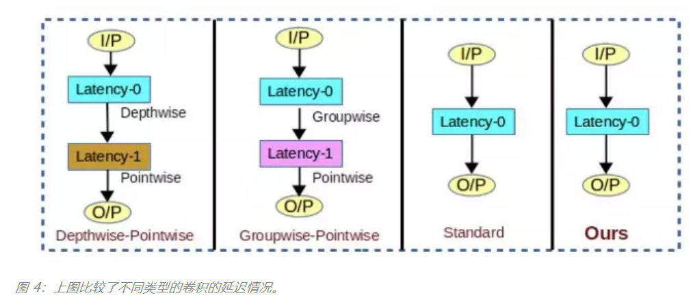

## CVPR 2019 | 用异构卷积训练深度CNN：提升效率而不损准确度

> 对于深度卷积神经网络而言，准确度和计算成本往往难以得兼，研究界也一直在探索通过**模型压缩**或**设计新型高效架构**来解决这一问题。印度理工学院坎普尔分校的一篇 CVPR 论文则给出了一个新的思路——**使用异构的卷积过滤器**；实验表明这种方法能在保证准确度的同时显著降低计算成本。

论文：https://arxiv.org/abs/1903.04120

摘要：我们提出了一种全新的深度学习架构，其中的卷积运算利用了 **异构核**。相比于标准的卷积运算，我们提出的 HetConv（基于异构核的卷积）能在减少计算量（FLOPs）和参数数量的同时维持表征的效率。为了展现我们所提出的卷积的有效性，我们在 VGG [30] 和 ResNet [8] 等标准卷积神经网络（CNN）上进行了广泛的实验并给出了实验结果。我们发现，使用我们提出的 HetConv 过滤器替换了这些架构中的标准卷积过滤器之后，我们能在 FLOPs 方面实现 3 到 8 倍的速度提升，同时还能维持（有时候能提升）准确度。我们将我们提出的卷积与分组/深度方面的卷积进行了比较，结果表明它能在显著提升准确度的同时将 FLOPs 降低更多。

## 引言

卷积神经网络（CNN）在视觉和自然语言处理领域都已经取得了卓越的表现。进一步提升性能的总体趋势使得模型越来越复杂且越来越深。但是，使用更深度的网络，通过提升模型复杂度来提升准确度并不是毫无代价的——计算成本（FLOPs）会大幅增长。因此，为了降低 FLOPs 以让模型更高效，研究者们已经提出了各种不同类型的卷积运算/卷积过滤器。

已有的卷积过滤器大致可以分为**三类**：

1）深度方面的卷积过滤器，用于执行逐深度的卷积（DWC）[38]；

2）点方面的卷积过滤器，用于执行逐点卷积（PWC）[36]；

3）分组方面的卷积过滤器，用于执行逐分组卷积（GWC）[19]。近来的大多数架构都使用了这些卷积过滤器的组合来得到高效的模型。很多常见的模型也使用了这些卷积（比如 DWC、PWC 和 GWC）来探索可以降低 FLOPs 的新架构。但是，设计一种新架构需要大量研究工作才能找到最优的过滤器组合，进而使得 FLOPs 最小。

另一种提升模型效率的常用方法是 **压缩模型**。模型压缩大致可以分为三类：**连接剪枝** [6]、**过滤器剪枝** [24, 11, 21, 10, 32, 31, 33] 和**量化** [6, 27]。

过滤器剪枝的思想是 **将模型中贡献最小的过滤器剪枝掉**，在移除这个过滤器/连接之后，模型通常还会得到微调以维持其性能。在给模型剪枝时，我们需要一个预训练模型（可能需要计算成本很高的训练作为预处理步骤），然后我们再丢弃贡献最小的过滤器。因此这是一个成本很高且很困难的过程。因此，比起剪枝，使用高效的卷积过滤器或卷积运算来设计高效的架构才是更常用的方法。这不需要昂贵的训练，然后在训练后进行剪枝，因为训练是从头开始高效完成的。

使用高效的卷积过滤器会有** 两种不同的目标**。一类**研究的重心是设计 FLOPs 最小的架构**，**同时会在准确度上妥**协。这些研究的目标是为物联网/低端设备开发模型。这类模型有准确度较低的问题，因此必须搜索最佳可能的模型来实现准确度和 FLOPs 之间的平衡。因此这类模型在 FLOPs 和准确度之间会有所权衡。

另一类研究则专注于在保证模型的 FLOPs 与原架构相同的同时提升准确度。Inception [35]、RexNetXt [40] 和 Xception [2] 等近期架构就属于这一类。他们的目标是使用高效的卷积过滤器设计一种更加复杂的模型，同时保持其 FLOPs 与基础模型一样。通常可以预期更复杂的模型能学习到更好的特征，从而得到更优的准确度。但是，这类模型的重点不是设计一种新架构，而主要是在** 标准的基础架构中使用已有的高效过滤器**。因此这些工作会保持层的数量与架构和基础模型一样，再在每层上添加过滤器以使得 FLOPs 不增大。

不同于这两类方法，我们的方法 **主要侧重于通过设计新的卷积核（kernel）来降低给定模型/架构的 FLOPs**，**同时无损准确度**。通过实验我们发现我们提出的方法的 FLOPs 比当前最佳的剪枝方法显著更低，同时还能维持基础模型/架构的准确度。而该剪枝方法则成本高昂，在实现 FLOPs 压缩时会导致准确度显著下降。

在我们提出的方法中，我们选择了一种不同的策略来提升已有模型的效率，同时不牺牲其准确度。架构搜索方法需要数年的研究才能得到一种最优化的架构。因此，我们没有去设计一种新的高效架构，而是设计了一种高效的卷积运算（卷积过滤器），并可直接用在任意已有的标准架构中来降低 FLOPs。为了实现这一目标，我们提出了一种新型的卷积—— **异构卷积**（HetConv）。

根据卷积核的类型，这种卷积运算可以分成两类：
* 使用传统卷积过滤器的同构卷积（这里所指的传统卷积包括标准卷积、逐分组卷积、逐深度卷积、逐点卷积）。同构卷积使用同构过滤器执行。同构过滤器是指该过滤器包含的所有卷积核都是同样大小（比如在 3 × 3 × 256 CONV2D 过滤器中，所有 256 个核都是 3×3 大小）。
* 使用异构卷积过滤器的异构卷积（HetConv）。异构过滤器是指该过滤器包含不同大小的卷积核（比如在某个 HetCOnv 过滤器中，256 核有的是 3×3 大小，其余的是 1×1 大小）。

在深度 CNN 中使用 **异构过滤器能克服基于高效架构搜索和模型压缩的已有方法的局限**。比如最近期的高效架构 MobileNet [12] 使用了逐深度和逐点卷积，其中用两个卷积层替代了标准的卷积层，因此会有更多延迟（延迟 1）。有关延迟的更多详情请参阅第 3.3 节和图 4。但我们提出 HetConv 的延迟与原始架构一样（延迟 0）。[12, 35, 36, 2] 的延迟均大于 0。

不同于模型压缩方法存在准确度大幅下降的问题，我们的方法与 ResNet [8] 和 VGGNet [30] 等标准模型的当前最佳结果相比也具有很高的竞争力。不同于需要预训练模型的剪枝方法，使用 HetConv，我们可以从头开始训练我们的模型，同时无损准确度。如果我们增大 FLOPs 剪枝的程度，剪枝方法还会造成准确度极大下降。相比于 FLOPs 剪枝方法，使用我们提出的 HetConv 过滤器能在 FLOPs 方面达到当前最佳水平。另外，剪枝过程的效率也很低，因为在剪枝后还需要大量时间来进行训练和微调。我们的方法具有很高的效率，并且从头开始训练时也能得到与原始模型相近的结果。

就我们所知，这是首个异构的卷积/过滤器。这种异构设计有助于提升已有架构的效率（降低 FLOPs），同时无损准确度。我们在 ResNet [8] 和 VGG-16 [30] 等不同架构上进行了广泛的实验——只是将它们的原始过滤器替换成了我们提出的过滤器。我们发现，无需牺牲这些模型的准确度，我们就能大幅降低 FLOPs（3 到 8 倍）。这样的降低程度甚至比已有的剪枝方法还好很多。

我们的主要贡献如下： 

• 我们设计了一种高效的异构卷积过滤器，可用在任何已有架构中，能在不牺牲准确度的同时提升这些架构的效率（将 FLOPs 降低 3 到 8 倍）。

• 我们提出的 HetConv 过滤器是按零延迟的方式设计的。因此，从输入到输出的延迟可忽略不计。

## 我们提出的方法
在本论文中，我们提出了一种包含异构卷积核（比如一些核的大小是 3×3，其余的是 1×1）的全新过滤器/卷积（HetConv），可以在保证原始模型同等准确度的同时降低 FLOPs。图 1 和图 2 展示了标准过滤器与 HetConv 过滤器之间的差异。

