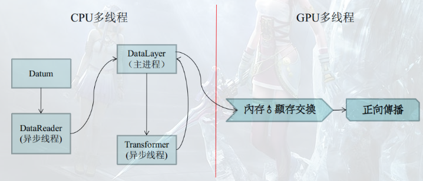
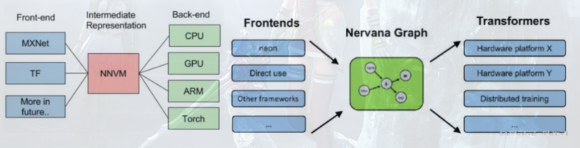
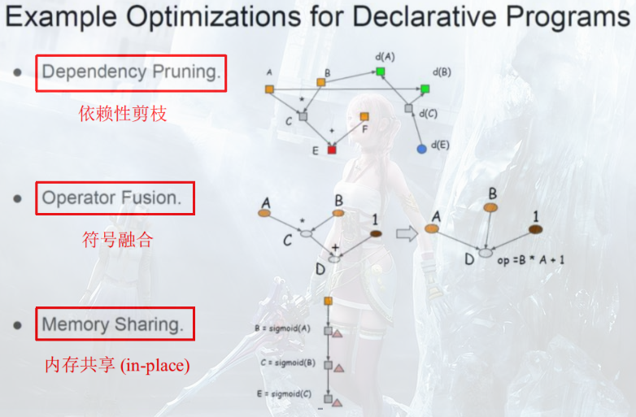

Caffe诞生于12年末，如果偏要形容一下这个框架，可以用"须敬如师长"。

这是一份相当规范的代码，这个规范，不应该是BAT规范，那得是Google规范。

很多自称码农的人应该好好学习这份代码，改改自己丑陋的C++编程习惯。

下面列出几条重要的规范准则：

# 1. const

先说说const问题，Google为了增加代码的可读性，明确要求：
**不做修改的量(涵盖函数体内、函数参数列表)，必须以const标记**。
相对的，对于那些改变的量，可选择用mutable标记。
因为mutable关键词不是很常用，所以一般在自设函数中使用。
严格的const不在于担心变量是否被误修改，而在于给代码阅读者一个清晰的思路：
**这个值不会改变，这个值肯定要改变。**


## 1.2. 引用
"引用"是C/C++设计的一个败笔，因为C/C++默认是深拷贝，这在大内存数据结构操作的时候，
容易让新手程序员写出弱智低能的代码。假设Datum结构A使用了2G内存，令：
Datum B=A;
那么，内存会占用4G空间，而且，我们大概需要几秒的时间去拷贝A的2G内存。
这个几秒看起来不是很成问题，但是在多线程编程中，两个异步线程共享数据：

如果你不用引用会怎么样？
**很有趣，这个复制再赋值的操作会被CPU中断，变成无效指令。**
这在Caffe的多线程I/O设计架构中，是个关键点。

另外，对于基本数据类型(char/int/float/double)，引用是没用必要的。
但是，string、vector<int>等容器，引用就相当有必要了。

## 1.3. const引用
const引用最常见于函数参数列表，用于传递常、大数据结构量。
**与此相对的，如果你要修改一个大数据结构量，应当在参数列表中传入指针，而不是引用。**

## 1.4. 常成员函数
常成员函数，在OO里通常容易被新手忽略掉。(Java就没那么复杂)，通常写作：
`void xxx() const`，目的是：
**const标记住传入成员函数的this指针**。
常成员函数其实不是必要的，但是在一定情况下，就会变成必要的。

这个情况相当有趣，而且在Caffe中也经常发生：

```c++
void xxx(const Blob& blob){
　　blob.count();
}
```
如果我们遵照Google的编程规范，用const引用锁定传入的Blob。
那么，blob.count()这个成员函数的调用就会被编译器的语义分析为：**成员变量不可修改**。

如果你的代码写成这样，那就会被编译器拦下，错误信息为：**this指针不一致**。

```c++
class Blob{
public:
    int count() {}  //错误
    int count() const {}  //正确
};
```

常成员函数主要功能如下：
1. 常成员函数内部不允许进行数据成员的修改，但是可以在函数内部输出const数据成员与非数据成员！
2. 可以区分同名构造函数，举个例子（如下）：

```c++
#include <iostream>
using namespace std;
 
class Test
{
public:
	void Show()const
	{
		cout << "Hello,Const!" << endl;
	}
	void Show()
	{
		cout << "Hello!" << endl;
	}
};
 
int main()
{
	Test t1;
	t1.Show(); # Hello!
	Test const t2;
	t2.Show();  # Hello,Const!
	return 0;
}
```

## 1.5 常对象
**在类的实例化同时，加上const进行修饰实例化出的对象即可**：
常量对象上可以执行常量成员函数，是因为常量成员函数确保不会修改任何非静态成员变量的值。编译器如果发现常量成员函数内出现了有可能修改非静态成员变量的语句，就会报错。因此，常量成员函数内部也不允许调用同类的其他非常量成员函数（静态成员函数除外）。

那么实例化出的对象将无法对类进行操作；
当然，const对象是可以直接操作const成员的（数据成员、函数成员），所以这就需要我们把成员函数声明为const型；
```c++
#include <iostream>
using namespace std;

class Point
{
private:
    int x, y;
    const int e;
    static int count;
public:
    Point(int xx, int yy,int ee):e(ee),x(xx),y(yy)
    {
        count++;
    }
    void Show_C()const   //常函数内部无法对数据进行修改
    {
        cout << "C = " << c << endl;
        cout << "D = " << d << endl;
    }
    static int Show_Count()
    {
        cout<< "count: "<<count;
    }
    int c = 250;
    const int d = 360;    //可以直接在声明的时候赋值
};

int Point::count = 0;

int main()
{

    Point const P1(1, 2, 3);    //这里的const直接限制了在外部对类中public中数据成员的修改

    cout << P1.d << endl;    //const int d = 360;

    P1.Show_C();
    Point::Show_Count();
    return 0;
}
```

# 2. 要点
## 2.1. public、private、protected
OO的封装性是比较难定位的一个规范，成员变量及成员函数如何访问权限是个问题。

Caffe严格遵照标准的OO封装概念：方法是public，变量是private或者是protected。

区别private和protected就一句话：

**private成员变量或是函数，不可能被继承。通常只用在本Class独有，而派生类不直使用的函数/变量上。**
比如im2col和col2im，这两个为卷积做Patch预变换的函数。

**protected和private的成员函数和成员变量都不可能从外部被访问，应当在public里专门设置访问接口。**

并且接口根据需要，恰当使用const标记，避免越权访问。

有趣的是，如果这么做，会增加相当多的代码量，而且都是一些复制粘贴的废品代码。

为了避免这种情况，Google开发了Protocol Buffer，将数据结构大部分访问接口自动生成，且独立安排。

这样，在主体代码里，我们不会因为数据的访问接口的规范，而导致阅读代码十分头疼(想想那一扫下来的废代码)。

## 2.2. 独立性
如果你研究过Word2Vec的源码，应该就知道，为什么Word2Vec必须跑在Linux下。。
因为Mikolov同学在写代码的时候，用了POSIX OS的API函数pThread，来实现内核级线程。
这为跨平台带来麻烦，一份优秀的跨平台代码，必须具有相当出色的平台独立性。
在这点上，Caffe使用了C++最强大的Boost库，来避免对OS API函数的使用。

Boost库，又称为C++三千佳丽的后宫，内涵1W+头文件，完整编译完大小达3.3G，相当庞大。
它的代码来自世界上顶级的C++开发者，是C++最忠实的第三方库，并且是ISO C++新规范的唯一来源。
Boost在Caffe中的主要作用是提供OS独立的内核级线程。
当然，已经于C++11中被列入规范的`boost::shared_ptr`其实也算。
还有一个十分精彩的`boost::thread_specific_ptr`，也在Caffe中起到了核心作用。

不足之处也有，而且其中一处还成了Bug，那就是API函数之一的open。
Linux的open默认是以二进制打开的，而Windows则是以文本形式打开的。
移植到Windows时，需要补上 O_BINARY作为flag。

## 2.3. 异构性
大家都知道Caffe能跑GPU，一个关键点是：
它是在何处，又是怎么进行CPU与GPU分离的？

这个模型实际上应当算是CUDA标准模型。

由于内存显存不能跨着访问（一个在北桥，一个在南桥），又要考虑的CPU和GPU的平衡。

所以，数据的读取、转换不仅要被平摊到CPU上，而且应当设计成多线程，多线程的生产者消费者模型。

并且具有一定的多重缓冲能力，这样保证最大化CPU/GPU的计算力。

在一个机器学习系统当中，我们要珍惜计算设备的每一个时钟周期，切实做到计算力的最大化利用。

## 2.4. 设计模式
实际使用的设计模式只有两个。

第一个是**MVC**，这个其实是迫不得已。
异构编程决定着，数据、视图、控制三大块必须独立开来。
但视图和控制并不是很明显，在设计接口/可视化GUI的时候，将凸显重要性。

第二个称为**工厂模式**，这是一个存在于Java的概念，尽管C++也可以模仿。
具体来说，工厂模式是为了弥补面向对象型编译语言的不足，会被OO的多态所需要。
以Caffe为例：

我们当前有一个基类指针`Layer* layer`;
在程序运行之前，计算机并不知道这个指针究竟要指向何种派生类。是卷积层？Pooling层？ReLU层？
鬼才知道。一个愚蠢的方法：
```c
if(type==CONV) {....}
else if(type==POOLING) {....}
else if(type==RELU} {.....}
else {ERROR}
```
看起来，还是可以接受的，但是在软件工程专业看来，这种模式相当得蠢。
工厂模式借鉴了工厂管理产品的经验，将各种类型存在数据库中，需要时，拿出来看看。
这种模式相当得灵活，当然，在Caffe中作用不是很大，仅仅是为了花式好看。
要实现这个模式，你只需要一个关联容器(C++/JAVA)，字典容器(Python)。
将string与创建指针绑定即可。
C/C++中有函数指针的说法，如：

`typedef boost::shared_ptr< Layer<Dtype> > (*NEW_FUNC)(const LayerParameter& );`

经过typdef之后，NEW_FUNC就可以指向函数：

```c
boost::shared_ptr< Layer<Dtype> > xxx(const LayerParameter& x);
NEW_FUNC yyy=boost::shared_ptr< Layer<Dtype> > xxx(const LayerParameter& x);

yyy();  //相当于xxx()
xxx();
```

需要访问工厂时，我们只需要访问这个代替工厂管理数据库的容器，而不是幼稚地使用if(.....)

## 2.5.序列化与反序列化
如果Caffe不使用Protocol Buffer，那么代码量将扩大一倍。
这不是危言耸听，在传统系统级程序设计中，序列化与反序列化一直是一个码农问题。
尤其是在机器学习系统中，复杂多变的数据结构，给序列化和反序列化带来巨大麻烦。

**Protocol Buffer在序列化阶段，是一个高效的编码器，能将数据最小体积序列化。**

而在反序列化阶段，它是一个强大的解码器，支持二进制/文本两类数据的解析与结构反序列化。
其中，从文本反序列化意义颇大，这就形成了Caffe著名的文本配置文件prototxt，用于net和solver。
相对灵活的配置方式，尤其适合超大规模神经网络，这点在早期机器学习系统中独领风骚(很多人认为这比图形界面还要方便)。

## 2.6. 宏
据说写库狂人都是用宏狂人。
C/C++提供了强大了自定义宏函数(#define)，Caffe通过宏，大概减少了1000~2000行代码。
宏函数大致有如下几种：

1. **`#define DISABLE_COPY_AND_ASSIGN(classname)`**
俗称禁止拷贝和赋值宏，如果你熟悉Qt，就会发现，Qt中大部分数据结构都用了这个宏来保护。
这个宏算是最没用的宏，用在了所有Caffe大型数据结构上(Blob、Layer、Net、Solver)
**目的是禁止两个大型数据结构直接复制、构造、然后赋值。**
实际上，Caffe也没有去编写复制构造函数代码，所以最终还是会被编译器拦下。
前面以及说过了，两个大型数据结构之间的复制会是什么样的下场，这是绝对应该被禁止的。
**如果你要使用一个数据结构，请用指针或是引用指向它。**
如果你有乱赋值的编程陋习，请及时打上这个宏，避免自己手贱。反之，可以暂时无视它。
当然，从库的完整性角度，这个宏是明智的。
Java/Python不需要这个宏，因为Java对大型数据结构，默认是浅拷贝，也就是直接引用。
而Python，这个没有数据类型的奇怪语言，则默认全部是浅拷贝。

2. **`#define INSTANTIATE_CLASS(classname)`**
非常非常非常重要的宏，重要的事说三遍。
由于Caffe采用分离式模板编程方法（据说也是Google倡导的)
模板未类型实例化的定义空间和实例化的定义空间是不同的。
实际上，编译器并不会理睬分离在cpp里的未实例化的定义代码，而是将它放置在一个虚拟的空间.
一旦一段明确类型的代码，访问这段虚拟代码空间，就会被编译器拦截。
如果你想要让模板的声明和定义分离编写，就需要在cpp定义文件里，将定义指定明确的类型，实例化。
这个宏的作用正是如此。（Google编程习惯的宏吧)。
更详细的用法，将在后续文章中详细介绍。

3. **`#define INSTANTIATE_LAYER_GPU_FUNCS(classname)`**
通样是实例化宏，专门写这个宏的原因，是因为NVCC编译器相当傲娇。
打在cpp文件里的`INSTANTIATE_CLASS`宏，NVCC在编译cu文件时，可不会知道。
所以，你需要在cu文件里，为这些函数再次实例化。
其实也没几个函数，也就是`forward_gpu`和`backward_gpu`

4. **`#define NOT_IMPLEMENTED`**

俗称偷懒宏，你要是这段代码不想写了，打个NOT_IMPLEMENTED就行了。
就是宣告：“老子就是不想写这段代码，留空，留空！”
但是注意，宏封装了LOG(FATAL)，这是个Assert(断言)，会引起CPU硬件中断。
一旦代码空间转到你没写的这段，整个程序就会被终止。

5. **`#define REGISTER_LAYER_CLASS(type)`** 
Layer工厂模式用的宏，也就是将这个Layer的信息写到工厂的管理数据库里
此宏省了不少代码，在使用工厂之前，记得要为每个成品(Layer)打上这个宏。

## 2.7.命名空间
Caffe为了与Boost等库接轨，几乎为所有结构提供了以caffe为关键字的命名空间。
设置命名空间的主要目的是防止Caffe的函数、变量与其他库产生冲突。
在我们的山寨过程中，为了代码的简洁，将忽略全部的命名空间。

## 2.8. 命名法
Caffe中普遍采用下划线命名法。

我们对其作出了部分修改，整体采用两种命名法：
①针对变量而言: 采用下划线命名法
②针对函数而言：采用驼峰命名法


# 3. 计算图

计算图最早的出处应该是追溯到Bengio在09年的《Learning Deep Architectures for AI》，
Bengio使用了有向图结构来描述神经网络的计算:

.png)

如图，符号集合{*，+，sin} 构成图的结点，整张图可看成三部分：输入结点、输出结点、从输入到输出的计算函数。
随后在Bengio组的Theano框架执行中，Graph就被隐式应用于Op的连接。
不过这时候，Op还是执行时-动态编译的。

Caffe1中计算图其实就是Net，因为Net可以被Graph模拟出来(CGVM和Caffe2Keras都实现了)。
贾扬清在Caffe1中显式化了计算图的表示，用户可以通过编辑`net.prototxt`来设计计算图。
Caffe1在Jonathan Long和Evan Shelhamer接手后，他们开发了PyCaffe。
PyCaffe通过Python天然的工厂(\__getattr__)，实现了`net.prototxt`的隐式生成。
之后的Caffe2，也就直接取消了net.prototxt的编辑，同样利用Python的(__getattr__)获取符号类型定义。
Caffe1带来一种新的计算图组织Op的描述方式，不同于Theano直接翻译Op为C执行代码，然后动态编译，

软件工程中的高级设计模式——工厂模式被广泛使用。
计算图被划分为三个阶段，定义阶段、构造阶段、执行阶段：
1. **定义阶段**：定义Layer/Op的name、type、bottom(input)，top(output)及预设参数。
2. **构造阶段**：通过工厂模式，由字符串化的定义脚本构造类对象。
3. **执行阶段**：根据传入的`bottom(input)`，得到额外参数(如shape)，此时计算图才能开始执行。

阶段划分带来的主要问题是限制了编译代码的完整性和优化程度。
在Theano中，C代码生成是最后一步，你可以组合数片细粒度的代码块，依靠编译器做硬件执行前的超级优化。
编译器优化是的提升指令流水线效率的重要手段，**编译器调度技术减少数据冲突，编译器分支预测技术减少控制冲突**。
而工厂模式编译符号时只考虑了单元本身，编译器没有上下文环境可供参考，故最终只能顺序执行多个预先编译的符号单元。
当符号粒度过细时，一个Layer的实现就会变成连续执行数个单元，每个单元都要处理一遍向量/矩阵，导致“TensorFlowSlow”。

## 3.1 计算图作为中间表示(IR)
PyCaffe和Caffe2将定义阶段移到Python中，而将构造和执行阶段保留在C++中做法，是计算图作为IR的思想启蒙。
Python与C++最大的不同在于：一个是脚本代码，用于前端。一个是本地代码，用于后端。
脚本代码创建/修改模型方便(无需因模型变动而重新编译)、执行慢，本地代码则正好相反。
两者取长补短，所以深度学习框架在2016年，迎来了前后端开发的黄金时代。


如上图，无论是9月份先提出的NNVM，还是最近Intel曝光的Nervana，都分离了前后端。
后端的独立，不仅减少了编译工作，最大的优势在于降低了传统框架做跨设备计算的代码耦合度。
在paper每周都有一大堆的现在，如果后端的每一次变动都要大量修改前端，那么框架的维护开销是非常大的。

在前端定义用于描述输入-输出关系的计算图有着良好的交互性，我们可以通过函数和重载脚本语言的操作符，
定义出媲美MATLAB的运算语言，这些语言以显式的Tensor作为数据结构，Operator作为计算符和函数，
Theano和MXNet都是这样隐蔽处理由表达式向计算图过渡的。
而Caffe2则比较直接，你需要先创建一个Graph，然后显示地调用Graph.AddOperator(xxx)
TensorFlow同样可以显式化处理Graph。

与用户交互得到的计算图描述字串是唯一的，但是与用户交互的方式却是不唯一的。
所以IR之上，分为两派：
第一派要搞自己的API，函数封装非常有个性，宣示这是自己的专利、独门语言。
第二派不搞自己的API，反而去模拟现有的API，表示我很低调。
显然，用户更喜欢用自己熟悉框架的写法去描述模型，不喜欢天天背着个函数速查手册。

## 3.2 计算图优化
用于中间表示得到的计算图描述最好不要直接构造，因为存在冗余的求解目标，且可共享变量尚未提取。
当限制计算图描述为有向无环图(DAG)时，一些基本的图论算法便可应用于计算图描述的化简与变换。
陈天奇在今年的MSR Talk：Programming Models and Systems Design for Deep Learning中，总结了计算图优化的三个点：



1. **依赖性剪枝**
分为前向传播剪枝，例：已知A+B=X，A+B=Y，求X？
反向传播剪枝,  例：A+B=X，A+B=Y，求X、Y，dX/dA？
根据用户的求解需求，可以剪掉没有求解的图分支。

2. **符号融合**
符号融合的自动实现是困难的，因为Kernel基本不再实时编译了，所以更多体现在符号粗细粒度的设计上。
粗粒度的符号融合了数个细粒度的符号，一次编译出连续多个执行步骤的高效率代码。
粗粒度和细粒度并无好坏区分，一个速度快，一个更灵活。
从贪心角度，VM框架通常会提供粗细粒度两种实现給用户，因而需要更多人力维护编译后端。

3. **内存共享**

Caffe1对于激活函数大多使用的inplace处理——即bottom和top是同一个Blob。
inplace使用新的输出y立即覆盖的输入x，需要以下两个条件：
1. bottom和top数量都为1，即：计算图中构成一条直线路径，
2. d(y)/d(x)与x是无关的，所以x被y覆盖不影响求导结果。

常见的激活函数都符合以上两个条件，因而可以减少内存的开销。
但是Caffe1在多网络内存共享优化上极其糟糕的，以至于Caffe1并不适合用来跑GAN，以及更复杂的网络。
一个简单例子是交叉验证上的优化：训练网络和验证网络的大部分Layer都是可以共享的，
但是由于Caffe1错误地将Blob独立的放在每个Net里，使得跨Net间很难共享数据。
除此之外，Caffe1还错误地将临时变量Blob独立放在每个Layer里，导致列卷积重复占用几个G内存。
让Net和Layer都能共享内存，只需要将Tensor/Blob置于最顶层，采用MVC来写框架即可。
Caffe2引入了Workspace来管理Tensor，并将工作空间的指针传给每一个Op、每一个Graph的构造函数。
这将使内存区域完全暴露在全局(类似MFC的Document)，与TensorFlow一样，提供Feed/Fetch这一组API用于Python的外部访问。
这种内存的管理方式，同时也为模拟Theano的API提供便利(e.g. theano.shared和get_value，本质就是Feed与Fetch)。
使用Workspace优化显存，可使Caffe1做列卷积仅比CUDNN多300M(VGG16全连接) / 900M(VGG16全卷积)，且时间开销近似为零。
遗憾的是，Caffe1臃肿、错误的代码结构似乎是无缘Workspace的引入了（这将面临大面积的代码重写，后果就是社区爆炸）。
P.S: 贾扬清在知乎还吐槽过Caffe1中大面积错误的模板写法，导致Caffe1似乎也是无缘FP16了..(大家赶紧研究Caffe2吧）


