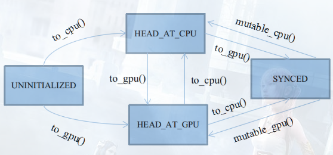

# 1. 硬件解析

## 1.1 物理硬件

大部分Caffe源码解读都喜欢跳过这部分，我不知道他们是什么心态，因为这恰恰是最重要的一部分。

内存的管理不擅，不仅会导致程序的立即崩溃，还会导致内存的泄露，当然，这只针对传统CPU程序而言。

由于GPU的引入，我们需要同时操纵俩种不同的存储体：

一个受北桥控制，与CPU之间架起**地址总线、控制总线、数据总线**。

一个受南桥控制，与CPU之间仅仅是一条可怜的**PCI总线**。

一个传统的C++程序，在操作系统中，会被装载至内存空间上。

一个有趣的问题，你觉得CPU能够访问显存空间嘛？你觉得你的默认C++代码能访问显存空间嘛？

结果显然是否定的，问题就在于CPU和GPU之间**只存在一条数据总线**。

**没有地址总线和控制总线**，你**除了让CPU发送数据拷贝指令外，别无其它用处。**

## 1.2 环境之艰
可怜的数据总线，加大了异构程序设计的难度。
于是我们看到，GPU的很大一部分时钟周期，用在了和CPU互相交换数据。
DDR4->48GB/S,GDDR->150GB/S
内存如何去弥补与显存的之间带宽的差距？
**分时、异步、多线程**。
换言之，如果GPU需要在接下来1秒内，获得CPU的150GB数据，那么CPU显然不能提前一秒去复制。
它需要提前3秒、甚至4秒。如果它当前还有其它串行任务，你就不得不设个线程去完成它。
这就是新版Caffe增加的新功能之一：**多重预缓冲**。
设置于**DataLayer的分支线程**，**在GPU计算，CPU空闲期间，为显存预先缓冲3~4个Batch的数据量，**
来解决内存显存带宽不一致，导致的GPU时钟周期浪费问题，也增加了CPU的利用率。

## 1.3 编程之繁
在传统的CUDA程序设计里，我们往往经历这样一个步骤：

-> 计算前
cudaMalloc(....)          【分配显存空间】

cudaMemset(....)　　 【显存空间置0】

cudaMemcpy(....)　   【将数据从内存复制到显存】

-> 计算后
cudaMemcpy(....)       【将数据从显存复制回内存】
这些步骤相当得繁琐，你不仅需要反复敲打，而且如果忘记其中一步，就是毁灭性的灾难。

这还仅仅是GPU程序设计，如果考虑到CPU/GPU异构设计，那么就更麻烦了。

于是，聪明的人类就发明了**主存管理自动机**，按照按照一定逻辑设计状态转移代码。

这是Caffe非常重要的部分，称之为**SyncedMemory(同步存储体)**。

## 1.4 主存模型
> 状态转移自动机


自动机共有四种状态，以枚举类型定义于类SyncedMemory中：
> enum SyncedHead { UNINITIALIZED, HEAD_AT_CPU, HEAD_AT_GPU, SYNCED };

这四种状态基本会被四个应用函数触发：```cpu_data()、gpu_data()、mutable_cpu_data()、mutable_gpu_data()```

在它们之上，有四个状态转移函数：```to_cpu()、to_gpu()、mutable_cpu()、mutable_gpu()```

前两个状态转移函数用于未进入Synced状态之前的状态机维护，后两个用于从Synced状态中打破出来。

具体细节见后文，因为Synced状态会忽略to_cpu和to_gpu的行为，打破Synced状态只能靠人工赋值，切换状态头head。

后两个mutable函数会被整合在应用函数里，因为它们只需要简单地为head赋个值，没必要大费周章写个函数封装。

---
**★UNINITIALIZED**
UNINITIALIZED状态很有趣，它的生命周期是所有状态里最短的，将随着CPU或GPU其中的任一个申请内存而终结。
在整个内存周期里，我们并非一定要遵循着，数据一定要先申请内存，然后在申请显存，最后拷贝过去。

实际上，在GPU工作的情况下，大部分主存储体都是直接申请显存的，如除去DataLayer的前向/反向传播阶段。
所以，UNINITIALIZED允许直接由to_gpu()申请显存。

由此状态转移时，除了需要申请内存之外，通常还需要将内存置0。

---

**★HEAD_AT_CPU**：
该状态**表明最近一次数据的修改**，是**由CPU触发的**。

注意，**它只表明最近一次是由谁修改**，而不是谁访问。

在GPU工作时，该状态将成为所有状态里生命周期第二短的，通常自动机都处于SYNCED和HEAD_AT_GPU状态，
因为大部分数据的修改工作都是GPU触发的。

在GPU工作时，该状态将成为所有状态里生命周期第二短的，通常自动机都处于SYNCED和HEAD_AT_GPU状态，

因为大部分数据的修改工作都是GPU触发的。

该状态只有三个来源：
I、由UNINITIALIZED转移到：说白了，就是钦定你作为第一次内存的载体。

II、由mutable_cpu_data()强制修改得到：都要准备改数据了，显然需要重置状态。

cpu_data()及其子函数to_cpu()，只要不符合I条件，都不可能转移到改状态(因为**访问不会引起数据的修改**)

---
**★HEAD_AT_GPU**：

该状态表明最近一次数据的修改，是由GPU触发的。

几乎是与HEAD_AT_CPU对称的。

---

**★SYNCED：**
最重要的状态，也是唯一一个非必要的状态。

单独设立同步状态的原因，是为了标记内存显存的数据一致情况。

由于类SyncedMemory将同时管理两种主存的指针，

如果遇到HEAD_AT_CPU，却要访问显存。或是HEAD_AT_GPU，却要访问内存，那么理论上，得先进行**主存复制**。

这个复制操作是可以被优化的，因为如果内存和显存的数据是一致的，就没必要来回复制。

所以，使用SYNCED来标记数据一致的情况。

**SYNCED**只有两种转移来源：
I、由 **HEAD_AT_CPU+to_gpu()** 转移到：
含义就是，CPU的数据比GPU新，且需要使用GPU，此时就必须同步主存。

II、由 **HEAD_AT_GPU+to_cpu()** 转移到：

含义就是，GPU的数据比CPU新，且需要使用CPU，此时就必须同步主存。

在转移至SYNCED期间，还需要做两件准备工作：

I、检查当前CPU/GPU态的指针是否分配主存，如果没有，就重新分配。

II、复制主存至对应态。

处于**SYNCED**状态后，**to_cpu()**和**to_gpu()**将会得到优化，跳过内部全部代码。

自动机将不再运转，因为，此时仅需要返回需要的主存指针就行了，不需要特别维护。

这种安宁期会被**mutable前缀**的函数打破，因为它们会强制修改至HEAD_AT_XXX，**再次启动自动机**。

## 1.5 代码实战
建立`synced_memory.hpp`，在操作主存之前，你需要封装一些基础函数。

CPU端的函数是C/C++标准的通用函数：
```c++


```


