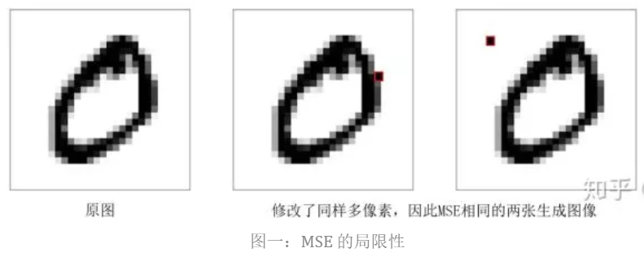

> 本文主要介绍了近年来GAN(生成对抗网络)在分布差异度量，IPM与正则化，对偶学习，条件与控制，提高分辨率，评价指标等问题上的发展情况和代表性工作，希望对之前没有跟进GAN相关工作的同学有所帮助

## 导视
---
很多机器学习任务可以归结为 **domain transform**，将数据从源域转换到目标域，例如根据文字生成图像、根据前一帧生成后一帧、将一种文革转换为另外一种风格等等。现有的神经网络 **module** 已经能够帮助我们将源数据映射为任意目标 **size**,而 MSE、MAE、Huber LOSS等传统的损失函数，也能够度量生成样本与目标域样本之间的差异。

但是，用这种方式构建的模型(比如 Auto Encoder)在 BP后，往往不那么 **令人满意**。

在研究过程中，一些工作发现，这些 **传统的损失函数** 在指导 NN更新的过程中 只能 **粗略地** 根据所有像素的 **平均误差**计算梯度，导致了很多 边缘分布、局部的差异没有被学到。

如上图所示，两张生成图像在原图的基础上修改的像素数目相同，因此其 MSE误差相同。然而根据常识，第二章图像明显不符合 0 的模式。一个好的损失函数，应当赋予第二张生成图像更大的 MSE.

在此基础上，GAN网络提出了一种可学习的 **损失函数**，即 判别器(Discriminator) 