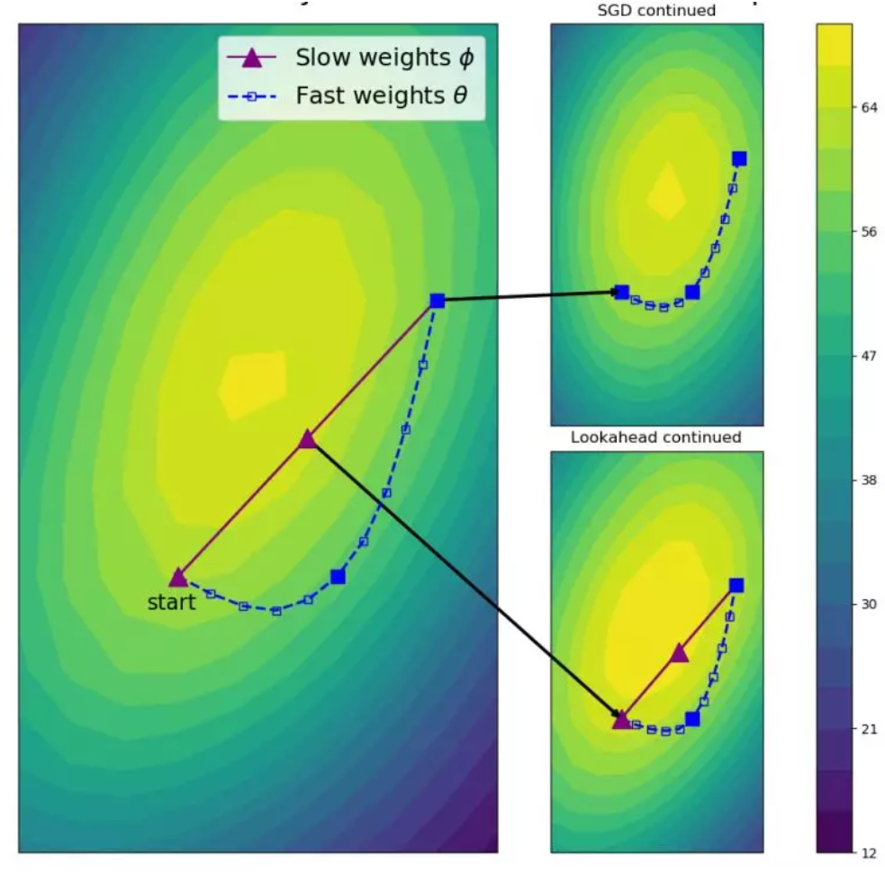
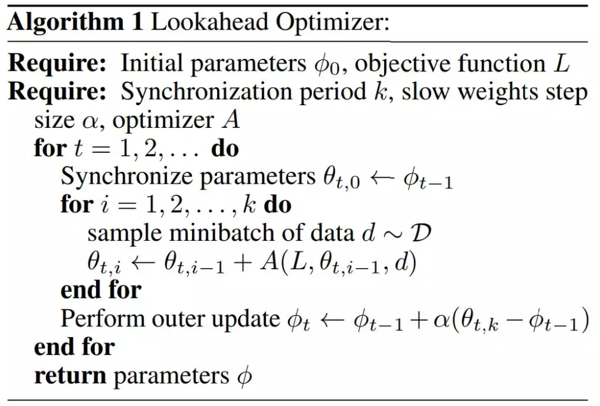
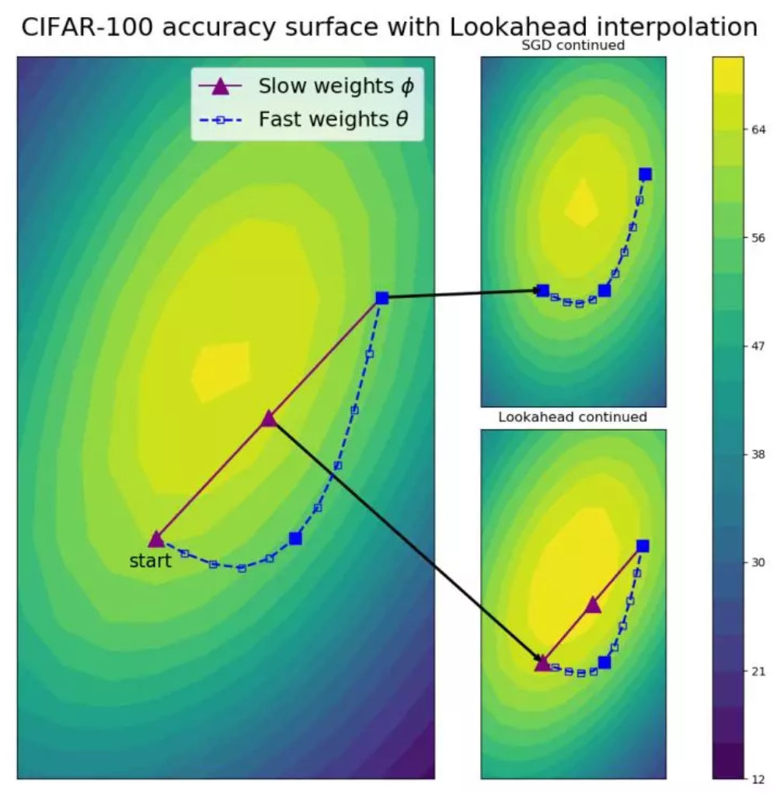
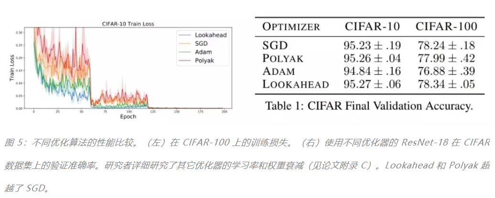
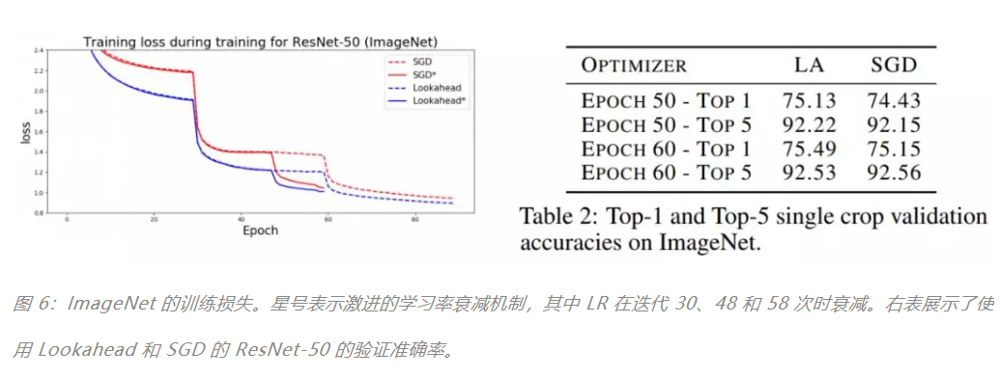
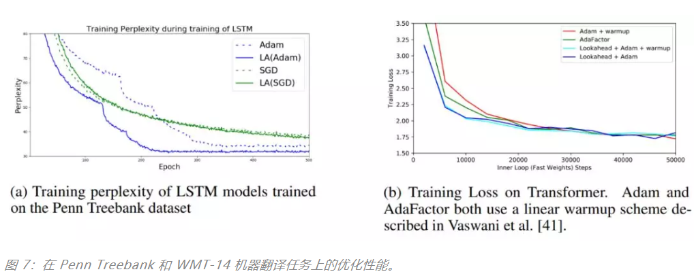

## Adam作者，联合 Hinton等人推出全新优化方法 lookahead
从最开始的批量梯度下降，到后来的随机梯度下降，然后到 Adam 等一大帮基于适应性学习率的方法，最优化器已经走过了很多年。尽管目前 Adam 差不多已经是默认的最优化器了，但从 17 年开始就有各种研究表示 Adam 还是有一些缺陷的，甚至它的收敛效果在某些环境下比 SGD 还差。

最近，来自多伦多大学向量学院的研究者发表了一篇论文，提出了一种新的优化算法——Lookahead。值得注意的是，该论文的最后作者 Jimmy Ba 也是原来 Adam 算法的作者，Hinton 老爷子也作为三作参与了该论文，所以作者阵容还是很强大的。
论文地址：https://arxiv.org/abs/1907.08610v1

**Lookahead算法与已有的方法完全不同，它迭代地更新两组权重。直观来说，Lookahead算法通过提前观察另一个优化器生成的 [fast weights]序列，来选择搜索方向。该研究发现，Lookahead算法能够提升学习稳定性，不仅降低了调参需要的功夫，同时还能提升收敛速度与效果。**

实验证明，Lookahead 算法的性能显著优于 SGD 和 Adam，即使 Lookahead 使用的是在 ImageNet、CIFAR-10/100、神经机器翻译和 Penn Treebank 任务上的默认超参数设置。

### 最优化器犯了什么错
SGD算法虽然简洁，但其在神经网络中的性能看比高级二阶优化方法。尽管SGD每一次用小批量算出来的更新方法可能并非那么精确，但更新读了效果却出乎意外地好。

一般而言，SGD 各种变体可以分成两大类：1）**自适应学习率机制**，如 AdaGrad 和 Adam；2）**加速机制**，如 Polyak heavyball 和 Nesterov momentum 等。这两种方法都利用之前累积的梯度信息实现快速收敛，它们希望借鉴以往的更新方向。但是，要想实现神经网络性能提升，通常需要花销高昂的超参数调整。

其实很多研究者都发现目前的最优化方法可能有些缺点，不论是 Adam 还是带动量的 SGD，它们都有难以解决的问题。例如我们目前最常用的 Adam，我们拿它做实验是没啥问题的，但要是想追求收敛性能，那么最好还是用 SGD+Momentum。但使用动量机制又会有新的问题，我们需要调整多个超参数以获得比较好的效果，不能像 Adam 给个默认的学习率 0.0001 就差不多了。

在 ICLR 2018 的最佳论文 On the Convergence of Adam and Beyond 中，研究者明确指出了 Adam 收敛不好的原因。他们表明在 **利用历史梯度的移动均值情况下，模型只能根据短期梯度信息为每个参数设计学习率，因此也就导致了收敛性表现不太好。**

那么 Hinton 等研究者是怎样解决这个问题的？他们提出的最优化方法能获得高收敛性能的同时，还不需要调参吗？

### 多伦多大学的「Look ahead」
Michael R. Zhang 和 Geoffrey Hinton 等研究者提出了一种新的最优化方法 Lookahead，该算法与之前已有的方法都不相同。此外，因为 Lookahead 与其它最优化器是正交的，这意味着我们可以使用 Lookahead 加强已有最优化方法的性能。

如下所示为 Lookahead 的直观过程，它会维护两套权重。Lookahead 首先使用内部循环中的 SGD 等标准优化器，更新 k 次「Fast weights」，然后以最后一个 Fast weights 的方向更新「slow weights」。如下 Fast Weights 每更新 5 次，Slow weights 就会更新一次。

**该研究表明这种更新机制能够有效地降低方差**，研究者发现 Lookahead对次优超参数没那么敏感，因此它对大规模调参的需求没那么强，此外，使用 Lookahead 及其内部优化器（如 SGD 或 Adam），还能实现更快的收敛速度，因此计算开销也比较小。

研究者在多个实验中 Lookahead 的效果。比如在 CIFAR 和 ImageNet 数据集上训练分类器，并发现使用 Lookahead 后 ResNet-50 和 ResNet-152 架构都实现了更快速的收敛。

研究者还在 Penn Treebank 数据集上训练 LSTM 语言模型，在 WMT 2014 English-to-German 数据集上训练基于 Transformer 的神经机器翻译模型。在所有任务中，使用 Lookahead 算法能够实现更快的收敛、更好的泛化性能，且模型对超参数改变的鲁棒性更强。

这些实验表明 Lookahead 对内部循环优化器、fast weight 更新次数以及 slow weights 学习率的改变具备鲁棒性。

### Lookahead Optimizer 怎么做

Lookahead 迭代地更新**两组权重**：**slow weights φ** 和 **fast weights θ**，前者在后者每更新 k 次后更新一次。**Lookahead 将任意标准优化算法 A 作为内部优化器来更新 fast weights**。

slow weights 每更新一次，fast weights 将被重置为目前的 slow weights 值。Lookahead 的伪代码见下图 Algorithm 1。

其中最优化器 A 可能是 Adam 或 SGD 等最优化器，内部的 for 循环会用常规方法更新 fast weights θ，且每次更新的起始点都是从当前的 slow weights φ 开始。

其中最优化器 A 可能是 Adam 或 SGD 等最优化器，内部的 for 循环会用常规方法更新 fast weights θ，且每次更新的起始点都是从当前的 slow weights φ 开始。最终模型使用的参数也是慢更新那一套，因此快更新相当于做了一系列实验，然后慢更新再根据实验结果选一个比较好的方向，这有点类似 Nesterov Momentum 的思想。

看上去这只是一个小技巧？似乎它应该对实际的参数更新没什么重要作用？那么继续看看它到底为什么能 Work。

### Lookahead 为什么能 Work
标准优化方法通常需要**谨慎调整学习率**，以**防止振荡和收敛速度过慢**，这在 SGD 设置中更加重要。而 Lookahead 能借助较大的内部循环学习率减轻这一问题。

当 **Lookahead 向高曲率方向振荡时**，fast weights 更新在低曲率方向上快速前进，slow weights 则通过参数插值使振荡平滑。fast weights 和 slow weights 的结合改进了高曲率方向上的学习，降低了方差，并且使得 Lookahead 在实践中可以实现更快的收敛。

另一方面，Lookahead 还能提升收敛效果。当 fast weights 在极小值周围慢慢探索时，slow weight 更新促使 Lookahead 激进地探索更优的新区域，从而使测试准确率得到提升。这样的探索可能是 SGD 更新 20 次也未必能够到达的水平，因此有效地提升了模型收敛效果。

如上为 ResNet-32 在 CIFAR-100 训练 100 个 Epoch 后的可视化结果。在从上图可以看到模型已经接近最优解了，右上的 SGD 还会慢慢探索比较好的区域，因为当时的梯度已经非常小了。但是右下的 Lookahead 会根据 slow weights（紫色）探索到更好的区域。

当然这里只是展示了 Lookahead 怎么做，至于该算法更新步长、内部学习率等参数怎么算，读者可以查阅原论文。此外，Hinton 等研究者还给出了详细的收敛性分析，感兴趣的读者也可以细细阅读，毕竟当年 ICLR 2018 最佳论文可是找出了 Adam 原论文收敛性分析的错误。

### 实验分析
研究人员在一系列深度学习任务上使用 Lookahead 优化器和业内最强的基线方法进行了对比，其中包括在 CIFAR-10/CIFAR-100、ImageNet 上的图像分类任务。此外，研究人员在 Penn Treebank 数据集上训练了 LSTM 语言模型，也探索了基于 Transformer 的神经机器翻译模型在 WMT 2014 英语-德语数据集上的表现。对于所有实验，每个算法都使用相同数量的训练数据。

从这些实验中，可以得到如下结论：

* 对于内部优化算法、k 和 α 的鲁棒性：研究人员在 CIFAR 数据集上的实验表明，Lookahead 可以始终如一地在不同初始超参数设置中实现快速收敛。我们可以看到 Lookahead 可以在基础优化器上使用更高的学习率进行训练，且无需对 k 和 α 进行大量调整。

* 内循环和外循环评估：研究人员发现，在每个内循环中 fast weights 可能会导致任务性能显著下降——这证实了研究者的分析：内循环更新的方差更高。