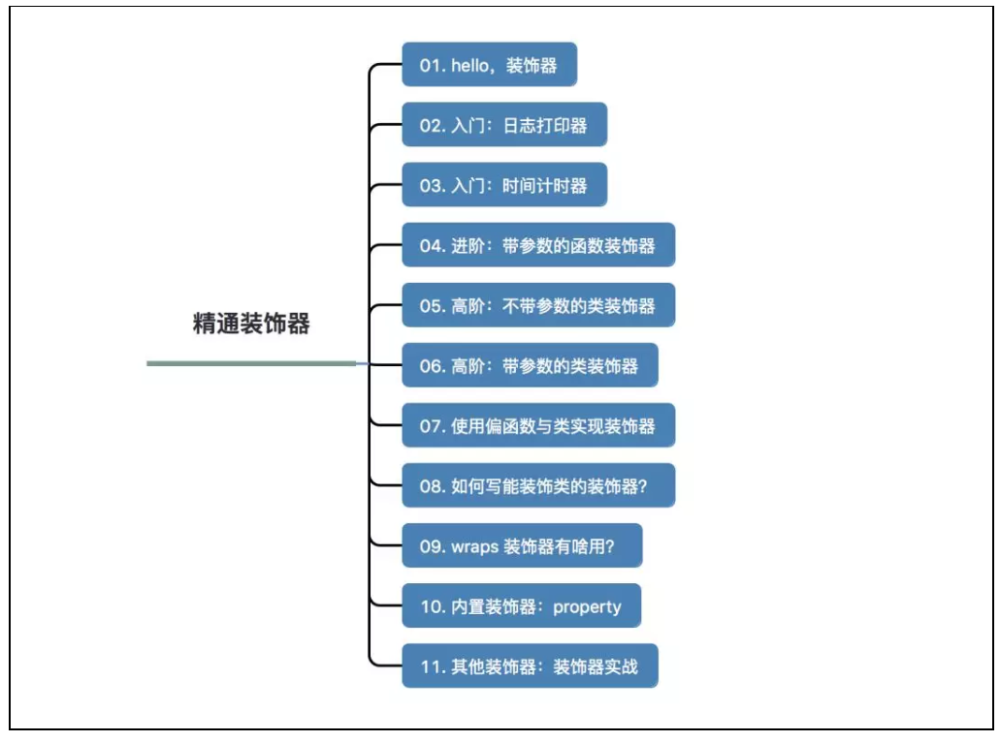

## 1. 装饰器简介

https://mp.weixin.qq.com/s?__biz=MzAxMjUyNDQ5OA==&mid=2653560626&idx=2&sn=b7210749476e1776ca11544689e1bb32&chksm=806e318fb719b8990ad4f8d456fe597e8952ace77d1ce899b81b41d883f84fdb8e1c0400369f&mpshare=1&scene=24&srcid=&sharer_sharetime=1566349035500&sharer_shareid=c6dddb77371c457f894e87ca845a013d&key=62a784aeab1c83b27a825a5a8aa4d18f5c2f0e03036a200c547a4c64c0d7e2375db41044188a10d04198c760be19291effae0bdc93dc460d6270a10fefb7021c1fe7fdaded0d361cf697d97768b5d4be&ascene=14&uin=MTM2MTEwNTY4NA%3D%3D&devicetype=Windows+10&version=62060833&lang=zh_CN&pass_ticket=P6x3%2BYeap7p7GazLAUVYeDbSAQOdghT1mGF9NXIzDp0WJE4F7cdG9vwBRfdL3D3u


装饰器放在一个函数开始定义的地方，它就像一顶帽子一样戴在这个函数的头上。和这个函数绑定在一起。在我们调用这个函数的时候，第一件事并不是执行这个函数，而是将这个函数做为参数传入它头顶上这顶帽子，这顶帽子我们称之为 **装饰器** 。

曾经我在刚转行做程序员时的一次的面试中，被面试官问过这样的两个问题：

> 1、你都用过装饰器实现过什么样的功能？
> 2、如何写一个可以传参的装饰器？



## 2. Hello，装饰器

装饰器的使用方法很固定：

1. 先定义一个装饰器(帽子)
2. 再定义你的业务函数或者类(人)
3. 最后把这装饰器(帽子)扣在这个函数(人)头上

```python
def decorator(func):
    def wrapper(*args, **kw):
        return func()
    return wrapper

@decorator
def function():
    print("hello, decorator")
```


## 3.入门：日志打印器

首先是 **日志打印器。**
实现的功能：
1. 在函数执行前，先打印一行日志告知一下主人，我要执行函数了。
2. 在函数执行完，也不能拍拍屁股走人，咱可是有礼貌的代码，再打印一行日志告知下主人，我执行完啦。

```python
# 这是装饰器函数，参数 func是被装饰的函数

def logger(func):
    def wrapper(*args,**kw):
        print(f"我要开始执行：{func.__name__} 函数了")
    
        #真正执行的是这行
        func(*args,**kw)

        print('执行完毕')
    return wrapper

@logger
def add(x,y):
    print(f"{x} + {y} = {x+y}")

add(200,50)
```

## 4. 入门：时间计数器
再来看看 时间计时器
实现功能：顾名思义，就是计算一个函数的执行时长。

```python
# 这是装饰函数
def timer(func):
    def wrapper(*args,**kw):
        t1 = time.time()
        # 这是函数真正执行的地方
        func(*args,**kw)

        t2 = time.time()

        cost_time = t2 -t1 
        print(f"花费时间：{cost_time}")
    return wrapper

import time
@timer
def want_sleep(sleep_time):
    time.sleep(sleep_time)

want_sleep(10)
```

## 5.带参数的函数装饰器
通过上面两个简单的入门示例，你应该能体会到装饰器的工作原理了。

不过，装饰器的用法还远不止如此，深究下去，还大有文章。今天就一起来把这个知识点学透。

回过头去看看上面的例子，装饰器是不能接收参数的。其用法，只能适用于一些简单的场景。不传参的装饰器，只能对被装饰函数，执行固定逻辑。

装饰器本身是一个函数，做为一个函数，如果不能传参，那这个函数的功能就会很受限，只能执行固定的逻辑。这意味着，如果装饰器的逻辑代码的执行需要根据不同场景进行调整，若不能传参的话，我们就要写两个装饰器，这显然是不合理的。

比如我们要实现一个可以定时发送邮件的任务（一分钟发送一封），定时进行时间同步的任务（一天同步一次），就可以自己实现一个 periodic_task （定时任务）的装饰器，这个装饰器可以接收一个时间间隔的参数，间隔多长时间执行一次任务。

可以这样像下面这样写，由于这个功能代码比较复杂，不利于学习，这里就不贴了。

```python
@periodic_task(spacing=60)
def send_mail():
     pass

@periodic_task(spacing=86400)
def ntp()
    pass 
```
那我们来自己创造一个伪场景，可以在装饰器里传入一个参数，指明国籍，并在函数执行前，用自己国家的母语打一个招呼。
```python
def say_hello(contry):
    def wrapper(func):
        def deco(*args,**kwargs):
            if contry == "china":
                print("你好呀")
            elif contry == "america":
                print("hello")
            else:
                return

            # 真正执行函数的地方
            func(*args,**kwargs)
        return deco
    return wrapper

# 小明，中国人
@say_hello("china")
def xiaoming():
    pass

# jack 美国人
@say_hello("america")
def jack():
    pass

xiaoming()
print("---------")
jack()
```

## 6.高阶：不带参数的类装饰器
以上都是基于函数实现的装饰器，在阅读别人代码时，还可以时常发现还有基于 **类**实现的装饰器。
基于类装饰器的实现，必须实现 \_\_call__ 和 __init__两个内置函数。

\_\_init__ ：接收被装饰函数
\_\_call__ ：实现装饰逻辑。

还是以日志打印这个简单的例子为例

```python
class logger(object):
    def __init__(self,func):
        self.func = func
    
    def __call__(self,*args,**kwargs):
        print(f"[INFO]: the function {self.func.__name__} is running")
        return self.func(*args,**kwargs)

@logger
def say(something):
    print(f"say {something}!")

say("hello")
```


