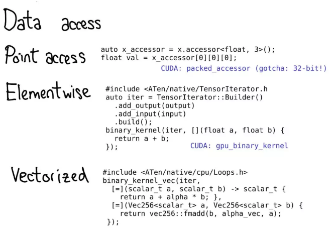
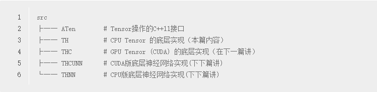

# 1。有关问题
## 1.1 docker shm
1. 在docek内运行，需要设置 “--shm-size=”，默认大小为 64MB，路径为"\dev\shm"; 如果在 K8s内，通过 emptyDir 支持内存，挂载到容器的 shm目录，最终实现对容器的共享内存进行扩容。
```
volumes:
- name: dshm
emptyDir:
    medium: Memory
containers:
- volumeMounts:
    - mountPath: /dev/shm
    name: dshm
```
**原理**：
> Please note that PyTorch uses shared memory to share data between processes, so if torch multiprocessing is used (e.g. for multithreaded data loaders) the default shared memory segment size that container runs with is not enough, and you should increase shared memory size either with --ipc=host or --shm-size command line options to nvidia-docker run.
在预加载训练或者测试图片时，会采用多进程，之间会共享内存。

---
##  1.2. pin_memory 

通常情况下，由于虚拟内存技术的存在，数据要么在内存中以锁页（“pinned”）的方式存在，要么保存在虚拟内存（磁盘）中。而cuda只接受锁页内存传入，所以在声明新的dataloader对象时，直接令其保存在锁页内存中，后续即可快速传入cuda。否则，数据需要从虚拟内存中先传入锁页内存，再传入cuda，

## 1.3 CUDA的锁页内存
对CUDA架构而言，主机端的内存被分为两种，一种是可分页内存（pageable memroy）和页锁定内存（page-lock或 pinned）。可分页内存是由操作系统API malloc()在主机上分配的，页锁定内存是由CUDA函数cudaHostAlloc()在主机内存上分配的，页锁定内存的重要属性是主机的操作系统将不会对这块内存进行分页和交换操作，确保该内存始终驻留在物理内存中。

GPU知道页锁定内存的物理地址，可以通过“直接内存访问（Direct Memory Access，DMA）”技术直接在主机和GPU之间复制数据，速率更快。事实上，当使用可分页内存进行复制时，复制操作将执行两遍，第一遍从可分页内存复制到一块“临时的”页锁定内存，然后再从这个页锁定内存复制到GPU上。因此，当在GPU和主机间复制数据时，这种差异会使也锁定主机内存的性能比标准可分页内存的性能要高大约2倍。

cuda运行时提供了使用分页锁定主机存储器(也称为pinned)的函数(与常规的使用malloc()分配的可分页的主机存储器不同)：
cudaHostAlloc()和cudaFreeHost()分配和释放分页锁定主机存储器; 


当为了提高CUDA程序的主机内存和设备内存传输消耗时，可以尝试一下两种方案

一：使用分页锁定内存，分页锁定内存和显存之间的拷贝速度大约是6GB/s，普通的分页内存和GPU间的速度大约是3GB/s，（另外：GPU内存间速度是30G,CPU间内存速度是10GB/s），但是这种方法会带来额外的cpu内存间的拷贝时间

二：使用内存映射（Zero Copy）让GPU直接使用CPU的内存，减少主机和设备间内存传输的时间，但是这种方法对于2.2以后的cuda版本未必管用

## 1.4 pytorch机理
一个高效的 C++ 核为了提高性能，PyTorch 的多数代码都是用 C++ 写的这一核心 libtorch 库用来实现张量数据结构、GPU 和CPU 算子以及基本并行基元。它还提供了一个自动微分系统，包括用于多数内置函数的梯度式。Python 的 bingding 是使用 YAML 元数据文件生成的。这种方法的个有趣副作用在于，它允许社区快速创建到多个其他语言的 binding ，生了 NimTorch、hasktorch 等新项目。

**分离控制** 和 **数据流控制流** 的解由 Python 和优化的、在主机 CPU 上执行的C++ 代码来处理，在设备上产生一个算子调用的线性序列。算子可以在CPU 或 GPU 上运行。PyTorch 通过利用 CUDA 流机制将 CUDA 内核调用排到 GPU 硬件 FIFO 来异步执行算子。

自定义缓存张量分配器PyTorch实现了一个自定义的分配器，它递增地构建CUDA内存的缓存并将其重新分配到之后的配额中，而无需进一步使用CUDA API。这种递增的分配对于实现更好的互操作性也非常关键，因为提前占用所有GPU内存会妨碍用户利用其他GPU支持的Python包。为了进一步提高其效率，这一分配器针对深度学习的特定内存使用模式进行了调优。。这种「一流一池（ one-pool-per-stream ）」的设计假设简化了实现，提高了分配器的性能。由于流序列化执行，如果空闲优先于 CPU 上的重新分配，同样的顺序也会发生在 GPU上。因此，只要在与释放的区域相同的流上使用新的分配，分配器就可以立即重新分配在 CPU 上释放的内存。但这种设计似乎也是有限制的，因为每个流的分配结果是碎片化的，但在实际操作中，PyTorch 几乎从不使用多个流。众所周知，以一种让CUDA 内核协同共享 GPU 的方式来编写 CUDA 内核是非常困难的，因为精确的调度是由硬件控制的。


多进程处理由于全局解释器锁（global interpreter lock，GIL）的 Python 默认实现不允许并行线程进行并行执行，所以为了解决该问题，Python 社区已经建立了一个标准的多进程处理模块，其中包含了大量的实用程序（utility），它们可以使得用户轻易地生成子进程并能够实现基础的进程间通信原语（communication primitive）。然而，原语的实现使用了与磁盘上持久性（on-disk persistence）相同格式的序列化，这在处理大规模数组时效率不高。所以，PyTorch 将Python 的 multiprocessing 模块扩展为 torch.multiprocessing，这就替代了内置包，并且 **自动将发送至其他进程的张量数据移动至共享内存中，而不用再通过通信渠道发送**。PyTorch 的这一设计极大地提升了性能，并且弱化了进程隔离（process isolation），从而产生了更类似于普通线程程序的编程模型。

引用计数用户常常设计模型来在训练期间利用所有可用的内存，并且增加批量大小是加速进程的常见方法。所以，为了发挥出色的性能，PyTorch必须将内存视作稀有资源，并小心管理。在引用计数方面，PyTorch 采取了一种不同的方法：**它依赖于一个引用计数方案来追踪每个张量的使用次数，并在该计数为零时立即释放底层内存。** 需要注意的是，PyTorch 通过集成 Python 自身的引用机制，追踪 libtorch 库内部的引用以及用户在其 Python 代码中所做的外部引用。需要特别警醒的一点是，我们在已经利用引用计数的语言（CPython、Swift，而非 PyPy 或 Lua 等众多脚本语言）实现，或者在那些允许用户自定义指定、复制和移动行为的语言（如 C++ 和 Rust ）实现中只能保证预期的性能特性。


## 1.5 C语言实现泛型编程
泛型(Genericity)就是编写一组函数，但是函数类型暂时不确定的能力。这组函数随后用用户需要的不同的类型进行实例化或创建。C语言并未提供这种能力，但是我们可以使用 #define 定义近似模拟这种机制。
如下：
```
|--- main.cpp
|---inc
   |---generic.h
```

```C
/*
main.cpp
*/
#include <iostream>

#define CONCAT_2_EXPAND(x,y) x ## y
#define show_(name) CONCAT_2_EXPAND(show_, name)
/*上面两句合并成一句： #define show_(name) show_##name 都会出错！
## 被称为连接符，用来将两个宏参数连接为一个宏参数。
#@其实就是给x加上单引号
#其实就是给x加上双引号，使其变成字符串
*/

#include "inc/generic.h" # 这里的导入，不会产生编译好的 show_ 函数
//real = int 类型， int 先用 real 来代表自己
#define real int

#line 1 GENERIC_FILE # 定义 real 后进行宏替代
#include GENERIC_FILE

#undef real // int 用完 real 后必须 undef 掉 real，因为 double 还要用 real

//real = double 类型
#define real double
#line 1 GENERIC_FILE
/*
它通知预处理器从下一行的行号被重新设定为 number 所代表的数字。如果给出了可选部分"string"，
预处理器就把它作为当前文件的名字。这条指令将修改__LINE__符号的值，
如果加上可选部分，还将修改__FILE__符号的值。
*/
#include GENERIC_FILE

int main() {
    show_int(6);
    show_double(3.14);


    std::cout<<__FILE__<<__LINE__<<endl;

    system("pause");
    return 0;
}
```

```C
// inc/generic.h
#ifndef GENERIC_FILE
#define GENERIC_FILE "inc/generic.h"
#else // 这里加了一个else,证明第一次的#include是不会进行编译

#include <iostream>
using namespace std;

void show_(real)(real number){
    cout << "real = " << number << endl;
}

#endif
```
```C
// main.i
...
# 6 "inc/generic.h"
using namespace std;

void show_int(int number){
    cout << "real = " << number << endl;
}
# 2 "inc/generic.h" 2
# 1 "inc/generic.h"
# 1 "inc/generic.h" 1

using namespace std;

void show_double(double number){
    cout << "real = " << number << endl;
}
# 2 "inc/generic.h" 2

int main() {
    show_int(6);
    show_double(3.14);
    std::cout<<"inc/generic.h"<<8<<endl;
    system("pause");
    return 0;
}

```
# 2。综述性原理说明
## 2.1 概念
1. 张量
张量是一种包含某种标量类型（比如浮点数和整型数等）的 n 维数据结构。我们可以将张量看作是由一些数据构成的，还有一些元数据描述了张量的大小、所包含的元素的类型（dtype）、张量所在的设备（CPU 内存？CUDA 内存？）


步幅（stride）


张量一个数学概念。但要在我们的计算机中表示它，我们必须为它们定义某种物理表示方法。最常用的表示方法是在**内存中相邻地放置张量的每个元素**（这也是术语「contiguous（邻接）」的来源），即将每一行写出到内存，如上所示。在上面的案例中，我已经指定该张量包含 32 位的整型数，这样你可以看到每一个整型数都位于一个物理地址中，每个地址与相邻地址相距 4 字节。为了记住张量的实际维度，我们必须将规模大小记为额外的元数据。


假设我想要读取我的逻辑表示中位置张量 [0,1] 的元素。我该如何将这个逻辑位置转译为物理内存中的位置？步幅能让我们做到这一点：要找到一个张量中任意元素的位置，我将每个索引与该维度下各自的步幅相乘，然后将它们全部加到一起。在上图中，我用蓝色表示第一个维度，用红色表示第二个维度，以便你了解该步幅计算中的索引和步幅。进行这个求和后，我得到了 2（零索引的）；实际上，数字 3 正是位于这个邻接数组的起点以下 2 个位置。

后面我还会谈到 TensorAccessor，这是一个处理索引计算的便利类（convenience class）。当你使用 TensorAccessor 时，不会再操作原始指针，这些计算过程已经为你隐藏了起来。）

步幅是我们为 PyTorch 用户讲解方法的基本基础。举个例子，假设我想取出一个表示以上张量的第二行的张量：


使用高级的索引支持，我只需写出张量 [1, :] 就能得到这一行。重要的是：当我这样做时，不会创建一个新张量；而是会返回一个基于底层数据的不同域段（view）的张量。这意味着，如果我编辑该视角下的这些数据，它就会反映在原始的张量中。

在这种情况下，了解如何做到这一点并不算太困难：3 和 4 位于邻接的内存中，我们只需要记录一个说明该（逻辑）张量的数据位于顶部以下 2 个位置的偏移量（offset）。（每个张量都记录一个偏移量，但大多数时候它为零，出现这种情况时我会在我的图表中省略它。）

如果我想取第一列：


当我们查看物理内存时，可以看到该列的元素不是相邻的：两者之间有一个元素的间隙。步幅在这里就大显神威了：我们不再将一个元素与下一个元素之间的步幅指定为 1，而是将其设定为 2，即跳两步。（顺便一提，这就是其被称为「步幅（stride）」的原因：如果我们将索引看作是在布局上行走，步幅就指定了我们每次迈步时向前多少位置。）


如果我们可以得到张量的域段，这就意味着我们必须解耦张量的概念（你所知道且喜爱的面向用户的概念）以及存储张量的数据的实际物理数据的概念（称为「存储（storage）」）


也许会有多个张量共享同一存储。存储会定义张量的 dtype 和物理大小，同时每个张量还会记录大小、步幅和偏移量，这定义的是物理内存的逻辑解释。

有一点需要注意：总是会存在一个张量-存储对，即使并不真正需要存储的「简单」情况也是如此（比如，只是用 torch.zeros(2, 2) 划配一个邻接张量时）。

在最抽象的层面上，当你调用 torch.mm 时，会发生两次调度：


第一次调度基于设备类型和张量布局：比如是 CPU 张量还是 CUDA张量，是有步幅的张量还是稀疏的张量。这个调度是动态的：这是一个虚函数（virtual function）调用（这个虚函数调用究竟发生在何处是本演讲后半部分的主题）。

这里需要做一次调度应该是合理的：CPU 矩阵乘法的实现非常不同于 CUDA 的实现。这里是动态调度的原因是这些核（kernel）可能位于不同的库（比如 libcaffe2.so 或 libcaffe2_gpu.so），这样你就别无选择：如果你想进入一个你没有直接依赖的库，你必须通过动态调度抵达那里。

第二次调度是在所涉 dtype 上的调度。这个调度只是一个简单的 switch 语句，针对的是核选择支持的任意 dtype。这里需要调度的原因也很合理：CPU 代码（或 CUDA 代码）是基于 float 实现乘法，这不同于用于 int 的代码。这说明你需要为每种 dtype 都使用不同的核。

如果你想要理解 PyTorch 中算子的调用方式，这可能就是你头脑中应有的最重要的知识。后面当我们更深入代码时还会回到这里。


因为我们已经谈过了张量，所以我还想花点时间谈谈张量扩展。毕竟，除了密集的 CPU 浮点数张量，还有其它很多类型的张量，比如 XLA 张量、量化张量、MKL-DNN 张量；而对于一个张量库，还有一件需要思考的事情：如何兼顾这些扩展？


我们当前的用于扩展的模型提供了张量的四个扩展点。首先，有三个独立地确定张量类型的配套参数：

* device（设备）：描述了实际存储张量的物理内存，比如在 CPU、英伟达 GPU（cuda）、AMD GPU（hip）或 TPU（xla）上。设备之间各不相同的特性是有各自自己的分配器（allocator），这没法用于其它设备。
* layout（布局）：描述了对物理内存进行逻辑解读的方式。最常用的布局是有步幅的张量（strided tensor），但稀疏张量的布局不同，其涉及到一对张量，一个用于索引，一个用于数据；MKL-DNN 张量的布局更加奇特，比如 blocked layout，仅用步幅不能表示它。
* dtype（数据类型）：描述了张量中每个元素实际存储的数据的类型，比如可以是浮点数、整型数或量化的整型数。

如果你想为 PyTorch 张量添加一种扩展，你应该思考你想要扩展这些参数中的哪几种。这些参数的笛卡尔积定义了你可以得到的所有可能的张量。现在，并非所有这些组合都有核（谁为 FPGA 上的稀疏量化张量用核?），但原则上这种组合可能有意义，因此我们至少应该支持表达它。

要为张量的功能添加「扩展」，还有最后一种方法，即围绕能实现的目标类型的 PyTorch 张量编写一个 wrapper（包装）类。这可能听起来理所当然，但有时候人们在只需要制作一个 wrapper 类时却跑去扩展那三个参数。wrapper 类的一个突出优点是开发结果可以完全不影响原来的类型（out of tree）。

你何时应该编写张量 wrapper，而不是扩展 PyTorch 本身？关键的指标是你是否需要将这个张量传递通过 autograd（自动梯度）反向通过过程。举个例子，这个指标告诉我们稀疏张量应该是一种真正的张量扩展，而不只是一种包含一个索引和值张量的 Python 对象：当在涉及嵌入的网络上执行优化时，我们想要嵌入生成稀疏的梯度。


## 2.2 pytorch 文件目录


* 首先，torch/ 包含你最熟悉的东西：你导入和使用的实际的 Python 模块。这些东西是 Python 代码而且易于操作（只需要进行修改然后查看结果即可）。但是，如果太过深入……
* torch/csrc/：实现了你可能称为 PyTorch 前端的 C++ 代码。用更描述性的术语讲，它实现了在 Python 和 C++ 间转换的绑定代码（binding code）；另外还有一些相当重要的 PyTorch 部分，比如 autograd 引擎和 JIT 编译器。它也包含 C++ 前端代码。
* aten/：这是「A Tensor Library」的缩写（由 Zachary DeVito 命名），是一个实现张量运算的 C++ 库。如果你检查某些核代码所处的位置，很可能就在 ATen。ATen 本身就分为两个算子区域：「原生」算子（算子的现代的 C++ 实现）和「传统」算子（TH、THC、THNN、THCUNN），这些是遗留的 C 实现。传统的算子是其中糟糕的部分；如果可以，请勿在上面耗费太多时间。
* c10/：这是「Caffe2」和「A"Ten"」的双关语，包含 PyTorch 的核心抽象，包括张量和存储数据结构的实际实现。

找代码需要看很多地方；我们应该简化目录结构，就是这样。如果你想研究算子，你应该在 aten 上花时间。

我们看看在实践中是如何分离这些代码的：


当你调用一个函数时，比如 torch.add，会发生什么？如果你记得我们的有关调度的讨论，你脑中应该已有了这些基础
* 我们必须从 Python 国度转换到 C++ 国度（Python 参数解析）。
* 我们处理变量调度（VariableType—Type，顺便一提，和编程语言类型并无特别关联，只是一个用于执行调度的小工具）。
* 我们处理设备类型/布局调度（Type）。
* 我们有实际的核，这要么是一个现代的原生函数，要么是传统的 TH 函数。

其中每一步都具体对应于一些代码。


我们在 C++ 代码中的起始着陆点是一个 Python 函数的 C 实现，我们已经在 Python 那边见过它，像是 torch._C.VariableFunctions.add。THPVariable_add 就是这样一个实现。

对于这些代码，有一点很重要：这些代码是自动生成的。如果你在 GitHub 库中搜索，你没法找到它们，因为你必须实际 build PyTorch 才能看到它们。另外一点也很重要：你不需要真正深入理解这些代码是在做什么，你应该快速浏览它，知道它的功能。

我在上面用蓝色标注了最重要的部分：你可以看到这里使用了一个 PythonArgParser 类来从 Python args 和 kwargs 取出 C++ 对象；然后我们调用一个 dispatch_add 函数（红色内联）；这会释放全局解释器锁，然后调用在 C++ 张量自身上的一个普通的旧方法。在其回来的路上，我们将返回的 Tensor 重新包装进 PyObject。


当我们在 Tensor 类上调用 add 方法时，还没有虚调度发生。相反，我有一个内联方法，其调用了一个内联方法，其会在「Type」对象上调用一个虚方法。这个方法是真正的虚方法（这就是我说 Type 只是一个让你实现动态调度的「小工具」的原因）。

在这个特定案例中，这个虚调用会调度到在一个名为 TypeDefault 的类上的 add 的实现。这刚好是因为我们有一个对所有设备类型（CPU 和 CUDA）都一样的 add 的实现；如果我们刚好有不同的实现，我们可能最终会得到 CPUFloatType::add 这样的结果。正是这种虚方法的实现能让我们最终得到实际的核代码。

也希望这张幻灯片很快过时；Roy Li 正在研究使用另一种机制替代 Type 调度，这能让我们更好地在移动端上支持 PyTorch。

值得再次强调，一直到我们到达核，所有这些代码都是自动生成的。


## 2.3编写核（kernel）

PyTorch 为有望编写核的人提供了大量有用工具。在这一节我们会了解其中一些。但首先，编写核需要什么？


我们一般将 PyTorch 中的核看作由以下部分组成：
* 首先有一些我们要写的有关核的元数据，这能助力代码生成并让你获取所有与 Python 的捆绑包，同时无需写任何一行代码。
* 一旦你到达了核，你就经过了设备类型/布局调度。你首先需要写的是错误检查，以确保输入的张量有正确的维度。（错误检查真正很重要！不要吝惜它！）
* 接下来，我们一般必须分配我们将要写入输出的结果张量。
* 该到写核的时候了。现在你应该做第二次 dtype 调度，以跳至其所操作的每个 dtype 特定的核。（你不应该过早做这件事，因为那样的话你就会毫无用处地复制在任何情况下看起来都一样的代码。）
* 大多数高性能核都需要某种形式的并行化，这样就能利用多 CPU 系统了。（CUDA 核是「隐式」并行化的，因为它们的编程模型构建于大规模并行化之上。）
* 最后，你需要读取数据并执行你想做的计算！

在后面的幻灯片中，我将介绍 PyTorch 中能帮你实现这些步骤的工具。

要充分利用 PyTorch 的代码生成能力，你需要为你的算子写一个模式（schema）。这个模式能提供你的函数的 mypy 风格类型，并控制是否为 Tensor 上的方法或函数生成捆绑包。你还可以告诉模式针对给定的设备-布局组合，应该调用你的算子的哪种实现。

有关这种格式的更多信息，请参阅：https://github.com/pytorch/pytorch/blob/master/aten/src/ATen/native/README.md

你可能也需要为你在 derivatives.yaml 中的操作定义一个导数。


错误检查可以在低层 API 完成，也能通过高层 API 实现。低层 API 只是一个宏 TORCH_CHECK，其接收的是一个布尔值，然后还有任意数量的参数构成错误字符串（error string）以便得出结论看该布尔值是否为真。

高层 API 能让你免于反复编写重复的错误消息。其工作方法是；你首先将每个张量包装为 TensorArg，这包含有关张量来处的信息（比如其参数名称）。然后它提供了一些预先装好的用于检查多种属性的函数；比如 checkDim() 测试的是张量的维度是否是一个固定数值。如果不是，该函数就基于 TensorArg 元数据提供一个用户友好的错误消息。


在用 PyTorch 写算子时，有一点很重要：你往往要注册三个算子：abs_out（其操作的是一个预分配的输出，其实现了 out= keyword 参数）、abs_（其操作的是 inplace）、abs（这只是一个算子的普通的旧功能版本）。

大部分时间，abs_out 是真正的主力，abs 和 abs_ 只是围绕 abs_out 的薄弱 wrapper；但有时候也可为每个案例编写专门的实现。


要执行 dtype 调度，你应该使用 AT_DISPATCH_ALL_TYPES 宏。这会获取你想要进行调度操作的张量的 dtype，并还会为可从该宏调度的每个 dtype 指定一个 lambda。通常而言，这个 lambda 只是调用一个模板辅助函数。

这个宏不只是「执行调度」，它也会决定你的核将支持的 dtype。这样，这个宏实际上就有相当多一些版本，这能让你选取不同的 dtype 子集以生成特定结果。大多数时候，你只需要 AT_DISPATCH_ALL_TYPES，但也要关注你可能需要调度其它更多类型的情况。


在 CPU 上，你通常需要并行化你的代码。过去，这通常是通过直接在你的代码中添加 OpenMP pragma 来实现。


某些时候，你必须真正访问数据。PyTorch 为此提供了相当多一些选择。
* 如果你只想获取某个特定位置的值，你应该使用 TensorAccessor。张量存取器就像是一个张量，但它将张量的维度和 dtype 硬编码为了模板参数。当你检索一个存取器时，比如 x.accessor();，我们会做一次运行时间测试以确保张量确实是这种格式；但那之后，每次存取都不会被检查。张量存取器能正确地处理步幅，因此你最好使用它们，而不是原始的指针访问（不幸的是，很多传统的核是这样做的）。另外还有 PackedTensorAccessor，这特别适用于通过 CUDA launch 发送存取器，这样你就能从你的 CUDA 核内部获取存取器。（一个值得一提的问题：TensorAccessor 默认是 64 位索引，这比 CUDA 中的 32 位索引要慢得多！）
* 如果你在用很常规的元素存取编写某种算子，比如逐点运算，那么使用远远更高级的抽象要好得多，比如 TensorIterator。这个辅助类能为你自动处理广播和类型提升（type promotion），相当好用。
* 要在 CPU 上获得真正的速度，你可能需要使用向量化的 CPU 指令编写你的核。我们也有用于这方面的辅助函数！Vec256 类表示一种标量向量，并提供了一些能在它们上一次性执行向量化运算的方法。然后 binary_kernel_vec 等辅助函数能让你轻松地运行向量化运算，然后结束那些没法用普通的旧指令很好地转换成向量指令的东西。这里的基础设施还能在不同指令集下多次编译你的核，然后在运行时间测试你的 CPU 支持什么指令，再在这些情况中使用最佳的核。


PyTorch 中大量核都仍然是用传统的 TH 风格编写的。（顺便一提，TH 代表 TorcH。这是个很好的缩写词，但很不幸被污染了；如果你看到名称中有 TH，可认为它是传统的。）传统 TH 风格是什么意思呢？
* 它是以 C 风格书写的，没有（或很少）使用 C++。
* 其 refcounted 是人工的（使用了对 THTensor_free 的人工调用以降低你使用张量结束时的 refcounts）。
* 其位于 generic/ 目录，这意味着我们实际上要编译这个文件很多次，但要使用不同的 #define scalar_t

这种代码相当疯狂，而且我们讨厌回顾它，所以请不要添加它。如果你想写代码但对核编写了解不多，你能做的一件有用的事情：将某些 TH 函数移植到 ATen。


# 3。源码解析

|代码位置|功能|
|:-:|:-:|
|torch/|你导入和使用的实际的 Python 模块。这些东西是 Python 代码而且易于操作（只需要进行修改然后查看结果即可）。但是，如果太过深入……
|torch/csrc/| PyTorch 前端的 C++ 代码。用更描述性的术语讲，它实现了在 Python 和 C++ 间转换的绑定代码（binding code）；另外还有一些相当重要的 PyTorch 部分，比如 autograd 引擎和 JIT 编译器。它也包含 C++ 前端代码。|
|aten/|这是「A Tensor Library」的缩写（由 Zachary DeVito 命名），是一个实现张量运算的 C++ 库。如果你检查某些核代码所处的位置，很可能就在 ATen。ATen 本身就分为两个算子区域：「原生」算子（算子的现代的 C++ 实现）和「传统」算子（TH、THC、THNN、THCUNN），这些是遗留的 C 实现。传统的算子是其中糟糕的部分；如果可以，请勿在上面耗费太多时间。|
c10/|这是「Caffe2」和「A"Ten"」的双关语，包含 PyTorch 的核心抽象，包括张量和存储数据结构的实际实现。

|目录结构|详细说明|
|:-:|:-:|
|THTensor|PyTorch中Tensor的存储和表示分开,多个THTensor可能共享一个THStorage，每个THTensor可能拥有不同的view（e.g. size, stride）。这样设计的好处是，有时看起来不一样的数据底层是共享的，比如矩阵与矩阵的转置、二维矩阵与二维矩阵变成一维时的矩阵。这部分的主要实现在**pytorch/aten**文件夹中，这里面既实现了底层的Tensor操作库，也封装了名为 ATen 的 C++11接口。
|THC|这篇主要看 Torch CUDA 部分，对应源码目录**aten/src/THC**，里面包含了许多C++和CUDA代码。这部分实现了操作 THCTensor 和 THCStorage 的接口，不过底层用的数据结构还是 **TensorImpl** 和 **StorageImpl** 。THC里的接口也是通过C语言范式实现的，但是Apply系列操作不再由宏来实现，而是使用了C++模板。其他的区别还有allocator不同，以及多了 **THCState** 结构。
|THNN|THNN是一个用C语言实现的神经网络模块的库，提供的功能非常底层。它实现了许多基础的神经网络模块，包括线性层，卷积层，Sigmoid等各种激活层，一些基本的loss函数，这些API都声明在**THNN/generic/THNN.h**中。每个模块都实现了前向传导（forward）和后向传导（backward）的功能。THCUNN则是对应模块的CUDA实现。
Autograd|这篇博客介绍 PyTorch 中自动微分引擎的实现，主要分为三部分：首先简要介绍一下计算图的原理；然后介绍 PyTorch 中与 autograd 的相关数据结构和backward()函数的实现，数据结构包括**torch::autograd::Variable**,**torch::autograd::Function**等；最后讲一下动态建立计算图的实现，这部分代码涉及到动态派发机制，而且都是用脚本生成的，不太容易理解。
 Python扩展| 这篇是本系列最后一篇博客了，介绍一下前面的C++代码怎么与Python交互，或者说Python里怎么调用C++代码进行高效的计算。首先简单介绍一下预备知识，既Python的C扩展通常怎么写；然后以比较核心的数据结构 **Tensor** 和 **Storage** 为例看一下它们怎么转换为Python类型的；最后稍带点儿Python自微分函数的实现。

PyTorch中Tensor的存储和表示分开，多个THTensor可能共享一个THStorage，每个THTensor可能拥有不同的view（e.g. size, stride）。这样设计的好处是，有时看起来不一样的数据底层是共享的，比如矩阵与矩阵的转置、二维矩阵与二维矩阵变成一维时的矩阵。这部分的主要实现在*pytorch/aten*文件夹中，这里面既实现了底层的Tensor操作库，也封装了名为 ATen 的 C++11接口。
```
aten/src里有几个重要的文件夹，它们实现的内容如下：
pytorch
├── aten                    # ATen: C++ Tensor库
│   ├── CMakeLists.txt
│   ├── conda
│   ├── src
│   │   ├── ATen            # Tensor操作的C++11的接口
│   │   ├── README.md
│   │   ├── TH              # CPU tensor 的底层实现
│   │   ├── THC             # GPU tensor （cuda）的底层实现
│   │   ├── THCUNN          # cuda版本底层神经网络的底层实现
│   │   └── THNN            # cpu版本底层神经网路的实现
│   └── tools
├── c10                     # 这里面也包含一些Tensor实现
│   ├── CMakeLists.txt
│   ├── core
│   ├── cuda
│   ├── hip
│   ├── macros
│   ├── test
│   └── util
├── caffe2                  # caffe2
├── tools
│   ├── autograd            # 生成自微分相关函数的工具
│   ├── ...
│   └── shared
├── torch                   # Python模块
│   ├── autograd
│   ├── csrc                # C++相关源码
│   │   ├── autograd        # 自动微分引擎实现
│   │   ├── cuda
│   │   ├── distributed
│   │   ├── generic
│   │   ├── jit
│   │   ├── multiprocessing
│   │   ├── nn
│   │   ├── tensor
│   │   ├── utils
│   │   ├── ...
│   │   └── utils.h
│   ├── cuda
│   ├── nn
│   ├── ...
│   ├── storage.py
│   └── tensor.py
├── ...
└── ubsan.supp
```

## 3.1 THTensor & THStorage

这篇讲的主要代码也都在TH文件夹内
TH里面的核心类型就是 **THTensor** 和 **THStorage** 了，前者是**Tensor的view**，后者是 **Tensor数据的存储地址**。由于Tensor的数据类型可以是多种多样的，而每种类型的API都一致，所以需要用到范型来减少重复代码，TH中是使用宏实现范型功能（因为Torch一开始是用C实现的），

THTensor的定义在aten/src/TH/generic/THTensor.h中：

```C
#include <c10/core/TensorImpl.h>

#define THTensor at::TensorImpl

// These used to be distinct types; 
//for some measure of backwards compatibility and documentation
// alias these to the single THTensor type.
#define THFloatTensor THTensor
#define THDoubleTensor THTensor
#define THHalfTensor THTensor
#define THByteTensor THTensor
#define THCharTensor THTensor
#define THShortTensor THTensor
#define THIntTensor THTensor
#define THLongTensor THTensor
#define THBoolTensor THTensor
#define THBFloat16Tensor THTensor
```


同样的，THStorage的定义在Aten/src/TH/generic/THStorage.h：
```c
#define THStorage at::StorageImpl

// These used to be distinct types; 
// for some measure of backwards compatibility and documentation
// alias these to the single THStorage type.
#define THFloatStorage THStorage
#define THDoubleStorage THStorage
#define THHalfStorage THStorage
#define THByteStorage THStorage
#define THCharStorage THStorage
#define THShortStorage THStorage
#define THIntStorage THStorage
#define THLongStorage THStorage
#define THBoolStorage THStorage
#define THBFloat16Storage THStorage
#define THQUInt8Storage THStorage
#define THQInt8Storage THStorage
#define THQInt32Storage THStorage
```
在THTensor.h中有很多类似这样的API声明：
> TH_API THStorage* THTensor_(storage)(const THTensor *self);

其中，THTensor_的宏定义为

> #define THTensor_(NAME)   TH_CONCAT_4(TH,Real,Tensor_,NAME)

上面的TH_CONCAT_4宏就是把它的四个参数连接起来，其中Real会被定义为实际类型（Float, Bool等），所以上面的API会被展开成：

>at::StorageImpl THFloatTensor_storage(const at::TensorImpl *self);
at::StorageImpl THBoolTensor_storage(const at::TensorImpl *self);
at::StorageImpl THLongTensor_storage(const at::TensorImpl *self);

在这些API中还会用到scalar_t类型，这个也是一个宏，特化的时候会传入具体的类型（如用来确保THFloatTensor里的StorageImpl存储的float类型）。

不难发现，所有的THTensor类型最终都会替换成**at::TensorImpl**，所有的THStorage类型也都会替换成**at::StorageImpl**，前者的实现在c10/core/TensorImpl.h中，后者的实现在c10/core/StorageImpl.h中。这两个类型的实现在c10中，也就是说Tensor类型的实现转移到了c10中，但API的实现依然在TH中。

### 3.1.1 TensorImpl
接着具体来看一下TensorImpl的实现，首先来看一下它的声明和属性：

```C++
struct C10_API TensorImpl : public c10::intrusive_ptr_target {
protected:
  // 指向实际数据存储位置，也就是指向StorageImpl
  Storage storage_;
    
  // 用于自动微分，只对Variable适用
  std::unique_ptr<c10::AutogradMetaInterface> autograd_meta_ = nullptr;

  SmallVector<int64_t,5> sizes_;      // Tensor的实际大小
  SmallVector<int64_t,5> strides_;    // 各个维度直接的间隔

  int64_t storage_offset_ = 0;
  int64_t numel_ = 1; // Tensor中元素个数，也就是sizes_数组中元素的乘积

  caffe2::TypeMeta data_type_;        // 数据类型

  TensorTypeId type_id_;
  bool is_contiguous_ = true;
  bool is_variable_ = false;
  bool is_wrapped_number_ = false;
    
  bool allow_tensor_metadata_change_ = true;
  bool reserved_ = false;
}
```
**TensorImpl**继承自 **intrusive_ptr_target** ，后者是为了通过使用 **intrusive_ptr<T>** **实现引用计数**而设计的基类，需要实现引用计数的类只需继承它即可。 TensorImpl 中的每个成员是干什么的基本都有注释，其中 **strides_** 是用来实现内存寻址的，即某个ijk脚标对应的内存地址为：
> storage_offset_ + i * strides_[0] + j * strides_[1] + k * strides_[2]

正常情况下用sizes_代替strides_可以实现同样的功能，但是有的Tensor是由较大的Tensor分割而来，维度之间的间隔不是sizes_，所以需要用另一个数组strides_存储维度间隔。

TensorImpl中的方法较多，就不一一列出了，实现了对Tensor（和Variable）的基本操作，Aten中的API也是基于这些基本操作实现的。

### 3.1.2 Variable与Tensor的合并
在早期的PyTorch版本中，Variable与Tensor是不同的类，**Variable用来保存需要计算梯度的Tensor**，但Variable的实现并不美好：一方面Variable::Impl是Tensor的子类，而它的成员里又拥有一个Tensor（存储数据），这违反了里氏替换原则，而且让Tensor的实现变得很复杂。而在现版本中，已经把Variable变成Tensor了，把一些Variable特有的方法（e.g.**requires_grad**）移到了TensorImpl里。

### 3.1.3 StorageImpl
StorageImpl的声明和属性如下：
```C++
struct C10_API StorageImpl final : public c10::intrusive_ptr_target {
 private:
  caffe2::TypeMeta data_type_;  // 数据类型
  DataPtr data_ptr_;            // 指向存储数据的内存块
  int64_t numel_;               // 数据总数
  bool resizable_;
  Allocator* allocator_;        // 内存分配器
}
```
其中，caffe2::TypeMeta data_type_存储了数据类型信息，包括：类型id、大小、类型名字等； **DataPtr** 其实就是 **unique_ptr** ，但指针类型固定 void*。 


### 3.1.4 分配内存
在Allocator.cpp中定义了全局变量allocator_array来存储所有的 allocator，每个设备类型对应一个：
```c++
C10_API at::Allocator* allocator_array[at::COMPILE_TIME_MAX_DEVICE_TYPES];

void SetAllocator(at::DeviceType t, at::Allocator* alloc) {
  allocator_array[static_cast<int>(t)] = alloc;
}

at::Allocator* GetAllocator(const at::DeviceType& t) {
  auto* alloc = allocator_array[static_cast<int>(t)];
  AT_ASSERTM(alloc, "Allocator for ", t, " is not set.");
  return alloc;
}

} // namespace c10
```
同时配备了SetAllocator和GetAllocator来设置和获取相应的分配器。

Allocator是一个虚基类，它的声明如下：
```c++
struct C10_API Allocator {
  virtual ~Allocator() = default;

  virtual DataPtr allocate(size_t n) const = 0;

  // 重载这个函数很关键，用来释放申请到的内存
  virtual DeleterFnPtr raw_deleter() const {
    return nullptr;
  }
  void* raw_allocate(size_t n) {
    auto dptr = allocate(n);
    AT_ASSERT(dptr.get() == dptr.get_context());
    return dptr.release_context();
  }
  void raw_deallocate(void* ptr) {
    auto d = raw_deleter();
    AT_ASSERT(d);
    d(ptr);
  }
};
```
这个分配器有两种使用方法，第一种就是直接调用 **raw_allocate** 和 **raw_deallocate** 分配和释放内存。第二种方法是调用Allocator::allocate，这个方法将返回一个DataPtr类型的指针，也就是  *unique_ptr* ，由于deleter存储在指针中，在释放指针的时候会释放相应的内存。不过两种方法的正确性都依赖于Allocator::raw_deleter能正确返回相应的释放器（deleter），否则两种方法都不能正确释放内存。这里需要注意的是，释放器（deleter）未必就是C库函数free：根据操作系统的不同，也可能是_aligned_free；根据设备的不同也可能是其他函数。

下面是在CPU上内存分配的具体实现：
```c++
struct C10_API DefaultCPUAllocator final : at::Allocator {
  ...
      
  at::DataPtr allocate(size_t nbytes) const override {
    void* data = alloc_cpu(nbytes);
    if (FLAGS_caffe2_report_cpu_memory_usage && nbytes > 0) {
      getMemoryAllocationReporter().New(data, nbytes);
      return {data, data, &ReportAndDelete, 
              at::Device(at::DeviceType::CPU)};
    }
    // 这四个参数用来构造一个DataPtr
    return {data, data, &free_cpu, 
            at::Device(at::DeviceType::CPU)};
  }
  
  at::DeleterFnPtr raw_deleter() const override {
    if (FLAGS_caffe2_report_cpu_memory_usage) {
      return &ReportAndDelete;
    }
    return &free_cpu;
  }
};

void* alloc_cpu(size_t nbytes) {
  if (nbytes == 0) {
    return nullptr;
  }

  void* data;
  // 分配64字节对齐的连续内存块
#ifdef __ANDROID__
  data = memalign(gAlignment, nbytes);	// gAlignment = 64
#elif defined(_MSC_VER)
  data = _aligned_malloc(nbytes, gAlignment);
#else
  CAFFE_ENFORCE_EQ(posix_memalign(&data, gAlignment, nbytes), 0);
#endif

  // 移动数据到线程的NUMA节点中
  NUMAMove(data, nbytes, GetCurrentNUMANode());
	// 填充内存
  if (FLAGS_caffe2_cpu_allocator_do_zero_fill) {
    memset(data, 0, nbytes);
  } else if (FLAGS_caffe2_cpu_allocator_do_junk_fill) {
    memset_junk(data, nbytes);
  }

  return data;
}

void free_cpu(void* data) {
#ifdef _MSC_VER
  _aligned_free(data);
#else
  free(data);
#endif
}
```
分配时使用 **memalign/_aligned_malloc/posix_memalign** 函数确保内存是64字节对齐的。

### 3.1.5 智能指针 Intrusive_ptr

PyTorch中使用intrusive_ptr来管理THTensor和THStorage的引用计数，其中引用分为强引用和弱引用（弱引用为了解决循环引用问题），对应的类名 intrusive_ptr和weak_intrusive_ptr。由于弱引用和强引用的实现类似，为了简单起见，我把弱引用的代码都去掉了，简化intrusive_ptr的实现如下：

```c++
class intrusive_ptr_target {
  mutable std::atomic<size_t> refcount_;

  // 声明友元类使得只能指针可以访问 refcount_
  template <typename T>
  friend class intrusive_ptr;

 protected:
  // 隐藏析构函数，防止直接析构对象
  virtual ~intrusive_ptr_target() {}

  constexpr intrusive_ptr_target() noexcept : refcount_(0) {}

 private:
  // 在摧毁对象时会调用次函数释放资源
  virtual void release_resources() {}
};

template <class TTarget>
class intrusive_ptr final {
 private:
  TTarget* target_;

  // 增加引用计数
  void retain_() {
    if (target_ != nullptr) {
      size_t new_refcount = ++target_->refcount_;
      AT_ASSERTM(new_refcount != 1,
                 "intrusive_ptr:Cannot increase refcount after it"
                 "reached zero.");
    }
  }

  // 销毁智能指针，减少引用计数，当引用计数为0时摧毁对象
  void reset_() noexcept {
    if (target_ != nullptr && --target_->refcount_ == 0) {
      target_->release_resources();
      delete target_;
    }
    target_ = nullptr;
  }

  // 隐藏通过普通指针初始化的构造函数（只能通过make_intrusive调用）
  explicit intrusive_ptr(TTarget* target) noexcept : target_(target) {}

 public:
  intrusive_ptr() noexcept : intrusive_ptr(nullptr) {}

  // 通过其他智能指针初始化，需增加引用计数
  intrusive_ptr(const intrusive_ptr& rhs) : target_(rhs.target_) {
  	retain_(); 
  }

  ~intrusive_ptr() noexcept { reset_(); }

  TTarget* get() const noexcept { return target_; }

  // 重载运算符使其能当作正常指针使用
  const TTarget& operator*() const noexcept { return *target_; }
  TTarget& operator*() noexcept { return *target_; }
  const TTarget* operator->() const noexcept { return target_; }
  TTarget* operator->() noexcept { return target_; }
  operator bool() const noexcept { return target_ != nullptr; }

  // 获取当前的引用计数
  size_t use_count() const noexcept {
    if (target_ == nullptr) {
      return 0;
    }
    return target_->refcount_.load();
  }

  // 把普通指针转换为智能指针（增加引用计数）
  template <class... Args>
  static intrusive_ptr make(Args&&... args) {
    auto result = intrusive_ptr(new TTarget(std::forward<Args>(args)...));
    ++result.target_->refcount_;

    return result;
  }
  
  // 把智能指针转换为普通指针
  TTarget* release() noexcept {
    TTarget* result = target_;
    target_ = nullptr;
    return result;
  }
  
  // 把普通指针转换为智能指针（不增加引用计数）
  static intrusive_ptr reclaim(TTarget* owning_ptr) {
    AT_ASSERTM(
        owning_ptr == nullptr || owning_ptr->refcount_.load() > 0,
        "intrusive_ptr: Can only intrusive_ptr::reclaim() owning pointers that were created using intrusive_ptr::release().");
    return intrusive_ptr(owning_ptr);
  }
};

// 用于构造智能指针
template <class TTarget, class... Args>
inline intrusive_ptr<TTarget> make_intrusive(Args&&... args) {
  return intrusive_ptr<TTarget>::make(std::forward<Args>(args)...);
}
```

**intrusive_ptr_target** 是被引用对象的父类， **TensorImpl** 和 **StorageImpl** 都继承自它，主要工作是声明了一个引用计数 **refcount_** ，并且把**智能指针类**声明为 **友元类** ，这样在 **intrusive_ptr** 里面就可以直接操作 **refcount_** 了。


再来看 **intrusive_ptr** 的实现，它有一个私有成员 **TTarget* target_** ，是被引用对象的普通指针；还有两个私有方法 **retain_** **和reset_** ，分别用来 **增加** 和 **减少** 引用计数。需要注意的是：通过普通指针初始化intrusive_ptr的构造函数也是私有的，不能被外部调用，只能通过静态函数make来调用（详见下文）；在通过其他智能指针初始化的时候需要增加引用计数。

最后还有两个方法release和reclaim，它们实现了普通指针和智能指针间的相互转换，用于C风格的API中（在Aten中经常用到）。除此之外，intrusive_ptr里还重载了许多运算符，让它可以像普通指针一样使用，还有许多其他方法就不一一介绍了。

### 3.1.6 创建Tensor
```c++
THTensor *THTensor_(new)(void)
{
  return c10::make_intrusive<at::TensorImpl>(
    // 下面三个参数将通过intrusive_ptr::make传给TensorImpl的构造函数，然后
    // 通过TensorImpl的指针构造intrusive_ptr
    c10::intrusive_ptr<at::StorageImpl>::reclaim(THStorage_(new)()),	// Storage&& storage
    at::CPUTensorId(),	// TensorTypeId type_id
    false		// bool is_variable
  ).release();	// release返回普通指针，TensorImpl*
}

THStorage* THStorage_(new)(void)
{
  return THStorage_new(caffe2::TypeMeta::Make<scalar_t>());
}

THStorage* THStorage_new(caffe2::TypeMeta data_type) {
  THStorage* storage = c10::make_intrusive<at::StorageImpl>(
      // 同理下面四个参数将通过intrusive_ptr::make传给StorageImpl的构造函
      // 数，然后通过StorageImpl的指针构造intrusive_ptr
      data_type,
      0,
      getTHDefaultAllocator(),
      true
  ).release();
  return storage;
}
```
上面是新建一个tensor的过程，通过 **c10::make_instrusive** 构造智能指针，然后调用 **release** 返回普通指针。传入的三个参数：**storage智能指针**， **tensortype** ， **is_variable** 会被转发到intrusive_ptr::make函数中，然后用这三个参数构造一个TensorImpl对象：
```c++
TensorImpl(Storage&& storage, TensorTypeId type_id, bool is_variable);
```
再用该对象的指针初始化智能指针：
```c++
intrusive_ptr(TTarget* target);
```
同时增加引用计数，最后 **make_intrusive** 返回智能指针。THStorage的构造过程同理。


## 3.3 THTensor和 THStorage 的使用宏实现泛型功能
TH负责实现CPU上的张量（Tensor）运算，存储，内存分配。张量的内存管理和运算类型通过THTensor和THStorage两个C泛型来进行建模。张量这个数学对象被TH分解为THTensor和THStorage，**THTensor**提供一种**查看**THStorage的方法，**THStorage**负责管理张量的**存储**方式。

### 3.3.1 **数据存储**

存储的数据结构声明如下
```c
typedef struct THStorage
{
 real *data;
 ptrdiff_t size;
 int refcount;// 引用计数
 char flag;
 THAllocator *allocator; // GPU或CPU的上下文，在GPU时有用，在CPU暂无用到
 void *allocatorContext;
 struct THStorage *view;
} THStorage;
// flag是4位标识符号,例如flag=0b0101 代表可以释放内存且采用了引用计数 ，
// 所以在storage释放内存时首先判断是否可以释放，
//然后如果采用了引用计数，只有计数为0时才可以释放内存
```
所有在CPU上的张量实际上都是内存中的一个一维C数组（C指针）data来存储，并且使用引用计数（reference count）来管理内存。
real  \*data中的real会在预编译的时候替换成预先设计的数据类型，比如int,float,byte等。
比如 int a[3] = {1,2,3}，data是数组a的地址，对应的size是3，不是sizeof(a)。
所以*data指向的是一段连续内存。是一维的！
数组在内存中的存储顺序为：
00 01 02 03 04 05 10 11 12 13 14 15 20 21 22 23 24 25 
是连续存储的。存储顺序按照最右边的下标率先变化。
如果是二维数组，那么nDimension = 2。dimension从0开始算起。

size(a) = {3,6}
[3] 是 dimension 0    size[0] = 3
[6] 是 dimension 1    size[1] = 6
nDimension = 2


### 3.3.2 **构造函数**

所有构造新THStorage的函数都以new开头，后面跟具有相关含义的后缀名。

```c
/* slow access -- checks everything */
// 空的THStorage -> return THStorage_(newWithSize)(0);
TH_API void THStorage_(set)(THStorage*, ptrdiff_t, scalar_t);
// 指定大小的THStorage -> return THStorage_(newWithAllocator)(size, &THDefaultAllocator, NULL);
// 未赋值，直接malloc了内存，未初始化这块内存
TH_API scalar_t THStorage_(get)(const THStorage*, ptrdiff_t);

TH_API THStorage* THStorage_(new)(void);
TH_API THStorage* THStorage_(newWithSize)(ptrdiff_t size);
TH_API THStorage* THStorage_(newWithSize1)(scalar_t);
TH_API THStorage* THStorage_(newWithSize2)(scalar_t, scalar_t);
TH_API THStorage* THStorage_(newWithSize3)(scalar_t, scalar_t, scalar_t);
TH_API THStorage* THStorage_(newWithSize4)(scalar_t, scalar_t, scalar_t, scalar_t);
TH_API THStorage* THStorage_(newWithMapping)(const char *filename, ptrdiff_t size, int flags);

TH_API THStorage* THStorage_(newWithAllocator)(ptrdiff_t size,
                                               c10::Allocator* allocator);
TH_API THStorage* THStorage_(newWithDataAndAllocator)(
    at::DataPtr&& data, ptrdiff_t size, at::Allocator* allocator);
```
析构函数都以`free`开头（实际上只有一个名为`free`的函数）

### 3.3.3 **张量**
```C
typedef struct THTensor
{
    // 一个用来存储张量各个维度大小的一维数组
    int64_t *size;   // 注意是指针
    int64_t *stride; // 注意是指针
    int nDimension;

    // Note: storage->size may be greater than the recorded size
    // of a tensor
    THStorage *storage;
    ptrdiff_t storageOffset;
    // 引用计数
    int refcount;
    char flag;
} THTensor;
```


张量在TH中是一种查看存储（Storage）的方法。它包括以下内容：

* long *size：一个用来存储张量各个维度大小的一维数组
* long *stride：一个用来存储张量各个角标偏移量的数组
* int nDimension：维度
* THStorage *storage：存储的指针 （作者在这里也注明了，张量大小实际上是小于等于存储大小的）
* ptrdiff_t: 存储偏移
*  refcount：引用计数

比如
z = torch.Tensor(2,3,4)   // 新建一个张量，size为 2,3,4
size(z) = {2,3,4}
[2] 是 dimension 0    size[0] = 2
[3] 是 dimension 1    size[1] = 3
[4] 是 dimension 2    size[2] = 4
nDimension = 3
THStorage只管理内存，是一维的。
THTensor通过size和nDimension将THStorage管理的一维内存映射成逻辑上的多维张量，
底层还是一维的。但是注意，代表某个Tensor的底层内存是一维的但是未必是连续的！
把Tensor按照数组来理解好了。

Tensor a[3][6]  裁剪（narrow函数）得到一个 Tensor b[3][4]，在内存中就是

```
Tensor a:  00 01 02 03 04 05 10 11 12 13 14 15 20 21 22 23 24 25 
Tensor b:  00 01 02 03  x  x 10 11 12 13  x  x 20 21 22 23  x  x
```
narrow函数并不会真正创建一个新的Tensor，Tensor b还是指向Tensor a的那段内存。

所以Tensor b在内存上就**不是连续**的了。
那么怎么体现Tensor在内存中是连续的呢？就靠THTensor结构体中的
size,stride,nDimension共同判断了。
pytorch的Tensor有个 **contiguous** 函数，C层面也有一个对应的函数：
> int THTensor_(isContiguous)(const THTensor *self)

判断 Tensor 在内存中是否连续。定义在 TH/generic/THTensor.c 中。
```c
int THTensor_(isContiguous)(const THTensor *self)
{
  int64_t z = 1;
  int d;
  for(d = self->nDimension-1; d >= 0; d--)
  {
    if(self->size[d] != 1)
    {
      if(self->stride[d] == z)
        z *= self->size[d]; // 如果是连续的，应该在这循环完然后跳到下面return 1
      else
        return 0;
    }
  }
  return 1;
}
```
把Tensor a[3][6] 作为这个函数的参数：
如果是连续的话 stride = {6,1}

size[0] = 3    size[1] = 6    nDimension = 2      z =1
d = 1   if size(1) = 6 != 1   if stride[1] == 1   z = z\*size(d)=6 
d = 0   if size(0) = 3 != 1   if stride[0] == 6   z = z\*size(d)=6\*3 = 18

因此，对于连续存储的a
stride = {6,1}
size = {3,6}

再举一个Tensor c[2][3][4]的例子，如果c是连续存储的，则：
stride = {12,4,1}
size =    { 2,3,4}  // 2所对应的stride就是 右边的数相乘(3x4)， 3所对应的stride就是右边的数相乘(4)

stride(i)返回第i维的长度。stride又被翻译成步长。
比如第0维，就是[2]所在的维度，Tensor c[ i ][ j ][ k ]跟Tensor c[ i+1 ][ j ][ k ]

在连续内存上就距离12个元素的距离。


对于内存连续的stride，**计算方式就是相应的size数右边的数相乘**。

所以不连续呢？

对于a[3][6]
stride = {6,1} 
size =   {3,6}

对于从a中裁剪出来的b[3][4]

stride = {6,1} 
size =   {3,4}

stride和size符合不了 **右边的数相乘** 的计算方法，所以就不连续了。
所以一段连续的一维内存，可以根据size和stride 解释 成 **逻辑上变化万千，内存上是否连续** 的张量。

比如24个元素，可以解释成 4 x 6 的2维张量，也可以解释成 2 x 3 x 4 的3维张量.

THTensor中的 **storageOffset** 就是说要从 **THStorage** 的第几个元素开始 解释 了。（取出某一行数据的时候使用，offset）

目前更新为 C++版本
```c
template <typename T, int Dim,
          typename IndexT, template <typename U> class PtrTraits>
__host__ __device__ bool
THCDeviceTensor<T, Dim, IndexT, PtrTraits>::isContiguousRange(
  int first, int last) const {

  int64_t prevSize = last < Dim ? getStride(last) * getSize(last) : 1;

  for (int i = last - 1; i >= first; --i) {
    if (getSize(i) != (IndexT) 1) {
      if (getStride(i) == prevSize) {
        prevSize *= getSize(i);
      } else {
        return false;
      }
    }
  }

  return true;
}
```

### 3.3.4 使用C语言实现面向对象以及泛型
在PyTorch/Torch中，后端的库都使用了宏来进行泛型等功能的实现。下面我们用一个例子介绍这一部分。面向对象这一点可以通过命名规范来完成，例如我们的向量结构体如果是`Vector`，那么属于这个结构体的方法就是`Vector_xxx`。下面主要介绍泛型。

**需求**
现在我们需要在C语言中实现对两个向量的加法`add`。并且向量的类型可以是：`float`, `double`。

**实现一**
很容易想到的一个方法就是针对不同类型编写按照规则命名的`add`函数以及向量结构体`Vector`，例如我们可以分别实现如下的`Vector`类型：`Float_Vector`, `Double_Vector`。同时实现其各自对应的加法函数（假设函数输入类型必须一致）：`Float_Vector_add`, `Double_Vector_add`

**实现二**

上述的实现方法实际上重复写了很多代码，我们知道两个向量的加法就是各个元素对应相加。以上所有类型所需的算法是完全相同的。假如在实现了泛型语言中去做这件事情是非常简单的，比如在C++中我们可以使用模板函数
```c++
template<typename T>
void add(Vector<T> &c, Vector<T> &a, Vector<T> &b)
{
 for(int i=0; i<a.size(); i++)
 {
c.data[i] = a.data[i] + b.data[i]
 }
}
```


## 3.4 TensorApply
TensorApply系列的宏函数是TH实现各种张量元素操作最重要的操作，它们负责把一个针对某些标量的操作应用到多个张量元素上去。在GPU部分是相当于一个map的操作。大致方法是优先去操作内存连续部分，然后再操作不连续的部分，以**增加CPU cache命中率。**

> 1. 先从下标最外层的维度开始循环，因为按照stride和size的计算公式，最外层的维度步长肯定是1
然后往里面的维度check是否内存一直连续，一直找到不连续的地方，称这个外层的tensor为A，它是连续的，
步长为1。我们把里面剩下的几个维度称为Tensor B，我们把Tensor A一整个看成Tensor B中的一个元素，
Tensor B由一个又一个A组成

> 2. 然后我们开始从最里面的维度循环Tensor B，每次从Tensor B中取得的元素，都是一个连续的A，然后
连续内存操作，会有预取，命中率很高)。
例子: 
连续的内存 size 3,4  stride 4,1
1 2 3 4
5 6 7 8
其中一个Tensor是 size 2,2 stride 4,1
先从最外层维度走起，发现第1个维度是连续的，第0个维度不连续了(根据前面讲过的size和stride的计算公式验证)
最外层第1个维度的Tensor就是A，里面第0个维度的Tensor就是B，B中两个元素，即2个A。每次取出一个最长连续
的内存A进行操作，取两次。
就这两个宏
获取Tensor的内存分布情况及相关信息stride size等
> #define __TH_TENSOR_APPLYX_PREAMBLE(TYPE, TENSOR, DIM, ALLOW_CONTIGUOUS)
更新地址到新的一段连续内存上
> #define  __TH_TENSOR_APPLYX_UPDATE_COUNTERS(TENSOR, ALWAYS_UPDATE)

```c
/*
 * The basic strategy for apply is as follows:
 *
 * 1. Starting with the outermost index, loop until we reach a dimension where the
 * data is no longer contiguous, i.e. the stride at that dimension is not equal to
 * the size of the tensor defined by the outer dimensions. Let's call this outer
 * (contiguous) tensor A. Note that if the Tensor is contiguous, then A is equal
 * to the entire Tensor. Let's call the inner tensor B.
 *
 * 2. We loop through the indices in B, starting at its outermost dimension. For
 * example, if B is a 2x2 matrix, then we do:
 *
 * B[0][0]
 * B[0][1]
 * B[1][0]
 * B[1][1]
 *
 * We set the offset into the underlying storage as (storageOffset + stride_B * index_B),
 * i.e. basically we compute the offset into the storage as we would normally for a
 * Tensor. But because we are guaranteed the subsequent data is contiguous in memory, we
 * can simply loop for sizeof(A) iterations and perform the operation, without having to
 * follow the order described by the strides of A.
 *
 * 3. As an optimization, we merge dimensions of A that are contiguous in memory. For
 * example, if A is a 3x3x3x3 tensor narrowed from a 3x3x4x3 tensor, then the first two
 * dimensions can be merged for the purposes of APPLY, reducing the number of nested
 * loops.
 */
```


