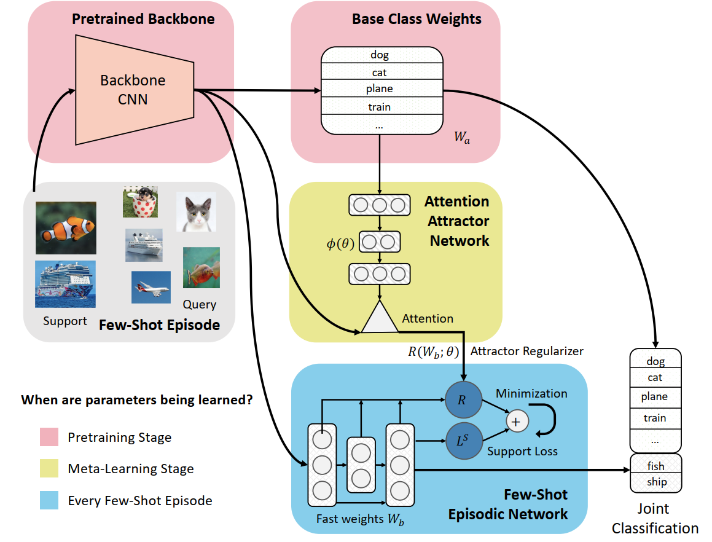

# 多伦多大学提出注意式吸引器网络，实现渐进式少量次学习

> 少量次学习(Few-Shot Learning) 一直以来都是机器学习领域内的一个重要研究主题。多伦多大学，提出了一种使用 **注意力吸引器网络** 的渐进式少量次学习方法，能在记住基础类别的同时很好地学习全新的类别。

论文： https://arxiv.org/abs/1810.07218
代码： https://github.com/renmengye/inc-few-shot-attractor-public

https://mp.weixin.qq.com/s?__biz=MzA3MzI4MjgzMw==&mid=2650773142&idx=3&sn=89a3fd9f2deaf6ddf232afd0fdc7e919&chksm=871a52e8b06ddbfe0bb64b4ce4360397a1792043250fc5a511101ec6083014f14a5f43f9baef&mpshare=1&scene=24&srcid=&sharer_sharetime=1572760548993&sharer_shareid=c6dddb77371c457f894e87ca845a013d&key=865e0f1f99f291d1c91200eeefea2c1bb497b1caa0b86c6e263a264992581931864c07d84b6f8944ea5dde4309e98f25694f768f1e20804354877910afb61f8d6d2c7971242c9054fd3165f42e53b7dc&ascene=14&uin=MTM2MTEwNTY4NA%3D%3D&devicetype=Windows+10&version=62070152&lang=zh_CN&pass_ticket=fJrAAgisEvkfz9HiOlC8HZNhrikB40WfhpPntYPa797RL%2BlpLqpqwmWoUrP91sN3

## 引言

通常，机器学习分类器的训练目标是 **识别一组预定义的类别**，但是很多应用往往需要机器学习能通过 **有限的数据** 灵活地学习 **额外的概念** ，而且 **无需在整个训练集上重新训练**。

这篇论文提出的 **渐进式少量次学习**（ incremental few-shot learning）能够解决这个问题。其中 **已经训练好** 的常规分类网络能够  **识别一组基础类别**，同时也会 **考虑一些额外的全新类别**，包括仅有少量有标注的样本地一些类别。在学习了全新的类别后，这个模型会在基础类别与全新类别的整体分类表现上被重新评估。为此，作者提出了一种元学习模型：**注意式吸引器网络**（Attention Attractor Network）。它可以调整对全新类别的学习规范，在每个 episode 中，作者都会训练一组新的用于识别全新类别的权重，直到它们收敛，而且作者还表明这种循环式反向传播技术可以在整个优化过程中反向传播，并能促进对这些参数的学习。研究表明，学习得到的吸引器网络无需回顾原始的训练集，就能在记住旧有类别的同时助力对全新类别的识别，其表现也胜过多种基准。

作者在 mini-ImageNet 和 tiered-ImageNet 上进行了实验，结果表明新提出的方法在 **渐进式少量次学习** 方面达到了当前最佳水平。

> 新提出的用于 **渐进式少量次** 学习的 注意力式吸引器网络。在预训练期间，网路学习基础类别权重 W_a 和特征提取器 CNN 骨干网络。在 元学习阶段则是一个 少量次学习 episode

## 模型

首先，这一节定义了 渐进式少量次 学习的设置，然后会介绍新提出的模型：注意力吸引器网络。该模型能通过使用 吸引器正则化项，根据少量次训练数据来实现对基础类别集的关注。图1给出了该方法的较高水平的模型示意图。

### 渐进式少量次学习

实现渐进式少量次学习的元学习方法的大致过程为：(1)在一个基础类别集上，学习一组固定的特征表征和一个分类器； (2)在每个训练和测试 episode 中，使用元学习得到的正则化器训练一个新类别的分类器；(3)基于组合到一起的新类别

