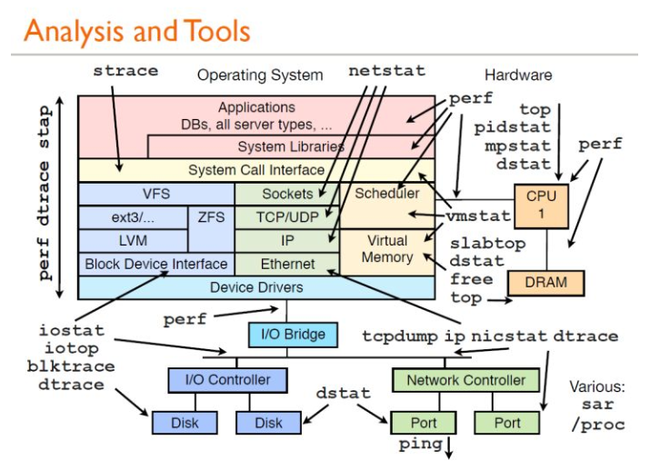
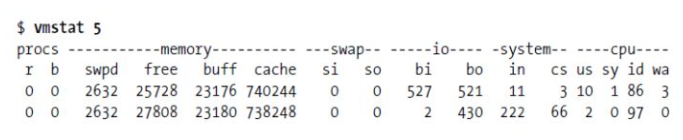
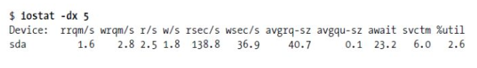

https://zhuanlan.zhihu.com/p/41943449

---
# 1. Linux性能分析工具

## 1.1 vmstat--虚拟内存统计
vmstat(VirtualMeomoryStatistics,虚拟内存统计) 是Linux中监控内存的常用工具,可对操作系统的 **虚拟内存** **、进程** 、 **CPU** 等的整体情况进行监视。

vmstat的常规用法：vmstat interval times即每隔interval秒采样一次，共采样times次，如果省略times,则一直采集数据，直到用户手动停止为止。
简单举个例子：

可以使用ctrl+c停止vmstat采集数据。

第一行显示了系统自启动以来的平均值，第二行开始显示现在正在发生的情况，接下来的行会显示每5秒间隔发生了什么，每一列的含义在头部，如下所示：

procs：r这一列显示了多少进程在等待cpu，b列显示多少进程正在不可中断的休眠（等待IO）。

memory：swapd列显示了多少块被换出了磁盘（页面交换），剩下的列显示了多少块是空闲的（未被使用），多少块正在被用作缓冲区，以及多少正在被用作操作系统的缓存。

swap：显示交换活动：每秒有多少块正在被换入（从磁盘）和换出（到磁盘）。

io：显示了多少块从块设备读取（bi）和写出（bo）,通常反映了硬盘I/O。

system：显示每秒中断(in)和上下文切换（cs）的数量。

cpu：显示所有的cpu时间花费在各类操作的百分比，包括执行用户代码（非内核），执行系统代码（内核），空闲以及等待IO。

内存不足的表现：free memory急剧减少，回收buffer和cacher也无济于事，大量使用交换分区（swpd）,页面交换（swap）频繁，读写磁盘数量（io）增多，缺页中断（in）增多，上下文切换（cs）次数增多，等待IO的进程数（b）增多，大量CPU时间用于等待IO（wa）

## 1.2 iostat--用于报告中央处理器统计信息
iostat用于报告中央处理器（CPU）统计信息和整个系统、适配器、tty 设备、磁盘和 CD-ROM 的输入/输出统计信息，默认显示了与vmstat相同的cpu使用信息，使用以下命令显示扩展的设备统计：

第一行显示的是自系统启动以来的平均值，然后显示增量的平均值，每个设备一行。

常见linux的磁盘IO指标的缩写习惯：rq是request,r是read,w是write,qu是queue，sz是size,a是verage,tm是time,svc是service。

rrqm/s和wrqm/s：每秒合并的读和写请求，“合并的”意味着操作系统从队列中拿出多个逻辑请求合并为一个请求到实际磁盘。

r/s和w/s：每秒发送到设备的读和写请求数。

rsec/s和wsec/s：每秒读和写的扇区数。

avgrq –sz：请求的扇区数。

avgqu –sz：在设备队列中等待的请求数。

await：每个IO请求花费的时间。

svctm：实际请求（服务）时间。

%util：至少有一个活跃请求所占时间的百分比。

## 1.3 dstat--系统监控工具
dstat显示了cpu使用情况，磁盘io情况，网络发包情况和换页情况，输出是彩色的，可读性较强，相对于vmstat和iostat的输入更加详细且较为直观。在使用时，直接输入命令即可，当然也可以使用特定参数。

## 1.4 iotop--LINUX进程实时监控工具
iotop命令是专门显示硬盘IO的命令，界面风格类似top命令，可以显示IO负载具体是由哪个进程产生的。是一个用来监视磁盘I/O使用状况的top类工具，具有与top相似的UI，其中包括PID、用户、I/O、进程等相关信息。

可以以非交互的方式使用：iotop –bod interval，查看每个进程的I/O，可以使用pidstat，pidstat –d instat。

## 1.5 pidstat--监控系统资源情况

pidstat主要用于监控全部或指定进程占用系统资源的情况,如CPU,内存、设备IO、任务切换、线程等。

使用方法：pidstat –d interval；pidstat还可以用以统计CPU使用信息：pidstat –u interval；统计内存信息：Pidstat –r interval。

## 1.6 top 

top命令的汇总区域显示了五个方面的系统性能信息：

1.负载：时间，登陆用户数，系统平均负载；

2.进程：运行，睡眠，停止，僵尸；

3.cpu:用户态，核心态，NICE,空闲，等待IO,中断等；

4.内存：总量，已用，空闲（系统角度），缓冲，缓存；

5.交换分区：总量，已用，空闲

任务区域默认显示：进程ID,有效用户，进程优先级，NICE值，进程使用的虚拟内存，物理内存和共享内存，进程状态，CPU占用率，内存占用率，累计CPU时间，进程命令行信息。

## 1.7 netstat
Netstat用于显示与IP、TCP、UDP和ICMP协议相关的统计数据，一般用于检验本机各端口的网络连接情况。

常见用法：

netstat –npl 可以查看你要打开的端口是否已经打开。

netstat –rn 打印路由表信息。

netstat –in 提供系统上的接口信息，打印每个接口的MTU,输入分组数，输入错误，输出分组数，输出错误，冲突以及当前的输出队列的长度。

ps--显示当前进程的状态

ps参数太多，具体使用方法可以参考man ps，常用的方法：ps aux #hsserver；ps –ef |grep #hundsun

杀掉某一程序的方法：ps aux | grep mysqld | grep –v grep | awk ‘{print $2 }’ xargs kill -9

杀掉僵尸进程：ps –eal | awk ‘{if ($2 == “Z”){print $4}}’ | xargs kill -9

## 1.8 lsof
lsof(list open files)是一个列出当前系统打开文件的工具。通过lsof工具能够查看这个列表对系统检测及排错，常见的用法：

查看文件系统阻塞 lsof /boot

查看端口号被哪个进程占用 lsof -i : 3306

查看用户打开哪些文件 lsof –u username

查看进程打开哪些文件 lsof –p 4838

查看远程已打开的网络链接 lsof –i @192.168.34.128

## 1.9 pmap

# 2 性能测试工具

## 2.1 perf
perf是Linux kernel自带的系统性能优化工具。优势在于与Linux Kernel的紧密结合，它可以最先应用到加入Kernel的new feature，用于查看热点函数，查看cashe miss的比率，从而帮助开发者来优化程序性能。

性能调优工具如 perf，Oprofile 等的基本原理都是对被监测对象进行采样，最简单的情形是根据 tick 中断进行采样，即在 tick 中断内触发采样点，在采样点里判断程序当时的上下文。假如一个程序 90% 的时间都花费在函数 foo() 上，那么 90% 的采样点都应该落在函数 foo() 的上下文中。运气不可捉摸，但我想只要采样频率足够高，采样时间足够长，那么以上推论就比较可靠。因此，通过 tick 触发采样，我们便可以了解程序中哪些地方最耗时间，从而重点分析。

想要更深的了解本工具可以参考：
http://blog.csdn.net/trochiluses/article/details/10261339

## 2.2 perf_events
perf_events: 一款随 Linux 内核代码一同发布和维护的性能诊断工具，由内核社区维护和发展。Perf 不仅可以用于应用程序的性能统计分析，也可以应用于内核代码的性能统计和分析。

更多参考：http://blog.sina.com.cn/s/blog_98822316010122ex.html

## 2.3 perf-tools

perf-tools: 一款基于 perf_events (perf) 和 ftrace 的Linux性能分析调优工具集。Perf-Tools 依赖库少，使用简单。支持Linux 3.2 及以上内核版本。more: https://github.com/brendangregg/perf-tools

## 2.4 ktap
ktap: 一种新型的linux脚本动态性能跟踪工具。允许用户跟踪Linux内核动态。ktap是设计给具有互操作性，允许用户调整操作的见解，排除故障和延长内核和应用程序。它类似于Linux和Solaris DTrace SystemTap。更多参考： https://github.com/ktap/ktap

## 2.5 Flame Graphs

是一款使用perf,system tap,ktap可视化的图形软件，允许最频繁的代码路径快速准确地识别，可以是使用http://github.com/brendangregg/flamegraph中的开发源代码的程序生成。

更多参考：http://www.brendangregg.com/flamegraphs.html

