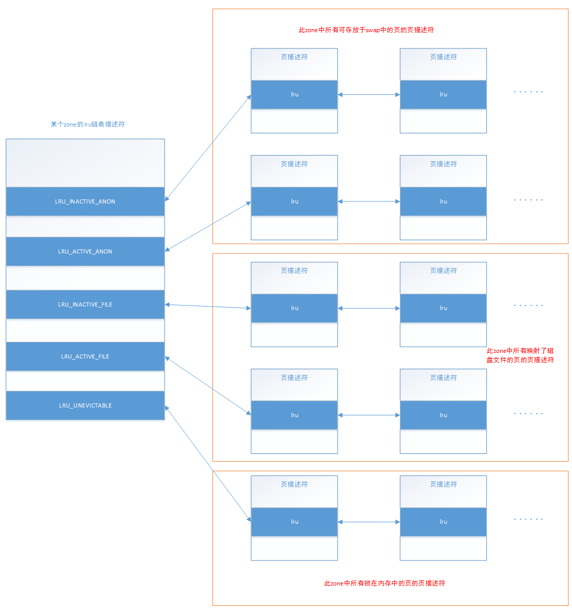
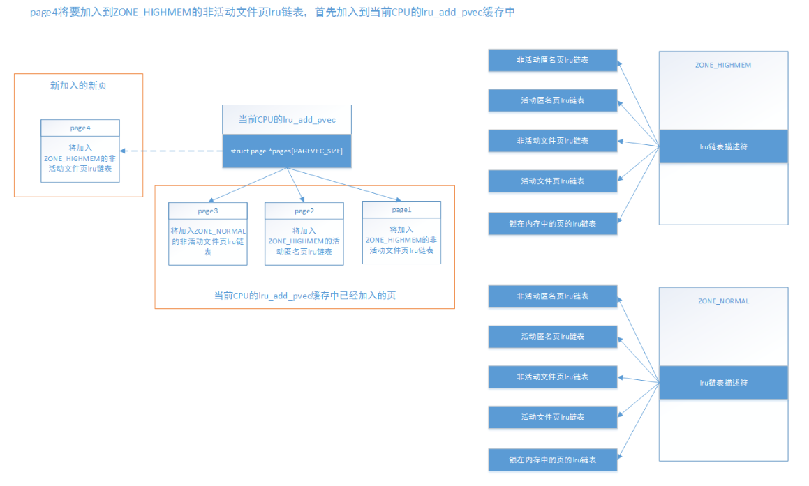
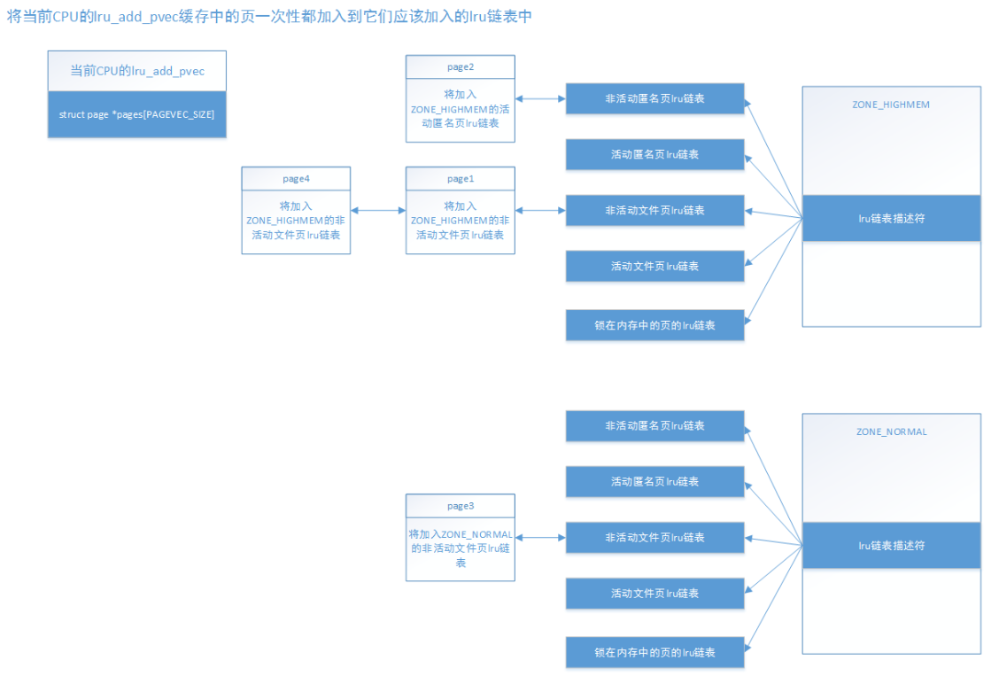
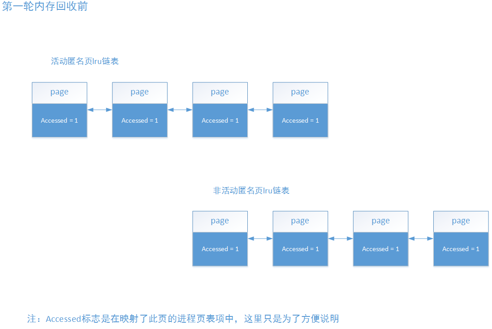
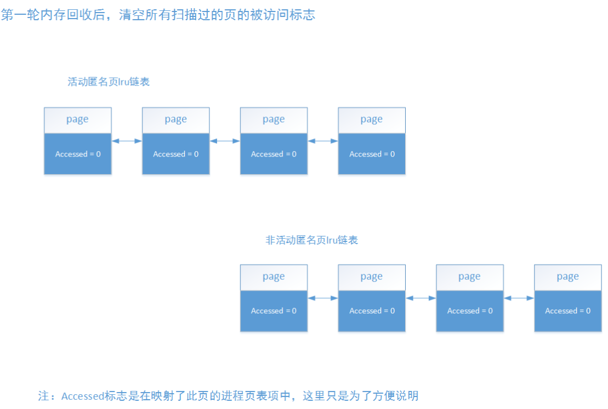

# 1. 概述
对于整个内存回收来说，lru链表是关键中的关键，实际上整个内存回收，做的事情就是处理lru链表的收缩，所以这篇文章就先说说系统的lru链表。

内存回收的核心思想，就是如果一些数据能够保存到磁盘，在内存不足时就把这些数据写到磁盘中，这样这些数据占用的内存页就可以作为空闲内存页给予系统使用了。

当内存不足时，系统就必须要将一些页框回收，而哪些页框可以回收呢，之前我们有说过，属于内核的大部分页框是不能够进行回收的，比如内核栈、内核代码段、内核数据段以及大部分内核使用的页框，它们都是不能够进行回收的；而相反，主要由进程使用的页框，比如进程代码段、进程数据段、进程堆栈、进程访问文件时映射的文件页、进程间共享内存使用的页，这些页框都是可以进行回收的。

lru链表在这时候就起到了这个重要作用，它能够让系统在那些可以回收的页框当中，选择到理想的回收页框。lru链表的核心思想就是做假设，如果一个页很久没有被访问到了，那么就假设在下一段时间中，这个页也可能不会被访问到。但是对于系统来说，它永远无法知道哪个页即将被访问，它认定一个页接下来的一段时间不会被访问到，但是有可能此页在下一刻就立刻被访问到了，也就是说，即使使用了lru链表，也不能保证不会发生上述的情况。

内核主要对进程使用的页进行回收，而回收操作，主要是两个方面：**一.直接将一些页释放。二.将页回写保存到磁盘，然后再释放。** 对于第一种，最明显的就是进程代码段的页，这些页都是只读的，因为代码段是禁止修改的，对于这些页，直接释放掉就好，因为磁盘上对应的数据与页中的数据是一致的。那么对于进程需要回写的页，内核主要将这些页放到磁盘的两个地方，当进程使用的页中的数据是**映射于具体文件**的，那么只需要将此页中的数据回写到对应文件所在**磁盘位置**就可以了。而对于那些**没有映射**磁盘对应文件的页，内核则将它们存放到**swap分区**中。根据这个，整理出下面这些情况的页

* **进程堆、栈、数据段使用的匿名页**：存放到swap分区中
* 进程代码段映射的可执行文件的文件页：直接释放
* 打开文件进行读写使用的文件页：如果页中数据与文件数据不一致，则进行回写到磁盘对应文件中，如果一致，则直接释放
* 进行文件映射mmap共享内存时使用的页：如果页中数据与文件数据不一致，则进行回写到磁盘对应文件中，如果一致，则直接释放
* **进行匿名mmap共享内存时使用的页**：存放到swap分区中
* **进行shmem共享内存时使用的页**：存放到swap分区中

由此可以看出，实际上lru链表只需要对两种情况进行分别处理就好了，一种是页需要存放到swap分区的情况，一种是页映射了文件的情况。但是还有一种情况，就是这些页是前面两种页中的一种，但是这些页被系统锁在内存中，禁止换出与回收，也就是整个lru链表主要组织上面三种情况的页。

# 2. lru链表描述符
如前面所说，lru链表组织的页包括：**可以存放到swap分区中的页**，**映射了文件的页**，以及被**锁在内存中禁止换出的进程页**。所有属于这些情况的页都必须加入到lru链表中，无一例外，而剩下那些**没有加入到lru链表**中的页，基本也就剩**内核使用的页框**了。

首先，lru链表并不是一个系统中只有一个，而是每个zone有一个，每个memcg在每个zone上又有一个。这样听起来很复杂，实际上只是并不是，而为了方便说明，本文中就只分析每个zone中包含的这个lru链表，而实际上memcg中为每个zone维护的lru链表，在代码和结构上是一样的。由于每个zone有自己的lru链表，我们先看看zone中与lru相关的变量：

```c
struct zone {
       ......

    /* lru链表使用的自旋锁 
     * 当需要修改lru链表描述符中任何一个链表时，都需要持有此锁，也就是说，不会有两个不同的lru链表同时进行修改
     */
    spinlock_t        lru_lock;
    /* lru链表描述符 */
    struct lruvec        lruvec;
 
        ......
}
```
每当对此zone的lru链表进行修改时，一定需要获取这个lru_lock的锁防止并发的情况。
　　下面说说lru链表描述符，正如前面所说，系统主要会将进程使用的页框分为下面三类：
* 可以存放到swap分区中的页
* 映射了磁盘文件的文件页
* 被锁在内存中禁止换出的进程页(包括以上两种页)

由于进程使用的页框分为三类，而lru链表是一个大的整体，系统为了把这三种类型的页都会放入到lru链表中。就用一个struct lruvec结构来描述一个lru链表，也可以称**struct lruvec**为 lru 链表描述符，如下：
```c
/* lru链表描述符，主要有5个双向链表
 * LRU_INACTIVE_ANON = LRU_BASE,
 * LRU_ACTIVE_ANON = LRU_BASE + LRU_ACTIVE,
 * LRU_INACTIVE_FILE = LRU_BASE + LRU_FILE,
 * LRU_ACTIVE_FILE = LRU_BASE + LRU_FILE + LRU_ACTIVE,
 * LRU_UNEVICTABLE,
 */
struct lruvec {
    /* 5个lru双向链表头 */
    struct list_head lists[NR_LRU_LISTS];
    struct zone_reclaim_stat reclaim_stat;
#ifdef CONFIG_MEMCG
    /* 所属zone */
    struct zone *zone;
#endif
};
```

可以看到，一个lru链表描述符中总共有5个双向链表头，它们分别描述五中不同类型的链表。由于每个页有自己的页描述符，而内核主要就是将对应的页的页描述符加入到这些链表中。

对于此zone中所有可以存放到swap分区中并且没被锁在内存中的页(进程堆、栈、数据段使用的页，匿名mmap共享内存使用的页，shmem共享内存使用的页)，lru链表描述符会使用下面两个链表进行组织：

* **LRU_INACTIVE_ANON**：称为**非活动匿名页lru链表**，此链表中保存的是此zone中所有最近**没被访问过**的并且可以存放到swap分区的页描述符，在此链表中的页描述符的PG_active标志为0。

* **LRU_ACTIVE_ANON**：称为活动匿名页lru链表，此链表中保存的是此zone中所有最**近被访问过**的并且可以存放到swap分区的页描述符，此链表中的页描述符的PG_active标志为1。

这两个链表我们统称为**匿名页lru链表**。

　对于此zone中所有映射了具体磁盘文件页并且没有被锁在内存中的页(映射了内核映像的页除外)，lru链表描述符会使用下面两个链表组织：

* **LRU_INACTIVE_FILE**：称为非活动文件页lru链表，此链表中保存的是此zone中所有最近没被访问过的文件页的页描述符，此链表中的页描述符的PG_active标志为0。

* **LRU_ACTIVE_FILE**：称为活动文件页lru链表，此链表中保存的是此zone中所有最近被访问过的文件页的页描述符，此链表中的页描述符的PG_active标志为1。

这两个链表我们统称为**文件页lru链表**。

而对于此zone中那些锁在内存中的页，lru链表描述符会使用这个链表进行组织：

* **LRU_UNEVICTABLE** ：此链表中保存的是此zone中所有禁止换出的页的描述符。

为了方便对于LRU_INACTIVE_ANON和LRU_ACTIVE_ANON这两个链表，统称为匿名页lru链表，而LRU_INACTIVE_FILE和LRU_ACTIVE_FILE统称为文件页lru链表。当进程运行过程中，通过调用mlock()将一些内存页锁在内存中时，这些内存页就会被加入到它们锁在的zone的LRU_UNEVICTABLE链表中，在LRU_UNEVICTABLE链表中的页可能是文件页也可能是匿名页。

之前说了内核主要是将对应页的页描述符加入到上述几个链表中的某个，比如我一个页映射了磁盘文件，那么这个页就加入到文件页lru链表中，内核主要通过页描述符的lru和flags标志描述一个加入到了lru链表中的页。

```c
struct page {
    /* 用于页描述符，一组标志(如PG_locked、PG_error)，同时页框所在的管理区和node的编号也保存在当中 */
    /* 在lru算法中主要用到的标志
     * PG_active: 表示此页当前是否活跃，当放到或者准备放到活动lru链表时，被置位
     * PG_referenced: 表示此页最近是否被访问，每次页面访问都会被置位
     * PG_lru: 表示此页是处于lru链表中的
     * PG_mlocked: 表示此页被mlock()锁在内存中，禁止换出和释放
     * PG_swapbacked: 表示此页依靠swap，可能是进程的匿名页(堆、栈、数据段)，
                       匿名mmap共享内存映射(mmap提供提供了不同于一般对
                       普通文件的访问方式，进程可以像读写内存一样对普通
                       文件的操作。过映射同一个普通文件实现共享内存。普
                       通文件被映射到进程地址空间后)，shmem共享内存映射(进程间共享数据最快的方法，一个进程向共享内存
                       区域写入了数据，共享这个内存区域的所有进程就可以
                       立刻看到其中的内容。)
     */
　　unsigned long flags;

　　......

　　union {
        /* 页处于不同情况时，加入的链表不同
         * 1.是一个进程正在使用的页，加入到对应lru链表和lru缓存中
         * 2.如果为空闲页框，并且是空闲块的第一个页，加入到伙伴系统的空闲块链表中(只有空闲块的第一个页需要加入)
         * 3.如果是一个slab的第一个页，则将其加入到slab链表中(比如slab的满slab链表，slub的部分空slab链表)
         * 4.将页隔离时用于加入隔离链表
         */
　　　　struct list_head lru;   
　　　　......
　　};
　　......
}
```
由于struct page是一个复合结构，当page用于不同情况时，lru变量加入的链表不同(如注释)，这里我们只讨论页是进程正在使用的页时的情况。这时候，页通过页描述符的lru加入到对应的zone的lru链表中，然后会置位flags中的**PG_lru**标志，表明此页是在lru链表中的。而如果flags的PG_lru和PG_mlocked都置位，说明此页是处于lru链表中的LRU_UNEVICTABLE链表上。如下图：



需要注意，此zone中所有可以存放于swap分区的页加入到匿名页lru链表，并不代表这些页现在就在swap分区中，而是未来内存不足时，可以将这些页数据放到swap分区中，以此来回收这些页。


# 3. lru缓存

上面说到，当需要修改lru链表时，一定要占有zone中的 **lru_lock** 这个锁，在多核的硬件环境中，在同时需要对lru链表进行修改时，锁的竞争会非常的频繁，所以内核提供了一个**lru缓存**的机制，这种机制能够**减少锁的竞争频率**。其实这种机制非常简单，lru缓存相当于将一些需要相同处理的页集合起来，当达到一定数量时再对它们进行一批次的处理，这样做可以让对锁的需求集中在这个处理的时间点，而没有lru缓存的情况下，则是当一个页需要处理时则立即进行处理，对锁的需求的时间点就会比较离散。首先为了更好的说明lru缓存，先对lru链表进行操作主要有以下几种：

* 将不处于lru链表的新页放入到lru链表中
* 将非活动lru链表中的页移动到非活动lru链表尾部(活动页不需要这样做，后面说明)
* 将处于活动lru链表的页移动到非活动lru链表
* 将处于非活动lru链表的页移动到活动lru链表、
* 将页从lru链表中移除

除了最后一项移除操作外，其他四样操作除非在特殊情况下， 否则都需要依赖于lru缓存。可以看到上面的5种操作，并不是完整的一套操作集(比如没有将活动lru链表中的页移动到活动lru链表尾部)，原因是因为lru链表并不是供于整个系统所有模块使用的，可以说lru链表的出现，就是专门用于进行**内存回收**，所以这里的操作集只实现了满足于内存回收所需要使用的操作。

**大部分在内存回收路径中对lru链表的操作，都不需要用到lru缓存，只有非内存回收路径中需要对页进行lru链表的操作时，才会使用到lru缓存。** 为了对应这四种操作，内核为每个CPU提供了四种lru缓存，当页要进行lru的处理时，就要先加入到lru缓存，当lru缓存满了或者系统主要要求将lru缓存中所有的页进行处理，才会将lru缓存中的页放入到页想放入的lru链表中。每种lru缓存使用struct pagevec进行描述：
```c
/* LRU缓存 
 * PAGEVEC_SIZE默认为14
 */
struct pagevec {
    /* 当前数量 */
    unsigned long nr;
    unsigned long cold;
    /* 指针数组，每一项都可以指向一个页描述符，默认大小是14 */
    struct page *pages[PAGEVEC_SIZE];
};
```

一个lru缓存的大小为14，也就是一个lru缓存中最多能存放14个即将处理的页。

nr代表的是此lru缓存中保存的页数量，而加入到了lru缓存中的页，lru缓存中的pages指针数组中的某一项就会指向此页的页描述符，也就是当lru缓存满时，pages数组中每一项都会指向一个页描述符。

上面说了内核为每个CPU提供四种缓存，这四种lru缓存如下：
```c
/* 这部分的lru缓存是用于那些原来不属于lru链表的，新加入进来的页 */
static DEFINE_PER_CPU(struct pagevec, lru_add_pvec);
/* 在这个lru_rotate_pvecs中的页都是非活动页并且在非活动lru链表中，将这些页移动到非活动lru链表的末尾 */
static DEFINE_PER_CPU(struct pagevec, lru_rotate_pvecs);
/* 在这个lru缓存的页原本应属于活动lru链表中的页，会强制清除PG_activate和PG_referenced，并加入到非活动lru链表的链表表头中
 * 这些页一般从活动lru链表中的尾部拿出来的
 */
static DEFINE_PER_CPU(struct pagevec, lru_deactivate_pvecs);
#ifdef CONFIG_SMP
/* 将此lru缓存中的页放到活动页lru链表头中，这些页原本属于非活动lru链表的页 */
static DEFINE_PER_CPU(struct pagevec, activate_page_pvecs);
#endif
```

如注释所说，CPU的每一个lru缓存处理的页是不同的，当一个新页需要加入lru链表时，就会加入到cpu的lru_add_pvec缓存；当一个非活动lru链表的页需要被移动到非活动页lru链表末尾时，就会被加入cpu的lru_rotate_pvecs缓存；当一个活动lru链表的页需要移动到非活动lru链表中时，就会加入到cpu的lru_deactivate_pvecs缓存；当一个非活动lru链表的页被转移到活动lru链表中时，就会加入到cpu的activate_page_pvecs缓存。

　注意，内核是为**每个CPU提供四种lru缓存**，而**不是每个zone**，并且也**不是为每种lru链表**提供四种lru缓存，也就是说，只要是新页，所有应该放入lru链表的新页都会加入到当前CPU的lru_add_pvec这个lru缓存中，比如同时有两个新页，一个将加入到zone0的活动匿名页lru链表，另一个将加入到zone1的非活动文件页lru链表，这两个新页都会先加入到此CPU的lru_add_pvec这个lru缓存中。用以下图进行说明更好理解，当前CPU的lru缓存中有page1，page2和page3这3个页，这时候page4加入了进来：



当page4加入后，当前CPU的lru_add_pvec缓存中有4个页待处理的页，而此时，如果当前CPU的lru_add_pvec缓存大小为4，或者一些情况需要当前CPU立即对lru_add_pvec缓存进行处理，那么这些页就会被放入到它们需要放入的lru链表中，如下：



这些页加入完后，当前CPU的lru_add_pvec缓存为空，又等待新一轮要被加入的新页。

对于CPU的lru_add_pvec缓存的处理，如上，而其他类型的lru缓存处理也是相同。只需要记住，要对页实现什么操作，就放到CPU对应的lru缓存中，而CPU的lru缓存满或者需要立即将lru缓存中的页放入lru链表时，就会将lru缓存中的页放到它们需要放入的lru链表中。同时，对于lru缓存来说，它们只负责将页放到页应该放到的lru链表中，所以，在一个页加入lru缓存前，就必须设置好此页的一些属性，这样才能配合lru缓存进行工作。


# 4. 加入lru链表
将上面的所有结构说完，已经明确了几点：
1. 不同类型的页需要加入的lru链表不同
2. smp中，加入lru链表前需要先加入到当前CPU的lru缓存中
3. 需要不同处理的页加入的当前CPU的lru缓存不同。

　接下来我们看看不同操作的实现代码。 

## 4.1 新页加入lru链表
当需要将一个新页需要加入到lru链表中，此时必须先加入到当前CPU的lru_add_pvec缓存中，一般通过__lru_cache_add()函数进行加入，如下：
```c
/* 加入到lru_add_pvec缓存中 */
static void __lru_cache_add(struct page *page)
{
    /* 获取此CPU的lru缓存， */
    struct pagevec *pvec = &get_cpu_var(lru_add_pvec);

    /* page->_count++ 
     * 在页从lru缓存移动到lru链表时，这些页的page->_count会--
     */
    page_cache_get(page);
    /* 检查LRU缓存是否已满，如果满则将此lru缓存中的页放到lru链表中 */
    if (!pagevec_space(pvec))
        __pagevec_lru_add(pvec);
    /* 将page加入到此cpu的lru缓存中，注意，加入pagevec实际上只是将pagevec中的pages数组中的某个指针指向此页，如果此页原本属于lru链表，那么现在实际还是在原来的lru链表中 */
    pagevec_add(pvec, page);
    put_cpu_var(lru_add_pvec);
}
```
　注意在此函数中加入的页的page->_count会++，也就是新加入lru缓存的页它的page->_count会++，而之后我们会看到，当页从lru缓存中移动到lru链表后，此页的page->_count就会--了。

pagevec_space()用于判断这个lru缓存是否已满，判断方法很简单：
```c
static inline unsigned pagevec_space(struct pagevec *pvec)
{
    return PAGEVEC_SIZE - pvec->nr;
}
```

如果lru缓存已满的情况下，就必须先把lru缓存中的页先放入它们需要放入的lru链表中，之后再将这个新页放入到lru缓存中，通过调用pagevec_add()将页加入到lru缓存中，如下：

```c
/* 将page加入到lru缓存pvec中 */
static inline unsigned pagevec_add(struct pagevec *pvec, struct page *page)
{
    /* lru缓存pvec的pages[]中的pvec->nr项指针指向此页 */
    pvec->pages[pvec->nr++] = page;
    /* 返回此lru缓存剩余的空间 */
    return pagevec_space(pvec);
}
```

在一些特殊情况或者lru缓存已满的情况下，都会将lru缓存中的页放入到它们对应的lru链表中，这个可通过__pagevec_lru_add()函数进行实现，在__pagevec_lru_add()函数中，主要根据lru缓存的nr遍历缓存中已经保存的页，在期间会对这些页所在的zone的lru_lock上锁，因为不能同时有2个CPU并发地修改同一个lru链表，之后会调用相应的回调函数，对遍历的页进行处理：

```c
/* 将pagevec中的页加入到lru链表中，并且会将pvec->nr设置为0 */
void __pagevec_lru_add(struct pagevec *pvec)
{
    /* __pagevec_lru_add_fn为回调函数 */
    pagevec_lru_move_fn(pvec, __pagevec_lru_add_fn, NULL);
}

```
实际上不同的lru链表操作，很大一部分不同就是这个回调函数的不同，回调函数决定了遍历的每个页应该进行怎么样的处理，而不同lru链表操作它们遍历lru缓存中的页的函数都是pagevec_lru_move_fn，我们先看看所有lru链表操作都共同使用的pagevec_lru_move_fn：

```c
/* 将缓存中的页做move_fn处理，然后对页进行page->_count--
 * 当所有页加入到lru缓存中时，都要page->_count++
 */
static void pagevec_lru_move_fn(struct pagevec *pvec,
    void (*move_fn)(struct page *page, struct lruvec *lruvec, void *arg),
    void *arg)
{
    int i;
    struct zone *zone = NULL;
    struct lruvec *lruvec;
    unsigned long flags = 0;

    /* 遍历pagevec中的所有页
     * pagevec_count()返回lru缓存pvec中已经加入的页的数量
     */
    for (i = 0; i < pagevec_count(pvec); i++) {
        struct page *page = pvec->pages[i];
        /* 获取页所在的zone */
        struct zone *pagezone = page_zone(page);

        /* 由于不同页可能加入到的zone不同，这样就是判断是否是同一个zone，是的话就不需要上锁了
         * 不是的话要先把之前上锁的zone解锁，再对此zone的lru_lock上锁
         */
        if (pagezone != zone) {
            /* 对之前的zone进行解锁，如果是第一次循环则不需要 */
            if (zone)
                spin_unlock_irqrestore(&zone->lru_lock, flags);
            /* 设置上次访问的zone */
            zone = pagezone;
            /* 这里会上锁，因为当前zone没有上锁，后面加入lru的时候就不需要上锁 */
            spin_lock_irqsave(&zone->lru_lock, flags);
        }

        /* 获取zone的lru链表 */
        lruvec = mem_cgroup_page_lruvec(page, zone);
        /* 将page加入到zone的lru链表中 */
        (*move_fn)(page, lruvec, arg);
    }
    /* 遍历结束，对zone解锁 */
    if (zone)
        spin_unlock_irqrestore(&zone->lru_lock, flags);
    /* 对pagevec中所有页的page->_count-- */
    release_pages(pvec->pages, pvec->nr, pvec->cold);
    /* pvec->nr = 0 */
    pagevec_reinit(pvec);
```

可以看到，这里最核心的操作，实际上就是遍历lru缓存pvec中每个指向的页，如果该页所在zone的lru_lock没有进行上锁，则上锁，然后对每个页进行传入的回调函数的操作，当所有页都使用回调函数move_fn处理完成后，就对lru缓存中的所有页进行page->_count--操作。

从之前的代码可以看到，这个move_fn就是传入的回调函数，对于新页加入到lru链表中的情况，这个move_fn就是__pagevec_lru_add_fn()：
```c
/* 将lru_add缓存中的页加入到lru链表中 */
static void __pagevec_lru_add_fn(struct page *page, struct lruvec *lruvec,
                 void *arg)
{
    /* 判断此页是否是page cache页(映射文件的页) */
    int file = page_is_file_cache(page);
    /* 是否是活跃的页 
     * 主要判断page的PG_active标志
     * 如果此标志置位了，则将此页加入到活动lru链表中
     * 如果没置位，则加入到非活动lru链表中
     */
    int active = PageActive(page);
    /* 获取page所在的lru链表，里面会检测是映射页还是文件页，并且检查PG_active，最后能得出该page应该放到哪个lru链表中 
     * 里面就可以判断出此页需要加入到哪个lru链表中
     * 如果PG_active置位，则加入到活动lru链表，否则加入到非活动lru链表
     * 如果PG_swapbacked置位，则加入到匿名页lru链表，否则加入到文件页lru链表
     * 如果PG_unevictable置位，则加入到LRU_UNEVICTABLE链表中
     */
    enum lru_list lru = page_lru(page);

    VM_BUG_ON_PAGE(PageLRU(page), page);

    SetPageLRU(page);
    /* 将page加入到lru中 */
    add_page_to_lru_list(page, lruvec, lru);
    /* 更新lruvec中的reclaim_stat */
    update_page_reclaim_stat(lruvec, file, active);
    trace_mm_lru_insertion(page, lru);
}
```

如注释所说，判断页需要加入到哪个lru链表中，主要通过三个标志位：
* PG_active:：此标志置位，表示此页需要加入或者处于页所在zone的活动lru链表中，当此页已经在lru链表中时，此标志可以让系统判断此页是在活动lru链表还是非活动lru链表中。
* PG_swapbacked：此标志置位，表示此页可以回写到swap分区，那么此页需要加入或者处于页所在zone的匿名页lru链表中。
* PG_unevictable：置位表示此页被锁在内存中禁止换出，表示此页需要加入或者处于页所在zone的LRU_UNEVICTABLE链表中。

而对于文件页lru链表来说，实际上还有一个PG_referenced标志，这里先提一下，后面会细说。

好的，通过这三个标志就能过清楚判断页需要加入到所属zone的哪个lru链表中了，到这里，也能说明，**在加入lru缓存前，页必须设置好这三个标志位，表明自己想加入到所属zone的哪个lru链表中**。接下来我们看看add_page_to_lru_list()函数，这个函数就很简单了，如下：
```c
/* 将页加入到lruvec中的lru类型的链表头部 */
static __always_inline void add_page_to_lru_list(struct page *page,
                struct lruvec *lruvec, enum lru_list lru)
{
    /* 获取页的数量，因为可能是透明大页的情况，会是多个页 */
    int nr_pages = hpage_nr_pages(page);
    /* 更新lruvec中lru类型的链表的页数量 */
    mem_cgroup_update_lru_size(lruvec, lru, nr_pages);
    /* 加入到对应LRU链表头部，这里不上锁，所以在调用此函数前需要上锁 */
    list_add(&page->lru, &lruvec->lists[lru]);
    /* 更新统计 */
    __mod_zone_page_state(lruvec_zone(lruvec), NR_LRU_BASE + lru, nr_pages);
}
```
这样一个新页加入lru缓存以及加入到lru链表中的代码就已经说完了，切记，并不是只有lru缓存满了，才会将其中的页加入到对应的lru链表中，一些特殊情况会要求lru缓存立即把存着的页加入到lru链表中。


## 4.2 将处于非活动链表中的页移动到非活动链表尾部

主要通过rotate_reclaimable_page()函数实现，这种操作主要使用在：当一个脏页需要进行回收时，系统首先会将页异步回写到磁盘中(swap分区或者对应的磁盘文件)，然后通过这种操作将页移动到非活动lru链表尾部。这样这些页在下次内存回收时会优先得到回收。

rotate_reclaimable_page()函数如下：

```c
/* 将处于非活动lru链表中的页移动到非活动lru链表尾部 
 * 如果页是处于非活动匿名页lru链表，那么就加入到非活动匿名页lru链表尾部
 * 如果页是处于非活动文件页lru链表，那么就加入到非活动文件页lru链表尾部
 */
void rotate_reclaimable_page(struct page *page)
{

    /* 此页加入到非活动lru链表尾部的条件
     * 页当前不能被上锁(并不是锁在内存，而是每个页自己的锁PG_locked)
     * 页必须不能是脏页(这里应该也不会是脏页)
     * 页必须非活动的(如果页是活动的，那页如果在lru链表中，那肯定是在活动lru链表)
     * 页没有被锁在内存中
     * 页处于lru链表中
     */
    if (!PageLocked(page) && !PageDirty(page) && !PageActive(page) &&
        !PageUnevictable(page) && PageLRU(page)) {
        struct pagevec *pvec;
        unsigned long flags;

        /* page->_count++，因为这里会加入到lru_rotate_pvecs这个lru缓存中 
         * lru缓存中的页移动到lru时，会对移动的页page->_count--
         */
        page_cache_get(page);
        /* 禁止中断 */
        local_irq_save(flags);
        /* 获取当前CPU的lru_rotate_pvecs缓存 */
        pvec = this_cpu_ptr(&lru_rotate_pvecs);
        if (!pagevec_add(pvec, page))
            /* lru_rotate_pvecs缓存已满，将当前缓存中的页加入到非活动lru链表尾部 */
            pagevec_move_tail(pvec);
        /* 重新开启中断 */
        local_irq_restore(flags);
    }
}
```
实际上实现方式与之前新页加入lru链表的操作差不多，简单看一下pagevec_move_tail()函数和它的回调函数：
```c
/* 将lru缓存pvec中的页移动到非活动lru链表尾部
 * 这些页原本就属于非活动lru链表
 */
static void pagevec_move_tail(struct pagevec *pvec)
{
    int pgmoved = 0;

    pagevec_lru_move_fn(pvec, pagevec_move_tail_fn, &pgmoved);
    __count_vm_events(PGROTATED, pgmoved);
}


/* 将lru缓存pvec中的页移动到非活动lru链表尾部操作的回调函数
 * 这些页原本就属于非活动lru链表
 */
static void pagevec_move_tail_fn(struct page *page, struct lruvec *lruvec,
                 void *arg)
{
    int *pgmoved = arg;

    /* 页属于非活动页 */
    if (PageLRU(page) && !PageActive(page) && !PageUnevictable(page)) {
        /* 获取页应该放入匿名页lru链表还是文件页lru链表，通过页的PG_swapbacked标志判断 */
        enum lru_list lru = page_lru_base_type(page);
        /* 加入到对应的非活动lru链表尾部 */
        list_move_tail(&page->lru, &lruvec->lists[lru]);
        (*pgmoved)++;
    }
}
```

## 4.3 将活动lru链表中的页加入到非活动lru链表中

这个操作使用的场景是文件系统主动将一些没有被进程映射的页进行释放时使用，就会将一些活动lru链表的页移动到非活动lru链表中，在内存回收过程中并不会使用这种方式。注意，在这种操作中只会移动那些没有被进程映射的页。并且将活动lru链表中的页移动到非活动lru链表中，有两种方式，一种是移动到非活动lru链表的头部，一种是移动到非活动lru链表的尾部，由于**内存回收是从非活动lru链表尾部**开始扫描页框的，所以加入到非活动lru链表尾部的页框更容易被释放，而在这种操作中，只会将干净的，不需要回写的页放入到非活动lru链表尾部。

主要是将活动lru链表中的页加入到lru_deactivate_pvecs这个CPU的lru缓存实现，而加入函数，是deactivate_page()：
```C
/* 将页移动到非活动lru链表中
 * 此页应该属于活动lru链表中的页
 */
void deactivate_page(struct page *page)
{
    /* 如果页被锁在内存中禁止换出，则跳出 */
    if (PageUnevictable(page))
        return;

    /* page->_count == 1才会进入if语句 
     * 说明此页已经没有进程进行映射了
     */
    if (likely(get_page_unless_zero(page))) {
        struct pagevec *pvec = &get_cpu_var(lru_deactivate_pvecs);

        if (!pagevec_add(pvec, page))
            pagevec_lru_move_fn(pvec, lru_deactivate_fn, NULL);
        put_cpu_var(lru_deactivate_pvecs);
    }
}
```

主要看回调函数lru_deactivate_fn():
```C
/* 将处于活动lru链表中的page移动到非活动lru链表中
 * 此页只有不被锁在内存中，并且没有进程映射了此页的情况下才会移动
 */
static void lru_deactivate_fn(struct page *page, struct lruvec *lruvec,
                  void *arg)
{
    int lru, file;
    bool active;

    /* 此页不在lru中，则不处理此页 */
    if (!PageLRU(page))
        return;

    /* 如果此页被锁在内存中禁止换出，则不处理此页 */
    if (PageUnevictable(page))
        return;

    /* Some processes are using the page */
    /* 有进程映射了此页，也不处理此页 */
    if (page_mapped(page))
        return;

    /* 获取页的活动标志，PG_active */
    active = PageActive(page);
    /* 根据页的PG_swapbacked判断此页是否需要依赖swap分区 */
    file = page_is_file_cache(page);
    /* 获取此页需要加入匿名页或者文件页lru链表，也是通过PG_swapbacked标志判断 */
    lru = page_lru_base_type(page);

    /* 从活动lru链表中删除 */
    del_page_from_lru_list(page, lruvec, lru + active);
    /* 清除PG_active和PG_referenced */
    ClearPageActive(page);
    ClearPageReferenced(page);
    /* 加到非活动页lru链表头部 */
    add_page_to_lru_list(page, lruvec, lru);

    /* 如果此页当前正在回写或者是脏页 */
    if (PageWriteback(page) || PageDirty(page)) {
        /* 则设置此页需要回收 */
        SetPageReclaim(page);
    } else {
        /* 如果此页是干净的，并且非活动的，则将此页移动到非活动lru链表尾部
         * 因为此页回收起来更简单，不用回写
         */
        list_move_tail(&page->lru, &lruvec->lists[lru]);
        __count_vm_event(PGROTATED);
    }

    /* 统计 */
    if (active)
        __count_vm_event(PGDEACTIVATE);
    update_page_reclaim_stat(lruvec, file, 0);
}
```

## 4.4 将非活动lru链表的页加入到活动lru链表

还有最后一个操作，将活动lru链表的页加入到非活动lru链表中，这种操作主要在一些页是非活动的，之后被标记为活动页了，这时候就需要将这些页加入到活动lru链表中，这个操作一般会调用activate_page()实现：
```c
/* smp下使用，设置页为活动页，并加入到对应的活动页lru链表中 */
void activate_page(struct page *page)
{
    if (PageLRU(page) && !PageActive(page) && !PageUnevictable(page)) {
        struct pagevec *pvec = &get_cpu_var(activate_page_pvecs);

        page_cache_get(page);
        if (!pagevec_add(pvec, page))
            pagevec_lru_move_fn(pvec, __activate_page, NULL);
        put_cpu_var(activate_page_pvecs);
    }
}
```

我们直接看回调函数__activate_page():
```c
/* 设置页为活动页，并加入到对应的活动页lru链表中 */
static void __activate_page(struct page *page, struct lruvec *lruvec,
                void *arg)
{
    if (PageLRU(page) && !PageActive(page) && !PageUnevictable(page)) {
        /* 是否为文件页 */
        int file = page_is_file_cache(page);
        /* 获取lru类型 */
        int lru = page_lru_base_type(page);
        /* 将此页从lru链表中移除 */
        del_page_from_lru_list(page, lruvec, lru);
        /* 设置page的PG_active标志，此标志说明此页在活动页的lru链表中 */
        SetPageActive(page);
        /* 获取类型，lru在这里一般是lru_inactive_file或者lru_inactive_anon
         * 加上LRU_ACTIVE就变成了lru_active_file或者lru_active_anon
         */
        lru += LRU_ACTIVE;
        /* 将此页加入到活动页lru链表头 */
        add_page_to_lru_list(page, lruvec, lru);
        trace_mm_lru_activate(page);

        __count_vm_event(PGACTIVATE);
        /* 更新lruvec中zone_reclaim_stat->recent_scanned[file]++和zone_reclaim_stat->recent_rotated[file]++ */
        update_page_reclaim_stat(lruvec, file, 1);
    }
}
```

到这里所有对lru链表中页的操作就说完了，对于移除操作，则直接移除，并且清除页的PG_lru标志就可以了。需要切记，**只有非内存回收的情况下对lru链表进行操作，才需要使用到这些lru缓存**，而内存回收时对lru链表的操作，**大部分操作是不需要使用这些lru缓存的**(只有将隔离的页重新加入lru链表时会使用)。 　　

# 5 lru链表的更新
我们知道，lru链表是将相同类型的页分为两个部分，一部分是活动页，一部分是非活动页，而具体的划分方法，就是看页最近是否被访问过，被访问过则是活动页，没被访问过则是非活动页(实际上这种说法并不准确，后面会细说)，这样看来，每当一个页被访问了，是不是都要判断这个页是否需要移动到活动lru链表？一个页久不被访问了，是不是要将这个页移动到非活动lru链表？实际上不是的，之前也说了很多遍，lru链表是专门为内存回收服务的，在内存回收没有进行之前，lru链表可以说是休眠的，系统可以将页加入到lru链表中，也可以将页从lru链表中移除，但是lru链表不会更新哪些没被访问的页需要移动到非活动lru链表，哪些经常被访问的页移动到活动lru链表。只有当进行内存回收时，lru链表才会开始干这件事。也就是说，在**没有进程内存回收时**，**lru链表基本不会有大的变动，变动只有新页加入，一些页移除**，**只有在内存回收过程中，lru链表才会有大的变动**。

这样就会涉及到一个问题，由于页被访问时，访问了此页的进程对应此页的页表项中的Accessed会置位，表面此页被访问了，而lru链表只有在进行内存回收时才会进行判断，那就会有一种情况，在一个小时之内，内存空闲页富足，这一个小时中都没有发生内存回收，而这一个小时中，所有进程使用的内存页都进行过了访问，也就是每个**页反向映射到进程页表项中总能找到有进程访问过此页**，这时候内存回收开始了，lru链表如何将这些页判断为活动页还是非活动页？可以说，在这种情况，第一轮内存回收基本上颗粒无收，因为所有页都会被判定为活动页，但是当第二轮内存回收时，就可以正常判断了，因为**每一轮内存回收**后，都会**清除所有访问了此页的页表项的Accessed标志**，在第二轮内存回收时，只有在第一轮内存回收后与第二轮内存回收开始前被访问过的页，才会被判断为最近被访问过的页。以匿名页lru链表进行说明，如下图：



开始内存回收前，所有加入的页都标记了被访问。



　第一轮内存回收后，清空所有页的被访问标记，这样所有页都被算作最近没有被访问过的。只有在所有页框都被标记了Accessed的情况下才会出现这种特殊情况，实际的真实情况也并不是这样，并不一定Accessed=1的页就会移动到活动匿名页lru链表中，下面我们会细说。

下面我们就会详细说明lru链表是怎么进行更新的，这里我们必须分开说明匿名页lru链表的更新以及文件页lru链表的更新操作，虽然它们的更新操作是同时发生的，但是它们的很多判断是很不一样的，这里我们先说匿名页lru链表的更新，在说明时，默认页不会在此期间被mlock()锁在内存中(因为这样此页就必须拿出原本的lru链表，加入到LRU_UNEVICTABLE链表中)。需要明确，之前说了，活动lru链表中存放的是最近访问过的页，非活动lru链表中存放的是最近没被访问过的页，实际上这种说法是不准确的，很久没被访问的页也有可能在活动lru链表中，而经常被访问的页也有可能出现在非活动lru链表中，下面我们就会细说。

## 5.1 匿名页lru链表的更新
**匿名页lru链表**是专门存放那些在内存回收时**可以回写到swap分区**中的页，这些页有进程的堆、栈、数据段，shmem共享内存使用的页，匿名mmap共享内存使用的页。 之前说了，活动lru链表中存放的是最近访问过的页，非活动lru链表中存放的是最近没被访问过的页，实际上这种说法是不准确的，在内存回收过程中，活动匿名页lru链表是否进行更新，取决于非活动匿名页lru链表长度是否达到标准，也就是说，当非活动匿名页lru链表长度在内存回收过程中一直符合标准，即使活动匿名页lru链表中所有的页都一直没被访问过，也不会将这些页移动到非活动匿名页lru链表中，以下就是内核中关于非活动匿名页lru链表长度的经验标准：
```c
/*  
 * zone中           非活动匿名页lru链表  
 * 总内存大小        需要包含的所有页的总大小
 * -------------------------------------
 *    10MB         5MB
 *   100MB         50MB
 *     1GB         250MB
 *    10GB         0.9GB
 *   100GB         3GB
 *     1TB         10GB
 *    10TB         32GB
 */
```
也如之前所说，lru链表在没有进行内存回收时，几乎是休眠的，也就是说，当没有进行内存回收时，链表中页的数量低于以上要求的lru链表长度都没有问题，以匿名页lru链表为例，当前zone管理着1GB的内存，根据经验公式，此zone的非活动匿名页lru链表中页的总内存量最多为250MB，当前此zone的非活动匿名页lru链表包含的页的总内存量为270MB，这时候一个进程取消了100MB的匿名mmap共享内存映射，这100MB全部来自于此zone，这时候这些页被移除出了此zone的非活动匿名页lru链表，此时，此zone的非活动匿名页包含的页的总内存量为170MB，低于了经验公式的250MB，但是这并不会造成匿名页lru链表的调整，只有当内存不足时导致内存回收了，在内存回收中才会进行匿名页lru链表的调整，让非活动匿名页lru链表包含的页提高，总内存量保持到250MB以上。同理，对于文件页lru链表也是一样。总之就是一句话，只有在内存回收进行中，才会调整lru链表中各个链表长度(除LRU_UNEVICTABLE链表外)。

当进程内存回收时，非活动匿名页lru链表长度未达到标准，就会先从活动匿名页lru链表尾部向头部进行扫描(一般每次扫描32个页)，然后会将所有扫描到的页移动到非活动匿名页lru链表中，注意，这里是所有扫描到的页，并不会判断此页有没有被访问，即使被访问了，也移动到非活动匿名页lru链表，我们假设所有在匿名页lru链表中的页在描述过程中都不会被进程锁在内存中禁止换出，而使用Accessed标志表示此页最近是否被进程访问过(实际这个标志在进程页表项中)，整体如下：


可以看到，每次从活动匿名页lru链表尾部拿出一些页，移动到非活动匿名页lru链表头部。这些页中即使有最近被访问的页，也必须移动到非活动匿名页lru链表中。并且只要被扫描到的页，所有映射了此页的进程页表项的Accessed标志都会被清除。

当对活动匿名页lru链表进行一次移动后，就会立即对非活动匿名页lru链表进行一次更新操作，同样，也是从非活动匿名页lru链表尾部开始向头部扫描，最多一次扫描32个，然后对扫描的页的状态进行相应的处理，对于不同状态的页进行不同的处理，处理标准如下：

1. 对于最近访问过的页(一个或多个映射了此页的进程页表项的Accessed被置位)，将页移动到**活动**匿名页lru链表尾部中。
2. 对于正在回写的页，将页移动到**非活动**匿名页lru链表头部，并标记这些页的PG_reclaim。
3. 其他页，尝试对它们进行回收，回收失败的页则将它们移动到非活动匿名页lru链表头部。

这当中还有一件很巧妙的事，之前说lru缓存时有一种专门处理是将非活动匿名页lru链表中的页移动到非活动匿名页lru链表末尾的，这个的使用情况就是针对那些正在回写的页的，从上图可以看到，正在回写的页被移动到了非活动匿名页lru链表头部，并且会在页描述符中置位PG_reclaim，块层回写完成后，如果此页的PG_reclaim置位了，则将此页移动到非活动匿名页lru链表的末尾，这样在下次一轮内存回收时，这些页将会优先得到扫描，并且更容易释放回收。这里正在回写的页都是正在回写到swap分区的页，因为在回收过程中，只有回写完成的页才能够释放。


## 5.2 文件页lru链表的更新
文件页lru链表中存放的是映射了具体磁盘文件数据的页，这些页包括：进程读写的文件，进程代码段使用的页(这部分映射了可执行文件)，文件mmap共享内存映射使用的页。一个zone中的这些页在没有被锁在内存中时，都会存放到文件页lru链表中。实际上文件页lru链表的更新流程与匿名页lru链表的更新流程是一样的，首先，进行内存回收时，当非活动文件页lru链表长度不满足系统要求时，就会先从活动文件页lru链表末尾拿出一些页，加入到非活动文件页lru链表头部，然后再从非活动文件页lru链表尾部向头部进行一定数量页的扫描，对扫描的页进行一些相应的处理。在这个过程中，判断非活动文件页lru链表长度的经验公式是与匿名页lru链表不一样的，并且对不同的页处理页不一样。

之前有稍微提及到一个页描述符中的PG_referenced标志，这里进行一个详细说明，这个标志可以说专门用于文件页的，置位了说明此文件页最近被访问过，没置位说明此文件页最近没有被访问过。可能到这里大家会觉得很奇怪，在**进程页表项**中有一个Accessed位用于标记此页表项映射的页被访问过(这个是CPU自动完成的)，而在页描述符中又有一个PG_referenced标志，用于描述一个页是否被访问过，这是因为文件页的特殊性。对于匿名页来说，进程访问匿名页只需要通过一个地址就可以直接访问了，而对于访问文件页，由于文件页建立时并不像匿名页那么便捷，对于**匿名页**，在缺页异常中直接分配一个页作为匿名页使用就行了(进程页几乎都是在缺页异常中分配的，跟写时复制和延时分配有关)，文件页还需要将磁盘中的数据读入文件页中。并且大部分情况下文件页是通过write()和read()进行访问(除了文件映射方式的mmap共享内存可以直接通过地址访问)，所以内核可以在一些**操作文件页的代码路径**上，**显式去置位文件页描述符的PG_referenced**，这样也可以表明此页最近有被访问过，而对于非文件页来说，这个PG_referenced在大多数情况下就没什么意义了，因为这些页可以**直接通过地址去访问**(比如malloc()了一段内存，就可以直接地址访问)。

在**文件页lru链表**中，内核要求**非活动文件页lru链表中保存的页数量必须要多于活动页lru链表中保存的页**，如果低于，那么就必须将活动文件页lru链表尾部的一部分页移动到非活动文件页lru链表头中，但是这部分并不是像匿名页lru链表这样所有扫描到的页都直接进行移动，这里，活动文件页lru链表会对大部分页进行移动，但是当扫描到的页是**进程代码段的**页，并且此页的**PG_referenced置位**，会将这种页移动到**活动**文件页lru链表头部，而**不是移动到非活动**文件页lru链表头部，对于**其他的文件页**，无论是否最近被访问过，都移动到**非活动**文件页lru链表头部。可以从这里看出来，代码段的页的回收优先级是比较低的，内核不太希望回收这部分的内存页，除非这部分的页一直都没被访问，就会被移动到非活动文件页lru链表中。注意与匿名页lru链表扫描一样，被扫描到的页，所有映射了此文件页的进程页表项的Accessed标志会被清除，但是不会清除PG_referenced标志。


而对于非活动文件页lru链表的更新，情况比非活动匿名页lru链表复杂得多，对于扫描到的非活动文件页lru链表中的页的处理如下：
1. 此文件页最近被多个进程访问(多个映射此页的进程页表项Accessed被置位)，则将页移动到**活动文件页**lru链表头部。
2. 此页的PG_referenced被置位，则将页移动到**活动文件页**lru链表头部。
3. 对于最近被访问过的代码段文件页，移动到**活动文件页**lru链表头部。
4. 最近只被一个进程访问过的页，并且页的PG_referenced没有置位，则将页移动到**非活动文件页**lru链表头部。
5. 正在回写的页则将页的PG_relaim置位，然后页移动到**非活动文件**页lru链表头部。
6. 其他页尝试释放回收。
7. 回收失败的页移动到非活动文件页lru链表头部。


这里需要注意，当文件页从活动文件页lru链表移动到非活动文件页lru链表时，是不会对页的PG_referenced进行清除操作的，从非活动文件页lru链表移动到活动文件页lru链表时，如果发现此文件页最近被访问过，则会置位此页的PG_referenced标志。

这里整个在内存回收中匿名页lru链表的整理和文件页lru链表的整理就已经描述完了，之后的文章会配合内存回收流程更详细地去说明整个流程。

这里只需要记住一点，lru链表的扫描只有在内存回收时进行，对于匿名页lru链表和文件页lru链表，在非活动链表长度不足的时候，才会从尾向头去扫描活动lru链表，将部分活动lru链表的页移动非活动lru链表中，对于不同类型的页，内核有不同的判断标准和处理方式。可以说，这个最近最少使用页链表，我个人认为更明确的叫法应该算是内存回收时最近最少使用页链表。 


