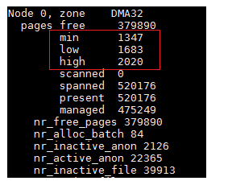

# 1. 概述

当linux系统内存压力过大时，就会对系统的每个压力大的zone进程内存回收，内存回收主要是针对**匿名页和文件页**进行的。对于**匿名页**，内存回收过程中会筛选出一些不经常使用的匿名页，将它们写入到swap分区中，然后作为空闲页框释放到伙伴系统。而对于**文件页**，内存回收过程中也会筛选出一些不经常使用的文件页，如果此文件页中保存的内容与磁盘中文件对应内容一致，说明此文件页是一个干净的文件页，就不需要进行回写，直接将此页作为空闲页框释放到伙伴系统中，相反，如果文件页保存的数据与磁盘中文件对应的数据不一致，则认定此文件页为脏页，需要先将此文件页回写到磁盘中对应数据所在位置上，然后再将此页作为空闲页框释放到伙伴系统中。这样当内存回收完成后，系统空闲的页框数量就会增加，能够缓解内存压力，，听起来很厉害，它也有一个弊端，就是在回收过程中会对系统的IO造成很大的压力，所以，在系统内，一般每个zone会设置一条线，当空闲页框数量不满足这条线时，就会执行内存回收操作，而系统空闲页框数量满足这条线时，系统是不会进行内存回收操作的。

# 2. zone的阀值
内存回收是以zone为单位进行的(也会以memcg为单位，这里不讨论这种情况)，而系统判断一个zone需不需要进行内存回收，如上面所说，为zone设置一条线，当此zone的空闲页框不足以到达这条线时，就会对此zone进行内存回收，实际上一个zone有三条线，这三条线分别是**最小阀值**(WMARK_MIN)，**低阀值**(WMARK_LOW)，**高阀值**(WMARK_HIGH)，它们都保存在zone的watermark[NR_WMARK]数组中，这个数组中保存的是各个阀值要求的页框数量，而每个阀值都会对内存回收造成影响。而它们的描述如下：

* watermark\[WMARK_MIN](min阀值)：在快速分配失败后的慢速分配中会使用此阀值进行分配，如果慢速分配过程中使用此值还是无法进行分配，那就会执行直接内存回收和快速内存回收
* watermark\[WMARK_LOW](low阀值)：也叫低阀值，是快速分配的默认阀值，在分配内存过程中，如果zone的空闲页框数量低于此阀值，系统会对zone执行快速内存回收
* watermark\[WMARK_HIGH](high阀值)：也叫高阀值，是zone对于空闲页框数量比较满意的一个值，当zone的空闲页框数量高于这个值时，表示zone的空闲页框较多。所以对zone进行内存回收时，目标也是希望将zone的空闲页框数量提高到此值以上，系统会使用此阀值用于oomkill进行内存回收。

这三个阀值的关系是：min阀值 < low阀值 < high阀值。在系统初始化期间，根据系统中整个内存的数量与每个zone管理的页框数量，计算出每个zone的min阀值，然后low阀值 = min阀值 + (min阀值 / 4)，high阀值 = min阀值 + (min阀值 / 2)。这样就得出了这三个阀值的数值，我们可以通过/proc/zoneinfo中查看这三个阀值的数值：

可以很明显看出来，相对于整个zone管理的总页框数量(managed)，这三个值是非常非常小的，连managed的1%都不到，这些都是在系统初始化期间进行设置的，具体设置函数是__setup_per_zone_wmarks()。有兴趣的可以去看看。这个阀值对内存回收的进行具有很重要的意义，后面会详细进行说明。对于zone的内存回收，它针对三样东西进程回收：slab、lru链表中的页、buffer_head。

这里只讨论内存回收针对lru链表中的页是如何进行回收的。lru链表主要用于管理进程空间中使用的内存页，它主要管理三种类型的页**：匿名页、文件页以及shmem使用的页**。在内存回收过程中，说简单些，就是将lru链表中的一些页数据放到磁盘中，然后将这些页释放，当然实际上可没有那么简单，这个后面会详细说明。

在说内存回收前，要先补充一些知识，因为内存回收并不是一个孤立的功能，它内部会涉及到其他很多东西，比如内存分配、lru链表、反向映射、swapcache、pagecache等。

## 2.1 判断页是否能够回收
抛开内存回收不谈，在内核中，**只有一种页能够进行回收，就是页描述符中的_count为0的页**，每个页都有自己唯一的页描述符，而每个页描述符中都有一个_count，这个_count代表的是此页的引用计数，当_count为-1时，说明此页是空闲的，存放在伙伴系统中，每当有一个进程映射了此页时，此页的_count就会++，也就是当某个页被10个进程映射了，它的page->_count肯定大于10(不等于10是因为可能还有其他模块引用了此页，比如块层、驱动等)，所以也可以反过来说，如果某个页的page->_count == 0，那就说明此页可以直接释放回收了。也就是说，内核实际上回收的是那些**page->_count == 0**的页，但是如果真的是这样，内存回收这就没有任何意义了，因为当最后一个引用此页的模块释放掉此页的引用时，如果page->_count为0，肯定会释放回收此页的。实际上内存回收做的事情，就是**想办法将一些page->_count不为0的页，尝试将它们的page->_count降到0，这样系统就可以回收这些页了**。下面是我总结出来在内存回收过程中会对页的page->_count产生影响的操作：
* 一个进程映射此页，page->_count++
* 一个进程取消映射此页，page->_count--
* 此页加入到lru缓存中，page->_count++
* 此页从lru缓存加入到lru链表中，page->_count--
* 此页被加入到一个address_space中，page->_count++
* 此页从address_space中移除时，page->_count--
* 文件页添加了buffer_heads，page->_count++
* 文件页删除了buffer_heads，page->_count--

## 2.2 lru链表
ru链表主要作用就是**将页排序**，将最应该回收的页放到最后面，最不应该回收的页放到最前面，然后进行内存回收时，就会从后面向前面进行扫描，将扫描到的页尝试进行回收，具体见 [lru链表](./lru链表.md)。这里只需要记住一点，**回收的页都是非活动匿名页lru链表或者非活动文件页lru链表上的页。这些页包括：进程堆、栈、匿名mmap共享内存映射、shmem共享内存映射使用的页、映射磁盘文件的页。**

