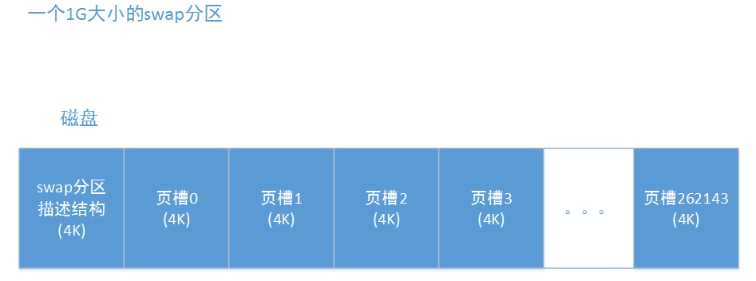

# 1. 概述

当linux系统内存压力过大时，就会对系统的每个压力大的zone进程内存回收，内存回收主要是针对**匿名页和文件页**进行的。对于**匿名页**，内存回收过程中会筛选出一些不经常使用的匿名页，将它们写入到swap分区中，然后作为空闲页框释放到伙伴系统。而对于**文件页**，内存回收过程中也会筛选出一些不经常使用的文件页，如果此文件页中保存的内容与磁盘中文件对应内容一致，说明此文件页是一个干净的文件页，就不需要进行回写，直接将此页作为空闲页框释放到伙伴系统中，相反，如果文件页保存的数据与磁盘中文件对应的数据不一致，则认定此文件页为脏页，需要先将此文件页回写到磁盘中对应数据所在位置上，然后再将此页作为空闲页框释放到伙伴系统中。这样当内存回收完成后，系统空闲的页框数量就会增加，能够缓解内存压力，，听起来很厉害，它也有一个弊端，就是在回收过程中会对系统的IO造成很大的压力，所以，在系统内，一般每个zone会设置一条线，当空闲页框数量不满足这条线时，就会执行内存回收操作，而系统空闲页框数量满足这条线时，系统是不会进行内存回收操作的。

# 2. zone的阀值
内存回收是以zone为单位进行的(也会以memcg为单位，这里不讨论这种情况)，而系统判断一个zone需不需要进行内存回收，如上面所说，为zone设置一条线，当此zone的空闲页框不足以到达这条线时，就会对此zone进行内存回收，实际上一个zone有三条线，这三条线分别是**最小阀值**(WMARK_MIN)，**低阀值**(WMARK_LOW)，**高阀值**(WMARK_HIGH)，它们都保存在zone的watermark[NR_WMARK]数组中，这个数组中保存的是各个阀值要求的页框数量，而每个阀值都会对内存回收造成影响。而它们的描述如下：

* watermark\[WMARK_MIN](min阀值)：在快速分配失败后的慢速分配中会使用此阀值进行分配，如果慢速分配过程中使用此值还是无法进行分配，那就会执行直接内存回收和快速内存回收
* watermark\[WMARK_LOW](low阀值)：也叫低阀值，是快速分配的默认阀值，在分配内存过程中，如果zone的空闲页框数量低于此阀值，系统会对zone执行快速内存回收
* watermark\[WMARK_HIGH](high阀值)：也叫高阀值，是zone对于空闲页框数量比较满意的一个值，当zone的空闲页框数量高于这个值时，表示zone的空闲页框较多。所以对zone进行内存回收时，目标也是希望将zone的空闲页框数量提高到此值以上，系统会使用此阀值用于oomkill进行内存回收。


这三个阀值的关系是：min阀值 < low阀值 < high阀值。在系统初始化期间，根据系统中整个内存的数量与每个zone管理的页框数量，计算出每个zone的min阀值，然后low阀值 = min阀值 + (min阀值 / 4)，high阀值 = min阀值 + (min阀值 / 2)。这样就得出了这三个阀值的数值，我们可以通过/proc/zoneinfo中查看这三个阀值的数值：

可以很明显看出来，相对于整个zone管理的总页框数量(managed)，这三个值是非常非常小的，连managed的1%都不到，这些都是在系统初始化期间进行设置的，具体设置函数是__setup_per_zone_wmarks()。有兴趣的可以去看看。这个阀值对内存回收的进行具有很重要的意义，后面会详细进行说明。对于zone的内存回收，它针对三样东西进程回收：slab、lru链表中的页、buffer_head。

这里只讨论内存回收针对lru链表中的页是如何进行回收的。lru链表主要用于管理进程空间中使用的内存页，它主要管理三种类型的页**：匿名页、文件页以及shmem使用的页**。在内存回收过程中，说简单些，就是将lru链表中的一些页数据放到磁盘中，然后将这些页释放，当然实际上可没有那么简单，这个后面会详细说明。

在说内存回收前，要先补充一些知识，因为内存回收并不是一个孤立的功能，它内部会涉及到其他很多东西，比如内存分配、lru链表、反向映射、swapcache、pagecache等。


# 3 判断页是否能够回收
抛开内存回收不谈，在内核中，**只有一种页能够进行回收，就是页描述符中的_count为0的页**，每个页都有自己唯一的页描述符，而每个页描述符中都有一个_count，这个_count代表的是此页的引用计数，当_count为-1时，说明此页是空闲的，存放在伙伴系统中，每当有一个进程映射了此页时，此页的_count就会++，也就是当某个页被10个进程映射了，它的page->_count肯定大于10(不等于10是因为可能还有其他模块引用了此页，比如块层、驱动等)，所以也可以反过来说，如果某个页的page->_count == 0，那就说明此页可以直接释放回收了。也就是说，内核实际上回收的是那些**page->_count == 0**的页，但是如果真的是这样，内存回收这就没有任何意义了，因为当最后一个引用此页的模块释放掉此页的引用时，如果page->_count为0，肯定会释放回收此页的。实际上内存回收做的事情，就是**想办法将一些page->_count不为0的页，尝试将它们的page->_count降到0，这样系统就可以回收这些页了**。下面是我总结出来在内存回收过程中会对页的page->_count产生影响的操作：
* 一个进程映射此页，page->_count++
* 一个进程取消映射此页，page->_count--
* 此页加入到lru缓存中，page->_count++
* 此页从lru缓存加入到lru链表中，page->_count--
* 此页被加入到一个address_space中，page->_count++
* 此页从address_space中移除时，page->_count--
* 文件页添加了buffer_heads，page->_count++
* 文件页删除了buffer_heads，page->_count--

# 4  lru链表
ru链表主要作用就是**将页排序**，将最应该回收的页放到最后面，最不应该回收的页放到最前面，然后进行内存回收时，就会从后面向前面进行扫描，将扫描到的页尝试进行回收，具体见 [lru链表](./内存源码分析-lru链表.md)。这里只需要记住一点，**回收的页都是非活动匿名页lru链表或者非活动文件页lru链表上的页。这些页包括：进程堆、栈、匿名mmap共享内存映射、shmem共享内存映射使用的页、映射磁盘文件的页。**

# 5  页的换入换出
首先先说明一下**页描述符**中对内存回收来说非常必要的标志：
* **PG_lru** ：表示页在lru链表中
* **PG_referenced**: 表示页最近被访问(只有文件页使用)
* **PG_dirty**：页为脏页，文件页被修改，以及非文件页加入到swap cache后，就会被标记为脏页。在此页回写前会被清除，但是回写失败时又会被置位
* **PG_active**：页为活动页，配合PG_lru就可以得出页是处于非活动页lru链表还是活动页lru链表
* **PG_private**：页描述符中的page->private保存有数据
* **PG_writeback**：页正在进行回写
* **PG_swapbacked**：此页可写入swap分区，一般用于表示此页是非文件页
* **PG_swapcache**：页已经加入到了swap cache中(只有非文件页使用)
* **PG_reclaim**：页正在进行回收，只有在内存回收时才会对需要回收的页进行此标记
* **PG_mlocked**：页被锁在内存中

内存回收做的事情就是想办法将**目标页的page->_count降到0**，对于那些没有进程映射了页，释放起来就很简单，如果页映射了磁盘文件，并且页为脏页(被写过)，那就就把页中的数据回写到磁盘中映射的文件中，而如果页没有映射磁盘文件，那么直接释放即可。但是对于有进程映射的页，如果此页映射了磁盘文件，并且页为脏页，那么和之前一样，将此页进行回写，然后释放回收即可，但是此页没有映射磁盘文件，情况就会稍微复杂，会将页数据写入到swap分区中，然后将此页释放回收。总结如下：

- 干净页，并且映射了磁盘文件的页，直接回收
- 脏页(PG_dirty置位)，回写到对应磁盘文件中，然后回收
- 没有进程映射，并且没有映射磁盘文件的页，直接回收
- 有进程映射，并且没有映射磁盘文件的页，回写到swap分区中，然后回收

接下来会分为非活动匿名页lru链表的页的换入换出，非活动文件页lru链表的页的换入换出进行描述。

匿名页lru链表上保存的页为：**进程堆、栈、数据段，匿名mmap共享内存映射，shmem映射。**, 这些类型的页都有个特点，在磁盘上没有映射对应的文件(shmem有对应的文件，是/dev/zero，但它不是映射此设备文件)。而在内存回收时，会从非活动匿名页lru链表末尾向前扫描一定数量的页框，然后尝试将这些页框进行回收，而如果这些页框没有进程映射它们，那么它们可以直接释放，而如果有进程映射了它们，那么系统就必须将这些页框回写到磁盘上。在linux系统中，你可以给系统挂载一个swap分区，这个分区就是专门用于保存这些类型的页的。当这些页需要回收，并且有进程映射了它们时，系统就会将这些页写入swap分区，需要注意，它们需要回收只有在内存不足进行内存回收时才会发生，也就是当系统内存充足时，是不会将这些类型的页写入到swap分区中的(使用memcg除外)，在磁盘上，一个swap分区是一组**连续的物理扇区**，比如一个1G大小的swap分区，那么它在磁盘上会占有1G大小磁盘块，然后这块磁盘块的第一个4K，专门用于存swap分区描述结构的，而之后的磁盘块，会被划分为一个一个4K大小的页槽(正好与普通页大小一致)，然后将它们标以ID，如下：



每个页槽可以保存一个页的数据，这样，一个被换出的页就可以写入到磁盘中，系统也能够将这些页组织起来了。虽然是叫swap分区，但是内核似乎并不将swap分区当做一个磁盘分区来看待，更像的是将其当做一个文件来看待，因为这个，每个swap分区都有一个 **address_space** 结构，这个结构是每个磁盘文件都会有一个的，这个address_space结构中最重要的是有一个基树和一个address_space操作集。而这里swap分区有一个，**swap分区的address_space叫做 swap cache**，它的作用是从非文件页在回写到swap分区到此非文件页被回收前的这段时间里，起到一个将swap类型的页表项与此页关联的作用和同步的作用。在这个swap cache的基树中，将此swap分区的所有页槽组织在了一起。当非活动匿名页lru链表中的一个页需要写入到swap分区时，步骤如下：

1. swap分配一个空闲的页槽
2. 根据这个空闲页槽的ID，从swap分区的swap cache的基树中找到此页槽ID对应的结点，将此页的页描述符存入当中
3. 内核以页槽ID作为偏移量生成一个swap页表项，并将这个swap页表项保存到页描述符中的private中
4. 对页进行反向映射，将所有映射了此页的进程页表项改为此swap页表项
5. 将此页的mapping改为指向此swap分区的address_space，并将此页设置为脏页
6. 通过swap cache中的address_space操作集将此页回写到swap分区中
7. 回写完成
8. 此页要被回收，将此页从swap cache中拿出来

当一个进程需要访问此页时，系统则会将此页从swap分区换入内存中，具体步骤如下：
1. 一个进行访问了此页，会先访问到之前设置的swap页表项
2. 产生缺页异常，在缺页异常中判断此页在swap分区中，而不在内存中
3. 分配一个新页
4. 根据进程的页表项中的swap页表项找到对应的页槽和swap cache
5. 如果以页槽ID在swap cache中没有找到此页，说明此页已被回收，从分区中将此页读取进来
6. 如果以页槽ID在swap cache中找到了此页，说明此页还在内存中，还没有被回收，则直接映射此页

　这样再此页没有被换出或者正在换出的情况下，所有映射了此页的进程又可以重新访问此页了，而当此页被完全换出到swap分区然后被回收后，此页就会从swap cache中移除，之后如果进程想要访问此页，就需要等此页被完全换入之后才行了。也就是这个swap cache完全为了提高效率，在页没有被回收前，即使此页已经回写到swap分区了，只要有进映射此页，就可以直接映射内存中的页，而不需要将页从磁盘读进来。对于非活动匿名页lru链表上的页进行换入换出这里就算是说完了。**记住对于非活动匿名页lru链表上的页来说，当此页加入到swap cache中时，那么就意味着这个页已经被要求换出，然后进行回收了。**

但是相反文件页则不是这样，接下来简单说说映射了磁盘文件的文件页的换入换出，实际上与非活动匿名页lru链表上的页进行换入换出是一模一样的，因为每个磁盘文件都有一个自己的address_space，这个address_space就是swap分区的address_space，**磁盘文件的address_space称为page cache**，接下来的处理就是差不多的，区别为以下三点：
1. 对于磁盘文件来说，它的数据并不像swap分区这样是连续的。
2. 当文件数据读入到一个页时，此文件页就需要在文件的page cache中做关联，这样当其他进程也需要访问文件的这块数据时，通过page cache就可以知道此页在不在内存中了。
3. 并不会为映射了此文件页的进程页表项生成一个新的页表项，会将所有映射了此页的页表项清空，因为在缺页异常中通过vma就可以判断发生缺页的页是映射了文件的哪一部分，然后通过文件系统可以查到此页在不在内存中。而对于匿名页的vma来说，则无法做到这一点。


## 5.1 内存分配过程
要说清楚内存回收，就必须要先理清楚内存分配过程，在调用`alloc_page()`或者`alloc_pages()`等接口进行一次内存分配时，最后都会调用到
**__alloc_pages_nodemask()** 函数，这个函数是内存分配的心脏，对内存分配流程做了一个整体的组织。具体可以见我博客的另一篇文章[linux内存源码分析 - 伙伴系统(初始化和申请页框)](./内存源码分析-伙伴系统(初始化和申请页框).md)。主要需要注意的，就是在__alloc_pages_nodemask()中会进行一次使用low阀值的快速内存分配和一次使用min阀值的慢速内存分配，快速内存分配使用的函数是get_page_from_freelist()，这个函数是分配页框的基本函数，也就是说，在慢速内存分配过程中，收集到和足够数量的页框后，也需要调用这个函数进行分配。先简单说明快速内存分配和慢速内存分配：

* **快速内存分配**：是get_page_from_freelist()函数，通过low阀值从zonelist中获取合适的zone进行分配，如果zone没有达到low阀值，则会进行快速内存回收，快速内存回收后再尝试分配。
* **慢速内存分配**：当快速分配失败后，也就是zonelist中所有zone在快速分配中都没有获取到内存，则会使用min阀值进行慢速分配，在慢速分配过程中主要做三件事，异步内存压缩、直接内存回收以及轻同步内存压缩，最后视情况进行oom分配。并且在这些操作完成后，都会调用一次快速内存分配尝试获取页框。

通过以下这幅图，来说明流程：


说到内存分配过程，就必须要说说中的preferred_zone和zonelist，preferred_zone可以理解为内存分配时，最希望从这个zone进行分配，，而zonelist理解为，当没办法从preferred_zone分配内存时，则根据zonelist中zone的顺序尝试进行分配，为什么会有这两个参数，是因为numa架构导致的，我们知道，当有多个node结点时，CPU跨结点访问内存是效率比较低的工作，所以CPU会优先在本node上的zone进行内存分配工作，如果本node上实在分配不出内存，那就尝试在离本node最近的node上分配，如果还是无法分配到，那就找再下一个node。这样每个node会将其他node的距离进行一个排序形成了其他node的一个链表，这个链表越前面的node就表示里本node越近，越后面的node就离本node越远。而在32位系统中，每个node有3个zone，分别是ZONE_HIGHMEM、ZONE_NORMAL、ZONE_DMA。每个区管理的内存数量不一样，导致每个区的优先级不同，优先级为ZONE_HIGHMEM > ZONE_NORMAL > ZONE_DMA，对于进程使用的页，系统优先分配ZONE_HIGHMEM的页框，如果ZONE_HIGHMEM无法分配页框，则从ZONE_NORMAL进行分配，当然，对于内核使用的页来说，大部分只会从ZONE_NORMAL和ZONE_DMA进行分配，这样，将这个zone优先级与node链表结合，就得到zonelist链表了，比如对于node0，它完整的zonelist链表就可能如下：
```
node0的管理区                                       node1的管理区
ZONE_HIGHMEM(0) -> ZONE_NORMAL(0) -> ZONE_DMA(0) -> ZONE_HIGHMEM(1) -> ZONE_NORMAL(1) -> ZONE_DMA(1)
```
因为每个node都有自己完整的zonelist链表，所以对于node1，它的链表时这样的
```
node1的管理区                                       node0的管理区
ZONE_HIGHMEM(1) -> ZONE_NORMAL(1) -> ZONE_DMA(1) -> ZONE_HIGHMEM(0) -> ZONE_NORMAL(0) -> ZONE_DMA(0)
```
　这样得到了两个node自己的zonelist，但是在内存分配中，还不一定会使用node自己的zonelist，因为有些内存只希望从ZONE_NORMAL和ZONE_DMA中进行分配，所以，在每次进行内存分配时，都会此次内存分配形成一个满足的zonelist，，比如：某次内存分配在node0的CPU上执行了，希望从ZONE_NORMAL和ZONEDMA区中进行分配，那么就会形成下面这个链表
```
node0的管理区                    node1的管理区
ZONE_NORMAL(0) -> ZONE_DMA(0) -> ZONE_NORMAL(1) -> ZONE_DMA(1)
```

这样就是preferred_zone和zonelist，preferred_zone一般都是指向zonelist中的第一个zone，当然这个还会跟nodemask有关，这个就不细说了。

## 5.2 扫描控制结构
之前说内存压缩的文章也有涉及这个结构，现在详细说明一下，扫描控制结构用于内存回收和内存压缩，它的主要作用时保存对一次内存回收或者内存压缩的变量和参数，一些处理结果也会保存在里面，结构如下：

```c
/* 扫描控制结构，用于内存回收和内存压缩 */
struct scan_control {
    /* 需要回收的页框数量 */
    unsigned long nr_to_reclaim;

    /* 申请内存时使用的分配标志 */
    gfp_t gfp_mask;

    /* 申请内存时使用的order值，因为只有申请内存，然后内存不足时才会进行扫描 */
    int order;

    /* 允许执行扫描的node结点掩码 */
    nodemask_t    *nodemask;

    /* 目标memcg，如果是针对整个zone进行的，则此为NULL */
    struct mem_cgroup *target_mem_cgroup;

    /* 扫描优先级，代表一次扫描(total_size >> priority)个页框 
     * 优先级越低，一次扫描的页框数量就越多
     * 优先级越高，一次扫描的数量就越少
     * 默认优先级为12
     */
    int priority;

    /* 是否能够进行回写操作(与分配标志的__GFP_IO和__GFP_FS有关) */
    unsigned int may_writepage:1;

    /* 能否进行unmap操作，就是将所有映射了此页的页表项清空 */
    unsigned int may_unmap:1;

    /* 是否能够进行swap交换，如果不能，在内存回收时则不扫描匿名页lru链表 */
    unsigned int may_swap:1;

    unsigned int hibernation_mode:1;

    /* 扫描结束后会标记，用于内存回收判断是否需要进行内存压缩 */
    unsigned int compaction_ready:1;

    /* 已经扫描的页框数量 */
    unsigned long nr_scanned;
    /* 已经回收的页框数量 */
    unsigned long nr_reclaimed;
};
```
结构很简单，主要就是保存一些参数，在内存回收和内存压缩时就会根据这个结构中的这些参数，做不同的处理，后面代码会详细说明。

这里我们只说说会几个特别的参数：

- **priority**：优先级，这个参数主要会影响内存回收时一次扫描的页框数量、在shrink_lruvec()中回收到足够页框后是否继续回收、内存回收时的回写、是否取消对zone进行回收判断而直接开始回收，一共四个地方。

- **may_unmap**：是否能够进行unmap操作，如果不能进行unmap操作，就只能对没有进程映射的页进行回收。

- **may_writepage**：是否能够进行将页回写到磁盘的操作，这个值会影响脏的文件页与匿名页lru链表中的页的回收，如果不能进行回写操作，脏页和匿名页lru链表中的页都不能进行回收(已经回写完成的页除外，后面解释)

- **may_swap** ：能否进行swap交换，同样影响匿名页lru链表中的页的回收，如果不能进行swap交换，就不会对匿名页lru链表进行扫描，也就是在本次内存回收中，完全不会回收匿名页lru链表中的页(进程堆、栈、shmem共享内存、匿名mmap共享内存使用的页)


在快速内存回收、直接内存回收、kswapd内存回收中，这几个值的设置不一定会一致，也导致了它们对不同类型的页处理方式也不同。

**除了sc->may_writepage会影响页的回写外，还有进行内存分配时使用的分配标志gfp_mask中的__GFP_IO和__GFP_FS会影响页的回写，具体如下：**

* 扫描到的非活动匿名页lru链表中的页如果还没有加入到swapcache中，需要有__GFP_IO标记才允许加入swapcache和回写。
* 扫描到的非活动匿名页lru链表中的页如果已经加入到了swapcache中，需要有__GFP_FS才允许进行回写。
* 扫描到的非活动文件页lru链表中的页需要有__GFP_FS才允许进行回写。

这里还需要说说**三个重要的内核配置**：

> **/proc/sys/vm/zone_reclaim_mode**

**这个参数只会影响快速内存回收**，其值有三种，

* 0x1：开启zone的内存回收
* 0x2：开启zone的内存回收，并且允许回写
* 0x4：开启zone的内存回收，允许进行unmap操作

当此参数为0时，会导致快速内存回收只会对最优zone附近的几个需要进行内存回收的zone进行内存回收(说快速内存会解释)，而只要不为0，就会对zonelist中所有应该进行内存回收的zone进行内存回收。

当此参数为0x1(001)时，就如上面一行所说，允许快速内存回收对zonelist中所有应该进行内存回收的zone进行内存回收。

当此参数为0x2(010)时，在0x1的基础上，允许快速内存回收进行匿名页lru链表中的页的回写操作。

当此参数0x4(100)时，在0x1的基础上，允许快速内存回收进行页的unmap操作。

> **/proc/sys/vm/laptop_mode**

**此参数只会影响直接内存回收**，只有两个值：
- 0：允许直接内存回收对匿名页lru链表中的页进行回写操作，并且允许直接内存回收唤醒flush内核线程
- 非0：直接内存回收不会对匿名页lru链表中的页进行回写操作


> **/proc/sys/vm/swapiness**

**此参数影响进行内存回收时，扫描匿名页lru链表和扫描文件页lru链表的比例，范围是0~200，系统默认是30**：

* 接近0：进行内存回收时，更多地去扫描文件页lru链表，如果为0，那么就不会去扫描匿名页lru链表。
* 接近200：进行内存回收时，更多地去扫描匿名页lru链表。

# 6. 内存回收
## 6.1 对zone进行一次内存回收流程

内存回收可以针对某个zone进行回收，也可以针对某个memcg进行回收，这里我们就只讨论针对某个zone进行回收的情况，无论是针对zone进行内存回收还是针对memcg进行内存回收，整个内核只有一个函数入口，就是是 **shrink_zone()** 函数，也就是内核中无论怎么样进行内存回收，最终调用到的函数都会是这个shrink_zone()，这个函数要求调用者传入一个设置好的struct scan_control结构以及目标zone的指针。虽然是对zone进行一次内存回收，但是实际上在这个函数里，如果此zone还可以回收页框时，可能会对zone进行多次的内存回收，这是因为两个方面

1. 如果每次仅回收2\^order个页框，满足于本次内存分配(内存分配失败时才会导致内存回收)，那么下次内存分配时又会导致内存回收，影响效率，所以，每次zone的内存回收，都是尽量回收更多页框，制定回收的目标是2\^(order+1)个页框，比要求的2^order多了一倍。但是当非活动lru链表中的数量不满足这个标准时，则取消这种状态的判断。
2. zone的内存回收后往往伴随着zone的内存压缩(见linux内存源码分析 - 内存压缩)，所以进行zone的内存回收时，会回收到空闲页框数量满足进行内存压缩为止。

我们看一下这个shrink_zone()：
```c
/* 对zone进行内存回收 
 * 返回是否回收到了页框，而不是十分回收到了sc中指定数量的页框
 * 即使没回收到sc中指定数量的页框，只要回收到了页框，就返回真
 */
static bool shrink_zone(struct zone *zone, struct scan_control *sc)
{
    unsigned long nr_reclaimed, nr_scanned;
    bool reclaimable = false;

    do {
        /* 当内存回收是针对整个zone时，sc->target_mem_cgroup为NULL */
        struct mem_cgroup *root = sc->target_mem_cgroup;
        struct mem_cgroup_reclaim_cookie reclaim = {
            .zone = zone,
            .priority = sc->priority,
        };
        struct mem_cgroup *memcg;

        /* 记录本次回收开始前回收到的页框数量 
         * 第一次时是0
         */
        nr_reclaimed = sc->nr_reclaimed;
        /* 记录本次回收开始前扫描过的页框数量
         * 第一次时是0
         */
        nr_scanned = sc->nr_scanned;

        /* 获取最上层的memcg
         * 如果没有指定开始的root，则默认是root_mem_cgroup
         * root_mem_cgroup管理的每个zone的lru链表就是每个zone完整的lru链表
          */
        memcg = mem_cgroup_iter(root, NULL, &reclaim);
        do {
            struct lruvec *lruvec;
            int swappiness;

            /* 获取此memcg在此zone的lru链表 
             * 如果内核没有开启memcg，那么就是zone->lruvec
             */
            lruvec = mem_cgroup_zone_lruvec(zone, memcg);
            /* 从memcg中获取swapiness，此值代表了进行swap的频率，此值较低时，那么就更多的进行文件页的回收，此值较高时，则更多进行匿名页的回收 */
            swappiness = mem_cgroup_swappiness(memcg);

            /* 对此memcg的lru链表进行回收工作 
             * 此lru链表中的所有页都是属于此zone的
             * 每个memcg中都会为每个zone维护一个lru链表
             */
            shrink_lruvec(lruvec, swappiness, sc);

            /* 如果是对于整个zone进行回收，那么会遍历所有memcg，对所有memcg中此zone的lru链表进行回收 
             * 而如果只是针对某个memcg进行回收，如果回收到了足够内存则返回，如果没回收到足够内存，则对此memcg下面的memcg进行回收
             */
            if (!global_reclaim(sc) &&
                    sc->nr_reclaimed >= sc->nr_to_reclaim) {
                mem_cgroup_iter_break(root, memcg);
                break;
            }
            /* 下一个memcg，对于整个zone进行回收和对某个memcg进行回收但回收数量不足时会执行到此 */
            memcg = mem_cgroup_iter(root, memcg, &reclaim);
        } while (memcg);
        
        /* 计算此memcg的内存压力，保存到memcg->vmpressure */
        vmpressure(sc->gfp_mask, sc->target_mem_cgroup,
               sc->nr_scanned - nr_scanned,
               sc->nr_reclaimed - nr_reclaimed);

        if (sc->nr_reclaimed - nr_reclaimed)
            reclaimable = true;

    /* 判断是否再次此zone进行内存回收 
     * 继续对此zone进行内存回收有两种情况:
     * 1. 没有回收到比目标order值多一倍的数量页框，并且非活动lru链表中的页框数量 > 目标order多一倍的页
     * 2. 此zone不满足内存压缩的条件，则继续对此zone进行内存回收
     * 而当本次内存回收完全没有回收到页框时则返回，这里大概意思就是想回收比order更多的页框
     */
    } while (should_continue_reclaim(zone, sc->nr_reclaimed - nr_reclaimed,
                     sc->nr_scanned - nr_scanned, sc));

    return reclaimable;
}
```
在此函数中，**首先会遍历memcg，根据memcg获取lru链表描述符lruvec与swapiness，这个swapiness的值的范围是0~200，它会影响扫描匿名页lru链表和文件页lru链表的页框数量**，当此值越低时，就需要扫描的匿名页lru链表的页框越少，当此值为0时，则不扫描匿名页lru链表的页框，相反，此值越高，则需要扫描的匿名页lru链表的页框越多，当其为200时，则**只扫描匿名页lru链表中的页框**，**不扫描文件页lru链表中的页框**。然后调用shrink_lruvec()对此lru链表描述符的lru链表进行扫描，最后遍历完所有memcg后，判断是否继续对此zone进行内存回收，总的来说，流程如下：

1. 从root_memcg开始遍历memcg
    1. 获取memcg的lru链表描述符lruvec
    2. 获取memcg的swapiness
    3. 调用shrink_lruvec()对此memcg的lru链表进行处理

2. 遍历完所有memcg后，检查是否还要对此zone再次进行内存回收。

核心函数就是**shrink_lruvec()**，我们先看代码：
```c
/* 对lru链表描述符lruvec中的lru链表进行内存回收，此lruvec有可能属于一个memcg，也可能是属于一个zone 
 * lruvec: lru链表描述符，里面有5个lru链表，活动/非活动匿名页lru链表，活动/非活动文件页lru链表，禁止换出页链表
 * swappiness: 扫描匿名页的亲和力，其值越低，就扫描越少的匿名页，当为0时，基本不会扫描匿名页lru链表，除非针对整个zone进行内存回收时，此zone的所有文件页都释放了都不能达到高阀值，那就只对匿名页进行扫描
 * sc: 扫描控制结构
 */
static void shrink_lruvec(struct lruvec *lruvec, int swappiness,
              struct scan_control *sc)
{
    unsigned long nr[NR_LRU_LISTS];
    unsigned long targets[NR_LRU_LISTS];
    unsigned long nr_to_scan;
    enum lru_list lru;
    unsigned long nr_reclaimed = 0;
    /* 需要回收的页框数量 */
    unsigned long nr_to_reclaim = sc->nr_to_reclaim;
    struct blk_plug plug;
    bool scan_adjusted;

    /* 对这个lru链表描述符中的每个lru链表，计算它们本次扫描应该扫描的页框数量 
     * 计算好的每个lru链表需要扫描的页框数量保存在nr中
     * 每个lru链表需要扫描多少与sc->priority有关，sc->priority越小，那么扫描得越多
     */
    get_scan_count(lruvec, swappiness, sc, nr);

    /* 将nr的数据复制到targets中 */
    memcpy(targets, nr, sizeof(nr));

    /* 是否将nr[]中的数量页数都扫描完才停止
     * 如果是针对整个zone进行扫描，并且不是在kswapd内核线程中调用的，优先级为默认优先级，就会无视需要回收的页框数量，只有将nr[]中的数量页数都扫描完才停止
     * 快速回收不会这样做(快速回收的优先级不是DEF_PRIORITY)
     */
    scan_adjusted = (global_reclaim(sc) && !current_is_kswapd() &&
             sc->priority == DEF_PRIORITY);

    /* 初始化这个struct blk_plug
     * 主要初始化list，mq_list，cb_list这三个链表头
     * 然后current->plug = plug
     */
    blk_start_plug(&plug);
    /* 如果LRU_INACTIVE_ANON，LRU_ACTIVE_FILE，LRU_INACTIVE_FILE这三个其中一个需要扫描的页框数没有扫描完，那扫描就会继续 
     * 注意这里不会判断LRU_ACTIVE_ANON需要扫描的页框数是否扫描完，这里原因大概是因为系统不太希望对匿名页lru链表中的页回收
     */
    while (nr[LRU_INACTIVE_ANON] || nr[LRU_ACTIVE_FILE] ||
                    nr[LRU_INACTIVE_FILE]) {
        unsigned long nr_anon, nr_file, percentage;
        unsigned long nr_scanned;

        /* 以LRU_INACTIVE_ANON，LRU_INACTIVE_ANON，LRU_INACTIVE_FILE，LRU_ACTIVE_FILE这个顺序遍历lru链表 
         * 然后对遍历到的lru链表进行扫描，一次最多32个页框
         */
        for_each_evictable_lru(lru) {
            /* nr[lru类型]如果有页框需要扫描 */
            if (nr[lru]) {
                /* 获取本次需要扫描的页框数量，nr[lru]与SWAP_CLUSTER_MAX的最小值 
                 * 也就是每一轮最多只扫描SWAP_CLUSTER_MAX(32)个页框
                 */
                nr_to_scan = min(nr[lru], SWAP_CLUSTER_MAX);
                /* nr[lru类型]减掉本次需要扫描的页框数量 */
                nr[lru] -= nr_to_scan;

                /* 对此lru类型的lru链表进行内存回收 
                 * 一次扫描的页框数是nr[lru]与SWAP_CLUSTER_MAX的最小值，也就是如果全部能回收，一次也就只能回收SWAP_CLUSTER_MAX(32)个页框
                 * 都是从lru链表末尾向前扫描
                 * 本次回收的页框数保存在nr_reclaimed中
                 */
                nr_reclaimed += shrink_list(lru, nr_to_scan,
                                lruvec, sc);
            }
        }

        /* 没有回收到足够页框，或者需要忽略需要回收的页框数量，尽可能多的回收页框，则继续进行回收
         * 当scan_adjusted为真时，扫描到nr[三个类型]数组中的数都为0为止，会忽略是否回收到足够页框，即使回收到足够页框也继续进行扫描
         * 也就是尽可能的回收页框，越多越好，alloc_pages()会是这种情况
         */
        if (nr_reclaimed < nr_to_reclaim || scan_adjusted)
            continue;

        /* kswapd和针对某个memcg进行回收的情况中会调用到此，已经回收到了足够数量的页框，调用到此是用于判断是否还要继续扫描，因为已经回收到了足够页框了 */
        /* 扫描一遍后，剩余需要扫描的文件页数量和匿名页数量 */
        nr_file = nr[LRU_INACTIVE_FILE] + nr[LRU_ACTIVE_FILE];
        nr_anon = nr[LRU_INACTIVE_ANON] + nr[LRU_ACTIVE_ANON];

        /* 已经扫描完成了，退出循环 */
        if (!nr_file || !nr_anon)
            break;

        /* 下面就是计算再扫描多少页框，会对nr[]中的数进行相应的减少 
         * 调用到这里肯定是kswapd进程或者针对memcg的页框回收，并且已经回收到了足够的页框了
         * 如果nr[]中还剩余很多数量的页框没有扫描，这里就通过计算，减少一些nr[]待扫描的数量
         * 设置scan_adjusted，之后把nr[]中剩余的数量扫描完成
         */
        if (nr_file > nr_anon) {
            /* 剩余需要扫描的文件页多于剩余需要扫描的匿名页时 */

            /* 原始的需要扫描匿名页数量 */
            unsigned long scan_target = targets[LRU_INACTIVE_ANON] +
                        targets[LRU_ACTIVE_ANON] + 1;
            lru = LRU_BASE;
            /* 计算剩余的需要扫描的匿名页数量占 */
            percentage = nr_anon * 100 / scan_target;
        } else {
            /* 剩余需要扫描的文件页少于剩余需要扫描的匿名页时 */
            unsigned long scan_target = targets[LRU_INACTIVE_FILE] +
                        targets[LRU_ACTIVE_FILE] + 1;
            lru = LRU_FILE;
            percentage = nr_file * 100 / scan_target;
        }

        nr[lru] = 0;
        nr[lru + LRU_ACTIVE] = 0;

        lru = (lru == LRU_FILE) ? LRU_BASE : LRU_FILE;
        nr_scanned = targets[lru] - nr[lru];
        nr[lru] = targets[lru] * (100 - percentage) / 100;
        nr[lru] -= min(nr[lru], nr_scanned);

        lru += LRU_ACTIVE;
        nr_scanned = targets[lru] - nr[lru];
        nr[lru] = targets[lru] * (100 - percentage) / 100;
        nr[lru] -= min(nr[lru], nr_scanned);

        scan_adjusted = true;
    }
    blk_finish_plug(&plug);
    /* 总共回收的页框数量 */
    sc->nr_reclaimed += nr_reclaimed;

    /* 非活动匿名页lru链表中页数量太少 */
    if (inactive_anon_is_low(lruvec))
        /* 从活动匿名页lru链表中移动一些页去非活动匿名页lru链表，最多32个 */
        shrink_active_list(SWAP_CLUSTER_MAX, lruvec,
                   sc, LRU_ACTIVE_ANON);

    /* 如果太多脏页进行回写了，这里就睡眠100ms */
    throttle_vm_writeout(sc->gfp_mask);
}
```
此函数主要是对lru链表描述符中的lru链表进行处理，我们知道，lru链表描述符中一共有5个链表：LRU_ACTIVE_ANON，LRU_INACTIVE_ANON，LRU_ACTIVE_FILE，LRU_INACTIVE_FILE，LRU_UNEVICTABLE。对于内存回收来说，它只会处理前面4个lru链表，也就是活动匿名页lru链表，非活动匿名页lru链表，活动文件页lru链表，非活动文件页lru链表。此函数主要工作就是：

1. 调用get_scan_count()计算每个lru链表需要扫描的页框数量，保存到nr数组中；
2. 循环判断nr数组中是否还有lru链表没有扫描完成
   - 以活动匿名页lru链表、非活动匿名页lru链表、活动文件页lru链表、非活动文件页lru链表的顺序作为一轮扫描，每次每个lru链表扫描32个页框，并且在nr数组中减去lru链表对应扫描的数量；
   - 一轮扫描结束后判断是否回收到了足够页框，没有回收到足够页框则跳到 2 继续循环判断nr数组；
   - 已经回收到了足够页框，当nr数组有剩余时，判断是否要对lru链表继续扫描，如果要继续扫描，则跳到 2

3. 如果非活动匿名页lru链表中页数量太少，则对活动匿名页进行一个32个页框的扫描；
4. 如果太多脏页正在进行回写，则睡眠100ms

这里需要说明的有两点：计算每个lru链表需要扫描的数量和调整nr数组。

在**get_scan_count()**函数中会计算每个lru链表需要扫描的页框数量，然后将它们保存到nr数组中，在此，有两个因素会影响这4个lru链表需要扫描的数量，一个是sc->priority(扫描优先级)，一个是swapiness。
* **sc->priority**: 影响的是这4个lru链表扫描页框数量的基准值，当sc->priority越小，每个lru链表需要扫描的页框数量就越多，当sc->priority为0时，则本次shrink_lruvec()会对每个lru链表都完全扫描一遍。在不同内存回收过程中，使用的sc->priority不同，而sc->priority默认值为12。
* **swapiness：** 影响的是在基准值的基础上，是否做调整，让系统更多地去扫描文件页lru链表，或者更多地去扫描匿名页lru链表。当swapiness为100时，扫描文件页lru链表与扫描匿名页lru链表是平衡的，并不倾向与谁，也就是它们需要扫描的页框就是就是sc->priority决定的基准值，当swapiness为0,时，就不会去扫描匿名页lru链表，只扫描文件页lru链表。

有兴趣的可以去看看get_scan_count()函数，这个函数这里就不详细进行说明了，之后可能会出篇文章对此函数进行详细说明。

计算好每个lru链表需要扫描的页框数量后，就以活动匿名页lru链表、非活动匿名页lru链表、活动文件页lru链表、非活动文件页lru链表的顺序对每个链表进行一次最多32个页框的扫描，然后将对应的nr数组的数值进行减少，当对这4个lru链表都进行过一次扫描后，判断是否回收到了足够页框，如果没有回收到足够页框，则继续扫描，而**如果已经回收到了足够页框**的话，并且**nr数组中的数还有剩余**的情况下，这里会有两种可能，一种是直接返回，另一种是继续扫描，这两种情况发生的条件如下：

* **回收到足够页框后直接返回**: **快速内存回收、kswapd内存**回收中会这样做，在回收到sc->nr_to_reclaim数量的页框后直接返回上一级
* **回收到足够页框后继续扫描:** **直接内存回收**时第一次调用shrink_zone()时、kswapd针对某个memcg进行内存回收时会这样做，即使回收到sc->nr_to_reclaim数量的页框后，还会继续扫描，直到nr数组为0具体见后面直接内存回收

当回收到sc>nr_to_reclaim数量的页框后，还打算继续扫描的情况，则会继续扫描这4个lru链表，而对于kswapd针对某个memcg进行内存回收的情况会稍微有所不同，虽然这种情况也会继续扫描，但是它会执行一些代码去减少一些nr数组中的值，这样重新扫描时，就会扫描得少一些。

接下来说说对每个lru链表的处理，在shrink_lruvec()中已经设计出了每个lru链表一次扫描32个页框，然后调用shrink_list()函数，我们先看看shrink_list():

```c
/*
 * 对lru链表进行处理
 * lru: lru链表的类型
 * nr_to_scan: 需要扫描的页框数量，此值 <= 32，当链表长度不足32时，就为链表长度
 * lruvec: lru链表描述符，与lru参数结合就得出待处理的lru链表
 * sc: 扫描控制结构
 */
static unsigned long shrink_list(enum lru_list lru, unsigned long nr_to_scan,
                 struct lruvec *lruvec, struct scan_control *sc)
{
    /* 如果lru类型是活动lru(包括活动匿名页lru和活动文件页lru) */
    if (is_active_lru(lru)) {
        /* 如果此活动lru对应的非活动lru链表中维护的页框数量太少，则会从活动lru链表中移动一些到对应非活动lru链表中 
         * 这里需要注意，文件页和匿名页的非活动lru链表中是否少计算方式是不同的
         * 匿名页的话，有一个经验值表示大概多少匿名页保存到非活动匿名页lru链表
         * 文件页的话，大概非活动文件页数量要大于活动文件页
         * 而如果遇到page->_count == 0的页，则会将它们释放到每CPU页框高速缓存中
         */
        if (inactive_list_is_low(lruvec, lru))
            /* 从活动lru中移动一些页框到非活动lru中，移动nr_to_scan个，nr_to_scan <= 32，从活动lru链表末尾拿出页框移动到非活动lru链表头 
             * 只有代码段的页最近被访问了，会将其加入到活动lru链表头部，其他页即使最近被访问了，也移动到非活动lru链表
             */
            shrink_active_list(nr_to_scan, lruvec, sc, lru);
        return 0;
    }

    /* 如果lru类似是非活动lru，那么会对此lru类型的lru链表中的页框进行回收 */
    return shrink_inactive_list(nr_to_scan, lruvec, sc, lru);
}
```
可以很明显看到，只有非活动lru链表中页框数量不足时，才会调用`shrink_active_list()`对活动lru链表进行处理，否则并不会进行处理，不过需要注意，即使并不对活动lru链表进行处理，在`shrink_lruvec()`中也会相应减少nr数组中的数值。而怎么判断非活动lru链表保存的页框数量过少的，具体见[linux内存源码分析 - 内存回收](./内存源码分析-lru链表.md)。需要注意，此函数调用成功后，返回值 >= 0。大于0说明回收到了页框，因为内存回收只会对非活动lru链表中的页进行回收，所以只有对非活动lru链表进行处理时返回值才会大于0。

## 6.2 对活动lru链表处理
　我们先看怎么对活动lru链表进行处理的，**活动lru链表包括活动匿名页lru链表以及活动文件页lru链表，这两个lru链表都会调用`shrink_active_list()`** 进行处理：
```c
/*
 * 从lruvec中的lru类型的链表中获取一些页，并移动到非活动lru链表头部，注意此函数会以lru参数为类型，比如lru参数为LRU_ACTIVE_ANON，那只会处理ANON类型的页，不会处理FILE类型的页
 * 只有代码段的页最近被访问了，会将其加入到活动lru链表头部，其他页即使最近被访问了，也移动到非活动lru链表
 * 从lruvec中的lru类型的链表中拿出一些页之后，会判断这些页的去处，然后将page->_count = 1的页进行释放，因为说明此页只有隔离的时候对其page->_count进行了++，已经没有进程或模块引用此页
 * 将其释放到伙伴系统的每CPU高速缓存中
 * nr_to_scan: 默认是32，扫描次数，如果扫描的全是普通页，那最多扫描32个页，如果全是大页，最多扫描(大页/普通页)*32个页
 * lruvec: 需要扫描的lru链表(里面包括一个zone中所有类型的lru链表)
 * sc: 扫描控制结构
 * lru: 需要扫描的类型，是active_file或者active_anon的lru链表
 */
static void shrink_active_list(unsigned long nr_to_scan,
                   struct lruvec *lruvec,
                   struct scan_control *sc,
                   enum lru_list lru)
{
    unsigned long nr_taken;
    unsigned long nr_scanned;
    unsigned long vm_flags;
    /* 从lru中获取到的页存放在这，到最后这里面还有剩余的页的话，就把它们释放回伙伴系统 */
    LIST_HEAD(l_hold);    /* The pages which were snipped off */
    /* 移动到活动lru链表头部的页的链表 */
    LIST_HEAD(l_active);
    /* 将要移动到非活动lru链表的页放在这 */
    LIST_HEAD(l_inactive);
    struct page *page;
    /* lruvec的统计结构 */
    struct zone_reclaim_stat *reclaim_stat = &lruvec->reclaim_stat;
    unsigned long nr_rotated = 0;
    isolate_mode_t isolate_mode = 0;
    /* lru是否属于LRU_INACTIVE_FILE或者LRU_ACTIVE_FILE */
    int file = is_file_lru(lru);
    /* lruvec所属的zone */
    struct zone *zone = lruvec_zone(lruvec);

    /* 将当前CPU的多个pagevec中的页都放入lru链表中 */
    lru_add_drain();

    /* 从kswapd调用过来的情况下，sc->may_unmap为1
     * 直接内存回收的情况，sc->may_unmap为1
     * 快速内存回收的情况，sc->may_unmap与zone_reclaim_mode有关
     */
    if (!sc->may_unmap)
        isolate_mode |= ISOLATE_UNMAPPED;

    /* 从kswapd调用过来的情况下，sc->may_writepage与latptop_mode有关
     * 直接内存回收的情况，sc->may_writepage与latptop_mode有关
     * 快速内存回收的情况，sc->may_writepage与zone_reclaim_mode有关
     */
    if (!sc->may_writepage)
        isolate_mode |= ISOLATE_CLEAN;

    /* 对zone的lru_lock上锁 */
    spin_lock_irq(&zone->lru_lock);

    /* 从lruvec中lru类型链表的尾部拿出一些页隔离出来，放入到l_hold中，lru类型一般是LRU_ACTIVE_ANON或LRU_ACTIVE_FILE
     * 也就是从活动的lru链表中隔离出一些页，从活动lru链表的尾部依次拿出
     * 当sc->may_unmap为0时，则不会将有进程映射的页隔离出来
     * 当sc->may_writepage为0时，则不会将脏页和正在回写的页隔离出来
     * 隔离出来的页会page->_count++
     * nr_taken保存拿出的页的数量
     */
    nr_taken = isolate_lru_pages(nr_to_scan, lruvec, &l_hold,
                     &nr_scanned, sc, isolate_mode, lru);
    if (global_reclaim(sc))
        __mod_zone_page_state(zone, NR_PAGES_SCANNED, nr_scanned);

    reclaim_stat->recent_scanned[file] += nr_taken;

    /* 做统计 */
    __count_zone_vm_events(PGREFILL, zone, nr_scanned);
    __mod_zone_page_state(zone, NR_LRU_BASE + lru, -nr_taken);
    __mod_zone_page_state(zone, NR_ISOLATED_ANON + file, nr_taken);
    /* 释放lru链表锁 */
    spin_unlock_irq(&zone->lru_lock);

    /* 将l_hold中的页一个一个处理 */
    while (!list_empty(&l_hold)) {
        /* 是否需要调度，需要则调度 */
        cond_resched();
        /* 将页从l_hold中拿出来 */
        page = lru_to_page(&l_hold);
        list_del(&page->lru);

        /* 如果页是unevictable(不可回收)的，则放回到LRU_UNEVICTABLE这个lru链表中，这个lru链表中的页不能被交换出去 */
        if (unlikely(!page_evictable(page))) {
            /* 放回到page所应该属于的lru链表中 
             * 而这里实际上是将页放到zone的LRU_UNEVICTABLE链表中
             */
            putback_lru_page(page);
            continue;
        }

        /* buffer_heads的数量超过了结点允许的最大值的情况 */
        if (unlikely(buffer_heads_over_limit)) {
            /* 文件页才有的page才有PAGE_FLAGS_PRIVATE标志 */
            if (page_has_private(page) && trylock_page(page)) {
                if (page_has_private(page))
                    /* 释放此文件页所拥有的buffer_head链表中的buffer_head，并且page->_count-- */
                    try_to_release_page(page, 0);
                unlock_page(page);
            }
        }

        /* 检查此页面最近是否有被访问过，通过映射了此页的页表项的Accessed进行检查，并且会清除页表项的Accessed标志
         * 如果此页最近被访问过，返回的是Accessed为1的数量页表项数量
         */
        if (page_referenced(page, 0, sc->target_mem_cgroup,
                    &vm_flags)) {
            /* 如果是大页，则记录一共多少个页，如果是普通页，则是1 */
            nr_rotated += hpage_nr_pages(page);

            /* 如果此页映射的是代码段，则将其放到l_active链表中，此链表之后会把页放入页对应的活动lru链表中
             * 可以看出对于代码段的页，还是比较倾向于将它们放到活动文件页lru链表的
             * 当代码段没被访问过时，也是有可能换到非活动文件页lru链表的
             */
            if ((vm_flags & VM_EXEC) && page_is_file_cache(page)) {
                list_add(&page->lru, &l_active);
                continue;
            }
        }
        /* 将页放到l_inactive链表中
         * 只有最近访问过的代码段的页不会被放入，其他即使被访问过了，也会被放入l_inactive
         */
        ClearPageActive(page);    /* we are de-activating */
        list_add(&page->lru, &l_inactive);
    }

    spin_lock_irq(&zone->lru_lock);

    /* 记录的是最近被加入到活动lru链表的页数量，之后这些页被返回到active链表 */
    reclaim_stat->recent_rotated[file] += nr_rotated;

    /* 将l_active链表中的页移动到lruvec->lists[lru]中，这里是将active的页移动到active的lru链表头部 */
    move_active_pages_to_lru(lruvec, &l_active, &l_hold, lru);
    /* 将l_inactive链表中的页移动到lruvec->lists[lru - LRU_ACITVE]中，这里是将active的页移动到inactive的lru头部 */
    move_active_pages_to_lru(lruvec, &l_inactive, &l_hold, lru - LRU_ACTIVE);
    __mod_zone_page_state(zone, NR_ISOLATED_ANON + file, -nr_taken);
    spin_unlock_irq(&zone->lru_lock);

    mem_cgroup_uncharge_list(&l_hold);
    /* 剩下的页的处理，剩下的都是page->_count为0的页，作为冷页放回到伙伴系统的每CPU单页框高速缓存中 */
    free_hot_cold_page_list(&l_hold, true);
}
```

这里面，首先，会将当前CPU所有的lru缓存中的页全部放到lru链表中，其次调用`isolate_lru_pages()`从lru链表的末尾隔离出一些页来放入到`l_hold`链表中，成功隔离出来的页的`page->_count`会进行++。这个函数在内存回收中是一个通用函数，也就是它即可以用来隔离活动lru链表的页，也可以用来隔离非活动lru链表的页，需要注意这个函数依赖于`sc->may_writepage`和`sc->may_unmap`，这两个变量在之前有过说明，也如注释上所说，当`sc->may_writepage`为0时，则不会将正在回写的页和脏页隔离出来，当`sc->may_unmap`为0时，则不会将有进程映射的页隔离出来，这些页都会被跳过，这样一来，在这些情况下，实际隔离的页就会少于需要扫描的页。隔离出一些页后，又会调用`page_referenced()`函数，此函数通过反向映射，检查映射了此页的进程页表项有多少个的**Accessed**被置1了，然后清除这些页表项的Accessed标志，此标志被置1说明这些进程最近访问过此页。当最近有进程访问过此页，如果此页是映射了代码段的页，就把此页加入到`l_active`链表，其他页则清除PG_active标志，通过page->lru这个链表结点加入到`l_inactive`链表。也就是隔离出来的页，只有代码段最近被访问过了，才会留在活动lru链表中，其余的页，都必须要通过page->lru这个链表结点移动到非活动lru链表头中。 **不过因为代码段的页是属于文件页lru链表，也就是对于活动匿名页lru链表中隔离出来的页，所有都放到非活动匿名页lru链表头部，而对于活动文件页lru链表中隔离出来的页，除了最近被访问过的代码段的页，其余页都移动到非活动文件页lru链表头部。之后调用`move_active_pages_to_lru()`函数，将l_active中的页加入到活动lru链表头部，将l_inactive中的页加入到非活动lru链表尾部，并且会对成功加入的页的page->_count进行--，这样与成功隔离时正好进行了一加一减的操作。在将活动页移动到非活动lru链表时，可能会扫描到一种页，它们的page->_count为0，也就是已经没有任何模块和进程对其进行引用了，这种页就可以直接释放了。所以看到shrink_active_list()函数最后将这些类型的页进行释放。** 关于isolate_lru_pages()、page_referenced()和move_active_pages_to_lru()函数，以后的文章再分析，这篇文章放不下了。


`shrink_active_list()`调用完成后，所有隔离出来的页都已经被放入到相应的lru链表中了。**注意，这里在移动页框时并不会使用lru缓存，之前关于lru链表分析的文章也说过，在内存回收过程中，只有将页加入到LRU_UNEVICTABLE链表中时需要用到lru缓存，而对于页在相同类型的lru链表间移动时，是不会使用到lru缓存的**。`shrink_active_list()`函数总结要点有五：

1. 将本cpu的lru缓存全部清空，将lru缓存的页放到lru链表中，而其他CPU的则不处理
2. 根据`sc->may_writepage`与`sc->may_unmap`选择要隔离的页
3. 如果结点buffer_heads数量超过限制值，则会尝试对扫描到的文件页进行buffer_heads的释放，进行释放后的文件页的page->_count--
4. 将所有映射了隔离页的页表项Accessed都清0
5. 将最近被访问过的代码段的页移动到活动lru链表头，其余页都移动到非活动lru链表头
6. 将page->_count == 0的页进行释放。

## 6.3 对非活动lru链表进行处理

接下来我们看看对于非活动lru链表的分析，**非活动lru链表包括非活动匿名页lru链表和非活动文件页lru链表，它们都会调用`shrink_inactive_list()`**，，此函数就要比活动lru链表的处理函数`shrink_active_list()`复杂得多，如下：

```c
/* 对lruvec这个lru链表描述符中的lru类型的lru链表进行内存回收，这个lru类型一定是LRU_INACTIVE_ANON或者LRU_INACTIVE_FILE类型
 * nr_to_scan: 最多扫描多少个页框
 * lruvec: lru链表描述符，里面有5个lru链表
 * sc: 扫描控制结构
 * lru: 需要扫描的lru链表
 * 返回本次回收的页框数量
 */
static noinline_for_stack unsigned long
shrink_inactive_list(unsigned long nr_to_scan, struct lruvec *lruvec,
             struct scan_control *sc, enum lru_list lru)
{
    LIST_HEAD(page_list);
    unsigned long nr_scanned;
    unsigned long nr_reclaimed = 0;
    unsigned long nr_taken;
    unsigned long nr_dirty = 0;
    unsigned long nr_congested = 0;
    unsigned long nr_unqueued_dirty = 0;
    unsigned long nr_writeback = 0;
    unsigned long nr_immediate = 0;
    isolate_mode_t isolate_mode = 0;
    /* 此非活动lru是否为非活动文件页lru */
    int file = is_file_lru(lru);
    /* lru所属的zone */
    struct zone *zone = lruvec_zone(lruvec);
    struct zone_reclaim_stat *reclaim_stat = &lruvec->reclaim_stat;

    /* 如果隔离的页数量多于非活动的页数量，则是隔离太多页了，个人猜测这里是控制并发
     * 当zone的NR_INACTIVE_FILE/ANON < NR_ISOLATED_ANON时，有一种情况是其他CPU也在对此zone进行内存回收，所以NR_ISOLATED_ANON比较高
     */
    while (unlikely(too_many_isolated(zone, file, sc))) {
        /* 这里会休眠等待100ms，如果是并发进行内存回收，另一个CPU可能也在执行内存回收 */
        congestion_wait(BLK_RW_ASYNC, HZ/10);

        /* We are about to die and free our memory. Return now. */
        /* 当前进程被其他进程kill了，这里接受到了kill信号 */
        if (fatal_signal_pending(current))
            return SWAP_CLUSTER_MAX;
    }

    /* 将当前cpu的pagevec中的页放入到lru链表中 
     * 而其他CPU的pagevec中的页则不会放回到lru链表中
     * 这样做似乎是因为效率问题
     */
    lru_add_drain();

    if (!sc->may_unmap)
        isolate_mode |= ISOLATE_UNMAPPED;
    if (!sc->may_writepage)
        isolate_mode |= ISOLATE_CLEAN;

    /* 对lru链表上锁 */
    spin_lock_irq(&zone->lru_lock);

    /* 从lruvec这个lru链表描述符的lru类型的lru链表中隔离最多nr_to_scan个页出来，隔离时是从lru链表尾部开始拿，然后放到page_list 
     * 返回隔离了多少个此非活动lru链表的页框
     */
    nr_taken = isolate_lru_pages(nr_to_scan, lruvec, &page_list,
                     &nr_scanned, sc, isolate_mode, lru);

    /* 更新zone中对应lru中页的数量 */
    __mod_zone_page_state(zone, NR_LRU_BASE + lru, -nr_taken);
    /* 此zone对应隔离的ANON/FILE页框数量 */
    __mod_zone_page_state(zone, NR_ISOLATED_ANON + file, nr_taken);

    /* 如果是针对整个zone的内存回收，而不是某个memcg的内存回收的情况 */
    if (global_reclaim(sc)) {
        /* 统计zone中扫描的页框总数 */
        __mod_zone_page_state(zone, NR_PAGES_SCANNED, nr_scanned);
        /* 如果是在kswapd内核线程中调用到此的，则扫描的页框数量统计到zone的PGSCAN_KSWAPD */
        if (current_is_kswapd())
            __count_zone_vm_events(PGSCAN_KSWAPD, zone, nr_scanned);
        else
            /* 否则扫描的数量统计到zone的PGSCAN_DIRECT */
            __count_zone_vm_events(PGSCAN_DIRECT, zone, nr_scanned);
    }
    /* 释放lru锁 */
    spin_unlock_irq(&zone->lru_lock);

    /* 隔离出来的页数量为0 */
    if (nr_taken == 0)
        return 0;

    /* 上面的代码已经将非活动lru链表中的一些页拿出来放到page_list中了，这里是对page_list中的页进行内存回收 
     * 此函数的步骤:
     * 1.此页是否在进行回写(两种情况会导致回写，之前进行内存回收时导致此页进行了回写；此页为脏页，系统自动将其回写)，这种情况同步回收和异步回收有不同的处理
     * 2.此次回收时非强制进行回收，那要先判断此页能不能进行回收
     *         如果是匿名页，只要最近此页被进程访问过，则将此页移动到活动lru链表头部，否则回收
     *         如果是映射可执行文件的文件页，只要最近被进程访问过，就放到活动lru链表，否则回收
     *         如果是其他的文件页，如果最近被多个进程访问过，移动到活动lru链表，如果只被1个进程访问过，但是PG_referenced置位了，也放入活动lru链表，其他情况回收
     * 3.如果遍历到的page为匿名页，但是又不处于swapcache中，这里会尝试将其加入到swapcache中并把页标记为脏页，这个swapcache作为swap缓冲区，是一个address_space
     * 4.对所有映射了此页的进程的页表进行此页的unmap操作
     * 5.如果页为脏页，则进行回写，分同步和异步，同步情况是回写完成才返回，异步情况是加入块层的写入队列，标记页的PG_writeback表示正在回写就返回，此页将会被放到非活动lru链表头部
     * 6.检查页的PG_writeback标志，如果此标志位0，则说明此页的回写完成(两种情况: 1.同步回收 2.之前异步回收对此页进行的回写已完成)，则从此页对应的address_space中的基树移除此页的结点，加入到free_pages链表
     *        对于PG_writeback标志位1的，将其重新加入到page_list链表，这个链表之后会将里面的页放回到非活动lru链表末尾，下次进行回收时，如果页回写完成了就会被释放
     * 7.对free_pages链表的页释放
     *
     * page_list中返回时有可能还有页，这些页是要放到非活动lru链表末尾的页，而这些页当中，有些页是正在进行回收的回写，当这些回写完成后，系统再次进行内存回收时，这些页就会被释放
     *        而有一些页是不满足回收情况的页
     * nr_dirty: page_list中脏页的数量
     * nr_unqueued_dirty: page_list中脏页但并没有正在回写的页的数量
     * nr_congested: page_list中正在进行回写并且设备正忙的页的数量(这些页可能回写很慢)
     * nr_writeback: page_list中正在进行回写但不是在回收的页框数量
     * nr_immediate: page_list中正在进行回写的回收页框数量
     * 返回本次回收的页框数量
     */
    nr_reclaimed = shrink_page_list(&page_list, zone, sc, TTU_UNMAP,
                &nr_dirty, &nr_unqueued_dirty, &nr_congested,
                &nr_writeback, &nr_immediate,
                false);

    /* 对lru上锁 */
    spin_lock_irq(&zone->lru_lock);

    /* 更新reclaim_stat中的recent_scanned */
    reclaim_stat->recent_scanned[file] += nr_taken;

    /* 如果是针对整个zone，而不是某个memcg的情况 */
    if (global_reclaim(sc)) {
        /* 如果是在kswakpd内核线程中 */
        if (current_is_kswapd())
            /* 更新到zone的PGSTEAL_KSWAPD */
            __count_zone_vm_events(PGSTEAL_KSWAPD, zone,
                           nr_reclaimed);
        else
            /* 不是在kswapd内核线程中，更新到PGSTEAL_DIRECT */
            __count_zone_vm_events(PGSTEAL_DIRECT, zone,
                           nr_reclaimed);
    }

    /* 
     * 将page_list中剩余的页放回它对应的lru链表中，这里的页有三种情况:
     * 1.最近被访问了，放到活动lru链表头部
     * 2.此页需要锁在内存中，加入到unevictablelru链表
     * 3.此页为非活动页，移动到非活动lru链表头部
     * 当页正在进行回写回收，当回写完成后，通过判断页的PG_reclaim可知此页正在回收，会把页移动到非活动lru链表末尾，具体见end_page_writeback()函数
     * 加入lru的页page->_count--
     * 因为隔离出来时page->_count++，而在lru中是不需要对page->_count++的
     */
    putback_inactive_pages(lruvec, &page_list);

    /* 更新此zone对应隔离的ANON/FILE页框数量，这里减掉了nr_taken，与此函数之前相对应 */
    __mod_zone_page_state(zone, NR_ISOLATED_ANON + file, -nr_taken);

    spin_unlock_irq(&zone->lru_lock);

    mem_cgroup_uncharge_list(&page_list);
    /* 释放page_list中剩余的页到伙伴系统中的每CPU页高速缓存中，以冷页处理 
     * 这里剩余的就是page->_count == 0的页
     */
    free_hot_cold_page_list(&page_list, true);

    /* 隔离出来的页都在进行回写(但不是回收造成的回写) */
    if (nr_writeback && nr_writeback == nr_taken)
        /* 标记ZONE的ZONE_WRITEBACK，标记此zone许多页在回写 */
        set_bit(ZONE_WRITEBACK, &zone->flags);

    /* 本次内存回收是针对整个zone的，这里面主要对zone的flags做一些标记 */
    if (global_reclaim(sc)) {
        if (nr_dirty && nr_dirty == nr_congested)
            set_bit(ZONE_CONGESTED, &zone->flags);

        if (nr_unqueued_dirty == nr_taken)
            set_bit(ZONE_DIRTY, &zone->flags);
        /* 有一些页是因为回收导致它们在回写，则等待一下设备 */
        if (nr_immediate && current_may_throttle())
            congestion_wait(BLK_RW_ASYNC, HZ/10);
    }

    /* 非kswapd的情况下，如果现在设备回写压力较大 */
    if (!sc->hibernation_mode && !current_is_kswapd() &&
        current_may_throttle())
        /* 等待一下设备 */
        wait_iff_congested(zone, BLK_RW_ASYNC, HZ/10);

    trace_mm_vmscan_lru_shrink_inactive(zone->zone_pgdat->node_id,
        zone_idx(zone),
        nr_scanned, nr_reclaimed,
        sc->priority,
        trace_shrink_flags(file));
    return nr_reclaimed;
}
```

此函数与shrink_inactive_list()函数流程差不多，首先要求当前CPU的所有lru缓存将页放入到lru链表中，然后通过isolate_lru_pages()函数从活动lru链表末尾扫描出符合要求的页，这些页会通过page->lru加入到page_list链表中，然后调用shrink_page_list()对这个page_list链表中的页进行回收处理，之后将page_list链表中剩余的页放回到它们应该放入到链表中。

当把页放回对应的地方后，则将page->_count == 0的页进行释放，这里实际上回收的是在shrink_page_list()中没有进行回收，但是执行完shrink_page_list()后，正巧所有映射了此页的进程都取消了映射，并且此页也不为脏，这就以直接回收了。之后会根据状态标记一些zone的状态。主要进行具体的回收工作函数还是shrink_page_list()：


```c
/* 在page_list中的页都是非活动lru链表的，并且都是同一类型的页(ANON/FILE)
 * 注意page_list中的页还没有被标注进行回收的标志(PG_reclaim)，并且如果为脏页的页(PG_dirty被设置)，那么只有在kswapd调用到此会进行writeback(回写到磁盘)操作
 * 到达这里之前，所有pagevec中的页都放回了lru链表中
 * force_reclaim: 表示是否强制进行回收，强制进行回收则不会判断此页是否应该回收，强制回收的意思是即使页最近被访问过了，也进行回收，除非页被mlock在内存中，或者unmap失败
 * ret_nr_dirty: 脏页数量(包括正在回写和没有回写的脏页)
 * ret_nr_unqueued_dirty: 是脏页但没有进行回写的页
 * ret_nr_congested: 正在进行回写，但是设备正忙
 * ret_nr_writeback: 正在进行回写但不是在回收的页框数量
 * ret_nr_immediate: 正在进行回写的回收页框数量
 */
static unsigned long shrink_page_list(struct list_head *page_list,
                      struct zone *zone,
                      struct scan_control *sc,
                      enum ttu_flags ttu_flags,
                      unsigned long *ret_nr_dirty,
                      unsigned long *ret_nr_unqueued_dirty,
                      unsigned long *ret_nr_congested,
                      unsigned long *ret_nr_writeback,
                      unsigned long *ret_nr_immediate,
                      bool force_reclaim)
{
    /* 初始化两个链表头 */
    LIST_HEAD(ret_pages);
    /* 这个链表保存本次回收就可以立即进行释放的页 */
    LIST_HEAD(free_pages);
    int pgactivate = 0;
    unsigned long nr_unqueued_dirty = 0;
    unsigned long nr_dirty = 0;
    unsigned long nr_congested = 0;
    unsigned long nr_reclaimed = 0;
    unsigned long nr_writeback = 0;
    unsigned long nr_immediate = 0;

    /* 检查是否需要调度，需要则调度 */
    cond_resched();

    /* 将page_list中的页一个一个释放 */
    while (!list_empty(page_list)) {
        struct address_space *mapping;
        struct page *page;
        int may_enter_fs;
        enum page_references references = PAGEREF_RECLAIM_CLEAN;
        bool dirty, writeback;

        /* 检查是否需要调度，需要则调度 */
        cond_resched();

        /* 从page_list末尾拿出一个页 */
        page = lru_to_page(page_list);
        /* 将此页从page_list中删除 */
        list_del(&page->lru);

        /* 尝试对此页上锁，如果无法上锁，说明此页正在被其他路径控制，跳转到keep 
         * 对页上锁后，所有访问此页的进程都会加入到zone->wait_table[hash_ptr(page, zone->wait_table_bits)]
         */
        if (!trylock_page(page))
            goto keep;

        /* 在page_list的页一定都是非活动的 */
        VM_BUG_ON_PAGE(PageActive(page), page);
        /* 页所属的zone也要与传入的zone一致 */
        VM_BUG_ON_PAGE(page_zone(page) != zone, page);

        /* 扫描的页数量++ */
        sc->nr_scanned++;

        /* 如果此页被锁在内存中，则跳转到cull_mlocked */    
        if (unlikely(!page_evictable(page)))
            goto cull_mlocked;

        /* 如果扫描控制结构中标识不允许进行unmap操作，并且此页有被映射到页表中，跳转到keep_locked */
        if (!sc->may_unmap && page_mapped(page))
            goto keep_locked;

        /* Double the slab pressure for mapped and swapcache pages */
        /* 对于处于swapcache中或者有进程映射了的页，对sc->nr_scanned再进行一次++
         * swapcache用于在页换出到swap时，页会先跑到swapcache中，当此页完全写入swap分区后，在没有进程对此页进行访问时，swapcache才会释放掉此页 
         * 这样做是为了让sc->nr_scanned增加得更快?
         */
        if (page_mapped(page) || PageSwapCache(page))
            sc->nr_scanned++;

        /* 本次回收是否允许执行IO操作 */
        may_enter_fs = (sc->gfp_mask & __GFP_FS) ||
            (PageSwapCache(page) && (sc->gfp_mask & __GFP_IO));

        /* 检查是否是脏页还有此页是否正在回写到磁盘 
         * 这里面主要判断页描述符的PG_dirty和PG_writeback两个标志
         * 匿名页当加入swapcache后，就会被标记PG_dirty
         * 如果文件所属文件系统有特定is_dirty_writeback操作，则执行文件系统特定的is_dirty_writeback操作
         */
        page_check_dirty_writeback(page, &dirty, &writeback);
        /* 如果是脏页或者正在回写的页，脏页数量++ */
        if (dirty || writeback)
            nr_dirty++;

        /* 是脏页但并没有正在回写，则增加没有进行回写的脏页计数 */
        if (dirty && !writeback)
            nr_unqueued_dirty++;

        /* 获取此页对应的address_space，如果此页是匿名页，则为NULL */
        mapping = page_mapping(page);
        /* 如果此页映射的文件所在的磁盘设备等待队列中有数据(正在进行IO处理)或者此页已经在进行回写回收 */
        if ((mapping && bdi_write_congested(mapping->backing_dev_info)) ||
            (writeback && PageReclaim(page)))
            /* 可能比较晚才能进行阻塞回写的页的数量 
              * 因为磁盘设备现在繁忙，队列中有太多需要写入的数据
              */
            nr_congested++;

        /* 此页正在进行回写到磁盘，对于正在回写到磁盘的页，是无法进行回收的，除非等待此页回写完成 
         * 此页正在进行回写有两种情况:
         * 1.此页是正常的进行回写(脏太久了)
         * 2.此页是刚不久前进行内存回收时，导致此页进行回写的
         */
        if (PageWriteback(page)) {
            /* Case 1 above */

            /* 下面的判断都是基于此页正在进行回写到磁盘为前提 */

            /* 当前处于kswapd内核进程，并且此页正在进行回收(可能在等待IO)，然后zone也表明了很多页正在进行回写 
             * 说明此页是已经在回写到磁盘，并且也正在进行回收的，本次回收不需要对此页进行回收
             */
            if (current_is_kswapd() &&
                PageReclaim(page) &&
                test_bit(ZONE_WRITEBACK, &zone->flags)) {
                /* 增加nr_immediate计数，此计数说明此页准备就可以回收了 */
                nr_immediate++;
                /* 跳转到keep_locked */
                goto keep_locked;

            /* Case 2 above */
            /* 此页正在进行正常的回写(不是因为要回收此页才进行的回写)
             * 两种情况会进入这里:
             * 1.本次是针对整个zone进行内存回收的
             * 2.本次回收不允许进行IO操作
             * 那么就标记这个页要回收，本次回收不对此页进行回收，当此页回写完成后，会判断这个PG_reclaim标记，如果置位了，把此页放到非活动lru链表末尾
             * 快速回收会进入这种情况
             */
            } else if (global_reclaim(sc) ||
                !PageReclaim(page) || !(sc->gfp_mask & __GFP_IO)) {
                /* 设置此页正在进行回收，因为此页正在进行回写，那设置称为进行回收后，回写完成后此页会被放到非活动lru链表末尾 */
                SetPageReclaim(page);
                /* 增加需要回写计数器 */
                nr_writeback++;

                goto keep_locked;

            /* Case 3 above */
            } else {
                /* 等待此页回写完成，回写完成后，尝试对此页进行回收，应该只有针对某个memcg进行回收时才会进入这 */
                wait_on_page_writeback(page);
            }
        }

        /*
         * 此次回收时非强制进行回收，那要先判断此页需不需要移动到活动lru链表
         * 如果是匿名页，只要最近此页被进程访问过，则将此页移动到活动lru链表头部，否则回收
         * 如果是映射可执行文件的文件页，只要最近被进程访问过，就放到活动lru链表，否则回收
         * 如果是其他的文件页，如果最近被多个进程访问过，移动到活动lru链表，如果只被1个进程访问过，但是PG_referenced置位了，也放入活动lru链表，其他情况回收
         */
        if (!force_reclaim)
            references = page_check_references(page, sc);

        /* 当此次回收时非强制进行回收时 */
        switch (references) {
        /* 将页放到活动lru链表中 */
        case PAGEREF_ACTIVATE:
            goto activate_locked;
        /* 页继续保存在非活动lru链表中 */
        case PAGEREF_KEEP:
            goto keep_locked;

        /* 这两个在下面的代码都会尝试回收此页 
         * 注意页所属的vma标记了VM_LOCKED时也会是PAGEREF_RECLAIM，因为后面会要把此页放到lru_unevictable_page链表
         */
        case PAGEREF_RECLAIM:
        case PAGEREF_RECLAIM_CLEAN:
            ; /* try to reclaim the page below */
        }

        /* page为匿名页，但是又不处于swapcache中，这里会尝试将其加入到swapcache中，这个swapcache作为swap缓冲区 
         * 当页被换出或换入时，会先加入到swapcache，当完全换出或者完全换入时，才会从swapcache中移除
         * 有了此swapcache，当一个页进行换出时，一个进程访问此页，可以直接从swapcache中获取此页的映射，然后swapcache终止此页的换出操作，这样就不用等页要完全换出后，再重新换回来
         */
        if (PageAnon(page) && !PageSwapCache(page)) {
            /* 如果本次回收禁止io操作，则跳转到keep_locked，让此匿名页继续在非活动lru链表中 */
            if (!(sc->gfp_mask & __GFP_IO))
                goto keep_locked;
            /* 将页page加入到swap_cache，然后这个页被视为文件页，起始就是将页描述符信息保存到以swap页槽偏移量为索引的结点
              * 设置页描述符的private = swap页槽偏移量生成的页表项swp_entry_t，因为后面会设置所有映射了此页的页表项为此swp_entry_t
              * 设置页的PG_swapcache标志，表明此页在swapcache中，正在被换出
               * 标记页page为脏页(PG_dirty)，后面就会被换出
              */
              /* 执行成功后，页属于swapcache，并且此页的page->_count会++，但是由于引用此页的进程页表没有设置，进程还是可以正常访问这个页 */
            if (!add_to_swap(page, page_list))
                /* 失败，将此页加入到活动lru链表中 */
                goto activate_locked;
            /* 设置可能会用到文件系统相关的操作 */
            may_enter_fs = 1;

            /* Adding to swap updated mapping */
            /* 获取此匿名页所在的swapcache的address_space，这个是根据page->private中保存的swp_entry_t获得 */
            mapping = page_mapping(page);
        }

        /* 这里是要对所有映射了此page的页表进行设置
         * 匿名页会把对应的页表项设置为之前获取的swp_entry_t
         */
        if (page_mapped(page) && mapping) {
            /* 对所有映射了此页的进程的页表进行此页的unmap操作
             * ttu_flags基本都有TTU_UNMAP标志
             * 如果是匿名页，那么page->private中是一个带有swap页槽偏移量的swp_entry_t，此后这个swp_entry_t可以转为页表项
             * 执行完此后，匿名页在swapcache中，而对于引用了此页的进程而言，此页已经在swap中
             * 但是当此匿名页还没有完全写到swap中时，如果此时有进程访问此页，会将此页映射到此进程页表中，并取消此页放入swap中的操作，放回匿名页的lru链表(在缺页中断中完成)
             * 而对于文件页，只需要清空映射了此页的进程页表的页表项，不需要设置新的页表项
             * 每一个进程unmap此页，此页的page->_count--
             * 如果反向映射过程中page->_count == 0，则释放此页
             */
            switch (try_to_unmap(page, ttu_flags)) {
            case SWAP_FAIL:
                goto activate_locked;
            case SWAP_AGAIN:
                goto keep_locked;
            case SWAP_MLOCK:
                goto cull_mlocked;
            case SWAP_SUCCESS:
                ; /* try to free the page below */
            }
        }

        /* 如果页为脏页，有两种页
         * 一种是当匿名页加入到swapcache中时，就被标记为了脏页
         * 一种是脏的文件页
         */
        if (PageDirty(page)) {
            /* 只有kswapd内核线程能够进行文件页的回写操作(kswapd中不会造成栈溢出?)，但是只有当zone中有很多脏页时，kswapd也才能进行脏文件页的回写
             * 此标记说明zone的脏页很多，在回收时隔离出来的页都是没有进行回写的脏页时设置
             * 也就是此zone脏页不够多，kswapd不用进行回写操作
             * 当短时间内多次对此zone执行内存回收后，这个ZONE_DIRTY就会被设置，这样做的理由是: 优先回收匿名页和干净的文件页，说不定回收完这些zone中空闲内存就足够了，不需要再进行内存回收了
             * 而对于匿名页，无论是否是kswapd都可以进行回写
             */
            if (page_is_file_cache(page) &&
                    (!current_is_kswapd() ||
                     !test_bit(ZONE_DIRTY, &zone->flags))) {
                /* 增加优先回收页的数量 */
                inc_zone_page_state(page, NR_VMSCAN_IMMEDIATE);
                /* 设置此页需要回收，这样当此页回写完成后，就会被放入到非活动lru链表尾部 
                 * 不过可惜这里只能等kswapd内核线程对此页进行回写，要么就等系统到期后自动将此页进行回写，非kswapd线程都不能对文件页进行回写
                 */
                SetPageReclaim(page);

                /* 让页移动到非活动lru链表头部，如上所说，当回写完成后，页会被移动到非活动lru链表尾部，而内存回收是从非活动lru链表尾部拿页出来回收的 */
                goto keep_locked;
            }

            /* 当zone没有标记ZONE_DIRTY时，kswapd内核线程则会执行到这里 */
            /* 当page_check_references()获取页的状态是PAGEREF_RECLAIM_CLEAN，则跳到keep_locked
             * 页最近没被进程访问过，但此页的PG_referenced被置位
             */
            if (references == PAGEREF_RECLAIM_CLEAN)
                goto keep_locked;
            /* 回收不允许执行文件系统相关操作，则让页移动到非活动lru链表头部 */
            if (!may_enter_fs)
                goto keep_locked;
            /* 回收不允许进行回写，则让页移动到非活动lru链表头部 */
            if (!sc->may_writepage)
                goto keep_locked;

            /* Page is dirty, try to write it out here */
            /* 将页进行回写到磁盘，这里只是将页加入到块层，调用结束并不是代表此页已经回写完成
             * 主要调用page->mapping->a_ops->writepage进行回写，对于匿名页，也是swapcache的address_space->a_ops->writepage
             * 页被加入到块层回写队列后，会置位页的PG_writeback，回写完成后清除PG_writeback位，所以在同步模式回写下，结束后PG_writeback位是0的，而异步模式下，PG_writeback很可能为1
             * 此函数中会清除页的PG_dirty标志
             * 会标记页的PG_reclaim
             * 成功将页加入到块层后，页的PG_lock位会清空
             * 也就是在一个页成功进入到回收导致的回写过程中，它的PG_writeback和PG_reclaim标志会置位，而它的PG_dirty和PG_lock标志会清除
             * 而此页成功回写后，它的PG_writeback和PG_reclaim位都会被清除
             */
            switch (pageout(page, mapping, sc)) {
            case PAGE_KEEP:
                /* 页会被移动到非活动lru链表头部 */
                goto keep_locked;
            case PAGE_ACTIVATE:
                /* 页会被移动到活动lru链表 */
                goto activate_locked;
            case PAGE_SUCCESS:
                /* 到这里，页的锁已经被释放，也就是PG_lock被清空 
                 * 对于同步回写(一些特殊文件系统只支持同步回写)，这里的PG_writeback、PG_reclaim、PG_dirty、PG_lock标志都是清0的
                 * 对于异步回写，PG_dirty、PG_lock标志都是为0，PG_writeback、PG_reclaim可能为1可能为0(回写完成为0，否则为1)
                 */

                /* 如果PG_writeback被置位，说明此页正在进行回写，这种情况是异步才会发生 */
                if (PageWriteback(page))
                    goto keep;
                
                /* 此页为脏页，这种情况发生在此页最近又被写入了，让其保持在非活动lru链表中 
                 * 还有一种情况，就是匿名页加入到swapcache前，已经没有进程映射此匿名页了，而加入swapcache时不会判断
                 * 但是当对此匿名页进行回写时，会判断此页加入swapcache前是否有进程映射了，如果没有，此页可以直接释放，不需要写入磁盘
                 * 所以在此匿名页回写过程中，就会将此页从swap分区的address_space中的基树拿出来，然后标记为脏页，到这里就会进行判断脏页，之后会释放掉此页
                 */
                if (PageDirty(page))
                    goto keep;
                /* 尝试上锁，因为在pageout中会释放page的锁，主要是PG_lock标志 */
                if (!trylock_page(page))
                    goto keep;
                if (PageDirty(page) || PageWriteback(page))
                    goto keep_locked;
                /* 获取page->mapping */
                mapping = page_mapping(page);

            /* 这个页不是脏页，不需要回写，这种情况只发生在文件页，匿名页当加入到swapcache中时就被设置为脏页 */
            case PAGE_CLEAN:
                ; /* try to free the page below */
            }
        }

        /* 这里的情况只有页已经完成回写后才会到达这里，比如同步回写时(pageout在页回写完成后才返回)，异步回写时，在运行到此之前已经把页回写到磁盘
         * 没有完成回写的页不会到这里，在pageout()后就跳到keep了
         */
        
        /* 通过页描述符的PAGE_FLAGS_PRIVATE标记判断是否有buffer_head，这个只有文件页有
         * 这里不会通过page->private判断，原因是，当匿名页加入到swapcache时，也会使用page->private，而不会标记PAGE_FLAGS_PRIVATE
         * 只有文件页会使用这个PAGE_FLAGS_PRIVATE，这个标记说明此文件页的page->private指向struct buffer_head链表头
         */
        if (page_has_private(page)) {
            /* 因为页已经回写完成或者是干净不需要回写的页，释放page->private指向struct buffer_head链表，释放后page->private = NULL 
             * 释放时必须要保证此页的PG_writeback位为0，也就是此页已经回写到磁盘中了
             */
            if (!try_to_release_page(page, sc->gfp_mask))
                /* 释放失败，把此页移动到活动lru链表 */
                goto activate_locked;

            /* 一些特殊的页的mapping为空，比如一些日志的缓冲区，对于这些页如果引用计数为1则进行处理 */
            if (!mapping && page_count(page) == 1) {
                /* 对此页解锁，清除PG_lock */
                unlock_page(page);
                /* 对page->_count--，并判断是否为0，如果为0则释放掉此页 */
                if (put_page_testzero(page))
                    goto free_it;
                else {
                    /* 这里不太明白，大概意思是这些页马上就会在其他地方被释放了，所以算作回收页 */
                    
                    nr_reclaimed++;
                    continue;
                }
            }
        }

        /* 
         * 经过上面的步骤，在没有进程再对此页进行访问的前提下，page->_count应该为2
         * 表示只有将此页隔离出lru的链表和加入address_space的基树中对此页进行了引用，已经没有其他地方对此页进行引用，
         * 然后将此页从address_space的基数中移除，然后page->_count - 2，这个页现在就只剩等待着被释放掉了
         * 如果是匿名页，则是对应的swapcache的address_space的基树
         * 如果是文件页，则是对应文件的address_space的基树
         * 当page->_count为2时，才会将此页从address_space的基数中移除，然后再page->_count - 2
         * 相反，如果此page->_count不为2，说明unmap后又有进程访问了此页，就不对此页进行释放了
         * 同时，这里对于脏页也不能够进行释放，想象一下，如果一个进程访问了此页，写了数据，又unmap此页，那么此页的page->_count为2，同样也可以释放掉，但是写入的数据就丢失了
         * 成功返回1，失败返回0
         */
        if (!mapping || !__remove_mapping(mapping, page, true))
            goto keep_locked;

        /* 释放page锁 */
        __clear_page_locked(page);
free_it:
        /* page->_count为0才会到这 */
        
        /* 此页可以马上回收，会把它加入到free_pages链表
         * 到这里的页有三种情况，本次进行同步回写的页，干净的不需要回写的页，之前异步回收时完成异步回写的页
         * 之前回收进行异步回写的页，不会立即释放，因为上次回收时，对这些页进行的工作有: 
         * 匿名页: 加入swapcache，反向映射修改了映射了此页的进程页表项，将此匿名页回写到磁盘，将此页保存到非活动匿名页lru链表尾部
         * 文件页: 反向映射修改了映射了此页的进程页表项，将此文件页回写到磁盘，将此页保存到非活动文件页lru链表尾部
         * 也就是异步情况这两种页都没有进行实际的回收，而在这些页回写完成后，再进行回收时，这两种页的流程都会到这里进行回收
         * 也就是本次能够真正回收到的页，可能是之前进行回收时已经处理得差不多并回写完成的页
         */
        
        /* 回收页数量++ */
        nr_reclaimed++;

        /* 加入到free_pages链表 */
        list_add(&page->lru, &free_pages);
        /* 继续遍历页 */
        continue;

cull_mlocked:
        /* 当前页被mlock所在内存中的情况 */

        /* 此页为匿名页并且已经放入了swapcache中了 */
        if (PageSwapCache(page))
            /* 从swapcache中释放本页在基树的结点，会page->_count-- */
            try_to_free_swap(page);
        
        unlock_page(page);
        /* 把此页放回到lru链表中，因为此页已经被隔离出来了
         * 加入可回收lru链表后page->_count++，但同时也会释放隔离的page->_count--
         * 加入unevictablelru不会进行page->_count++
         */
        putback_lru_page(page);
        continue;

activate_locked:
        /* Not a candidate for swapping, so reclaim swap space. */
        /* 这种是持有页锁(PG_lock)，并且需要把页移动到活动lru链表中的情况 */

        /* 如果此页为匿名页并且放入了swapcache中，并且swap使用率已经超过了50% */
        if (PageSwapCache(page) && vm_swap_full())
            /* 将此页从swapcache的基树中拿出来 */
            try_to_free_swap(page);
        VM_BUG_ON_PAGE(PageActive(page), page)
        /* 设置此页为活动页 */;
        SetPageActive(page);
        /* 需要放回到活动lru链表的页数量 */
        pgactivate++;
keep_locked:
        /* 希望页保持在原来的lru链表中，并且持有页锁的情况 */

        /* 释放页锁(PG_lock) */
        unlock_page(page);
keep:
        /* 希望页保持在原来的lru链表中的情况 */

        /* 把页加入到ret_pages链表中 */
        list_add(&page->lru, &ret_pages);
        VM_BUG_ON_PAGE(PageLRU(page) || PageUnevictable(page), page);
    }

    mem_cgroup_uncharge_list(&free_pages);
    /* 将free_pages中的页释放 */
    free_hot_cold_page_list(&free_pages, true);

    /* 将ret_pages链表加入到page_list中 */
    list_splice(&ret_pages, page_list);
    count_vm_events(PGACTIVATE, pgactivate);

    *ret_nr_dirty += nr_dirty;
    *ret_nr_congested += nr_congested;
    *ret_nr_unqueued_dirty += nr_unqueued_dirty;
    *ret_nr_writeback += nr_writeback;
    *ret_nr_immediate += nr_immediate;
    return nr_reclaimed;
}
```

shrink_page_list()，它的工作就是对page_list链表中的每个页尝试进行回收操作了，但是进行回收操作，并不等于此页就可以立即进行回收，因为如果为脏页的话，回写到磁盘的操作是异步的，而这些页将在回写完成后进行回收，具体怎么做的，我们慢慢道来。首先，在shrink_page_list()中会遍历page_list链表中的每一个页，然后对每个遍历到的页都进行处理，先总结一下这个shrink_page_list()对每个遍历到的页主要做哪几件事情：

1. 检查此页是否正在回写(通过页描述符的PG_writeback标志)，然后做相应的处理
2. 检查此页最近是否有被访问过(非文件页通过页表项的Accessed判断，文件页通过页描述符的PG_referenced和页表项的Accessed判断)，有则进行相应处理(此页就不一定被回收)
3. 如果是非文件页，检查此页是否加入到了swap cache(置位PG_swapcache)，没有则将此页加入到swap cache(通过PG_swapcache判断)，并且标记非文件页为脏页(重要，标记PG_dirty)以及page->_count++，会为此非文件页分配一个swap类型的页表项，保存到page->private中
4. 如果有进程映射了此页，则进行unmap操作(是否执行unmap操作与sc->may_unmap有关)，如果是非文件页，那么映射了此非文件页的页表项被设置为之前分配的swap类型的页表项，如果是文件页，则清空页表项
5. 如果页为脏页，则对此页进行异步回写(是否执行回写操作与sc->may_writepage有关)，一些特殊的文件系统可能进行同步回写(比如ramdisk)，然后设置此页的PG_reclaim。这里需要注意，只有kswap能够对文件页进行回写
6. 如果此页是文件页，并且包含有buffer_heads(会以链表的形式保存在page->private中)，则释放其buffer_heads链表，注意这个buffer_heads是文件页特有的，因为文件离散地保存在磁盘中，而swap分区是连续的，所以非文件页并不需要这个buffer_heads。
7. 将page->_count == 2和page->_count == 0的干净页进行回收，并将它们从swap cache 或者 page cache中移除
8. 除了回收的页，其余的页都放回到对应的lru链表中。


先讨论第一件事情，就是检查这个页是否在进行回写操作，**这里要先说说块层的异步回写的结束后的处理函数end_buffer_async_write()，这个函数将一个页回写完成后会检查页的PG_reclaim标志，如果置位了则将此页移动到非活动lru链表末尾，因为内存回收扫描是从lru链表的末尾进行的，在下次进行内存回收扫描时，会优先扫描到此页，也可以对此页进行优先释放回收**。那么，现在在shrink_page_list()中，如果遍历到的页在进行回写操作(通过页的PG_writeback位判断)，那么导致此页进行回写的情况有两种：页脏太久了，系统自动将其回写(PG_writeback置位，而PG_reclaim没有置位)；页最近被内存回收处理过，是内存回收要求它进行回写(PG_writeback和PG_reclaim都置位了)。对于第一种情况，则将此页的PG_reclaim置位，这样此页在回写完成后，就会被放到非活动lru链表末尾，这样在下次内存回收时，此页就很大可能被作为一个干净页去释放回收。对于第二种可能，这个页本来就是进行内存释放时主动要求其回写的，那么此页的PG_writeback和PG_reclaim都在之前处理此页的内存回收时置位了，这里就不做什么了。

判断完遍历到的页是否正在进行回写后，还需要判断此页最近是否被访问过，处理如下：

**如果扫描的是非活动文件页lru链表，本次回收跳过的页有：**
1. 此文件页最近被多个进程访问(多个映射此页的进程页表项Accessed被置位)，则将页移动到活动文件页lru链表头部。
2. 此页的PG_referenced被置位，则将页移动到活动文件页lru链表头部。
3. 对于最近被访问过的代码段文件页，移动到活动文件页lru链表头部。

**如果扫描的是非活动匿名页lru链表，本次回收跳过的页有：**
1. 对于最近访问过的页(一个或多个映射了此页的进程页表项的Accessed被置位)，将页移动到活动匿名页lru链表尾部中。
2. 对于正在回写的页，将页移动到非活动匿名页lru链表头部，并标记这些页的PG_reclaim。

除了以上这些页，其他页都可以顺利通过检查，之前的工作相当于判断此页能否进行回收，现在开始的工作就是为此页的回收做准备了，总的来说，就是三件事：

1. 非文件页加入到swap cache
2. 对页进行unmap操作
3. 调用page->mapping->a_ops->writepage进行异步回写

当一个非文件页加入swap cache时，主要对此文件做几件事，首先，分配一个swap类型的页表项，将所有映射了此页的进程页表项设置为这个swap类型的页表项；其次，置位此页的PG_dirty，标记此页是一个脏页，这样后面就会通过判断这个进行异步回写了；最后，将此页的mapping指向swap分区的address_space，这样在进行异步回写时，就能够通过swap分区的address_space->a_ops->writepage函数将此页异步回写到swap分区中。对于文件页来说，则没有这一步加入到swap cache中，因为每个文件都有自己的address_space，一个新的文件页就已经有对应文件的address_space了。

之后进行unmap操作，对于非文件页，这个的工作就是将映射了此非文件页的页表项设置为之前分配的swap类型的页表项，而对于文件页来说，则清空映射了此文件页的进程页表项。

然后，就调用页描述符中的page->mapping->a_ops->writepage将页进行异步回写，这里需要注意，只对脏页进行异步回写，这就是为什么当非文件页加入到swap cache后，要设置为脏页，这里就会将它回写到磁盘，而对于文件页，只有数据与磁盘中不一致时，才需要回写。并且这里会对脏页设置PG_reclaim标志，而干净页则不用。

好了 ，这几步做完了，可以将此页进行回收了吧，可惜这时候只能对不用进行回写的干净页进行回收，因为回写是异步进行的，这些正在进行回写的页，会被放到非活动lru链表头部，这里就与前面说的相呼应了，当回写完成后，通过判断PG_reclaim标志，会将页移动到非活动lru链表末尾，这样在下次进行内存回收时，这些页就更优先进行回收了。

假设现在内存回收扫描到了这个回写完成的页，如果此页是文件页，那么它还必定会有一个buffer_heads链表需要进行释放，这个buffer_heads用于描述此页需要回写到磁盘的位置。当文件页回写完后，如果此文件页又被内存回收扫描到了，准备对它回收，那么就会将此文件页的buffer_heads进行释放。buffer_heads都保存页描述符page->private中。

之后，如果回收的是文件页，那么还必须将此页从所属文件的page cache中移除，如果回收的是非文件页页，也必须将此页从所属swap分区的swap cache中移除。

到这里，此页已经可以进行回收了。

下面我们默认此页能够回收，忽略回收检查，并且默认没有进程在此期间访问页，将页分为干净文件页，脏文件页，非文件页描述一下回收过程(非文件页只要加入到swap cache中就会被设置为脏页)：

**干净文件页回收过程：**


可以看到，对于干净文件页，由于文件页不加入swapcache，只需要进行一个unmap操作，就可以直接进行回收了，这种页回收效率是最高的。

**对于脏文件页:**


可以看到对于脏文件页，待其回写完成后，内核进行一次内存回收时，如果扫描到此页，只需要直接将其释放就可以了。注意：只有kswapd内核线程能够对脏文件页进行回写操作，并且回写完成后并不会主动要求内核进行一次内存回收，也有可能回写完成后，zone的内存足够了，就不进行内存回收了。

**再看看非文件页的回收流程：**


其实很简单，对于脏页，在回写之后的下次内存回收时，就可以将其回收，而对于干净的页，在本次内存回收时，就可以将其回收。而当非文件页加入swapcache后，就会被设置为脏页(PG_dirty置位)。
其实可以总结，非文件页相对于文件页来说，在内存回收处理过程中有以下区别：

1. 一般回收的非文件页在非活动匿名页lru链表中，而回收的文件页在非活动文件页lru链表中。
2. 非文件页回写前必须要加入swapcache，并会生成一个以页槽号为偏移量的swap类型的页表项；而文件页不会加入swapcache，并且没有swap类型的页表项
3. unmap时，映射了非文件页的进程页表项会被设置为swao类型的页表项，而映射了文件页的进程页表项则直接清空
4. 非文件页在有进程映射了的情况下，一定要进行回写后才能回收；而文件页即使没有进程映射的情况下，只要是脏页，回收时都要回写
5. 非文件页没有buffer_heads，不需要对buffer_heads进行回收，而文件页回写完后进行需要进行buffer_heads的回收

现在再说说在回写过程中，又有进程映射了此页怎么办，这里我们结合page->_count来说，之前有说过，当有模块引用或者进程映射了此页的时候，此页的page->_count就会++，这里我们假设一个场景，有10个进程映射了一个非文件页，没有其他模块引用此非文件页，那么此页的page->_count就为10。然后此页在非活动匿名页lru链表中被内存回收扫描到，内核打算对此页进行回收，第一件做的事情，将此页从lru链表隔离出来，这里page->_count++(就等于11了)。第二件事，将此页加入到swap cache中，page->_count++(现在等于12了)。第三件事，对此页进行unmap，由于有10个进程映射了此页，unmap后，此页的page->_count -= 10，现在page->_count就剩2了，如果此页是干净页，那么如之前说的，回收时判断page->_count == 2的可以进行回收。如果此页是脏页，那么就回写，然后将此页放回到非活动匿名页lru链表，这时page->_count会减1(这时候就为1了，这里为1是因为swapcache在引用此页)。之后回写完成再被扫描到时，一样会进行隔离，那么page->_count++(现在为2了)，最后一样可以通过page->_count == 2判断此页能够释放。这样说明，如果在回写过程中，有进程又映射了此页，因为映射此页那么page->_count就会增加，在回写完成后的回收时，此page->_count就不可能变为0了，更何况由于有进程映射了此页，说明此进程最近访问了此页，此页还会被移动到活动匿名页lru链表中。而对于文件页，即使没有进程映射它，它的page->_count就为1，因为它自出身一来，就被对应文件的page cache引用了。并且因为文件页不需要加入到swap cache，实际上在内存回收过程中，当没有进程映射此文件页时，它的page->_count一样为2。


# 7.内存回收种类

因为在不同的内存分配路径中，会触发不同的内存回收方式，内存回收针对的目标有两种，一种是针对zone的，另一种是针对一个memcg的，而这里我们只讨论针对zone的内存回收，个人把针对zone的内存回收方式分为三种，分别是快速内存回收、直接内存回收、kswapd内存回收。

1. **快速内存回收:** 处于`get_page_from_freelist()`函数中，在遍历zonelist过程中，对每个zone都在分配前进行判断，如果分配后zone的空闲内存数量 < 阀值 + 保留页框数量，那么此zone就会进行快速内存回收，即使分配前此zone空闲页框数量都没有达到阀值，都会进行此zone的快速内存回收。注意阀值可能是min/low/high的任何一种，因为在快速内存分配，慢速内存分配和oom分配过程中如果回收的页框足够，都会调用到`get_page_from_freelist()`函数，所以快速内存回收不仅仅发生在快速内存分配中，在慢速内存分配过程中也会发生。

2. **直接内存回收：** 处于慢速分配过程中，直接内存回收只有一种情况下会使用，在慢速分配中无法从zonelist的所有zone中以min阀值分配页框，并且进行异步内存压缩后，还是无法分配到页框的时候，就对zonelist中的所有zone进行一次直接内存回收。注意，直接内存回收是针对zonelist中的所有zone的，它并不像快速内存回收和kswapd内存回收，只会对zonelist中空闲页框不达标的zone进行内存回收。并且在直接内存回收中，有可能唤醒flush内核线程。

3. **kswapd内存回收：** 发生在kswapd内核线程中，每个node有一个swapd内核线程，也就是kswapd内核线程中的内存回收，是只针对所在node的，并且只会对 分配了order页框数量后空闲页框数量 < 此zone的high阀值 + 保留页框数量 的zone进行内存回收，并不会对此node的所有zone进行内存回收。

　这三种内存回收虽然是在不同状态下会被触发，但是如果当内存不足时，kswapd内存回收和直接内存回收很大可能是在并发的进行内存回收的。而实际上，这三种回收再怎么不同，进行内存回收的执行代码是一样的，只是在内存回收前做的一些处理和判断不同。

## 7.1 快速内存回收

无论是在快速分配还是慢速分配过程中，只要内核希望从一个zonelist中获取连续页框，就必须调用`get_page_from_freelist()`函数，在此函数中会对zonelist中的所有zone进行判断，判断能否从此zone分配连续页框，而判断一个zone能否进行分配的唯一标准是：分配后剩余的页框数量 > 阀值 + 此zone的保留页框数量。当zone不满足这个标准，内核会对zone进行快速内存回收，这个快速内存回收的执行路径是：

`get_page_from_freelist() -> zone_reclaim() -> __zone_reclaim() ->shrink_zone()`

由于篇幅关系，就不列代码了，之前也说了，/proc/sys/vm/zone_reclaim_mode会影响快速内存回收，在get_page_from_freelist()函数中就有这么一段：

```c
/* 
* 判断是否对此zone进行内存回收，如果开启了内存回收，则会对此zone进行内存回收，否则，通过距离判断是否进行内存回收
* zone_allows_reclaim()函数实际上就是判断zone所在node是否与preferred_zone所在node的距离 < RECLAIM_DISTANCE(30或10)
* 当内存回收未开启的情况下，只会对距离比较近的zone进行回收
*/
if (zone_reclaim_mode == 0 ||
!zone_allows_reclaim(preferred_zone, zone))
goto this_zone_full;
```

`zone_allows_reclaim()`用于计算zone与`preferred_zone`之间的距离，这个跟node距离有关，当距离不满足时，则不会对此zone进行快速内存回收，也就是当`zone_reclaim_mode`开启后，才会对zonelist中的所有zone进行内存回收。

需要注意阀值，之前也说了，在一次分配过程中，可能很多地方会调用`get_page_from_freelist()`函数，而每次传入的阀值很可能是不同的，在第一次进行快速分配时，使用的是zone的low阀值进行`get_page_from_freelist()`调用，在慢速分配过程中，会使用zone的min阀值进行`get_page_from_freelist()`调用，而在oomkill进行分配过程中，会使用high阀值调用`get_page_from_freelist()`，当zone的分配后剩余的页框数量 < 阀值 + 此zone的保留页框数量 时，则会调用`zone_reclaim()`对此zone进行内存回收而zone_reclaim()又会调用到__zone_relcaim()。在__zone_reclaim()中，主要做三件事：初始化一个struct scan_control结构、循环调用shrink_zone()进行对zone的内存回收、从调用shrink_slab()对slab进行回收，struct scan_ control结构初始化如下：
```c
 struct scan_control sc = {
        /* 最少一次回收SWAP_CLUSTER_MAX，最多一次回收1 << order个，应该是1024个 */
        .nr_to_reclaim = max(nr_pages, SWAP_CLUSTER_MAX),
        /* 当前进程明确禁止分配内存的IO操作(禁止__GFP_IO，__GFP_FS标志)，那么则清除__GFP_IO，__GFP_FS标志，表示不进行IO操作 */
        .gfp_mask = (gfp_mask = memalloc_noio_flags(gfp_mask)),
        .order = order,
        /* 优先级为4，默认是12，会比12一次扫描更多lru链表中的页框，而且扫描次数会比优先级为12的少，并且如果回收过程中回收到了足够页框，就会返回 */
        .priority = ZONE_RECLAIM_PRIORITY,
        /* 通过/proc/sys/vm/zone_reclaim_mode文件设置是否允许将脏页回写到磁盘，即使设为允许，快速内存回收也不能对脏文件页进行回写操作。
         * 当zone_reclaim_mode为0时，在这里是不允许页框回写的，
         */
        .may_writepage = !!(zone_reclaim_mode & RECLAIM_WRITE),
        /* 通过/proc/sys/vm/zone_reclaim_mode文件设置是否允许将匿名页回写到swap分区 
         * 当zone_reclaim_mode为0时，在这里是不允许匿名页回写的，我们这里假设允许
         */
        .may_unmap = !!(zone_reclaim_mode & RECLAIM_SWAP),
        /* 允许对匿名页lru链表操作 */
        .may_swap = 1,
        /* 本结构还有一个
         * .target_mem_cgroup 表示是针对某个memcg，还是针对整个zone进行内存回收的，这里为空，也就是说这里是针对整个zone进行内存回收的
         */
    };
```
nr_pages是1<<order。可以看到优先级为4，sc->may_writepage和sc->may_unmap与zone_reclaim_mode有关。

　　这个sc是针对一个zone的，上面也说了，只有当zone不满足 分配后剩余的页框数量 > 阀值 + 此zone保留的页框数量 时，才会对zone进行内存回收，也就是它不是针对整个zonelist进行内存回收的，而是针对不满足情况的zone进行。

　　再看看循环调用shrink_zone():

```c
do {
            /* 对此zone进行内存回收，内存回收的主要函数 */
            shrink_zone(zone, &sc);
            /* 没有回收到足够页框，并且循环次数没达到优先级次数，继续 */
        } while (sc.nr_reclaimed < nr_pages && --sc.priority >= 0);
```

可以看到，每次调用shrink_zone后都会sc.priority--，也就是最多进行4次调用shrink_zone()，并且每次调用shrink_zone()扫描的页框会越来越多，直到回收到了1<<order个页框为止。

## 7.2 直接内存回收

调用流程：

>__alloc_pages_slowpath() -> __alloc_pages_direct_reclaim() -> __perform_reclaim() -> try_to_free_pages() -> do_try_to_free_pages() -> shrink_zones() -> shrink_zone()

直接内存回收发生在慢速分配中，在慢速分配中，首先唤醒所有node结点的kswap内核线程，然后会调用get_page_from_freelist()尝试用min阀值从zonelist的zone中获取连续页框，如果失败，则对zonelist的zone进行异步压缩，异步压缩之后再次调用get_page_from_freelist()尝试使用min阀值从zonelist的zone中获取连续页框，如果还是失败，就会进入到直接内存回收。在进行直接内存回收时，进程是有可能加入到node的pgdat->pfmemalloc_wait这个等待队列中，当kswapd进行内存回收后如果node空闲内存达到平衡，那么就会唤醒pgdat->pfmemalloc_wait中的进程，其实也就是，加入到pgdat->pfmemalloc_wait这个等待队列的进程，自身就不会进行直接内存回收，而是让kswapd进行，之后kswapd会唤醒它们。之后的文章会详细说明这种情况。

先看初始化的struct scan_control，是在try_to_free_pages()中进行初始化的：
```c
 struct scan_control sc = {
        /* 打算回收32个页框 */
        .nr_to_reclaim = SWAP_CLUSTER_MAX,
        .gfp_mask = (gfp_mask = memalloc_noio_flags(gfp_mask)),
        /* 本次内存分配的order值 */
        .order = order,
        /* 允许进行回收的node掩码 */
        .nodemask = nodemask,
        /* 优先级为默认的12 */
        .priority = DEF_PRIORITY,
        /* 与/proc/sys/vm/laptop_mode文件有关
         * laptop_mode为0，则允许进行回写操作，即使允许回写，直接内存回收也不能对脏文件页进行回写
         * 不过允许回写时，可以对非文件页进行回写
         */
        .may_writepage = !laptop_mode,
        /* 允许进行unmap操作 */
        .may_unmap = 1,
        /* 允许进行非文件页的操作 */
        .may_swap = 1,
    };
```
在直接内存回收过程中，这个sc结构是对zonelist中所有zone使用的，而不是像快速内存回收，是针对zonelist中不满足条件的一个一个zone进行使用，对于直接内存回收，以下需要注意：

- sc的c初始使用的是默认的优先级12
  - 那么就会对遍历12遍zonelist中的所有zone，每次遍历后sc->priority--，相当于让每个zone执行12次shrink_zone()
  - 只有sc->priority == 12时会对zonelist中的所有zone强制执行shrink_zone()，而当sc->priority == 12这轮循环过后，会通过判断来确定zone是否要执行shrink_zone()，这个判断标志就是：此zone已经扫描的页数 < (此zone所有没有锁在内存中的文件页和非文件页之和 * 6) 。如果扫描页数超过此值，就说明已经对此zone扫描过太多页框了，就不对此zone进行shrink_zone()了。
  - 并且当优先级降到10以下时，即使原来sc->may_writepage不允许回写，这时候会开始允许回写。这样做是因为不回写很难回收到页框。
- 只打算回收的页框为32个，并且在此期间，如果扫描页数超过(sc->nr_to_reclaim + sc->nr_to_reclaim / 2)，则是会根据laptop_mode的情况唤醒flush内核线程的。
- 直接内存回收无论如何都不会对脏文件页进行回写操作，如果sc->may_writepage为1，那么会对非文件页进行回写操作
- 会对文件页和非文件页进行unmap操作
- 会对非文件页处理(加入swap cache，unmap，回写)
- 会先回收在memcg中并且超过所在memcg的soft_limit_in_bytes的进程的内存
- 也会调用shrink_slab()对slab进行回收
　　个人认为直接内存回收是为了让更多的页得到扫描，然后进行回写操作，也可能是为了后面的内存压缩回收一些页框，其实这里不太理解，为什么只回收32个页框，它并不像直接内存回收，打算回收的页框数量是1<<order。

可以对直接内存回收总结出：

**开始标志是：zonelist的所有zone都不能通过min阀值获取到页框时。**

**结束标志：回收到32个页框，或者sc->priority降到0，或者空闲页框足够进行内存压缩了(可能会进行多次shrink_zone()的调用)。**

**回收对象：超过所在memcg的soft_limit_in_bytes的进程的内存、zone的干净文件页、slab、匿名页swap**

## 7.3 kswapd内存回收

调用过程：

> kswapd -> balance_pgdat() -> kswapd_shrink_zone() -> shrink_zone()

　　在分配过程中，只要`get_page_from_freelist()`函数无法以low阀值从zonelist的zone中获取到连续页框，并且分配内存标志gfp_mask没有标记__GFP_NO_KSWAPD，则会唤醒kswapd内核线程，在当中执行kswapd内存回收。


先看初始化的sc结构：

```c
 /* 扫描控制结构 */
    struct scan_control sc = {
        /* (__GFP_WAIT | __GFP_IO | __GFP_FS)
         * 此次内存回收允许进行IO和文件系统操作，有可能阻塞
         */
        .gfp_mask = GFP_KERNEL,
        /* 分配内存失败时使用的order值，因为只有分配内存失败才会唤醒kswapd */
        .order = order,
        /* 这个优先级决定了一次扫描多少队列 */
        .priority = DEF_PRIORITY,
        .may_writepage = !laptop_mode,
        .may_unmap = 1,
        .may_swap = 1,
    };
```
由于此sc是针对整个node的所有zone的，这里没有设置sc->nr_to_reclaim，在确定对某个zone进行内存回收时，这个sc->nr_to_reclaim被设置为：
> sc->nr_to_reclaim = max(SWAP_CLUSTER_MAX, high_wmark_pages(zone));

可以看到，如果回收的页框数量达到了zone的high阀值，其实意思就是尽可能的回收页框了。

kswapd内核线程是每个node有一个的，那也意味着，此node的kswapd只会对此node的zone进行内存回收工作，也就不需要zonelist了。

要点：
* 优先级使用默认为的12，会执行多次遍历node(并不是node中的所有zone)，但并不会每次遍历都进行sc->priority--，当能够回收的内存时，才进行sc->priority--
  * 以ZONE_HIGHMEM -> ZONE_NORMAL ->ZONE_DMA的顺序找出第一个不平衡的zone，平衡条件是： **此zone分配页框后剩余的页框数量 > 此zone的high阀值 + 此zone保留的页框数量**。不满足则表示此zone不平衡。
  * 对第一个不平衡的zone及其后面的zone进行回收在memcg中并且超过所在memcg的soft_limit_in_bytes的进程的内存，比如第一个不平衡的zone是ZONE_NORMAL，那么执行内存回收的zone就是ZONE_NORMAL和ZONE_DMA。
  * 如果zone是平衡的，则不对zone进行内存回收(但是上面那部不会因为zone平衡而不执行)，而如果zone是不平衡的，那么会调用shrink_zone()进行内存回收，以及调用shrink_slab()进行slab的回收。
  * 对于node中所有 zone分配后剩余内存 < zone的low阀值 + zone保留的页框数量 的zone，会进行内存压缩
* 如果laptop == 0，那么会对文件页和非文件页进行回写操作，如果laptop == 1，那么只有当sc->priority < 10时才会对文件页和非文件页进行回写操作
* 会对文件页和非文件页进行回写unmap操作
* 会对非文件页进行处理(加入swapcache，unmap，回写)

可以看出来，kswapd内存回收会将node结点中的所有zone的空闲页框都至少拉高high阀值。

可以对kswapd内存回收总结出：
开始标志：zonelist的所有zone都不能通过min阀值获取到页框时，会唤醒所有node的kswapd内核线程，然后在kswapd中会对不满足 zone分配页框后剩余的页框数量 > 此zone的high阀值 + 此zone保留的页框数量 的zone进行内存回收。

结束标志：node中所有zone都满足 zone分配页框后剩余的页框数量 > 此zone的high阀值 + 此zone保留的页框数量(可能会进行多次shrink_zone()的调用)。

回收对象：超过所在memcg的soft_limit_in_bytes的进程的内存、zone的干净的文件页、zone的脏的文件页、slab、匿名页swap


