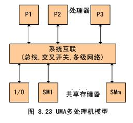
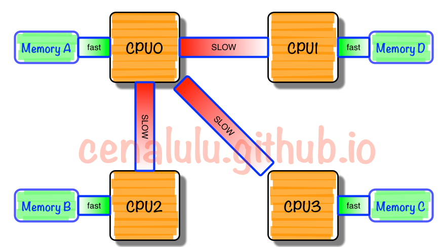
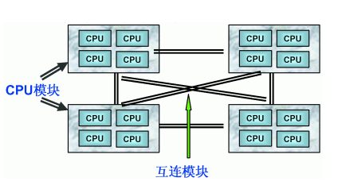
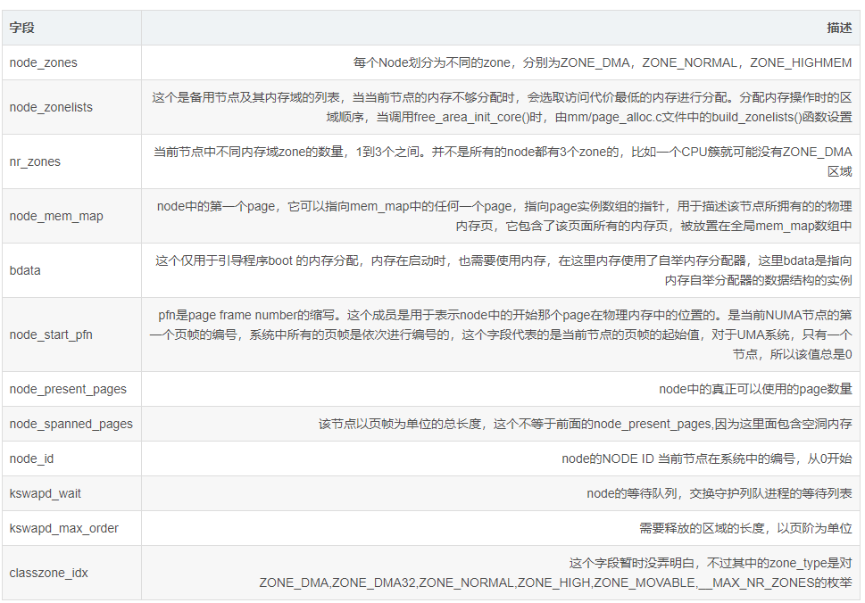
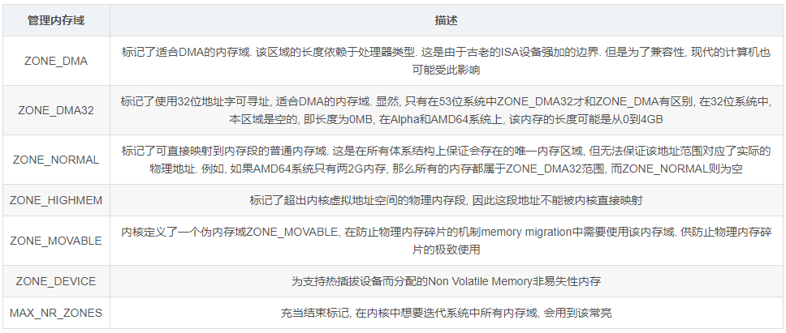
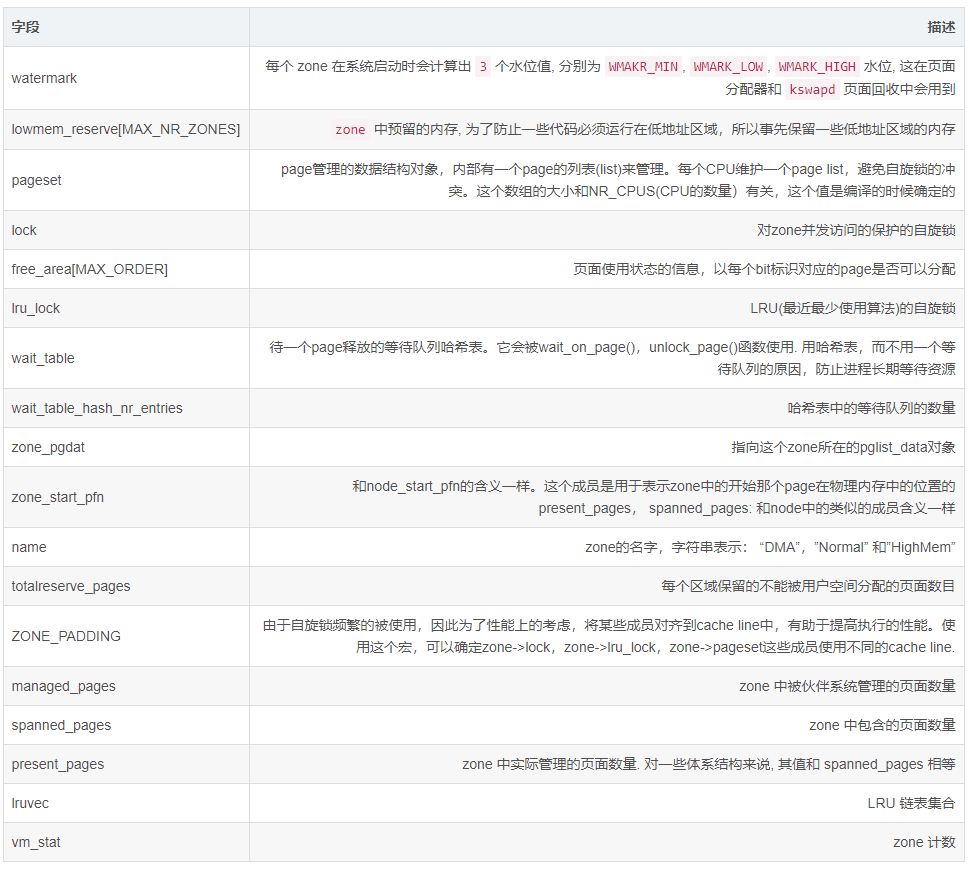

# 1. 服务器体系(SMP, NUMA, MPP)与共享存储器架构(UMA和NUMA)

## 1.1 架构概述
从系统架构来看，目前的商用服务器大体可以分为三类
* **对称多处理器结构**(SMP：Symmetric Multi-Processor)
* **非一致存储访问结构**(NUMA：Non-Uniform Memory Access)
* **海量并行处理结构**(MPP：Massive Parallel Processing)。


共享存储型多处理机有两种模型
* **均匀存储器存取**（Uniform-Memory-Access，简称UMA）模型
* **非均匀存储器存取**（Nonuniform-Memory-Access，简称NUMA）模型

而我们后面所提到的COMA和ccNUMA都是NUMA结构的改进

## 1.2 SMP(Symmetric Multi-Processor)
所谓对称多处理器结构，是指服务器中多个CPU对称工作，无主次或从属关系。

各CPU共享相同的物理内存，每个 CPU访问内存中的任何地址所需时间是相同的，因此SMP也被称为**一致存储器访问结构(UMA：Uniform Memory Access)**

对SMP服务器进行扩展的方式包括增加内存、使用更快的CPU、增加CPU、扩充I/O(槽口数与总线数)以及添加更多的外部设备(通常是磁盘存储)。

SMP服务器的主要特征是共享，系统中所有资源(CPU、内存、I/O等)都是共享的。也正是由于这种特征，导致了SMP服务器的主要问题，那就是它的扩展能力非常有限。

对于SMP服务器而言，每一个共享的环节都可能造成SMP服务器扩展时的瓶颈，而最受限制的则是内存。由于每个CPU必须通过相同的内存总线访问相同的内存资源，因此随着CPU数量的增加，内存访问冲突将迅速增加，最终会造成CPU资源的浪费，使CPU性能的有效性大大降低。实验证明，SMP服务器CPU利用率最好的情况是2至4个CPU



图中，物理存储器被所有处理机均匀共享。所有处理机对所有存储字具有相同的存取时间，这就是为什么称它为均匀存储器存取的原因。每台处理机可以有私用高速缓存,外围设备也以一定形式共享

## 1.3 NUMA(Non-Uniform Memory Access)
由于SMP在扩展能力上的限制，人们开始探究如何进行有效地扩展从而构建大型系统的技术，NUMA就是这种努力下的结果之一

利用NUMA技术，可以把几十个CPU(甚至上百个CPU)组合在一个服务器内.



NUMA多处理机模型如图所示，其访问时间随存储字的位置不同而变化。其共享存储器物理上是分布在所有处理机的本地存储器上。所有本地存储器的集合组成了全局地址空间，可被所有的处理机访问。处理机访问本地存储器是比较快的，但访问属于另一台处理机的远程存储器则比较慢，因为通过互连网络会产生附加时延。

NUMA服务器的基本特征是具有多个CPU模块，每个CPU模块由多个CPU(如4个)组成，并且具有独立的本地内存、I/O槽口等。



由于其节点之间可以通过互联模块(如称为Crossbar Switch)进行连接和信息交互，因此每个CPU可以访问整个系统的内存(这是NUMA系统与MPP系统的重要差别)。显然，访问本地内存的速度将远远高于访问远地内存(系统内其它节点的内存)的速度，这也是非一致存储访问NUMA的由来。

由于这个特点，为了更好地发挥系统性能，开发应用程序时需要尽量减少不同CPU模块之间的信息交互。利用NUMA技术，可以较好地解决原来SMP系统的扩展问题，在一个物理服务器内可以支持上百个CPU。比较典型的NUMA服务器的例子包括HP的Superdome、SUN15K、IBMp690等。

但NUMA技术同样有一定缺陷，由于访问远地内存的延时远远超过本地内存，因此当CPU数量增加时，系统性能无法线性增加。如HP公司发布Superdome服务器时，曾公布了它与HP其它UNIX服务器的相对性能值，结果发现，64路CPU的Superdome (NUMA结构)的相对性能值是20，而8路N4000(共享的SMP结构)的相对性能值是6.3. 从这个结果可以看到，8倍数量的CPU换来的只是3倍性能的提升.

## 1.4  MPP(Massive Parallel Processing)
和NUMA不同，MPP提供了另外一种进行系统扩展的方式，它由多个SMP服务器通过一定的节点互联网络进行连接，协同工作，完成相同的任务，从用户的角度来看是一个服务器系统。其基本特征是由多个SMP服务器(每个SMP服务器称节点)通过节点互联网络连接而成，每个节点只访问自己的本地资源(内存、存储等)，是一种完全无共享(Share Nothing)结构，因而扩展能力最好，理论上其扩展无限制，目前的技术可实现512个节点互联，数千个CPU。目前业界对节点互联网络暂无标准，如 NCR的Bynet，IBM的SPSwitch，它们都采用了不同的内部实现机制。但节点互联网仅供MPP服务器内部使用，对用户而言是透明的。

在MPP系统中，每个SMP节点也可以运行自己的操作系统、数据库等。但和NUMA不同的是，它不存在异地内存访问的问题。换言之，每个节点内的CPU不能访问另一个节点的内存。节点之间的信息交互是通过节点互联网络实现的，这个过程一般称为数据重分配(Data Redistribution)。

但是MPP服务器需要一种复杂的机制来调度和平衡各个节点的负载和并行处理过程。目前一些基于MPP技术的服务器往往通过系统级软件(如数据库)来屏蔽这种复杂性。举例来说，NCR的Teradata就是基于MPP技术的一个关系数据库软件，基于此数据库来开发应用时，不管后台服务器由多少个节点组成，开发人员所面对的都是同一个数据库系统，而不需要考虑如何调度其中某几个节点的负载。

# 2 三种体系架构之间的差异

## 2.1 NUMA、MPP、SMP之间性能的区别

NUMA的节点互联机制是在同一个物理服务器内部实现的，当某个CPU需要进行远地内存访问时，它必须等待，这也是NUMA服务器无法实现CPU增加时性能线性扩展。

MPP的节点互联机制是在不同的SMP服务器外部通过I/O实现的，每个节点只访问本地内存和存储，节点之间的信息交互与节点本身的处理是并行进行的。因此MPP在增加节点时性能基本上可以实现线性扩展。

SMP所有的CPU资源是共享的，因此完全实现线性扩展。

## 2.2 NUMA、MPP、SMP之间扩展的区别

NUMA理论上可以无限扩展，目前技术比较成熟的能够支持上百个CPU进行扩展。如HP的SUPERDOME。
MPP理论上也可以实现无限扩展，目前技术比较成熟的能够支持512个节点，数千个CPU进行扩展。
SMP扩展能力很差，目前2个到4个CPU的利用率最好，但是IBM的BOOK技术，能够将CPU扩展到8个。
MPP是由多个SMP构成，多个SMP服务器通过一定的节点互联网络进行连接，协同工作，完成相同的任务。

## 2.3 MPP和SMP、NUMA应用之间的区别
**MPP的优势**

MPP系统不共享资源，因此对它而言，资源比SMP要多，当需要处理的事务达到一定规模时，MPP的效率要比SMP好。由于MPP系统因为要在不同处理单元之间传送信息，在通讯时间少的时候，那MPP系统可以充分发挥资源的优势，达到高效率。也就是说：操作相互之间没有什么关系，处理单元之间需要进行的通信比较少，那采用MPP系统就要好。因此，MPP系统在决策支持和数据挖掘方面显示了优势。

**SMP的优势**

MPP系统因为要在不同处理单元之间传送信息，所以它的效率要比SMP要差一点。在通讯时间多的时候，那MPP系统可以充分发挥资源的优势。因此当前使用的OTLP程序中，用户访问一个中心数据库，如果采用SMP系统结构，它的效率要比采用MPP结构要快得多。

**NUMA架构的优势**

NUMA架构来看，它可以在一个物理服务器内集成许多CPU，使系统具有较高的事务处理能力，由于远地内存访问时延远长于本地内存访问，因此需要尽量减少不同CPU模块之间的数据交互。显然，NUMA架构更适用于OLTP事务处理环境，当用于数据仓库环境时，由于大量复杂的数据处理必然导致大量的数据交互，将使CPU的利用率大大降低。


# 3. (N)UMA模型中linux内存的结构
非一致存储器访问(NUMA)模式下

* 处理器被划分成多个”节点”(node), 每个节点被分配有的本地存储器空间. 所有节点中的处理器都可以访问全部的系统物理存储器，但是访问本节点内的存储器所需要的时间，比访问某些远程节点内的存储器所花的时间要少得多

* 内存被分割成多个区域（BANK，也叫”簇”），依据簇与处理器的”距离”不同, 访问不同簇的代码也会不同. 比如，可能把内存的一个簇指派给每个处理器，或则某个簇和设备卡很近，很适合DMA，那么就指派给该设备。因此当前的多数系统会把内存系统分割成2块区域，一块是专门给CPU去访问，一块是给外围设备板卡的DMA去访问
  
Linux把物理内存划分为三个层次来管理


## 3.1  内存节点node

### 3.1.1 为什么要用node来描述内存
这点前面是说的很明白了, NUMA结构下, 每个处理器CPU与一个本地内存直接相连, 而不同处理器之前则通过总线进行进一步的连接, 因此相对于任何一个CPU访问本地内存的速度比访问远程内存的速度要快

Linux适用于各种不同的体系结构, 而不同体系结构在内存管理方面的差别很大. 因此linux内核需要用一种体系结构无关的方式来表示内存.

因此linux内核把物理内存按照CPU节点划分为不同的node, 每个node作为某个cpu结点的本地内存, 而作为其他CPU节点的远程内存, 而UMA结构下, 则任务系统中只存在一个内存node, 这样对于UMA结构来说, 内核把内存当成只有一个内存node节点的伪NUMA

### 3.1.2 内存结点的概念
内存被划分为结点. 每个节点关联到系统中的一个处理器, 内核中表示为pg_data_t的实例. 系统中每个节点被链接到一个以NULL结尾的pgdat_list链表中<而其中的每个节点利用pg_data_tnode_next字段链接到下一节．而对于PC这种UMA结构的机器来说, 只使用了一个成为contig_page_data的静态pg_data_t结构.

内存中的每个节点都是由pg_data_t描述,而pg_data_t由struct pglist_data定义而来, 该数据结构定义在include/linux/mmzone.h, line 615

在分配一个页面时, Linux采用节点局部分配的策略, 从最靠近运行中的CPU的节点分配内存, 由于进程往往是在同一个CPU上运行, 因此从当前节点得到的内存很可能被用到




## 3.2 内存管理域zone
为了支持NUMA模型，也即CPU对不同内存单元的访问时间可能不同，此时系统的物理内存被划分为几个节点(node), 一个node对应一个内存簇bank，即每个内存簇被认为是一个节点

* 首先, 内存被划分为结点. 每个节点关联到系统中的一个处理器, 内核中表示为pg_data_t的实例. 系统中每个节点被链接到一个以NULL结尾的pgdat_list链表中<而其中的每个节点利用pg_data_tnode_next字段链接到下一节．而对于PC这种UMA结构的机器来说, 只使用了一个成为contig_page_data的静态pg_data_t结构.

* 接着各个节点又被划分为内存管理区域, 一个管理区域通过struct zone_struct描述, 其被定义为zone_t, 用以表示内存的某个范围, 低端范围的16MB被描述为ZONE_DMA, 某些工业标准体系结构中的(ISA)设备需要用到它, 然后是可直接映射到内核的普通内存域ZONE_NORMAL,最后是超出了内核段的物理地址域ZONE_HIGHMEM, 被称为高端内存.　是系统中预留的可用内存空间, 不能被内核直接映射.

### 3.2.1 为什么要将内存node分成不同的区域zone
NUMA结构下, 每个处理器CPU与一个本地内存直接相连, 而不同处理器之前则通过总线进行进一步的连接, 因此相对于任何一个CPU访问本地内存的速度比访问远程内存的速度要快, 而Linux为了兼容NUMAJ结构, 把物理内存相依照CPU的不同node分成簇, 一个CPU-node对应一个本地内存`pgdata_t`.

这样已经很好的表示物理内存了, 在一个理想的计算机系统中, 一个页框就是一个内存的分配单元, 可用于任何事情:存放内核数据, 用户数据和缓冲磁盘数据等等. 任何种类的数据页都可以存放在任页框中, 没有任何限制.

**但是Linux内核又把各个物理内存节点分成个不同的管理区域zone, 这是为什么呢?**

因为实际的计算机体系结构有硬件的诸多限制, 这限制了页框可以使用的方式. 尤其是, Linux内核必须处理80x86体系结构的两种硬件约束.

* ISA总线的直接内存存储DMA处理器有一个严格的限制 : 他们只能对RAM的前16MB进行寻址
* 在具有大容量RAM的现代32位计算机中, CPU不能直接访问所有的物理地址, 因为线性地址空间太小, 内核不可能直接映射所有物理内存到线性地址空间, 我们会在后面典型架构(x86)上内存区域划分详细讲解x86_32上的内存区域划分

因此Linux内核对不同区域的内存需要采用不同的管理方式和映射方式, 因此内核将物理地址或者成用`zone_t`表示的不同地址区域

### 3.2.2 内存管理区类型zone_type
前面我们说了由于硬件的一些约束, 低端的一些地址被用于DMA, 而在实际内存大小超过了内核所能使用的现行地址的时候, 一些高地址处的物理地址不能简单持久的直接映射到内核空间. 因此内核将内存的节点node分成了不同的内存区域方便管理和映射.

Linux使用`enum zone_type`来标记内核所支持的所有内存区域

`zone_type`结构定义在 `linux-5.3.1/include/linux/mmzone.h` , 其基本信息如下所示
```c++
enum zone_type
{
#ifdef CONFIG_ZONE_DMA
    ZONE_DMA,
#endif

#ifdef CONFIG_ZONE_DMA32

    ZONE_DMA32,
#endif

    ZONE_NORMAL,

#ifdef CONFIG_HIGHMEM
    ZONE_HIGHMEM,
#endif
    ZONE_MOVABLE,
#ifdef CONFIG_ZONE_DEVICE
    ZONE_DEVICE,
#endif
    __MAX_NR_ZONES

};
```
不同的管理区的用途是不一样的，ZONE_DMA类型的内存区域在物理内存的低端，主要是ISA设备只能用低端的地址做DMA操作。ZONE_NORMAL类型的内存区域直接被内核映射到线性地址空间上面的区域（line address space），ZONE_HIGHMEM将保留给系统使用，是系统中预留的可用内存空间，不能被内核直接映射。
————————————————


### 3.2.3 不同的内存区域的作用
在内存中，每个簇所对应的node又被分成的称为管理区(zone)的块，它们各自描述在内存中的范围。一个管理区(zone)由`struct zone`结构体来描述，在linux-2.4.37之前的内核中是用typedef struct zone_struct zone_t数据结构来描述）

管理区的类型用`zone_type`表示, 有如下几种




### 3.2.4 struct zone管理域数据结构
一个管理区(zone)由`struct zone`结构体来描述(linux-3.8~目前linux4.5)，而在linux-2.4.37之前的内核中是用`struct zone_struct`数据结构来描述), 他们都通过typedef被重定义为`zone_t`类型

struct zone在linux/mmzone.h中定义, 在linux-4.7的内核中可以使用include/linux/mmzone.h来查看其定义
```c++
struct zone {
	/* Read-mostly fields */

	/* zone watermarks, access with *_wmark_pages(zone) macros */
	unsigned long _watermark[NR_WMARK];
	unsigned long watermark_boost;

	unsigned long nr_reserved_highatomic;

	/*
	 * We don't know if the memory that we're going to allocate will be
	 * freeable or/and it will be released eventually, so to avoid totally
	 * wasting several GB of ram we must reserve some of the lower zone
	 * memory (otherwise we risk to run OOM on the lower zones despite
	 * there being tons of freeable ram on the higher zones).  This array is
	 * recalculated at runtime if the sysctl_lowmem_reserve_ratio sysctl
	 * changes.
	 */
	long lowmem_reserve[MAX_NR_ZONES];

#ifdef CONFIG_NUMA
	int node;
#endif
	struct pglist_data	*zone_pgdat;
	struct per_cpu_pageset __percpu *pageset;

#ifndef CONFIG_SPARSEMEM
	/*
	 * Flags for a pageblock_nr_pages block. See pageblock-flags.h.
	 * In SPARSEMEM, this map is stored in struct mem_section
	 */
	unsigned long		*pageblock_flags;
#endif /* CONFIG_SPARSEMEM */

	/* zone_start_pfn == zone_start_paddr >> PAGE_SHIFT */
	unsigned long		zone_start_pfn;

	/*
	 * spanned_pages is the total pages spanned by the zone, including
	 * holes, which is calculated as:
	 * 	spanned_pages = zone_end_pfn - zone_start_pfn;
	 *
	 * present_pages is physical pages existing within the zone, which
	 * is calculated as:
	 *	present_pages = spanned_pages - absent_pages(pages in holes);
	 *
	 * managed_pages is present pages managed by the buddy system, which
	 * is calculated as (reserved_pages includes pages allocated by the
	 * bootmem allocator):
	 *	managed_pages = present_pages - reserved_pages;
	 *
	 * So present_pages may be used by memory hotplug or memory power
	 * management logic to figure out unmanaged pages by checking
	 * (present_pages - managed_pages). And managed_pages should be used
	 * by page allocator and vm scanner to calculate all kinds of watermarks
	 * and thresholds.
	 *
	 * Locking rules:
	 *
	 * zone_start_pfn and spanned_pages are protected by span_seqlock.
	 * It is a seqlock because it has to be read outside of zone->lock,
	 * and it is done in the main allocator path.  But, it is written
	 * quite infrequently.
	 *
	 * The span_seq lock is declared along with zone->lock because it is
	 * frequently read in proximity to zone->lock.  It's good to
	 * give them a chance of being in the same cacheline.
	 *
	 * Write access to present_pages at runtime should be protected by
	 * mem_hotplug_begin/end(). Any reader who can't tolerant drift of
	 * present_pages should get_online_mems() to get a stable value.
	 */
	atomic_long_t		managed_pages;
	unsigned long		spanned_pages;
	unsigned long		present_pages;

	const char		*name;

#ifdef CONFIG_MEMORY_ISOLATION
	/*
	 * Number of isolated pageblock. It is used to solve incorrect
	 * freepage counting problem due to racy retrieving migratetype
	 * of pageblock. Protected by zone->lock.
	 */
	unsigned long		nr_isolate_pageblock;
#endif

#ifdef CONFIG_MEMORY_HOTPLUG
	/* see spanned/present_pages for more description */
	seqlock_t		span_seqlock;
#endif

	int initialized;

	/* Write-intensive fields used from the page allocator */
	ZONE_PADDING(_pad1_)

	/* free areas of different sizes */
	struct free_area	free_area[MAX_ORDER];

	/* zone flags, see below */
	unsigned long		flags;

	/* Primarily protects free_area */
	spinlock_t		lock;

	/* Write-intensive fields used by compaction and vmstats. */
	ZONE_PADDING(_pad2_)

	/*
	 * When free pages are below this point, additional steps are taken
	 * when reading the number of free pages to avoid per-cpu counter
	 * drift allowing watermarks to be breached
	 */
	unsigned long percpu_drift_mark;

#if defined CONFIG_COMPACTION || defined CONFIG_CMA
	/* pfn where compaction free scanner should start */
	unsigned long		compact_cached_free_pfn;
	/* pfn where async and sync compaction migration scanner should start */
	unsigned long		compact_cached_migrate_pfn[2];
	unsigned long		compact_init_migrate_pfn;
	unsigned long		compact_init_free_pfn;
#endif

#ifdef CONFIG_COMPACTION
	/*
	 * On compaction failure, 1<<compact_defer_shift compactions
	 * are skipped before trying again. The number attempted since
	 * last failure is tracked with compact_considered.
	 */
	unsigned int		compact_considered;
	unsigned int		compact_defer_shift;
	int			compact_order_failed;
#endif

#if defined CONFIG_COMPACTION || defined CONFIG_CMA
	/* Set to true when the PG_migrate_skip bits should be cleared */
	bool			compact_blockskip_flush;
#endif

	bool			contiguous;

	ZONE_PADDING(_pad3_)
	/* Zone statistics */
	atomic_long_t		vm_stat[NR_VM_ZONE_STAT_ITEMS];
	atomic_long_t		vm_numa_stat[NR_VM_NUMA_STAT_ITEMS];
} ____cacheline_internodealigned_in_smp;
```



