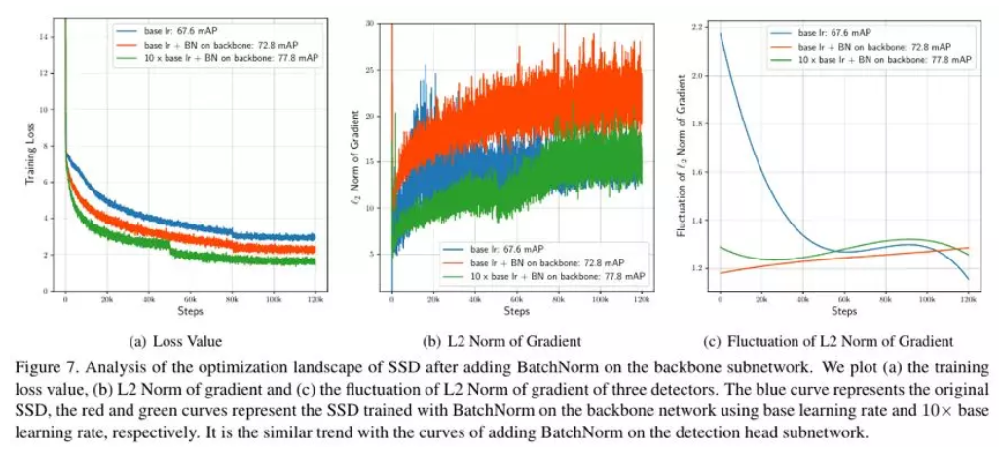
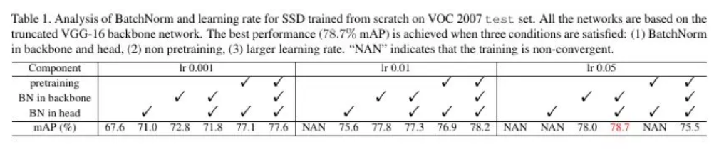
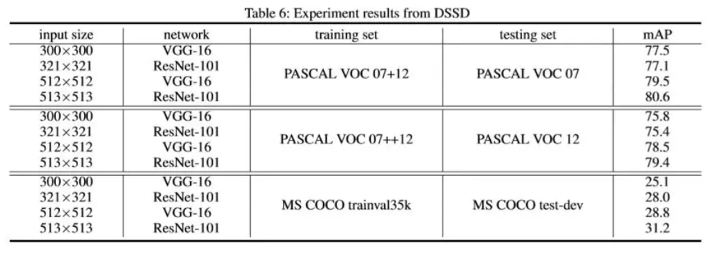
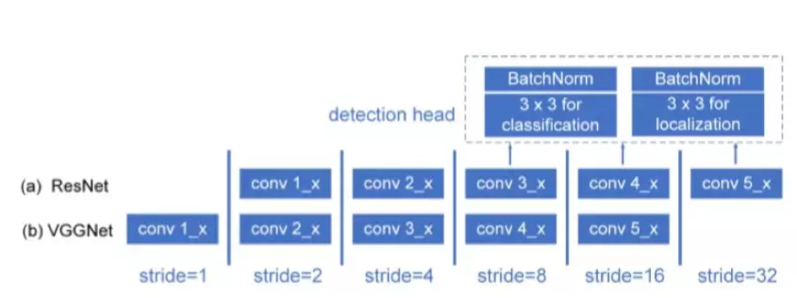
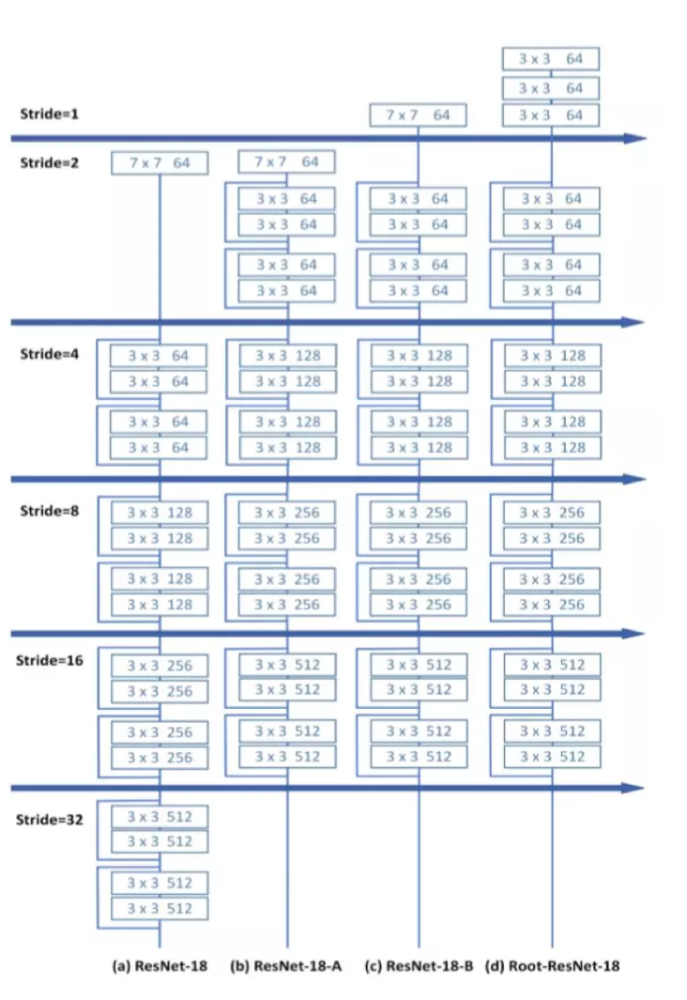
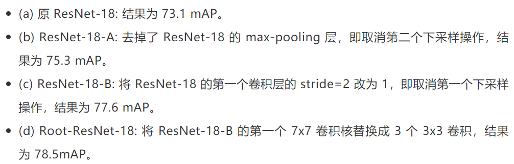
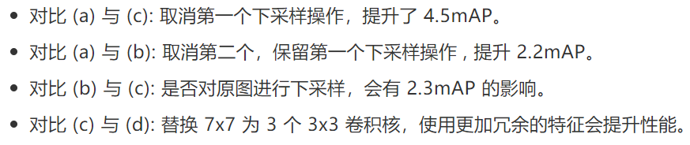
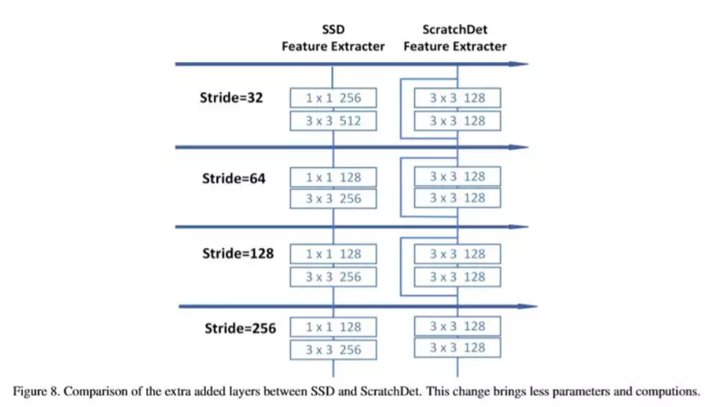
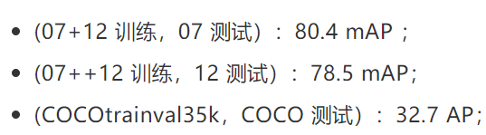

## CVPR 2019 | 京东AI研究院提出 ScratchDet：随机初始化训练SSD目标检测器

> 不久之前，CVPR 2019 接收论文公布：在超过 5100 篇投稿中，共有 1300 篇被接收，接收率达 25.2%。本文介绍了京东AI研究院被接受的一篇 Oral 论文，作者从优化的角度出发，通过 **实验解释了梯度稳定手段之一的 BatchNorm 是如何帮助随机初始化训练一阶段检测器 SSD**，**进而结合了 ResNet 与 VGGNet 来加强对小物体的检测**。值得一提的是，本文第一作者朱睿还是一位大四学生，就读于中山大学数据科学与计算机学院，现于京东 AI 研究院视觉与多媒体实验室实习。

使用 ImageNet 预训练的网络模型能够帮助目标任务（物体检测、语义分割、细粒度识别等）快速收敛，然而使用预训练模型会带来诸多限制，其中一个问题就是 **改动特征提取网络的结构成本相对较高，需要耗时巨大的重新预训练来适应不同需求的任务**。那么，如果**不使用预训练模型**，**进行随机初始化训练**，达到较高准确率的某些必要条件是什么？

本文介绍了我们今年的 CVPR Oral 工作《ScratchDet: Exploring to Train Single-Shot Object Detectors from Scratch》，作者从优化的角度出发，通过实验解释了梯度稳定手段之一的 BatchNorm 是如何帮助随机初始化训练一阶段检测器 SSD，进而结合了 ResNet 与 VGGNet 来加强对小物体的检测。

文章的代码后续会公布到 https://github.com/KimSoybean/ScratchDet，并且 contribute 到 mmdetection 中。

论文地址：https://arxiv.org/abs/1810.08425v3

### 动机
现有的检测训练任务存在**三个限制**：
* 分类任务与检测任务的 Learning bias: 一方面是两者损失函数的不同，一方面是两者对平移不变性的敏感度不同，还有另外一方面是数据集的差异：ImageNet 数据集是单图单物体，COCO & PASCAL VOC 数据集是单图多物体。
* 如果想要改动检测模型中的特征提取网络的结构，需要对网络重新预训练再进行检测任务的 finetune，而 ImageNet 预训练实验的代价比较大。这个问题在移动端、CPU 实时检测器等设计中尤为突出，比如：Pelee，Tiny-SSD，YOLO-LITE，Fire-SSD，Tiny-YOLO，Tiny-DSOD，MobileNetV2 等等。常用的 VGG-16、ResNet 的计算量以及参数量对于移动端的负载较大，而设计小网络的每次修改都需要重新在 ImageNet 上重新预训练，时间代价与计算资源消耗都比较大。再比如像 DetNet，想要设计一种专用于检测的网络，用在 ImageNet 预训练的实验就要花很多的时间。
* Domain Transfer 问题，比如从 ImageNet 自然与生活场景图像迁移到医疗图像中（X 光图，核磁共振图）的癌症检测（S4ND）、卫星图像检测（You Only Look Twice）是否有用，不同领域之间的迁移是否仍然能发挥作用?

### 分析
早期讨论随机初始化训练的工作 DSOD 将必要条件归结到一阶段检测器和 DenseNet 的 dense layer wise connection 上，但是这样做很大程度限制了网络结构的设计。我们想找到随机初始化训练检测器的某些本质的原因。受到 NeurIPS2018《How Does Batch Normalization Help Optimization?》这篇文章的启发，通过理论和实验说明 BN 在优化过程中发挥的作用：

* 梯度更加稳定，更加可预测
* 计算梯度时可采用更大的步长，即更大的学习率来加速训练
* 防止loss函数解空间突变，既不会掉入梯度消失的平坦区域，也不会掉入梯度爆炸的局部最小

沿着这个思路我们在 **SSD300 检测框架上给 VGG 网络与检测子网络分别加上了 BN 来进行随机初始化训练**（PASCAL VOC 07+12 训练，07 测试），调整学习率之后，得到的最好结果 78.7mAP，比直接随机初始化训练 SSD 的结果（67.6）高 11.6，比原 SSD300（77.2）高 1.5，比使用预训练模型 VGG-16-BN（78.2）高 0.6。实验细节在论文的实验部分有描述。

从左到右的 3 幅图分别是**训练 loss**，**梯度的 L2 Norm**，**梯度的波动程度**。通过这三幅图能够从优化角度分析，为什么 BN 能够帮助随机初始化训练检测器，蓝色曲线代表直接对 SSD 使用 0.001 的学习率做随机初始化训练，红色曲线在蓝色曲线的基础上在 VGG 网络上加了 BN，绿色曲线在红色曲线的基础上使用了 10 倍的学习率。从蓝色到红色，给特征提取网络添加了 BN 之后，梯度的波动程度大幅下降，梯度趋于稳定，优化空间更加平滑，训练 loss 下降，mAP 从 67.6 升高到 72.8。而从红色到绿色，平滑的优化空间允许使用更大的学习率，loss 进一步下降，mAP 也从 72.8 升高到 77.8。我们在检测子网络（detection head）也做了一样设置的实验，得出了相似的结论与梯度分析图，具体请参考论文。

我们在 SSD300 上做了尽可能详细的对比实验，包括在 3 个不同学习率（0.001, 0.01, 0.05）下给特征提取子网络（VGG）添加 BN，给检测子网络（detection head）添加 BN，给全部网络添加 BN，给全部网络不添加 BN，以上四者的随机初始化训练以及对比预训练 fine-tune 实验。可以看到，在为整个检测网络的不同部分添加 BN 之后会有不同程度的提升，而提升最高的是为整个网络添加 BN，在 VOC2007 测试集上（使用 VOC07+12 trainval 训练）可以达到 78.7mAP。

借着随机初始化训练带来的优势，可以对特征提取网络进行任意改动。之后我们借鉴了 VGGNet 和 ResNet 的优点，最大程度保留原图信息，来提升对小物体检测的性能（论文中输入图像大小是 300X300，小物体较多）。

### 分析 ResNet 和 VGGNet 的优缺点
在 SSD 的升级版论文 DSSD 中，我们将 SSD 的 **特征提取网络从 VGG-16 替换成了 ResNet-101**，所得实验结果汇总如下表：

ResNet-101 在 ImageNet 的 top-5 error 上比 VGG-16 低了 2.69%，但是在 SSD300-VOC 的结果却低于 VGG-16，为什么？跟 VGG-16 相比，ResNet-101 的优点是分类能力强，缺点是对小物体识别能力较差，因为第一个卷积层的 stride=2，在初始输入的图片上就进行下采样，会损失某些原图信息，尤其是小物体的信息。

1.  在 VOC_300 时，ResNet-101 的缺点＞优点，输入图片较小，图片中小物体数目变多，缺点被放大；且类别只有 20 类，不能发挥 ResNet 强大的分类能力，在 SSD 上结果低于 VGG-16。
2.  在 VOC_512 时，ResNet-101 的缺点<优点，输入图片变大，图片中小物体数目变少，缺点被缩小，在 SSD 上结果高于 VGG-16。
3.  在 COCO 上时，ResNet-101 的缺点<优点，任务类别有 80 类，是 VOC 的 4 倍，ResNet-101 能充分发挥分类能力，所以无论输入 300x300 或者 512x512，在 SSD 上结果均高于 VGG-16。

当然这里的结论需要进一步结合数据集本身的特性来验证，比如数据集规模 vs 模型参数量，数据集每张图片平均的 instance 数目，数据集小物体数量等等因素。

因此我们借鉴了 ResNet 与 VGGNet 的优点，首先把 ResNet 的第一个卷积层的 stride 从 2 改成 1，也就是取消第一个下采样操作，并且参照了 DSOD 的方法，替换第一个卷积层为 3 个 3x3 卷积层：这样做的目的是，尽可能保持原图信息不损失，并且充分利用。注意：在将新网络替换到 SSD 框架上时，仍然最大程度保证实验的公平性。首先，用于检测的特征图在论文中保持 38×38, 19×19, 10×10, 5×5, 3×3, 1×1 的大小，并没有使用大的特征图；其次，保证每个用于检测的特征图的 channel 数目相同。

分析：在 300x300 大小的输入图像上（小物体较多）：

之后，我们将 SSD 在特征提取网络后面添加的多个卷积层替换为残差模块，减少了参数量，并且提升了 FPS（SSD300-Root-Res34: 20FPS->25FPS，Tesla P40 测试）, 而且检测准确率没有下降（在 VOC07 上测试，80.4mAP)：

最后，我们使用了 Root-ResNet-34 来做随机初始化训练，得到较好的检测结果：

值得注意的是，在 COCO 测试集上 AP@S 13.0，对比其他相似输入大小的检测器，在小物体检测结果相对较好。

我们还对比了训练时间，使用 mmdetection 检测框架（使用了 repeat dataset 加速训练 trick），在输入为 300x300 的时候，随机初始化训练大约需要 84.6 小时，而使用预训练模型 fine-tune 需要 29.7 小时。但是相比起 ImageNet 数以百万计的图片数目与几周的训练时间来说，随机初始化训练检测器使用的时间相对更少的，可以被人们所接受。

### 小结
目前，在我们 JD AI Research 已经有几个小伙伴成功把随机初始化训练用在其他任务上，比如：

