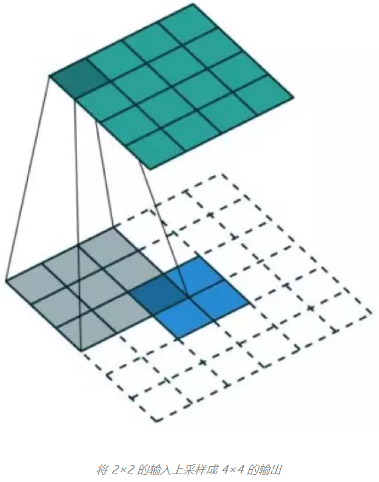

## 1. 卷积和互相关
在信号/图像处理领域，卷积的定义是：
$$ (f*g)(t) = \int^{\infty}_{-\infty}f(\tau)g(t-\tau)d\tau$$

其定义是两个函数中的一个函数经过反转和位移后再相乘得到的积的积分。下面可视化展示：

这里，函数g是过滤器，它被反转后再沿水平轴滑动。在每一个位置，我们都计算f和反转后的g之间的相交区域的面积，这个相交区域的面积就是特定位置算出的卷积值。

另一方面，互相关是两个函数之间的滑动点积或滑动内积。互相关中的过滤器不经过反转，而是直接滑过函数f。f与g之间的交叉区域即是互相关。下图展示了卷积与互相关之间的差异。

在深度学习中，卷积中的过滤器不经过反转，严格来说，这是 **互相关**。我们本质上是执行逐个元数乘法和加法。但在深度学习中，直接将其称之为卷积更加方便。这没什么问题，因为 **过滤器的权重是在训练阶段** 学习到的。如果上面例子中的反转函数g是正确的函数，那么经过训练后，学习到的过滤器看起来就会像是 **反转后的函数g**。因此，在训练之前，没必要像在真正的卷积中那样首先反转过滤器。

## 2. 3D卷积
3D卷积，其过滤器深度小于输入层深度(核大小 < 通道大小)。因此，3D卷积过滤器可以在所有三个方向(图像的高度、宽度、通道)上移动。在每个位置，逐元素的乘法和假发都会提供一个数值。因为过滤器是滑过一个 3D 空间，所以输出数值也按 3D 空间排布。也就是说输出是一个3D数据。

与 2D 卷积(编码了 2D 区域中目标的空间关系)类似，3D卷积可以描述 **3D空间中目标的空间关系**。对于某些应用(比如生物以学影像中的 3D分割/重构)而言，这样的 3D关系很重要，比如在 CT 和 MRI中，血管之类的目标会在 3D空间中 蜿蜒曲折。

## 3. 转置卷积(去卷积)
对于很多网络架构的很多应用而言，**我们往往需要进行与普通卷积方向相反的转换**，即我们希望 **执行上采样**。例子包括生成高分辨率图像以及将低维特征图映射到高位空间。比如在自动编码器或语义分割中，(在后者的例子中，语义分割会提取编码器中的特征图，然后在编码器中恢复原来的图像大小，使其可以分类原始图像中的每个像素。)

实现上采样的传统方法是应用 **插值方案或人工创建规则**。而神经网络等现代架构则倾向于让网络自己自动学习合适的变换，无需人类干预，为了做到这一点，我们使用 **转置卷积**.

转置卷积在文献中也被称为去卷积或 fractionally strided convolution. 但是, 需要指出[去卷积(deconvolution)]这个名称并不是很合适,因为转置卷积并非信号/图像处理邻域定义的那种真正的 **去卷积**. 从技术上讲,信号处理中的去卷积是卷积运算的 **逆运算**. 但这里却不是这种运算.

我们一直都可以使用直接的卷积实现 **转置卷积**.如下图,我们在一个 2x2 的输入(周围加了 2x2 的单位步长的零填充))上应用了一个 3x3 核的转置卷积.上采样输出的大小是 4x4.

通过应用各种填充和步长,我们可以将同样的 2x2 输入图像映射到不同的图像尺寸.下面,转置卷积被用在同一张 2x2 输入上(输入之间插入了一个零,并且周围加了 2x2 的单位步长的零填充),所得输出的大小是 5x5

在卷积中,我们定义 C 为卷积核, Large 为输入图像, Small 为输出图像,经过卷积(矩阵乘法)后,我们将大图像下采样为小图像.这种矩阵乘法的卷积实现遵照: C x Large = Small.

下面的例子展示了这种运算的工作方式,它将输入平展为 16 x 1 的矩阵,并将卷积核转换为一个稀疏矩阵(4 x 16). 然后,在稀疏矩阵和平展输入之间使用矩阵乘法.之后,再将所得到的矩阵(4x1)转换为 2x2 的输出.

现在,如果我们在等式的两边都 乘上矩阵的转置$C^T$,并借助 **一个矩阵与其转置矩阵的乘法得到一个单位矩阵** 这一性质,那么我们就能得到公式: $C^T x Small = Large$,如下图所示:

这里可以看到，我们执行了从小图像到大图像的上采样。这正是我们想要实现的目标。现在。你就知道「转置卷积」这个名字的由来了。

## 4. 扩张卷积(Atrous 卷积)
这是一个标准的离散卷积:
$$(F * k)(p) = \sum_{s+t=p}F(s)k(t)$$

扩张卷积如下:
$$(F*_lk)(p) = \sum_{s+lt=p}F(s)K(t)$$

当l = 1 时,扩张卷积会变得和标准卷积一样.

直观而言,扩张卷积就是通过在核元素之间插入空格来使核 **膨胀**.新增的参数 l 扩张率 表示我们希望将核价款的程度.具体实现可能各不相同,但通常是在核元素之间插入 l-1 个空格.下面展示了 l=1,2,4时的核的大小.

在这张图像中，3x3的红点表示经过卷积后，输出图像是3x3像素。尽管所有这三个扩张卷积的输出都是统一尺寸，但模型观察到的感受野有很大的不同。l=1时感受野为3x3,l=2时为7x7。l=3时，感受野的大小就增加到了15x15。有趣的是，与这些操作相关的参数的数量是相等的。我们 [观察]更大的感受野不会有额外的成本。因此，扩张卷积可用于廉价地增大输出单元的感受野，而不会增加其核大小，这在多个扩张卷积彼此堆叠时尤其有效。

## 5.可分卷积
某些神经网络架构使用了可分卷积，可分卷积有 **空间可分卷积** 和 **深度可分卷积**

### 5.1. 空间可分卷积

空间可分卷积操作的是图像的 2D 空间维度，即高和宽。从概念上看，空间可分卷积是将一个卷积分解为两个单独的运算。对于下面的示例， 3x3 的Sobel核被分成了一个 3x1核 和一个 1x3核。

在卷积中，3x3核直接与图像卷积。在空间可分卷积中，3x1核首先与图像卷积，然后再应用 1x3核。这样，执行同样的操作仅需要6参数，而不是9个。

此外，使用空间可分卷积所需的卷积乘法也更少。给一个具体的例子， 5x5图像与 3x3核的卷积(步幅=1,填充=0)要求在3个位置水平地扫描核(还有3个垂直的位置)，总共就9个位置，表示下图中的点。每个位置，会应用9次逐元素乘法。总共就是 9x9=81 次乘法。

另一方面，对于空间可分卷积，我们首先在 5x5的图像上应用一个 3x1的过滤器。我们可以在水平5个位置和垂直3个位置扫描这样的核。总共就是 5x3=15个位置，表示为下图中的点。在每个位置，会应用3次逐元素乘法，总共就是 15x3=45次乘法。现在得到了一个 3x5的矩阵，这个矩阵再与一个 1x3核卷积，即在水平3个位置核垂直3个位置扫描这个矩阵。对于这9个位置中的每一个，应用3次逐元素乘法，这一步需要 9x3=27次乘法。因此，总体而言，空间可分卷积需要 45+27=72次乘法，少于普通卷积。

我们稍微推广一下上面的例子，假设我们现在将卷积应用于一张 NxN的图像上，卷积核为 mxm,步幅为1，填充为0.传统卷积需要 (N-2)(N-2)xmxm次乘法，空间可分卷积需要 Nx(N-2)xm + (N-2)(N-2)xm = (2N-2)x(N-2)xm次乘法。空间可分卷积与标准卷积的计算成本比为：

$$
\frac{2}{m} + \frac{2}{m(N-2)}
$$

因为图像尺寸 N 远大于过滤器大小 (N>>m),所以这个比就变成了 2/m。也就是说，在这种渐进情况(N>>m)下，当过滤器大小为 3x3时，空间可分卷积的计算成本是标准卷积的 2/3. 过滤器大小为 5×5 时这一数值是 2/5；过滤器大小为 7×7 时则为 2/7。

尽管空间可分卷积能节省成本，**但深度学习却很少使用它。一大主要原因是并非所有的核都能分成两个更小的核。如果我们用空间可分卷积替代所有的传统卷积，那么我们就限制了自己在训练过程中搜索所有可能的核。这样得到的训练结果可能是次优的。**

### 5.2. 深度可分卷积
   
现在来看深度可分卷积，这在深度学习领域要常用得多（比如 MobileNet 和 Xception）。深度可分卷积包含两个步骤：深度卷积核 1×1 卷积。

在描述这些步骤之前，有必要回顾一下我们之前介绍的 **2D 卷积核** 1×1 卷积。首先快速回顾标准的 2D 卷积。举一个具体例子，假设输入层的大小是 7×7×3（高×宽×通道），而过滤器的大小是 3×3×3。经过与一个过滤器的 2D 卷积之后，输出层的大小是 5×5×1（仅有一个通道）。

**多通道卷积不同的通道上的卷积核的参数是不同的，而3D卷积则由于卷积核本身是3D的，所以这个由于“深度”造成的看似不同通道上用的就是同一个卷积，权重共享嘛。**

一般来说，两个神经网络层之间会应用多个过滤器。假设我们这里有 **128 个过滤器**。在应用了这 128 个 2D 卷积之后，我们有 128 个 5×5×1 的输出映射图（map）。然后我们将这些映射图堆叠成大小为 5×5×128 的单层。通过这种操作，我们可将输入层（7×7×3）转换成输出层（5×5×128）。空间维度（即高度和宽度）会变小，而深度会增大。

*现在使用深度可分卷积，看看我们如何实现同样的变换。*

首先，我们将深度卷积应用于输入层。但我们不使用 2D 卷积中大小为 3×3×3 的单个过滤器，而是分开使用 3 个核。每个过滤器的大小为 3×3×1。每个核与输入层的一个通道卷积（仅一个通道，而非所有通道！）。每个这样的卷积都能提供大小为 5x5x1的映射图。然后我们将这些映射堆叠在iqi，创建了一个 5x5x3的图像。经过这个操作之后，我们得到大小为 5x5x3的输出。现在我们可以降低空间维度了，但深度还是和 之前一样。

**深度可分卷积**——**第一步**：我们不使用 2D 卷积中大小为 3×3×3 的单个过滤器，而是分开使用 3 个核。每个过滤器的大小为 3×3×1。每个核与输入层的一个通道卷积（仅一个通道，而非所有通道！）。每个这样的卷积都能提供大小为 5×5×1 的映射图。然后我们将这些映射图堆叠在一起，创建一个 5×5×3 的图像。经过这个操作之后，我们得到大小为 5×5×3 的输出。

**在深度可分卷积的第二步**，为了扩展深度，我们应用一个核大小为 1×1×3 的 1×1 卷积。将 5×5×3 的输入图像与每个 1×1×3 的核卷积，可得到大小为 5×5×1 的映射图。

因此，在应用了 128 个 1×1 卷积之后，我们得到大小为 5×5×128 的层。

通过这两个步骤，深度可分卷积也会将输入层（7×7×3）变换到输出层（5×5×128）。

下图展示了深度可分卷积的整个过程

所以，深度可分卷积有何优势呢？效率！相比于 2D 卷积，深度可分卷积所需的操作要少得多。

回忆一下我们的 2D 卷积例子的计算成本。有 128 个 3×3×3 个核移动了 5×5 次，也就是 128 x 3 x 3 x 3 x 5 x 5 = 86400 次乘法。

可分卷积又如何呢？在第一个深度卷积步骤，有 3 个 3×3×1 核移动 5×5 次，也就是 3x3x3x1x5x5 = 675 次乘法。在 1×1 卷积的第二步，有 128 个 1×1×3 核移动 5×5 次，即 128 x 1 x 1 x 3 x 5 x 5 = 9600 次乘法。因此，深度可分卷积共有 675 + 9600 = 10275 次乘法。这样的成本大概仅有 2D 卷积的 12%！

所以，对于任意尺寸的图像，如果我们应用深度可分卷积，我们可以节省多少时间？让我们泛化以上例子。现在，对于大小为 H×W×D 的输入图像，如果使用 Nc 个大小为 h×h×D 的核执行 2D 卷积（步幅为 1，填充为 0，其中 h 是偶数）。为了将输入层（H×W×D）变换到输出层（(H-h+1)x (W-h+1) x Nc），所需的总乘法次数为：

$$
Nc * h * h * D * (H-h+1) * (W-h+1)
$$

另一方面，对于同样的变换，深度可分卷积所需的乘法次数为：

$$
D * h * h * 1 * (H-h+1) * (W-h+1) + \\
Nc * 1 * 1 * D * (H-h+1) x (W-h+1) = \\
 (h * h + Nc) * D * (H-h+1) * (W-h+1)
$$

则深度可分卷积与 2D 卷积所需的乘法次数比为：

$$
\frac{1}{N_c} + \frac{1}{h^2}
$$
现代大多数架构的输出层通常都有很多通道，可达数百甚至上千。对于这样的层（Nc >> h），则上式可约简为 1 / h²。基于此，如果使用 3×3 过滤器，则 2D 卷积所需的乘法次数是深度可分卷积的 9 倍。如果使用 5×5 过滤器，则 2D 卷积所需的乘法次数是深度可分卷积的 25 倍。

使用深度可分卷积有什么坏处吗？当然是有的。深度可分卷积会降低卷积中参数的数量。因此，对于较小的模型而言，如果用深度可分卷积替代 2D 卷积，模型的能力可能会显著下降。因此，得到的模型可能是次优的。但是，如果使用得当，深度可分卷积能在不降低你的模型性能的前提下帮助你实现效率提升。

## 6.分组卷积
AlexNet 论文在 2012 年引入了分组卷积。实现分组卷积的主要原因是**让网络训练可在 2 个内存有限（每个 GPU 有 1.5 GB 内存）的 GPU 上进行**。下面的 AlexNet 表明在大多数层中都有两个分开的卷积路径。这是在两个 GPU 上执行模型并行化（当然如果可以使用更多 GPU，还能执行多 GPU 并行化）。

这里我们介绍一下分组卷积的工作方式。首先，典型的 2D 卷积的步骤如下图所示。在这个例子中，通过应用 128 个大小为 3×3×3 的过滤器将输入层（7×7×3）变换到输出层（5×5×128）。推广而言，即通过应用 Dout 个大小为 h x w x Din 的核将输入层（Hin x Win x Din）变换到输出层（Hout x Wout x Dout）

在分组卷积中，过滤器会被分为不同的组。每一组都负责特定深度的典型 2D 卷积。下面的例子能让你更清楚地理解

上图展示了具有两个过滤器分组的分组卷积。在每个过滤器分组中，每个过滤器的深度仅有名义上的 2D 卷积的一半。它们的深度是 Din/2。每个过滤器分组包含 Dout/2 个过滤器。第一个过滤器分组（红色）与输入层的前一半（[:, :, 0:Din/2]）卷积，而第二个过滤器分组（橙色）与输入层的后一半（[:, :, Din/2:Din]）卷积。因此，每个过滤器分组都会创建 Dout/2 个通道。整体而言，两个分组会创建 2×Dout/2 = Dout 个通道。然后我们将这些通道堆叠在一起，得到有 Dout 个通道的输出层。

分组卷积有几个优点。

### 6.1 高效训练
第一个优点是高效训练。因为卷积被分成了多个路径，每个路径都可由不同的 GPU 分开处理，所以模型可以并行方式在多个 GPU 上进行训练。相比于在单个 GPU 上完成所有任务，这样的在多个 GPU 上的模型并行化能让网络在每个步骤处理更多图像。人们一般认为**模型并行化比数据并行化更好。后者是将数据集分成多个批次，然后分开训练每一批。但是，当批量大小变得过小时，我们本质上是执行随机梯度下降，而非批梯度下降。这会造成更慢，有时候更差的收敛结果。**

在训练非常深的神经网络时，分组卷积会非常重要，正如在 ResNeXt 中那样。

### 6.2 更高效
第二个优点是模型会更高效，即模型参数会随过滤器分组数的增大而减少。在之前的例子中，完整的标准 2D 卷积有 h x w x Din x Dout 个参数。具有 2 个过滤器分组的分组卷积有 (h x w x Din/2 x Dout/2) x 2 个参数。**参数数量减少了一半**。

### 6.3 可能提供比标准完整2D卷积更好的模型
第三个优点有些让人惊讶。分组卷积也许能提供比标准完整 2D 卷积更好的模型。
原因和稀疏过滤器的关系有关。下图是相邻层过滤器的相关性。其中的关系是稀疏的。

群卷积最早出现在alexnet中，作者认为group conv的方式能够**增加filter之间的对角相关性**，而且能够减少训练参数，不容易过拟合，类似于**正则效果**。

分组矩阵的相关性映射图又如何？

上图是当用 1、2、4、8、16 个过滤器分组训练模型时，相邻层的过滤器之间的相关性。那篇文章提出了一个推理：「**过滤器分组的效果是在通道维度上学习块对角结构的稀疏性**……在网络中，具有**高相关性的过滤器是使用过滤器分组以一种更为结构化的方式学习到**。从效果上看，不必学习的过滤器关系就不再参数化。这样显著地减少网络中的参数数量能使其不容易过拟合，因此，**一种类似正则化的效果让优化器可以学习得到更准确更高效的深度网络**。」

此外，每个过滤器分组都会学习数据的一个独特表征。正如 AlexNet 的作者指出的那样，过滤器分组似乎会将学习到的过滤器结构性地组织成两个不同的分组——黑白过滤器和彩色过滤器。