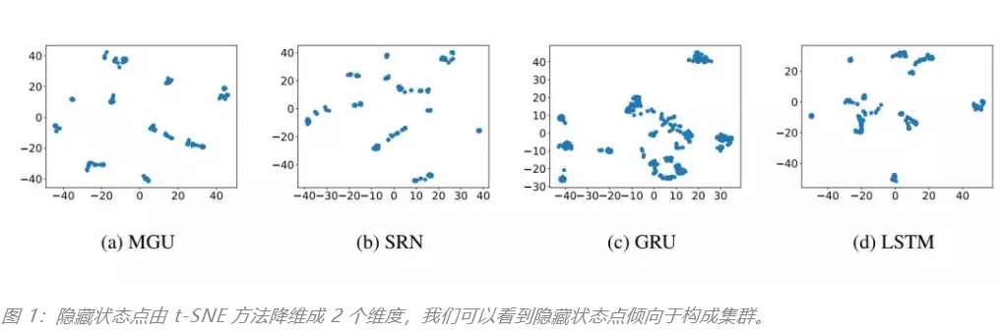
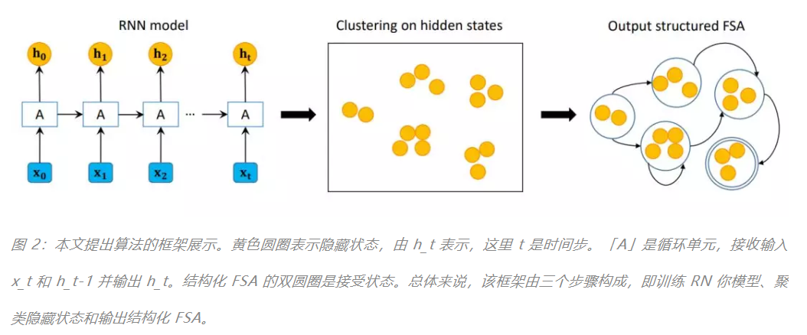
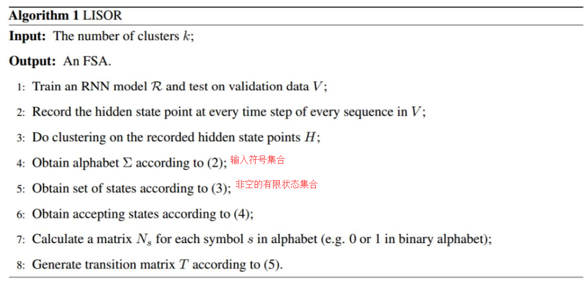
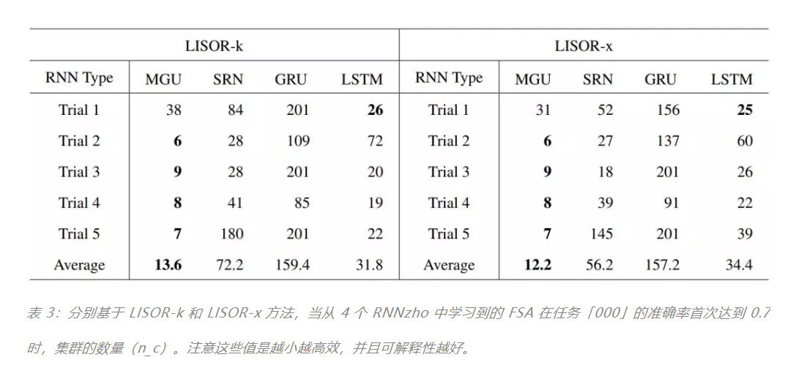
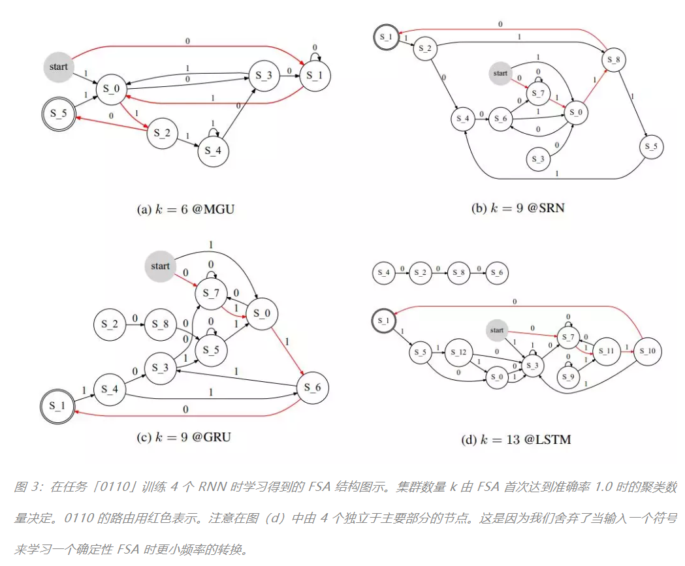
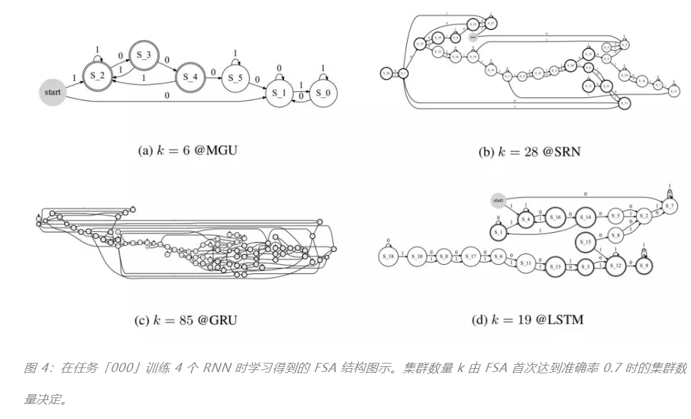
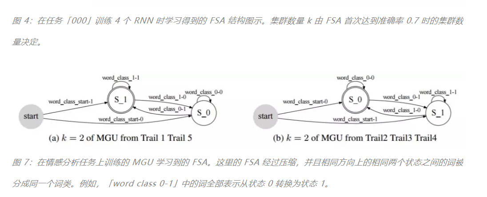

# 周志华等提出RNN可解释性方法，看看RNN内部都干了些什么

> 除了数值计算，你真的知道神经网络内部在做什么吗？我们一直理解深度模型都靠里面的运算流，但对于是不是具有物理意义、语义意义都还是懵懵懂懂。尤其是在循环神经网络中，我们只知道每一个时间步它都在利用以前的记忆抽取当前语义信息，但具体到怎么以及什么的时候，我们就无能为力了。在本文中，南京大学的周志华等研究者尝试利用有限状态机探索 RNN 的内在机制，这种具有物理意义的模型可以将 RNN 的内部流程展现出来，并帮助我们窥探 RNN 到底都干了些什么。

结构化学习（Structure learning）的主要任务是 **处理结构化的输出**，它 **不像分类问题那样为每个独立的样本预测一个值**。这里所说的结构可以是图、序列、树形结构和向量等。一般用于结构化输出的机器学习算法有各种概率图模型、感知机和 SVM 等。在过去的数十年里，结构化学习已经广泛应用于目标追踪、目标定位和语义解析等任务，而多标签学习和聚类等很多问题同样与结构化学习有很强的关联。

一般来说，结构化学习会使用 **结构化标注作为监督信息**，并借助相应的算法来预测这些结构化信息而实现优良的性能。然而，随着机器学习算法变得越来越复杂，它们的可解释性则变得越来越重要，这里的可解释性指的是如何理解学习过程的内在机制或内部流程。在这篇论文中，周志华等研究者重点关注深度学习模型，并探索如何学习这些模型的结构以提升模型可解释性。

探索深度学习模型的可解释性通常都比较困难，然而对于 RNN 等特定类型的深度学习模型，我们还是有方法解决的。循环神经网络（RNN）作为深度神经网络中的主要组成部分，它们在各种序列数据任务中有非常广泛的应用，特别是那些带有门控机制的变体，例如带有一个门控的 MGU、带有两个门控的 GRU 和三个门控的 LSTM。

除了我们熟悉的 RNN 以外，还有另一种工具也能捕捉序列数据，即 **有限状态机（Finite State Automaton/FSA）**。FSA 由有限状态和状态之间的转换组成，它将从一个状态转换为另一个状态以响应外部序列输入。FSA 的转换过程有点类似于 RNN，因为它们都是一个一个接收序列中的输入元素，并在相应的状态间传递。与 RNN 不同的是，FSA 的内部机制更容易被解释，因为我们更容易模拟它的过程。此外，FSA 在状态间的转换具有物理意义，而 RNN 只有数值计算的意义。

FSA 的这些特性令 **周志华团队探索从 RNN 中学习一个 FSA 模型，并利用 FSA 的天然可解释性能力来理解 RNN 的内部机制**，因此周志华等研究者采用 FSA 作为他们寻求的可解释结构。此外，这一项研究与之前关于结构化学习的探索不同。之前的方法主要关注结构化的预测或分类结果，这一篇文章 **主要关注中间隐藏层的输出结构**，这样才能更好地理解 RNN 的内在机制。

为了从 RNN 中学习 FSA，并使用 FSA 解释 RNN 的内在机制，我们需要知道如何学习 FSA 以及具体解释 RNN 中的什么。对于如何学习 FSA，研究者发现 **非门控的经典 RNN 隐藏状态倾向于构造一些集群**。但是仍然存在一些重要的未解决问题，

其中之一是我们不知道构造集群的倾向在门控 RNN 中是否也存在。我们同样需要考虑效率问题，因为门控 RNN 变体通常用于大型数据集中。对于具体解释 RNN 中的什么，研究者分析了门控机制在 LSTM、GRU 和 MGU 等模型中的作用，特别是不同门控 RNN 中门的数量及其影响。**鉴于 FSA 中状态之间的转换是有物理意义的，因此我们可以从与 RNN 对应的 FSA 转换推断出语义意义。**

在这篇论文中，周志华等研究者尝试从 RNN 学习 FSA，他们首先验证了除不带门控的经典 RNN 外，其它门控 RNN 变体的隐藏状态同样也具有天然的集群属性。然后他们提出了两种方法，其一是高效的聚类方法 k-means++。另外一种方法根据若相同序列中隐藏状态相近，在几何空间内也相近的现象而提出，这一方法被命名为 k-means-x。随后研究者通过设计五个必要的元素来学习 FSA，即字母表、一组状态、初始状态、一组接受状态和状态转换，他们最后将这些方法应用到了模拟数据和真实数据中。

对于人工模拟数据，研究者首先表示我们可以理解在运行过程学习到的 FSA。然后他们展示了准确率和集群数量之间的关系，并表示门控机制对于门控 RNN 是必要的，并且门越少越好。这在一定程度上解释了为什么只有一个门控的 MGU 在某种程度上优于其它门控 RNN。

对于情感分析这一真实数据，研究者发现在数值计算的背后，RNN 的隐藏状态确实具有区分语义差异性的能力。因为在对应的 FSA 中，导致正类/负类输出的词确实在做一些正面或负面的人类情感理解。

---

结构化学习中，输出通常是一个结构，可以作为监督信息用于获取良好的性能。考虑到深度学习可解释性在近年来受到了越来越多的关注，如果我们能重深度学习模型中学到可解释的结构，将是很有帮助的。在本文中，我们聚焦于循环神经网络（RNN），它的内部机制目前仍然是没有得到清晰的理解。我们发现处理序列数据的有限状态机（FSA）有更加可解释的内部机制，并且可以从 RNN 学习出来作为可解释结构。我们 **提出了两种不同的聚类方法来从 RNN 学习 FSA**。我们首先给出 FSA 的图形，以展示它的可解释性。从 FSA 的角度，我们分析了  **RNN 的性能如何受到门控数量的影响**，以及 **数值隐藏状态转换背后的语义含义**。我们的结果表明有简单门控结构的 RNN 例如最小门控单元（MGU）的表现更好，并且 FSA 中的转换可以得到和对应单词相关的特定分类结果，该过程对于人类而言是可理解的。

## 本文的方法

在这一部分，我们介绍提出方法的直觉来源和方法框架。我们将 RNN 的 **隐藏状态表示为一个向量或一个点**。因此当多个序列被输入到 RNN 时，**会积累大量的隐藏状态点**，**并且它们倾向于构成集群**。为了验证该结论，我们展示了在 MGU、SRU、GRU 和 LSTM 上的隐藏状态点的分布，如图 1（a）到（d）所示

展示了整个框架。我们首先在训练数据集上训练 RNN，然后再对应验证数据 V 的所有隐藏状态 H 上执行聚类，最后学习一个关于 V 的 FSA。再得到 FSA 后，我们可以使用它来测试未标记数据或直接画出图示。再训练 RNN 的第一步，我们利用了和 [ZWZZ16] 相同的策略，在这里忽略了细节。之后，我们会详细介绍隐藏状态聚类和 FSA 学习步骤（参见原文）。

完整的从 RNN 学习 FSA 的过程如算法 1 所示。我们将该方法称为 LISOR，**并展示了两种不同的聚类算法**。基于 k-means++的被称为「LISOR-k」，基于 k-means-x 的被称为「LISOR-x」。通过利用构成隐藏状态点的聚类倾向，LISOR-k 和 LISOR-x 都可以从 RNN 学习到良好泛化的 FSA。

## 实验结果
在这一部分，我们在人工和真实任务上进行了实验，并可视化了从对应 RNN 模型学习到的 FSA。除此之外，在两个任务中，我们讨论了我们如何从 **FSA 解释 RNN 模型**，以及展示使用学习到的 **FSA 来做分类的准确率**。

第一个人工任务是在一组长度为 4 的序列中（只包含 0 和 1）识别序列「0110」（任务「0110」）. 这是一个简单的只包含 16 个不同案例的任务。我们在训练集中包含了 1000 个实例，通过重复实例来提高准确率。我们使用包含所有可能值且没有重复的长度为 4 的 0-1 序列来学习 FSA，并随机生成 100 个实例来做测试。

第二个人工任务是确定一个序列是否包含三个连续的 0（任务「000」）。这里对于序列的长度没有限制，因此该任务有无限的实例空间，并且比任务「0110」更困难。我们随机生成 3000 个 0-1 训练实例，其长度是随机确定的。我们还生成了 500 个验证实例和 500 个测试实例。

如表 2 所示，我们可以看到在从 MGU 学习到的 FSA 的平均集群数量总是能以最小的集群数量达到准确率 1.0。集群数量为 65 意味着 FSA 的准确率在直到 n_c 为 64 时都无法达到 1.0。每次试验的最小集群数量和平均最小集群数量加粗表示。

如表 2 所示，我们可以看到在从 MGU 学习到的 FSA 的平均集群数量总是能以最小的集群数量达到准确率 1.0。集群数量为 65 意味着 FSA 的准确率在直到 n_c 为 64 时都无法达到 1.0。每次试验的最小集群数量和平均最小集群数量加粗表示。

