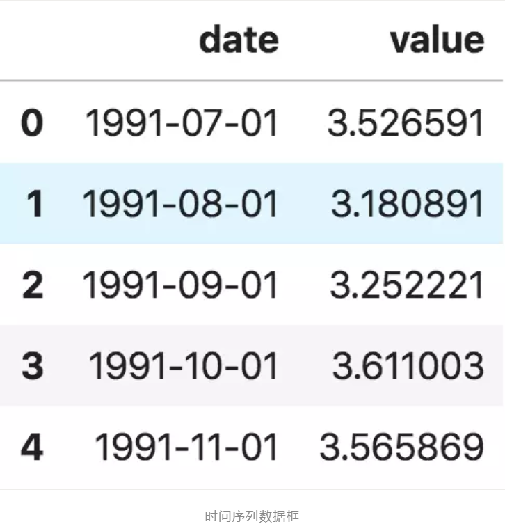
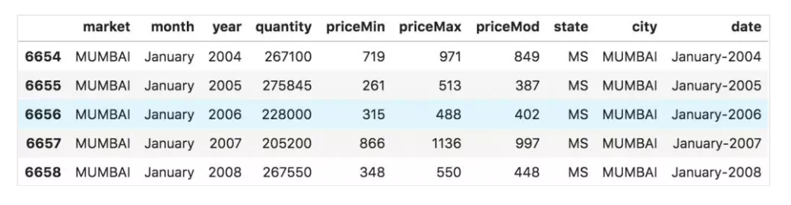

## 1. 什么是时间序列
https://mp.weixin.qq.com/s?__biz=MzU1NTUxNTM0Mg==&mid=2247491435&idx=2&sn=ed43b21a02314bb148ad350672c7df0a&chksm=fbd273cacca5fadc0633820ce5f268a65673e56b960e298359312741ffdcc908fe7e6031d42b&mpshare=1&scene=24&srcid=&key=00fc5a03f02a2a8aeb4bf4ae13c78c837c88792dd8610cfb9a27aaf5d088cc11af9394e9e49a586aa14f0f53f14e6ba36cd476d727e3af537601c038b3ea806ebfd9bd110b73d1ecf4c8586be5b70c5b&ascene=14&uin=MTM2MTEwNTY4NA%3D%3D&devicetype=Windows+10&version=62060833&lang=zh_CN&pass_ticket=P6x3%2BYeap7p7GazLAUVYeDbSAQOdghT1mGF9NXIzDp0WJE4F7cdG9vwBRfdL3D3u

**时间序列是指以固定时间为间隔的、由所观察的值组成的序列。** 根据观测值的不同频率，可将时间序列分成小时、天、星期、月份、季度和年等时间形式的序列。有时候，你也可以将秒钟和分钟作为时间序列的间隔，如每分钟的点击次数和访客数等等。

**为什么我们要对时间序列进行分析呢**？

因为当你想对一个序列进行预测时，首先要完成分析这个步骤。除此之外，时间序列的预测也具有极大商业价值，如企业的供求量、网站的访客量以及股票价格等，都是极其重要的时间序列数据。

那么，**时间序列分析都包括哪些内容呢**？

要做好时间序列分析，必须要理解序列的内在属性，这样才能做出更有意义且精准的预测。

## 2. 如何在 Python 中引入时间序列？

关于时间序列的数据大都存储在 csv 文件或其他形式的表格文件里，且都包含两个列：日期和观测值。

首先我们来看 panda 包里面的 read_csv() 函数，它可以将时间序列数据集（关于澳大利亚药物销售的 csv 文件）读取为 pandas 数据框。增加一个 parse_dates=['date'] 字段，可以把包含日期的数据列解析为日期字段。

```python
from dateutil.parser import parse 
import matplotlib as mpl
import matplotlib.pyplot as plt
import seaborn as sns
import numpy as np
import pandas as pd
plt.rcParams.update({'figure.figsize': (10, 7), 'figure.dpi': 120})

# Import as Dataframe
df = pd.read_csv('https://raw.githubusercontent.com/selva86/datasets/master/a10.csv', parse_dates=['date'])
df.head()
```



## 3、什么是面板数据？
面板数据同样是基于时间的数据集。

 

不同之处是，除了时间序列，面板数据还包括一个或多个相关变量，这些变量也是在同个时间段内测得的。

 

面板数据中的列包括有助于预测 y 值的解释变量，这些特征列可用于之后的预测。以下是关于面板数据的例子：




