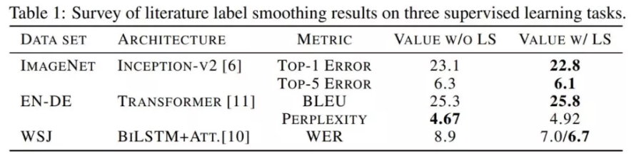
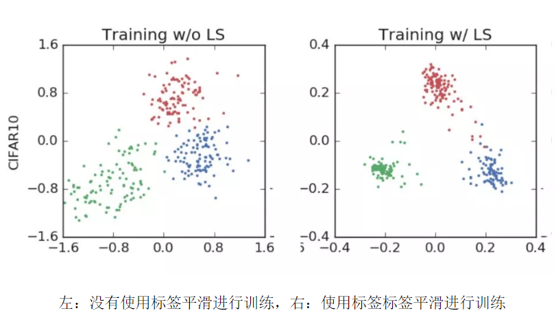
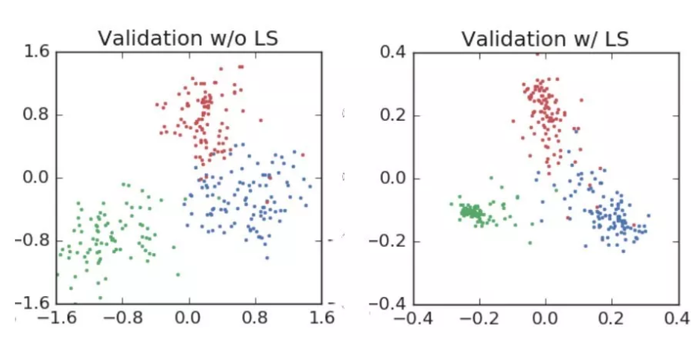
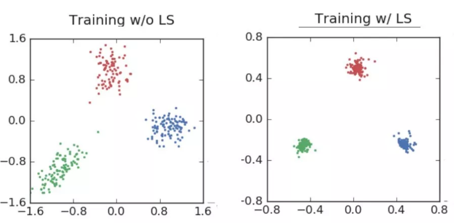
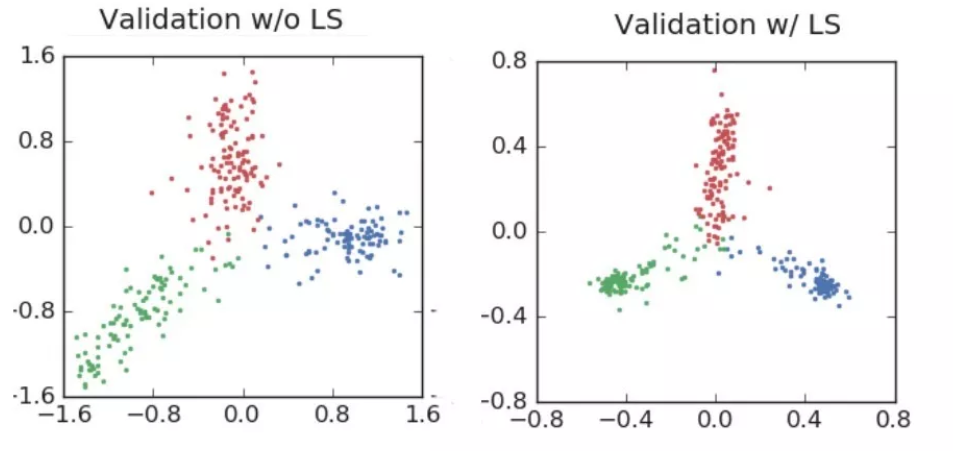
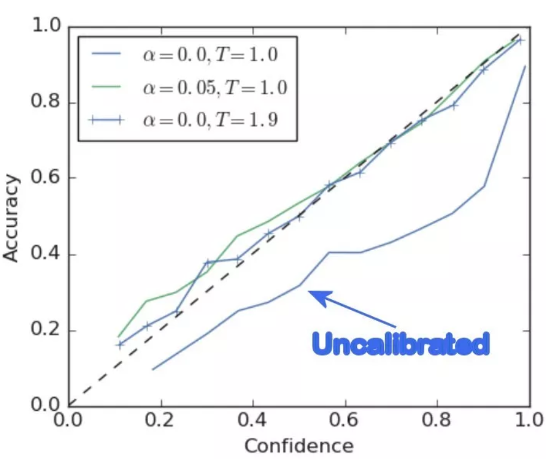
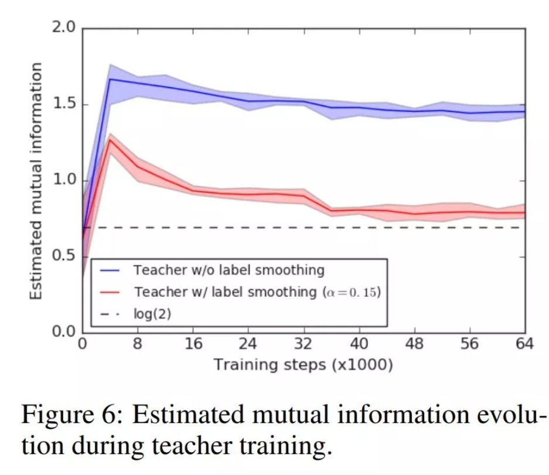

**标签平滑**
Google brain 给出了标签平滑的解释。
《when does label smoothing help?》

们建立了一种新的可视化方法来阐明标签平滑的内部效果，并对其内部工作原理提供了新的见解。标签平滑经常被使用，本文解释了为什么和标签平滑如何影响神经网络，以及何时使用，何时不使用的有价值的洞见。


**什么是标签平滑？**
标签平滑是一中损失函数的修正，已被证明是非常有效的训练深度学习的方法。标签平滑提高了图像分类、翻译甚至语音识别的准确性。我们的团队用它来打破许多 **FastAI** 排行榜记录：

简单的解释是，它将神经网络的训练目标从“1”调整为“1-label smoothing adjustment”,这意味着神经网络被训练得对自己的答案不是那么自信。默认值通常是0.1，这意味着目标答案是0.9（1-0.1）而不是 1

例如：假设我们要将图像分类成狗和猫，如果我们看到了一张狗得照片，我们训练NN(通过交叉熵损失)向1表示狗，0表示猫的方向移动。如果是一只猫，我们巡礼的方向正好相反，1表示猫，0表示狗，换句话说，这个一个binary或者说是hard的答案。

然而，NN有一个坏习惯，就是在训练过程中杜迪预测变得“过于自信”，这可能回降低它们的泛化能力，从而在新的，看不进啊的未来数据上表现的同样出色。此外，大型数据集通常会包含标签错误的数据，这意味着神经网络在本质上应该对“正确答案”持怀疑态度，以减少一定程度上围绕错误答案的极端情况下的建模。

因此，标签平滑所做的就是通过训练NN向“1-adjustment”目标移动，然后在其余的类上除以这个adjustment，从而使它对自己的答案不那么自信，而不是简单的设为1.

对于我们的二分类猫/狗示例，0.1的标签平滑意味着目标答案将是0.90（90%）确信这个一个狗的图像，而10%确幸这个是一只猫，而不是先前的向1或0移动的结果，优于不太确定，它作为一种正则化形式，提高了它对新数据的预测能力。

可以看到，代码中的标签平滑有助于理解它如何比通常的数学运算更好地工作。

```python 
# If JPEG decoding can be a bottleneck, you can optionally install an optimized JPEG decoder as follows.
conda uninstall --force jpeg libtiff -y
conda install -c conda-forge libjpeg-turbo pillow==6.0.0
CC="cc -mavx2" pip install --no-cache-dir -U --force-reinstall --no-binary :all: --compile pillow-simd

```

**标签平滑对神经网络的影响**
首先，AlexNet在训练中对“飞机、汽车和鸟类进行分类。”


验证集上的表现：


你可以看到，标签平滑强制对分类进行更紧密的分组，同时强制在聚类之间进行更等距的间隔。

“河狸、海豚和水獭”的ResNet例子更能说明问题：


ResNet训练用于分类3个图像类别。。。请注意在聚类紧密性方面的巨大差异

ResNet验证机结果，标签平滑提高了最终的精度。请注意，在训练中，标签平滑会将激活值驱动到紧密的簇中，而在验证集中，它会在中心周围传播，并充分覆盖预测的置信度范围。

正如图像所显示，标签平滑为最终的激活产生了**更紧密的聚类和更大的类别间的分类。**

**标签平滑的隐式网络校正功能**
在本文中，Hinton等人从可视化过程出发，展示了如何在不需要手动调节温度的情况下，自动校准网络，减少网络校准误差。

以前的研究(GUo et,al)表明，神经网络常常过于自信，相对于它们的真实准确性校准得很差。为了证明这一点，GUO等人开发了一种名为 **ECE**(预期校准误差)的校准度量。通过这种度量方法，它们能够使用一种称为温度缩放的训练后的修改器来调整给定神经网络的校准值，并使网络更好地与它的真实能力保持一致(减少ECE),从而提高最终精度。(在传递给softmax函数之前，通过将最终logits与温度标量相乘来执行温度缩放)

这篇论文展示了一些例子，但是最好的例子是在ImageNet上使用和不使用标签平滑训练的ResNet,并将这两个网络与温度调整网络进行了比较。


与未校准的网络相比，标签平滑极大地提高了置信度/准确率。其结果几乎与使用温度缩放进行手动调节相同。

实际上，经过平滑处理的标签网络并不是“过于自信”的，因此应该能够在未来的真实数据上进行泛化并表现得更好。

**知识蒸馏(什么时候不使用标签平滑)**
论文的最后一个部分讨论了这样一个发现，即尽管标签平滑可以产生用于各种任务的改进的神经网络，如果最终的模型将作为其他“学生”网络的老师，那么它不应该被使用。
作者注意到，尽管使用标签平滑训练提高了教师的最终准确性，但与使用“硬”目标训练的教师网络相比，它未能向学生网络传递足够多的知识(没有标签平滑)



标签平滑 **“擦除”了在hard目标训练中保留的一些细节**。这样的 **泛化有利于教师网络的性能**，但是它**传递给学生网络的信息更少**。

标签平滑产生的模型是不好的教师模型的原因可以通过初始的可视化或多或少的表现出来。通过强制将**最终的分类划分为更紧密的集群**，该网络**删除了更多的细节**，将重点放在**类之间的核心区别**上。

这种“舍入”有助于网络 **更好地处理不可见数据**。然而，丢失的信息最终会对它教授新学生模型的能力产生负面影响。

因此，准确性更高的老师并不能更好地向学生提炼信息。

**总结：**

在几乎所有的情况下，使用标签平滑训练可以产生更好的校准网络，从而更好地泛化，最终对不可见的生产数据产生更准确的预测。因此，，标签平滑应该是大多数深度学习训练的一部分。然而，有一种情况是，它对 构建将来作为教师的网络**没有用处**，**hard 目标训练**将产生一个更好的教师神经网络。
