## 从ReLU到GELU,一文概览神经网络中的激活函数

> 本文从激活函数的背景知识开始介绍，讲解： Sigmoid, Tanh, ReLU, LReLU, PReLU, Wish,并详细介绍了这些函数优缺点。

### 1. sigmoid

sigmoid又叫作 Logistic激活函数，它将实数值压缩进0到1的区间内，还可以在预测概率的输出层中使用。该函数将大的负数转换成0，将大的正数转换成1.数学公式为：

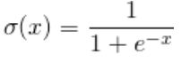

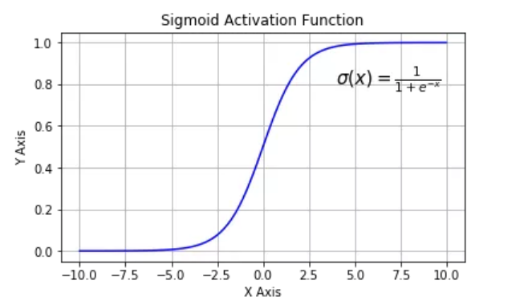

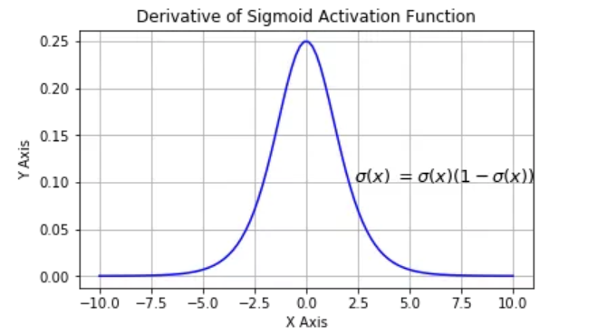

Sigmoid函数的三个主要缺陷：

1. 梯度消失：Sigmoid函数趋近0和1的时候变化率会变得平坦，也就是说，Sigmoid的梯度趋近于0. 神经网络使用Sigmoid激活函数进行反向传播时，输出接近0或1的神经元其梯度趋近于0.这些神经元叫坐饱和神经元。因此，这些神经元的权重不会更新。此外，与此类神经元相连的神经元的权重也更新的很慢，该问题叫作梯度消失。
2. 不以零为中心： Sigmoid输出不以0为中心。
3. 计算成本昂贵：exp()函数与其他非线性激活函数相比，计算成本昂贵。

在反向传播过程中，我们必须计算每个权重影响成本函数(cost function)的比例，具体做法是计算成本函数相对于每个权重的偏导数。假设我们不定义单个的权重，而是将最后一层L中的所有权重w定义为 $w^L$,则它们的倒数为：
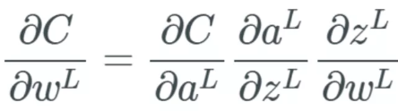

注意，当求偏导数时，我们要找到 $\partial a^{L}$的方程，然后仅微分 $\partial z^{L}$,其余部分保持不变。我们用 ' 号表示任意函数的导数。当计算中间项 $\frac{\partial a^{L}}{\partial z^{L}}$的偏导数时，有：
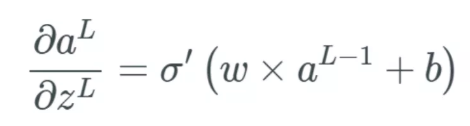

则 sigmoid 函数的导数就为：
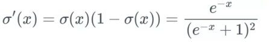

当我们向这个 sigmoid 函数输入一个很大的 x 值（正或负）时，我们得到几乎为 0 的 y 值——也就是说，当我们输入 w×a+b 时，我们可能得到一个接近于 0 的值。

当 x 是一个很大的值（正或负）时，我们本质上就是用一个几乎为 0 的值来乘这个偏导数的其余部分。

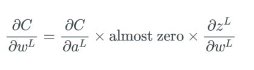

如果有太多的权重都有这样很大的值，那么我们根本就没法得到可以调整权重的网络，这可是个大问题。如果我们不调整这些权重，那么网络就只有细微的更新，这样算法就不能随时间给网络带来多少改善。对于针对一个权重的偏导数的每个计算，我们都将其放入一个梯度向量中，而且我们将使用这个梯度向量来更新神经网络。可以想象，如果该梯度向量的所有值都接近 0，那么我们根本就无法真正更新任何东西。

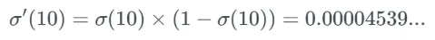

这里描述的就是梯度消失问题。这个问题使得 sigmoid 函数在神经网络中并不实用，我们应该使用后面介绍的其它激活函数。

#### 1.1 梯度消失问题

更新特定的权重，则更新规则为：
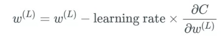

但如果偏导数 ∂C/∂w^(L) 很小，如同消失了一般，又该如何呢？这时我们就遇到了梯度消失问题，其中许多权重和偏置只能收到非常小的更新。

如果不同层的学习速度不同，层以不同的速度学习，**前面几层** 总是会根据学习率变得更差。
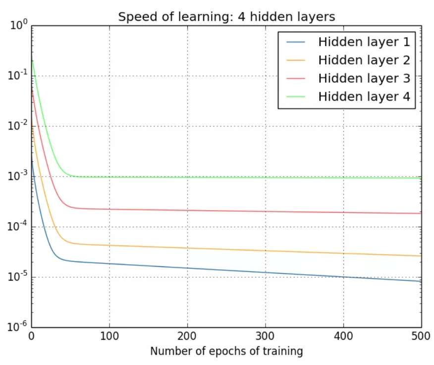

在这个示例中，隐藏层 4 的学习速度最快，因为其 **成本函数仅取决于连接到隐藏层 4** 的权重变化。我们看看隐藏层 1；这里的成本函数取决于连接隐藏层 1 与隐藏层 2、3、4 的权重变化。如果你看过了我前一篇文章中关于反向传播的内容，那么你可能知道网络中更前面的层会复用后面层的计算。
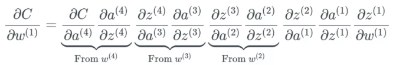

同时，如前面介绍的那样，最后一层仅 **取决于计算偏导时出现的一组变化**
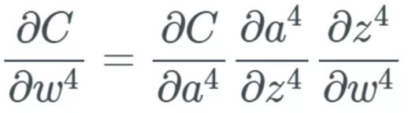

最终，这就是个大问题了，因为现在权重层的学习速度不同。这意味着网络中更后面的层几乎肯定会被网络中更前面的层受到更多优化。
 
而且问题还在于反向传播算法不知道应该向哪个方向传递权重来优化成本函数。

### 2. tanh
Tanh解决了Sigmoid函数中值域期望部位0的问题：
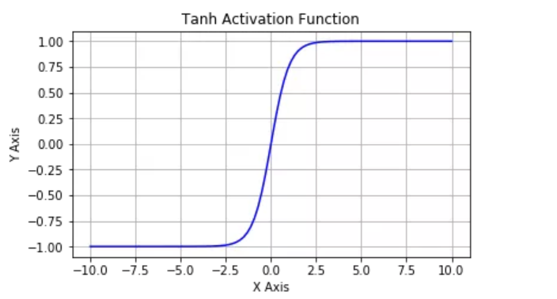

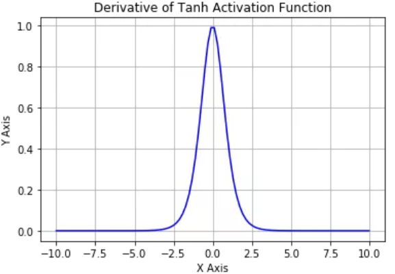

Tanh函数将值压缩到-1至1的区间内，和Sigmoid不同，Tanh的函数的 **输出以零为中心**，因为区间在-1到1之间。你可以将Tanh函数想象成两个Sigmoid函数放在一起。在实践中，Tanh函数的使用优先性高于Sigmoid函数，负数输入被当作负值，零输入值的映射接近零。缺点：

1. Tanh函数也会有梯度消失的问题，因此会在饱和时也会杀死梯度。

### 3. ReLU
为了解决梯度消失问题，使用ReLU单元。
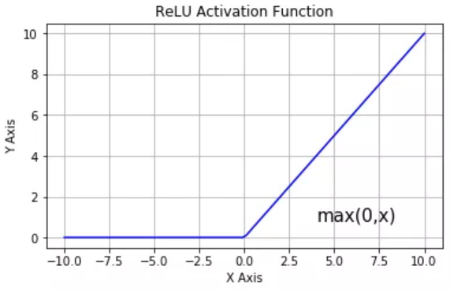

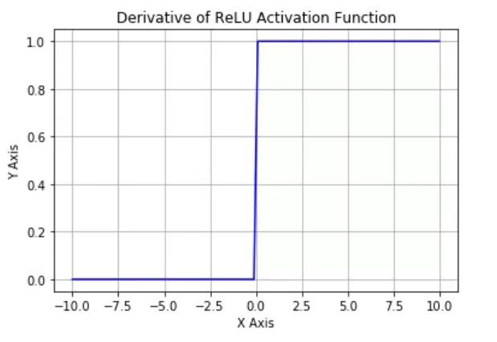

$$
f(x) = max(0,x)
$$

缺点：
1. 不以零为中心：和Sigmoid激活函数类似，ReLU函数的输出不以零为中心。
2. 前向传导(forward pass)过程中,如果x小于零，则神经元保持非激活状态，且在后向传导中杀死梯度。这样权重无法得到更新，网络无法学习。当x=0时，该点的梯度未定义，但是这个问题在实现中得到了解决，通过采用左侧或右侧的梯度的方式。

### 4. Leaky ReLU
可以解决ReLu激活函数中的梯度消失问题
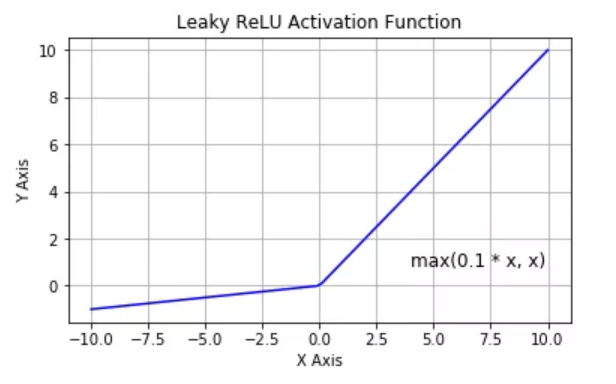

$$
f(x) = max(0.1x,x)
$$

可以进行扩展，不让x乘常数项，而是让x乘超参数

### 5. Parametric ReLU

$$
f(x) = max(\alpha x,x)
$$

### 6. Swish
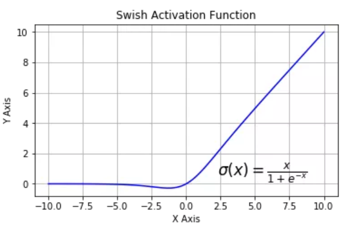

$$
\delta(x) = \frac{x}{1+e^{-x}}
$$

### 7. SELU
SELU激活能够对神经网络进行 **自归一化**(self-normalizing)

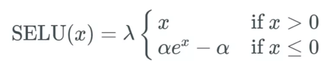

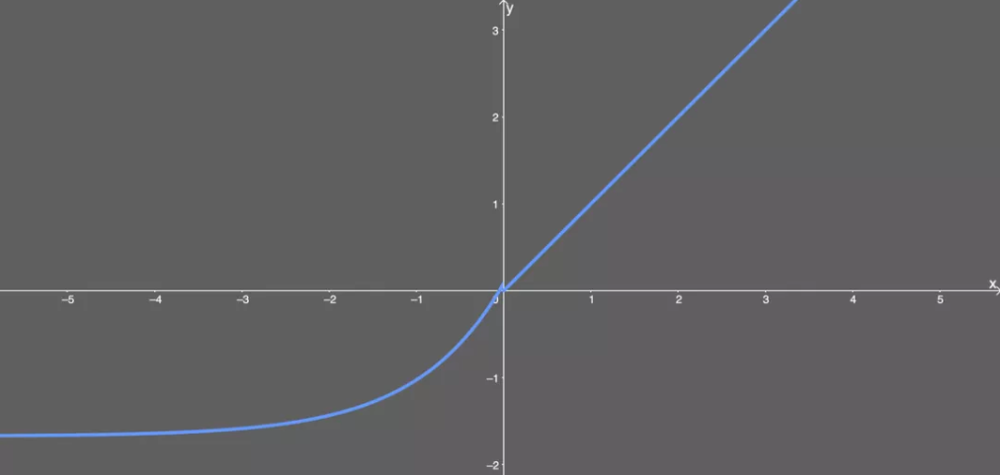

**归一化(normalization)**,就是减去均值，然后除以标准差，因此，经过归一化之后，网络的组件(权重、偏置和激活)的**均值均为0，标准差为1**.这正是SELU激活函数的输出值。

SELU的输出是归一化的，可称为 **内部归一化(internal normalization)**,因此，事实上其所有的输出都是均值为0且标准差为1.这个不同于外部归一化(external normalization)————会用到批归一化或其他办法。

如何做到呢？

简单解释一下，当输入小于 0 时，方差减小；当输入大于 0 时，方差增大——而标准差是方差的平方根，这样我们就使得标准差为 1。

我们通过梯度得到零均值。我们需要一些正值和负值才能让均值为 0。我的上一篇文章介绍过，梯度可以调整神经网络的权重和偏置，因此我们需要这些梯度输出一些负值和正值，这样才能控制住均值。

均值 μ 和方差 ν 的主要作用是使我们有某个域 Ω，让我们总是能将均值和方差映射到预定义的区间内。这些区间定义如下：

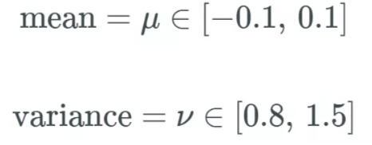

∈ 符号表示均值和方差在这些预定义的区间之内。反过来，这又能避免网络出现梯度消失和爆炸问题。

下面引述一段论文的解释，说明了他们得到这个激活函数的方式，我认为这很重要：

>SELU允许构建一个映射g，其性质能够实现 SNN(自归一化神经网络)。SNN不能通过(扩展型)修正线性单元(RELU)、sigmoid、tanh、Leaky ReLU实现，这个激活函数需要有：
> * 负值和正值，以便控制均值；
> * 饱和区域(导数趋近于零)，以便抑制更低层中较大的方差
> * 大于1的斜率，以便在更低层中的方差过小时增大方差；
> * 续曲线。后者能确保一个固定点，其中方差抑制可通过方差增大来获得均衡。我们能通过乘上指数线性单元（ELU）来满足激活函数的这些性质，而且 λ>1 能够确保正值净输入的斜率大于 1。

