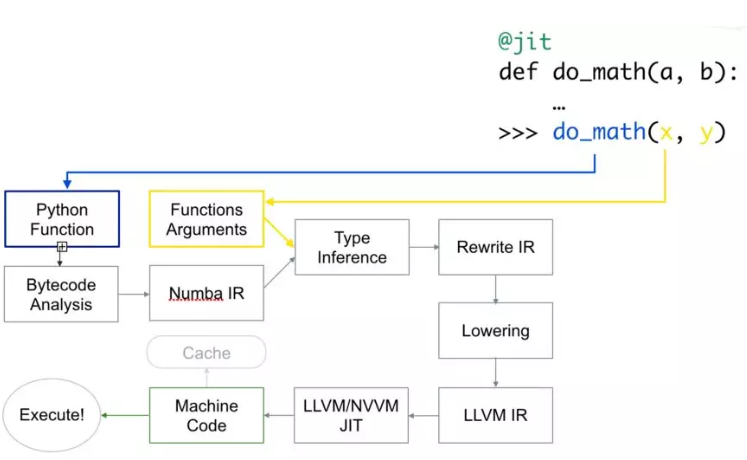

# 1. 介绍
Numba 是python的即时(Just in time)编译器，即您调用python函数时，您的全部或部分代码就会被转换为“即时”执行的机器码，它以您的本地机器码速度运行。

在 Numba 的帮助下，您可以加速所有计算负载比较大的 python 函数（例如循环）。它还支持 numpy 库！所以，您也可以在您的计算中使用 numpy，并加快整体计算，因为 python 中的循环非常慢。 您还可以使用 python 标准库中的 math 库的许多函数，如 sqrt 等。有关所有兼容函数的完整列表，请查看 此处。

# 2. Why use
那么，当有像 cython 和 Pypy 之类的许多其他编译器时，为什么要选择 numba？

原因很简单，这样您就不必离开写 python 代码的舒适区。是的，就是这样，您根本不需要为了获得一些的加速来改变您的代码，这与您从类似的具有类型定义的 cython 代码获得的加速相当。那不是很好吗？

您只需要添加一个熟悉的 python 功能，即添加一个包装器（一个装饰器）到您的函数上。类的装饰器也在开发中了。

所以，您只需要添加一个装饰器就可以了。例如：

# 3. How numba work
Numba 使用 LLVM 编译器基础结构 将原生 python 代码转换成优化的机器码。使用 numba 运行代码的速度可与 C/C++ 或 Fortran 中的类似代码相媲美。
以下是代码的编译方式：

首先，Python 函数被传入，优化并转换为 numba 的中间表达，然后在类型推断（type inference）之后，就像 numpy 的类型推断（所以 python float 是一个 float64），它被转换为 LLVM 可解释代码。 然后将此代码提供给 LLVM 的即时编译器以生成机器码。

您可以根据需要在运行时或导入时 生成 机器码，导入需要在 CPU（默认）或 GPU 上进行。

# 4. How to use it
当使用 @jit 时，请确保您的代码有 numba 可以编译的内容，比如包含库（numpy）和它支持的函数的计算密集型循环。否则它将不会编译任何东西，并且您的代码将比没有使用 numba 时更慢，因为存在 numba 内部代码检查的额外开销。

如果您的代码是 可并行化 的，您也可以传递 parallel=True 作为参数，但它必须与 nopython=True 一起使用，目前这只适用于CPU。
您还可以指定希望函数具有的函数签名，但是这样就不会对您提供的任何其他类型的参数进行编译。 例如：
```python
 1 from numba import jit, int32
 2 @jit(int32(int32, int32))
 3 def function(a, b):
 4    # your loop or numerically intensive computations
 5    return result
 6 # or if you haven t imported type names
 7 # you can pass them as string
 8 @jit( int32(int32, int32) )
 9 def function(a, b):
10    # your loop or numerically intensive computations
11    return result
```
现在您的函数只能接收两个 int32 类型的参数并返回一个 int32 类型的值。 通过这种方式，您可以更好地控制您的函数。 如果需要，您甚至可以传递多个函数签名。
您还可以使用 numba 提供的其他装饰器：
1. @vectorize:允许将标量参数作为numpy的ufuncs使用，
2. @guvectorize: 删除Numpy广义上的 ufuncs
3. @stencil: 定义一个函数使其成为stencil类型操作的核函数
4. @jitclass:用于jit类
5. @cfunc: 声明一个函数用于本地回调(被C/C++等调用)
6. @overload: 注册您自己的函数实现，以便在 nopython模式下使用，

# 5. @vectorize 装饰器
通过使用 @vectorize 装饰器，您可以对仅能对标量操作的函数进行转换，例如，如果您使用的是仅适用于标量的 python 的 math 库，则转换后就可以用于数组。 这提供了类似于 numpy 数组运算（ufuncs）的速度。 例如：
```python
1 from numba import jit, int32
2 @vectorize
3 def func(a, b):
4    # Some operation on scalars
5    return result
```
您还可以将 target 参数传递给此装饰器，该装饰器使 target 参数为 parallel 时用于并行化代码，为 cuda 时用于在 cudaGPU 上运行代码。
```python
1 @vectorize(target="parallel")
2 def func(a, b):
3    # Some operation on scalars
4    return result
```
使 target=“parallel” 或 “cuda” 进行矢量化通常比 numpy 实现的代码运行得更快，只要您的代码具有足够的计算密度或者数组足够大。如果不是，那么由于创建线程以及将元素分配到不同线程需要额外的开销，因此可能耗时更长。所以运算量应该足够大，才能获得明显的加速。

# 6. 在GPU上运行函数
您也可以像装饰器一样传递 @jit 来运行 cuda/GPU 上的函数。 为此您必须从 numba 库中导入 cuda。 但是要在 GPU 上运行代码并不像之前那么容易。为了在 GPU 上的数百甚至数千个线程上运行函数，需要先做一些初始计算。 实际上，您必须声明并管理网格，块和线程的层次结构。这并不那么难。
要在GPU上执行函数，您必须定义一个叫做 **核函数** 或 **设备函数** 的函数。首先让我们来看 **核函数。**
关于核函数要记住一些要点：
1. 核函数在被调用时要显式声明其线程层次结构，即块的数量和每块的线程数量。您可以编译一次核函数，然后用不同的块和网格大小多次调用它。
2. 核函数没有返回值。因此，要么必须对原始数组进行更改，要么传递另一个数组来存储结果。为了计算标量，您必须传递单元素数组。
```python
1 # Defining a kernel function
2 from numba import cuda
3 @cuda.jit
4 def func(a, result):
5    # Some cuda related computation, then
6    # your computationally intensive code.
7    # (Your answer is stored in  result )
```
因此，要启动核函数，您必须传入两个参数：
1. 每块的线程数，
2. 块的数量。

```python
1 threadsperblock = 32
2 blockspergrid = (array.size + (threadsperblock - 1)) // threadsperblock
3 func[blockspergrid, threadsperblock](array)
```
每个线程中的核函数必须知道它在哪个线程中，以便了解它负责数组的哪些元素。Numba 只需调用一次即可轻松获得这些元素的位置。
```python
1 @cuda.jit
2 def func(a, result):
3    pos = cuda.grid(1)  # For 1D array
4    # x, y = cuda.grid(2) # For 2D array
5    if pos &lt; a.shape[0]:
6        result[pos] = a[pos] * (some computation)
```
为了节省将 numpy 数组复制到指定设备，然后又将结果存储到 numpy 数组中所浪费的时间，Numba 提供了一些 函数 来声明并将数组送到指定设备，如：numba.cuda.device_array，numba.cuda。 device_array_like，numba.cuda.to_device 等函数来节省不必要的复制到 cpu 的时间（除非必要）。
**另一方面，设备函数** 只能从设备内部（通过核函数或其他设备函数）调用。 比较好的一点是，您可以从 **设备函数** 中返
```python
1 from numba import cuda
2 @cuda.jit(device=True)
3 def device_function(a, b):
4    return a + b
```