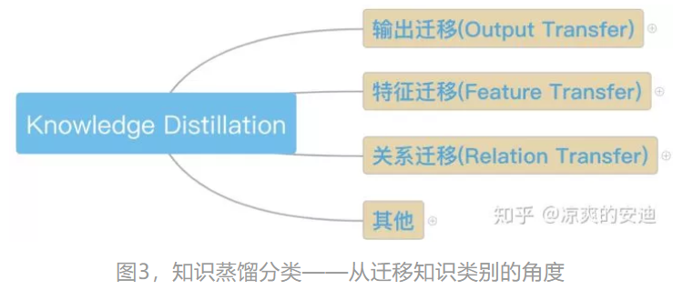

>把复杂模型或者多个模型Ensemble（Teacher）学到的知识 迁移到另一个轻量级模型（ Student ）上叫知识蒸馏。使模型变轻量的同时（方便部署），尽量不损失性能。

知识蒸馏(Knowledge Distillation)KD属于模型压缩、加速的一类玩法。在这里，知识应该宽泛和抽象地理解，模型参数，网络层的输出（网络提取的特征）、网络输出等都可以理解为知识。

KD主要分为三个大类：
* Output Transfer - 将网络的输出（Soft-target，后面会介绍其含义）作为知识；
* Feature Transfer - 将网络学习的特征作为知识;
* Relation Transfer - 将网络或者样本的关系作为知识

