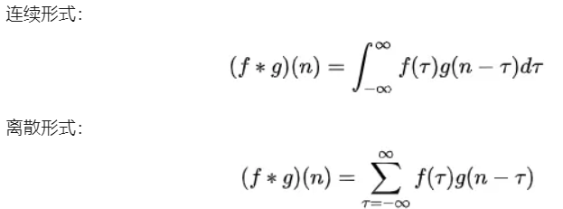
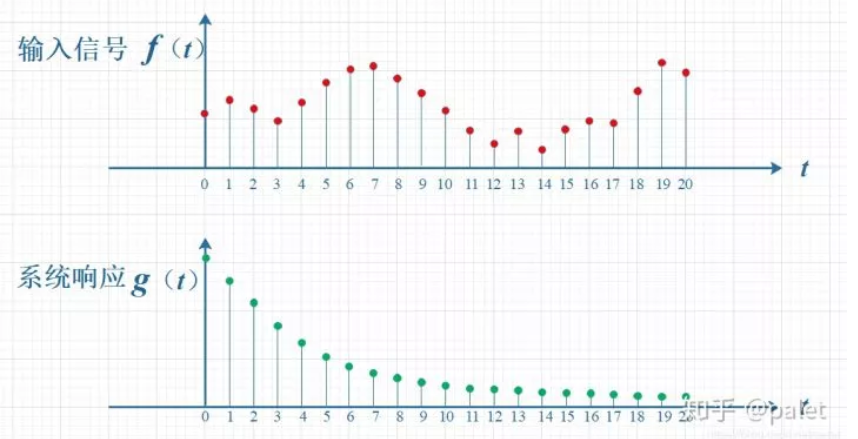
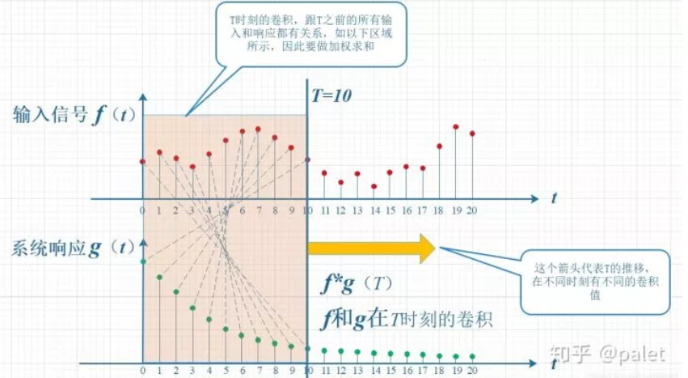
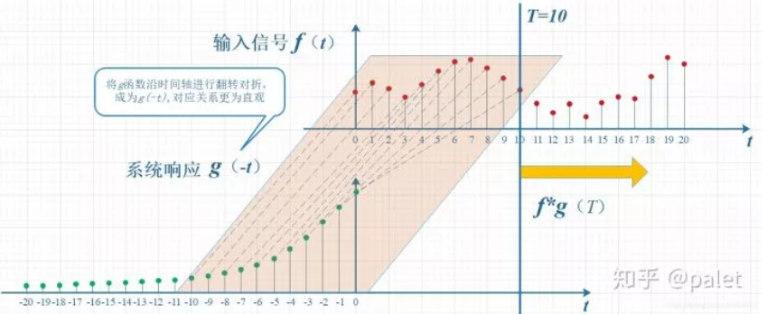
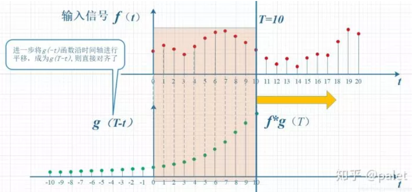
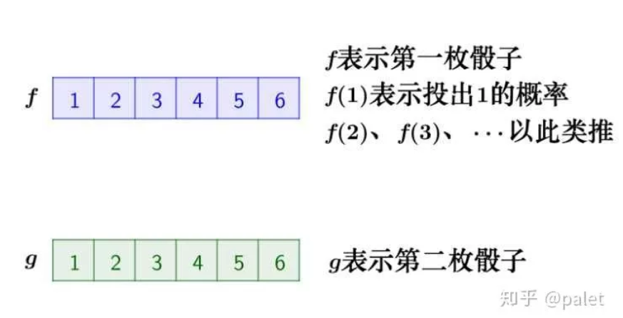
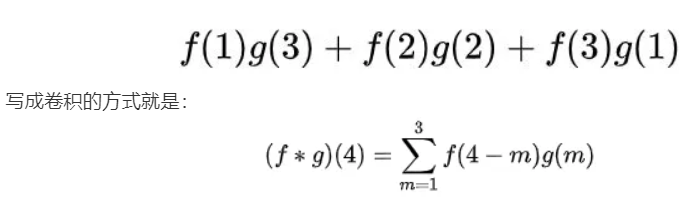
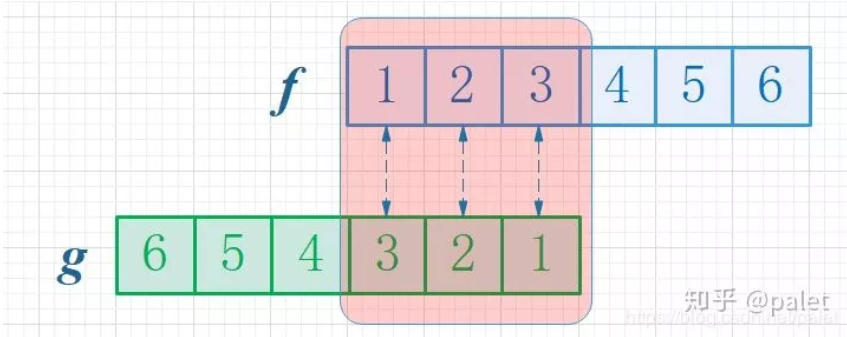
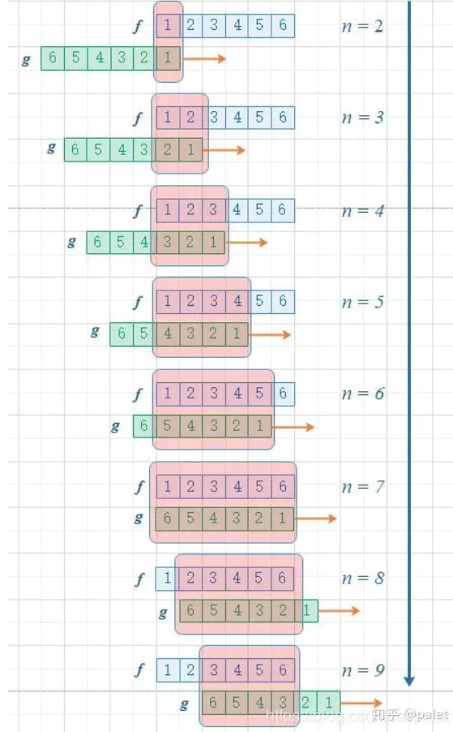

# 卷积的数学公式

## 例1： 说明为何要翻转：

如下图所示，输入信号是 f(t) ，是随时间变化的。系统响应函数是 g(t) ，图中的响应函数是随时间指数下降的，它的物理意义是说：如果在 t=0 的时刻有一个输入，那么随着时间的流逝，这个输入将不断衰减。换言之，到了 t=T时刻，原来在 t=0 时刻的输入f(0)的值将衰减为f(0)g(T)。

考虑到信号是连续输入的，也就是说，每个时刻都有新的信号进来，所以，最终输出的是所有之前输入信号的累积效果。如下图所示，在T=10时刻，输出结果跟图中带标记的区域整体有关。其中，f(10)因为是刚输入的，所以其输出结果应该是f(10)g(0)，而时刻t=9的输入f(9)，只经过了1个时间单位的衰减，所以产生的输出应该是 f(9)g(1)，如此类推，即图中虚线所描述的关系。这些对应点相乘然后累加，就是T=10时刻的输出信号值，这个结果也是f和g两个函数在T=10时刻的卷积值。

显然，上面的对应关系**看上去比较难看，是拧着的**，所以，我们把g函数对折一下，变成了g(-t)，这样就好看一些了。看到了吗？**这就是为什么卷积要“卷”，要翻转的原因，这是从它的物理意义中给出的**。

上图虽然没有拧着，**已经顺过来了，但看上去还有点错位，所以再进一步平移T个单位**，就是下图。它就是本文开始给出的卷积定义的一种图形的表述：

## 例2：丢骰子

在本问题 如何通俗易懂地解释卷积？中排名第一的马同学在中举了一个很好的例子（下面的一些图摘自马同学的文章，在此表示感谢），用丢骰子说明了卷积的应用。

要解决的问题是：**有两枚骰子，把它们都抛出去，两枚骰子点数加起来为4的概率是多少?**

分析一下，两枚骰子点数加起来为4的情况有三种情况：1+3=4， 2+2=4, 3+1=4

因此，两枚骰子点数加起来为4的概率为：

首先，因为两个骰子的点数和是4，为了满足这个约束条件，我们还是把函数 g 翻转一下，然后阴影区域上下对应的数相乘，然后累加，相当于求自变量为4的卷积值，如下图所示：

进一步，如此翻转以后，可以方便地进行推广去求两个骰子点数和为 n 时的概率，为f 和 g的卷积 f*g(n)，如下图所示：

由上图可以看到，函数 g 的滑动，带来的是点数和的增大。这个例子中对f和g的约束条件就是点数和，它也是卷积函数的自变量。有兴趣还可以算算，如果骰子的每个点数出现的概率是均等的，那么两个骰子的点数和n=7的时候，概率最大。

